# 如何使用 Buildkite 为 Monorepo 设置持续集成

> 原文：<https://medium.com/geekculture/set-up-continuous-integration-for-monorepo-using-buildkite-61539bb0ed76?source=collection_archive---------4----------------------->

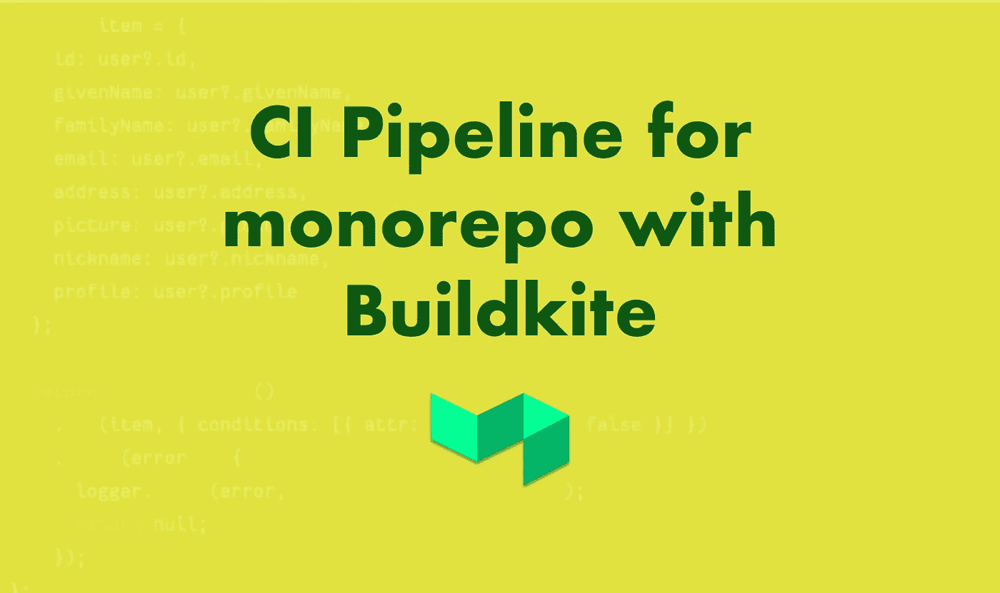

Monorepo 是一个单一的存储库，它将所有代码和多个项目保存在一个单一的 git 存储库中。Monorepo 设置非常吸引人，因为它具有在一个存储库中管理各种服务和前端的灵活性和能力。它还消除了跟踪多个存储库中的变更以及随着项目变更更新依赖关系的麻烦。

另一方面，monorepo 也面临着挑战，特别是在持续集成方面。当 monorepo 中的单个子项目发生变化时，我们需要确定哪些子项目发生了变化，以构建和部署发生变化的子项目。这篇文章一步一步地介绍了:

1.  在 Bulidkite 中为 monorepo 配置持续集成。
2.  使用自动伸缩将 Buildkite 代理部署到 AWS EC2 实例。
3.  配置 Github 以触发 Bulidkite CI 管道。
4.  配置 Buildkite，以便在 monorepo 中的子项目发生变化时触发适当的管道。
5.  使用 bash 脚本自动完成以上所有工作。

# 先决条件

1.  [**AWS**](https://aws.amazon.com/free/) 账号部署 Buildkite 代理。
2.  配置 [**AWS CLI**](https://docs.aws.amazon.com/cli/latest/userguide/cli-chap-configure.html) 与 AWS 账户对话。
3.  [**Buildkite**](https://buildkite.com/) 账号创建持续集成管道。
4.  [**Github**](https://github.com/)**账号托管 monorepo 源代码。**

**完整的源代码可以在 Github 的[**build kite-mono repo**](https://github.com/adikari/buildkite-monorepo)中找到。**

# **设置概述**

**Buildkite 工作流程由[管道](https://buildkite.com/docs/pipelines)和步骤组成。用于建模和定义工作流的顶级容器称为管道。步骤运行单个任务或命令。**

**下图列出了我们正在设置的管道、它们的相关触发器以及管道运行的每个步骤。**

****

**Pipeline and triggers**

# **拉式请求工作流**

**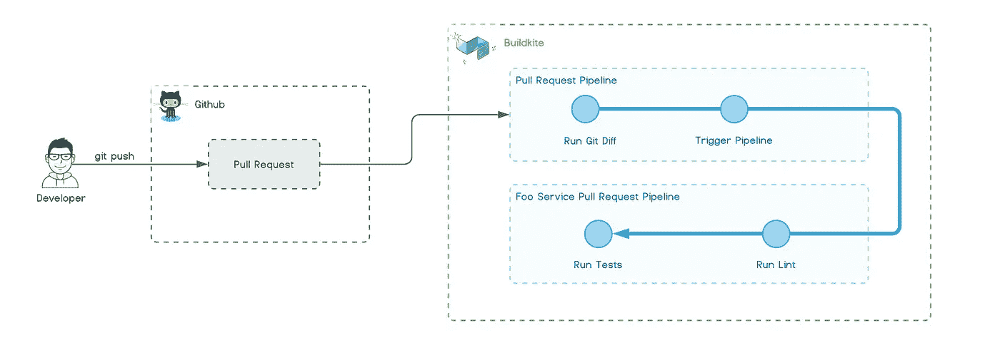**

**Pull Request Workflow**

**上图显示了拉请求管道的工作流。在 Github 中创建新的 Pull 请求会触发 Buildkite 中的`pull-request`管道。然后这个管道运行`git diff`来识别 monorepo 中的哪些文件夹(项目)发生了变化。如果它检测到变化，那么它将动态地触发为该项目定义的适当的拉请求管道。Buildkite 向 [Github 状态检查报告每个管道的状态。](https://docs.github.com/en/free-pro-team@latest/github/collaborating-with-issues-and-pull-requests/about-status-checks)**

# **合并工作流**

**当 Github 中的所有状态检查都通过时，Pull 请求被合并。合并拉请求会触发 Buildkite 中的`merge`管道。**

****

**Merge Workflow**

**与前面的管道类似，合并管道识别已经变更的项目，并为其触发相应的`deploy`管道。部署管道最初将更改部署到临时环境中。一旦部署到暂存完成，生产部署将被手动发布。**

# **最终项目结构**

```
.
├── .buildkite
│   ├── diff
│   ├── merge.yml
│   ├── pipelines
│   │   ├── deploy.json
│   │   ├── merge.json
│   │   └── pull-request.json
│   └── pull-request.yml
├── bar-service
│   ├── .buildkite
│   │   ├── deploy.yml
│   │   ├── merge.yml
│   │   └── pull-request.yml
│   └── bin
│       └── deploy
├── bin
│   ├── create-pipeline
│   ├── create-secrets-bucket
│   ├── deploy-ci-stack
│   └── stack-config
└── foo-service
    ├── .buildkite
    │   ├── deploy.yml
    │   ├── merge.yml
    │   └── pull-request.yml
    └── bin
        └── deploy
```

# **设置项目**

**创建一个新的 git 项目，并将其推送到 Github。在 CLI 中运行以下命令。**

**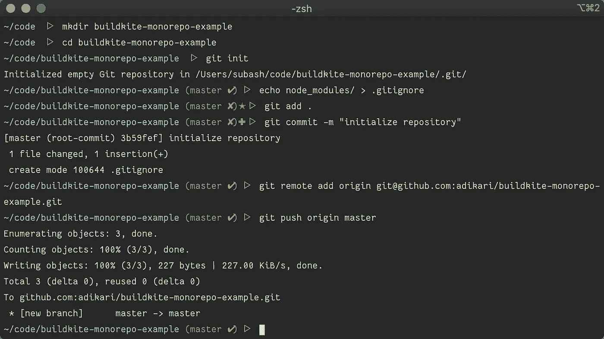**

# **设置 Buildkite 基础结构**

1.  **创建一个 bin 目录，其中包含一些可执行脚本。**

**2.将以下内容复制到`create-secrets-bucket`中。**

**Generate SSH Key and copy it to S3 bucket**

**上面的脚本创建了一个用于存储 ssh 密钥的 S3 存储桶。Buildkite 使用这个键连接到 Github repo。该脚本还生成 ssh 密钥并正确设置其权限。**

****运行脚本****

**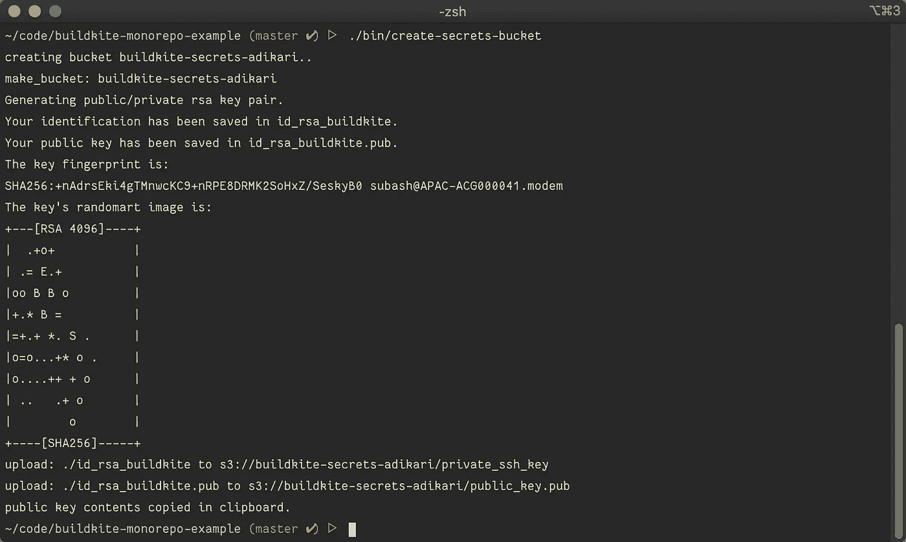**

**running create-secrets-bucket script**

**该脚本将生成的公钥和私钥复制到`~/.ssh`文件夹中。稍后可以使用这些键 ssh 到 EC2 实例，运行 Buildkite 代理进行调试。**

**接下来，验证存储桶是否存在，以及新的 S3 存储桶中是否存在密钥。**

****

**导航到[https://github.com/settings/keys](https://github.com/settings/keys)，添加新的 SSK 密钥，然后粘贴`id_rsa_buildkite.pub`的内容。**

****

# **部署 AWS 弹性 CI 云架构堆栈**

**Buildkite 的人员已经为 AWS **，**创建了 [**弹性 CI 堆栈，它在 AWS 中创建了一个私有的、自动伸缩的 Buildkite 代理集群。让我们将基础设施部署到我们的 AWS 客户。**](https://github.com/buildkite/elastic-ci-stack-for-aws)**

**创建一个新文件`bin/deploy-ci-stack`并将下面的脚本内容复制到其中。**

**您可以从 BUILDKITE 控制台的**代理**选项卡中获取“BUILDKITE_AGENT_TOKEN”。**

**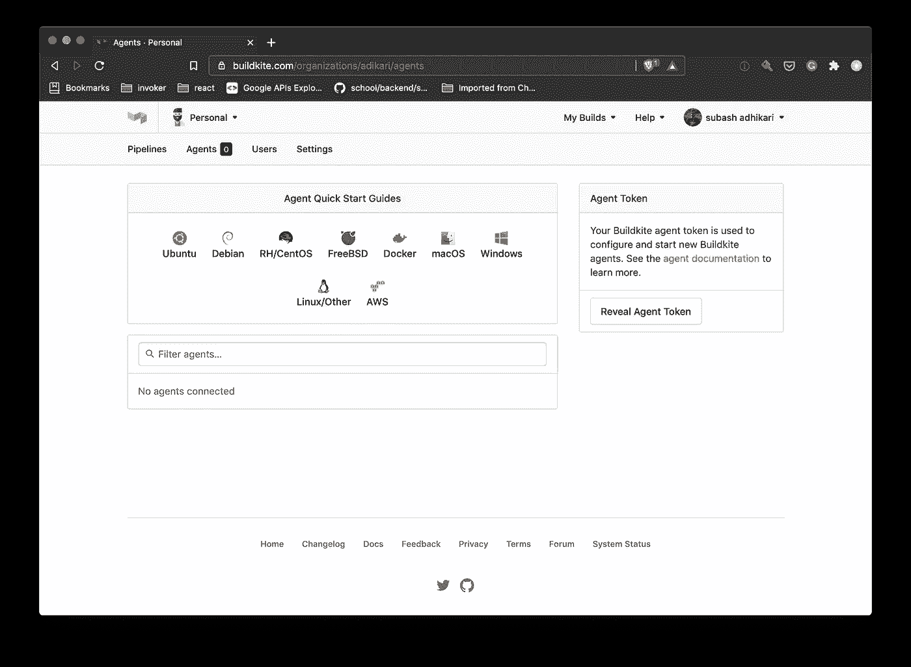**

**接下来，创建一个名为`bin/stack-config`的新文件。该文件中的配置会覆盖 Cloudformation 参数。弹性 CI 使用的 [Cloudformation 模板](https://s3.amazonaws.com/buildkite-aws-stack/latest/aws-stack.yml)中提供了完整的参数列表。**

**在第 2 行，用之前创建的存储桶替换存储桶名称。**

**接下来，在 CLI 中运行脚本来部署 Cloudformation 堆栈。**

**脚本需要一些时间来完成。打开 AWS Cloudformation 控制台查看进度。**

******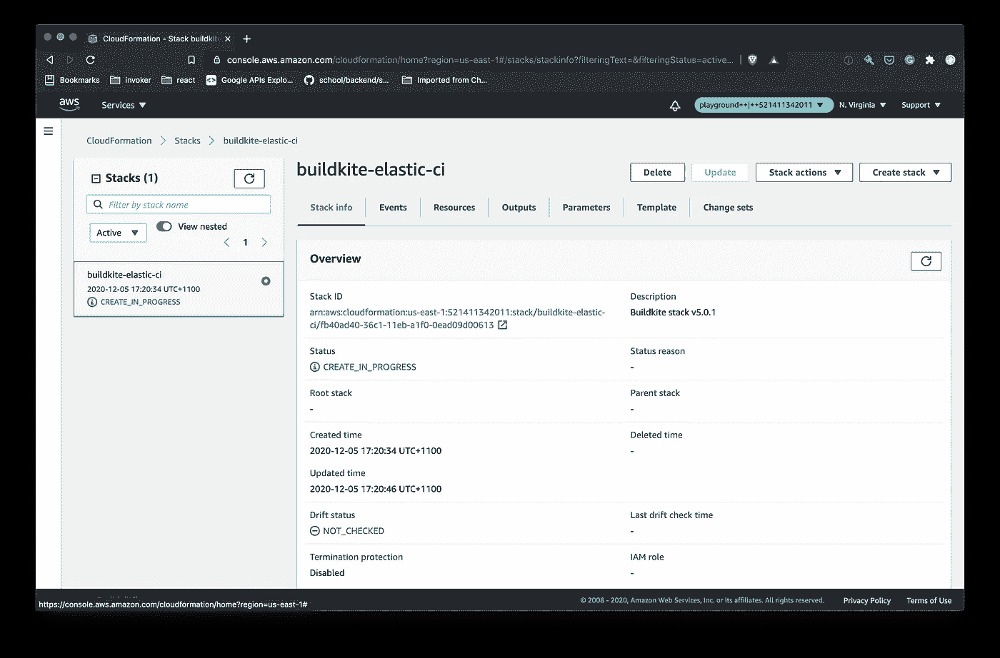**

**Cloudformation 堆栈将创建一个自动缩放组，Buildkite 将使用它来生成 EC2 实例。Buildkite 代理和构建在那些 EC2 实例中运行。**

**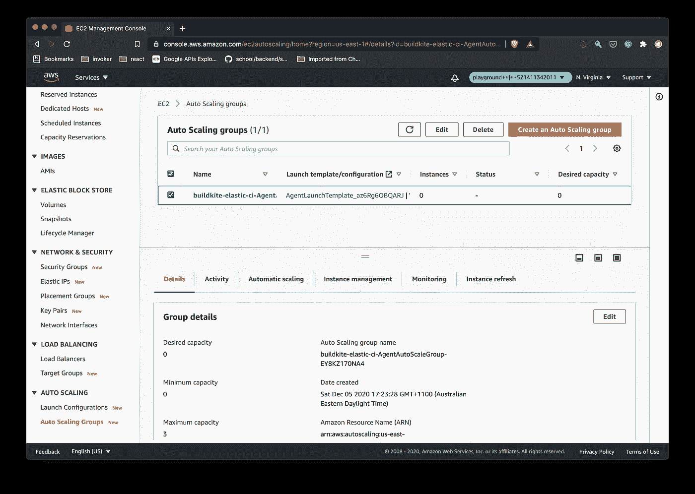**

# **在 Bulidkite 中创建构建管道**

**此时，我们已经有了运行 Buildkite 所需的基础设施。接下来，我们配置 Buildkite 并创建一些管道。**

**在[https://buildkite.com/user/api-access-tokens](https://buildkite.com/user/api-access-tokens)创建 API 访问令牌，并将范围设置为`write_builds`、`read_pipelines`和`write_pipelines`。关于代理令牌的更多信息在本[文档](https://buildkite.com/docs/agent/v3/tokens)中。**

**确保`BUILDKITE_API_TOKEN`设置在环境上。在运行脚本之前，要么使用 [dotenv](https://www.npmjs.com/package/dotenv) 要么将其导出到环境中。**

**将以下脚本的内容复制到`bin/create-pipeline`。可以在 Buildkite 控制台中手动创建管道，但是自动化和创建可复制的基础设施总是更好。**

**通过设置正确的权限(chmod +x)使脚本可执行。在 CLI 中运行`./bin/create-pipeline -h`获得帮助。**

**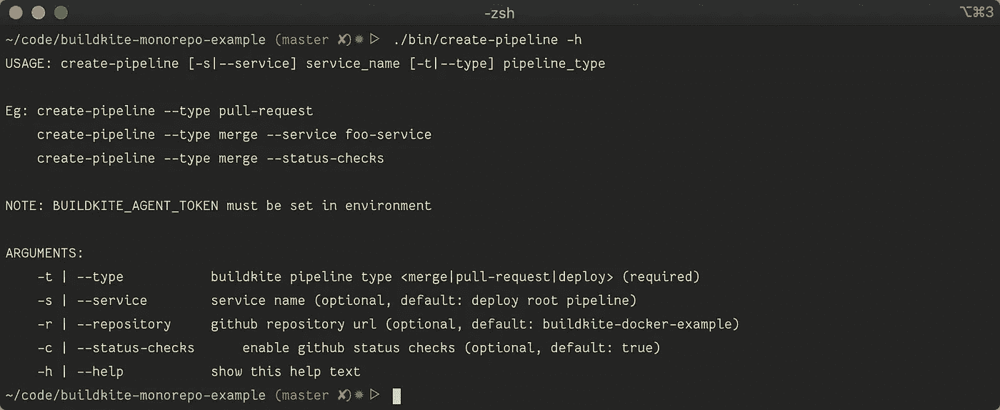**

**该脚本使用 [Buildkite REST API](https://buildkite.com/docs/apis/rest-api) 来创建具有给定配置的管道。该脚本使用定义为`json`文档的管道配置，并将其发布到 REST API。管道配置位于`.bulidkite/pipelines`文件夹中。**

**要定义`pull-request`管道的配置，使用以下内容创建`.buildkite/pipelines/pull-request.json`。**

**接下来，用下面的内容创建`./buildkite/pipelines/merge.json`。**

**最后，用下面的内容创建`.buildkite/pipelines/deploy.yml`。**

**现在，运行`./bin/create-pipeline`命令来创建一个拉请求管道。**

****

**从控制台输出中复制`Webhook url`并在 Github 中创建一个 webhook 集成。如果将来需要，可以在 Buildkite 控制台的 pipeline 设置中找到 webhook URL。我们只需要为`pull-request`和`merge`管道配置 webhook。所有其他管道都是动态触发的。**

**导航到 Github 库`Settings > Webhooks`并添加一个 webhook。选择`Just the push event`然后添加 webhook。对两条管线重复此操作。**

**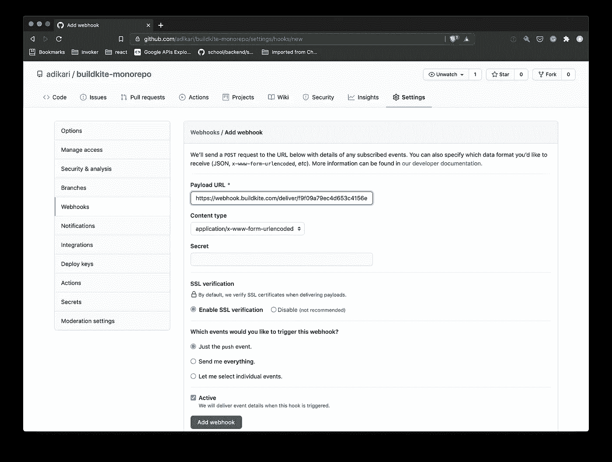**

**现在在 Buildkite 控制台中，应该有两条新创建的管道。🎉**

****

**接下来，添加 Github 集成，允许 Buildkite 向 Github 发送状态更新。每个帐户只需设置一次集成。它位于 Buildkite 控制台的`Setting > Integrations > Github`处。**

****

**接下来，创建剩余的管道。这些管道将由`pull-request`和`merge`管道动态触发，因此我们不需要创建 Github 集成。**

**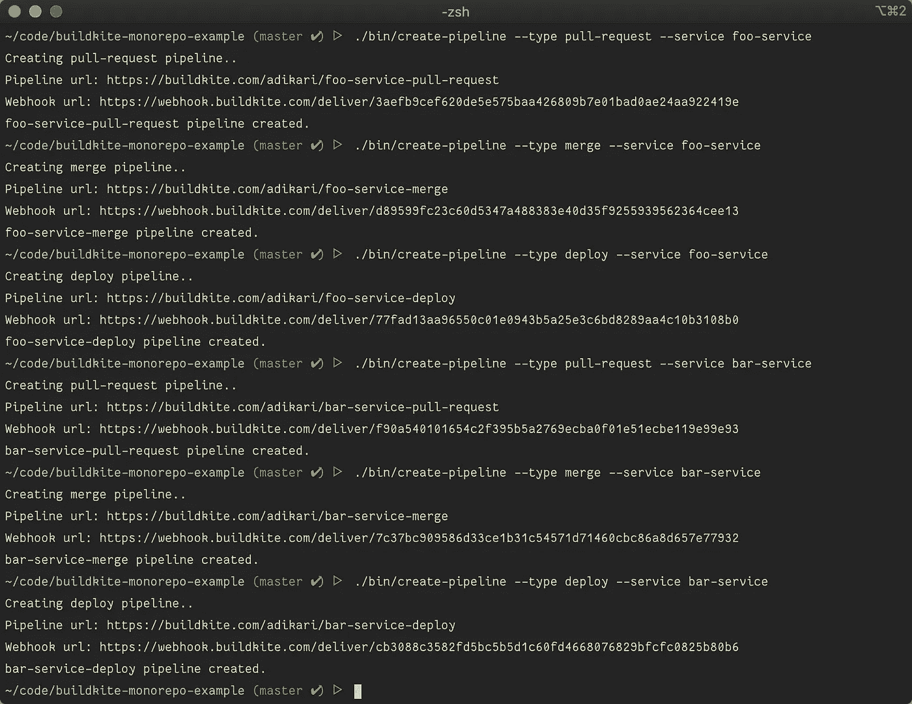**

**Buildkite 控制台现在应该列出了所有的管道。🥳**

**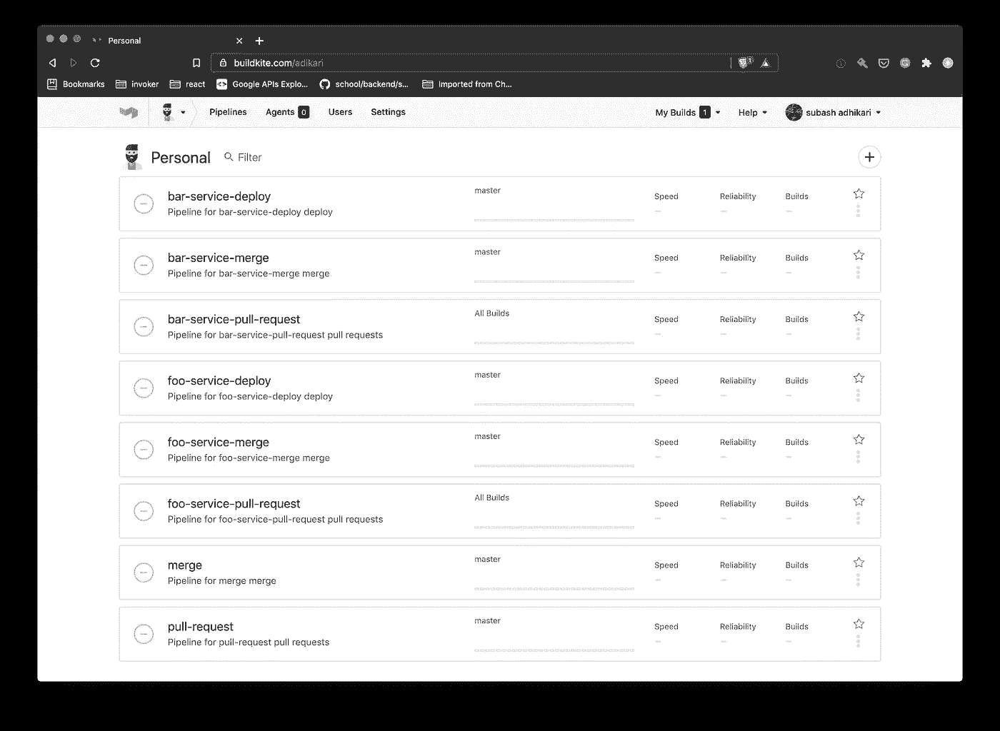**

# **设置构建风筝的步骤**

**现在，管道已经准备好了，为每个管道配置要运行的步骤。**

**在`.buildkite/diff`中添加以下脚本。该脚本区分针对主分支的提交中更改的所有文件。脚本的输出用于动态触发相应的管道。**

**更改脚本的权限，使其可执行。**

**创建一个新文件`.buildkite/pullrequest.yml`并添加以下步骤配置。我们使用[build kite-monorepo-diff](https://github.com/chronotc/monorepo-diff-buildkite-plugin)插件来运行`diff`脚本，并自动上传和触发各自的管道。**

**现在，通过在`.buildkite/merge.yml`中添加以下内容来创建合并管道的配置。**

**此时，我们已经配置了最顶层的`pull-request`和`merge`管道。现在我们需要为每个服务配置单独的管道。**

**首先为`foo-service`配置管道。用以下内容创建`foo-service/.buildkite/pull-request.yml`。当 foo 服务的`pull-request`管道运行时，指定`lint`和`test`命令运行。`command`选项也可以触发其他脚本。**

**接下来，通过在`foo-service/.buildkite/merge.yml`中添加以下内容，为 foo 服务设置合并管道。**

**当`foo-service-merge`管道运行时，会发生以下情况:**

1.  **管道运行健全性检查。**
2.  **然后`foo-deploy`流水线被动态触发。我们通过`STAGE`环境来识别运行部署的环境。**
3.  **一旦部署到登台完成，管道将被阻塞，并且不会自动触发后续管道。按下“发布到生产”按钮，可以恢复流水线。**
4.  **解除管道阻塞再次触发`foo-deploy`管道，但这一次使用`production`阶段。**

**最后，通过添加`foo-service/.buildkite/deploy.yml`为`foo-deploy`管道添加配置。在部署配置中，我们触发一个 bash 脚本并传递从`foo-service-merge`管道接收的`STAGE`变量。**

**现在，创建部署脚本`foo-service/bin/deploy`并添加以下内容。**

**使部署脚本可执行。**

**`foo-service`的流水线和步骤配置完成。重复上述所有步骤，为`bar service`配置管线。**

# **测试整体工作流程**

**我们已经配置了 Buildkite、Github，并建立了适当的基础设施来运行构建。接下来，测试整个工作流并观察它的运行。**

**为了测试工作流程，首先创建一个新的分支，并修改`foo-service`中的一些文件。将更改推送到 Github 并创建一个拉请求。**

****

**将更改推送到 Github 应该会触发 Buildkite 中的`pull-request`管道，然后触发`foo-service-pull-request`管道。Github 应该在 Github 检查中报告状态。可以启用 Github 分支保护，要求在合并 Pull 请求之前通过检查。**

**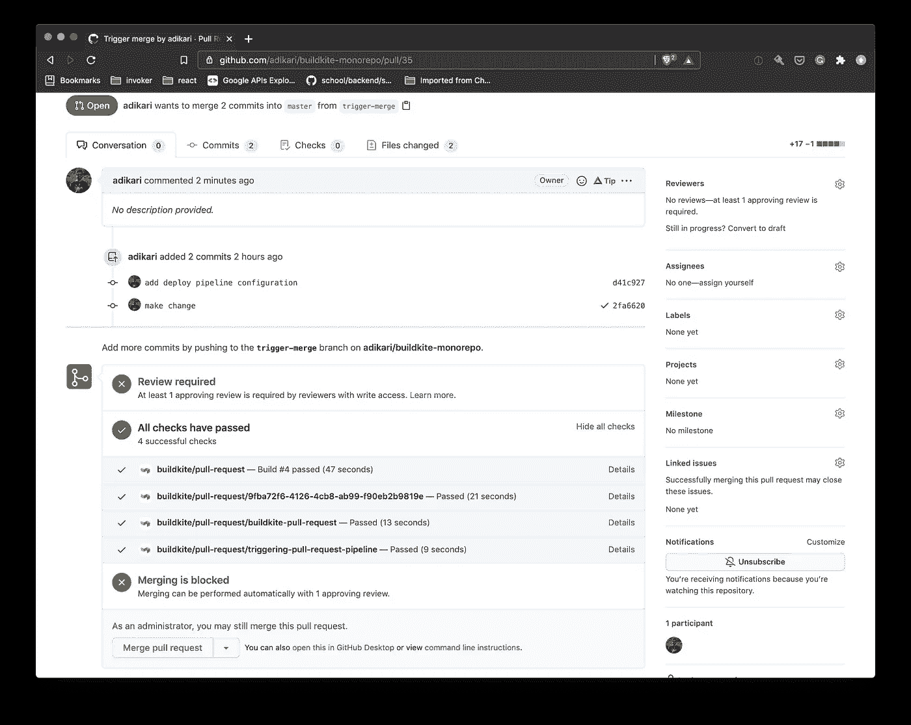**

**一旦 Github 中的所有检查都通过了，就合并 Pull 请求。这个合并将触发 Buildkite 中的`merge`管道。**

**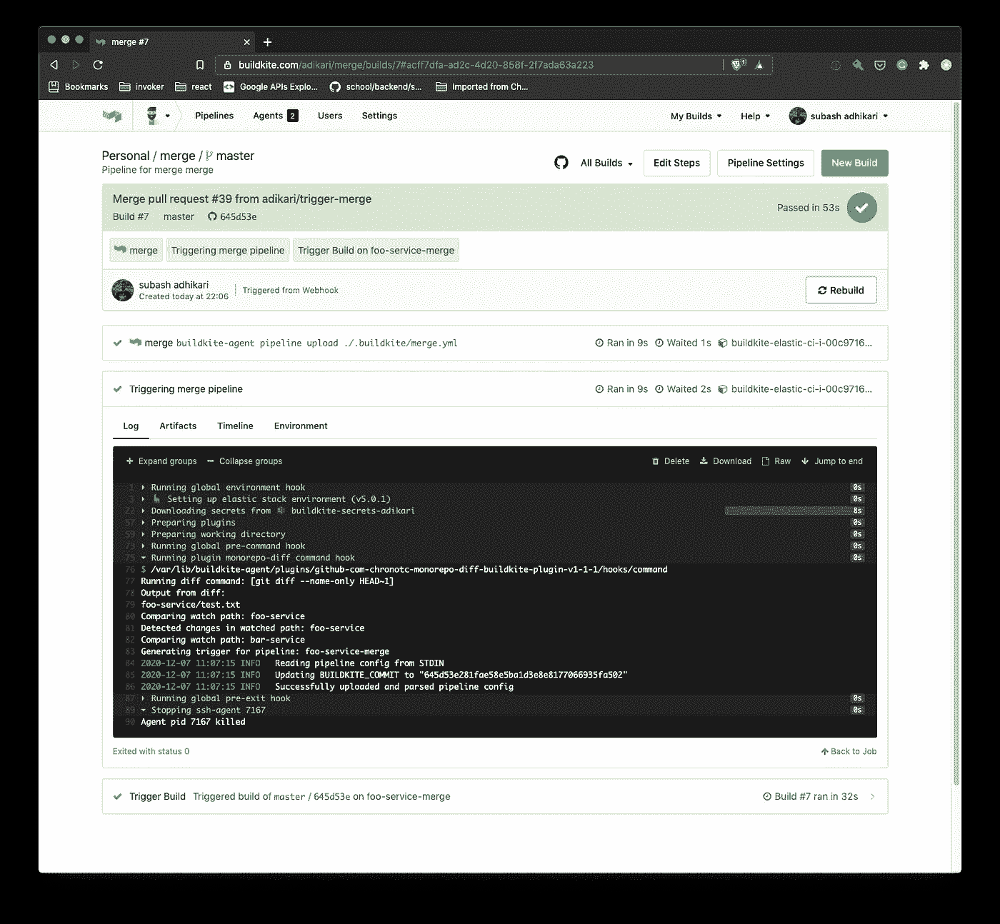**

**检测到 foo 服务的变化，触发`foo-service-merge`流水线。当`foo-service-deploy`在登台环境中运行时，管道最终会被阻塞。通过手动单击`Release to Production`按钮来针对生产运行部署，从而解除管道阻塞。**

**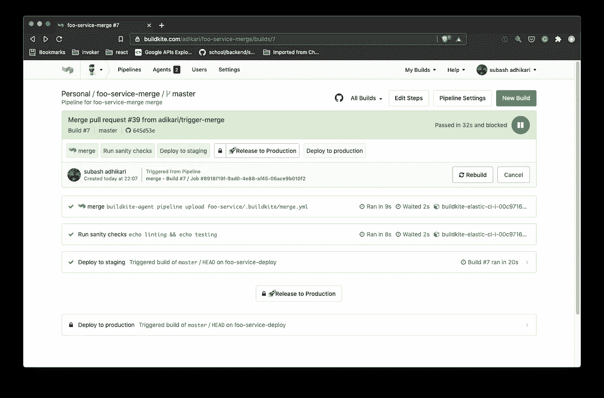**

# **摘要**

**在本文中，我们使用 Buildkite、Github 和 AWS 为 monorepo 建立了一个持续集成管道。管道将我们的代码从开发机器转移到登台，然后转移到生产。构建代理和步骤在自动缩放的 AWS EC2 实例中运行。我们还创建了一系列 bash 脚本来创建这种设置的易于复制的版本。作为对当前设计的改进，考虑使用[build kite-docker-compose-plugin](https://github.com/buildkite-plugins/docker-compose-buildkite-plugin)来隔离 Docker 容器中的构建。**

***在*[*Twitter*](https://twitter.com/adikari)*上关注我或者在*[*Github*](https://github.com/adikari)*上查看我的项目。***