# 设置您的树莓 Pi 4 无线。

> 原文：<https://medium.com/geekculture/setting-up-your-raspberry-pi-4-wireless-f51c16937d1e?source=collection_archive---------12----------------------->

## Raspberry Pi 2021 的无线设置

作者:[爱德华多·帕德隆](https://fullmakeralchemist.medium.com)

# 1.你需要什么

在这里，您将了解 Raspberry Pi，使用它需要什么以及如何配置它。通常有必要使用键盘⌨️、鼠标🖱️和显示器🖥️来开始为您的项目使用 Raspberry Pi。在本指南中，我们将使用截至 2021 年 4 月的最新软件版本。我们只需要一台笔记本电脑💻一个树莓 Pi 4 和它的电源。有很多覆盆子的型号。树莓 Pi 4 型号 B 是最新，最快，最容易使用的。

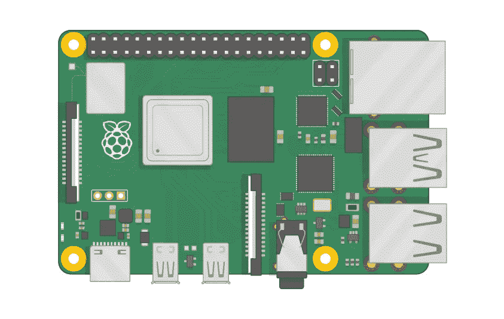

Image by [Raspberry Pi](https://projects-static.raspberrypi.org/projects/raspberry-pi-setting-up/0d6033edf45ad2d4185ed05d6cd9a01e2f803034/en/images/pi-plug-in.gif) from [Raspberry Pi](https://www.raspberrypi.org/)

Raspberry Pi 4 有 2GB、4GB 或 8GB 的内存。对于大多数教育目的、业余爱好者制作项目和桌面使用，2GB 就足够了。

我们需要的东西:

*   笔记本电脑
*   树莓 Pi 4
*   电源(如果你没有太多经验的话，最好和你的覆盆子一起购买官方的 [USB-C 电源](https://www.raspberrypi.org/products/type-c-power-supply/)。
*   具有移动热点功能的智能手机
*   微型 SD 卡(容量至少 8GB)

在开始之前，一个非常重要的部分是选择 micro SD 卡，因为我们将在其上加载操作系统，在图中我们可以看到一个 micro SD 存储器，其中我们将考虑黑盒，这个符号在表中向我们显示了当前 Micro SD 卡的分类，请务必注意，在 Raspberry Pi 上应该使用的最低速度是 10 Mb/秒。

根据我们获得的等级，在点火速度和一些任务的执行上，它会被更多地注意到。拥有最贵的 SD 以在 Raspberry 中获得更好的性能并不重要，但拥有一张好卡可以延长其使用寿命，因为 Raspberry Pi 大量使用卡，它们最终会损坏，这意味着需要购买另一张卡。


Image from [Amazon](https://www.amazon.com.mx/Sandisk-128GB-Extreme-microSDXC-Memoria/dp/B07FCMKK5X) by [SanDisk](https://images-na.ssl-images-amazon.com/images/I/815cRpgAN3L._AC_SL1500_.jpg)

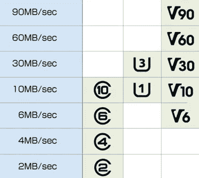

Image from [Lexar](https://www.lexar.com/wp-content/uploads/2017/09/SDFAQ-UHS-2.jpg) by L[e](https://www.lexar.com/wp-content/uploads/2017/09/SDFAQ-UHS-2.jpg)xar

许多供应商包括已经配置了 Raspberry Pi 操作系统的 Raspberry Pisd 卡，并准备好与套件一起使用，但它们通常与 NOOBS 一起提供。NOOBS 是一个便于在小型计算机上安装各种 Linux 发行版的应用程序。

NOOBS 使互联网接入在安装过程中没有必要，我们将只需要连接到网络时，它是第一次打开。这样做将使我们可以毫无问题地安装操作系统，如 Raspbian、Arch Linux。安装程序稍后将允许我们使用新的发行版正常启动我们的 Raspberry Pi，但是 NOOBS 将保留在内存中，我们可以在启动过程中通过按 Shift 键随时访问这个应用程序。

作为个人喜好，我觉得还是买一个 SanDisk 这样的品牌的内存做安装比较好，如下图。

**注意:您应该避免在没有关闭树莓的情况下断开电源，这会损坏当前的内存，并且所有内容都将丢失，即使格式化内存也无法再次使用。**

# 2.使用 Raspberry Pi 成像仪安装 Raspberry Pi 操作系统

使用 Raspberry Pi Imager 是在 SD 卡上安装 Raspberry Pi OS 的最简单方法。**注意:Raspberry Pi OS 不是唯一可以安装的操作系统**。以下概述的步骤可用于安装其他兼容 Raspberry Pi 的操作系统，但启动时的初始设置会有所不同。有关其他操作系统的更多信息，请访问[安装操作系统映像](https://www.raspberrypi.org/documentation/installation/installing-images/README.md)。要下载并运行 Raspberry Pi 成像仪，请访问页面 [Raspberry Pi 下载页面](https://www.raspberrypi.org/downloads)。单击与您的操作系统相匹配的 Raspberry Pi 成像仪的链接。

下载完成后，点击它启动安装程序。当您启动安装程序时，您的操作系统可能会试图阻止它的执行(在这种情况下，您必须单击安装程序窗口中的 ***更多信息*** 以继续，并单击 ***无论如何都要运行*** )。

一旦安装了 Raspberry Pi 成像仪

1.  将您的 SD 卡插入计算机或笔记本电脑的 SD 卡插槽。
2.  在 Raspberry Pi Imager 中，选择要安装❶的操作系统和要安装在❷上的 SD 卡(见图)。

**注:您需要首次连接到互联网，以便 Raspberry Pi 成像仪下载您选择的操作系统。该操作系统将被存储以供将来脱机使用。在线以备后用意味着 Raspberry Pi 成像仪将始终为您提供最新版本。**

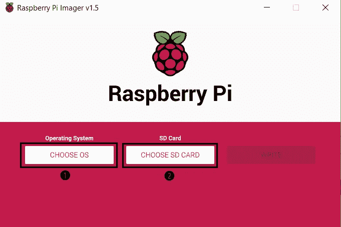

Screenshot by [Eduardo Padron](https://fullmakeralchemist.medium.com/)

如果有一张卡装有另一个以前的操作系统或一些文件，我们可以使用 Raspberry Pi Imager 进行格式化，让它保持新的状态。

我们将选择“选择操作系统”,然后我们将单击“擦除”,我们将返回主窗口，我们将选择“选择 SD 卡”,我们将选择我们的卡，“写入”已启用，我们将单击，将出现一个窗口，我们将在其中确认并准备好我们的卡已准备好用 Raspberry 操作系统覆盖。

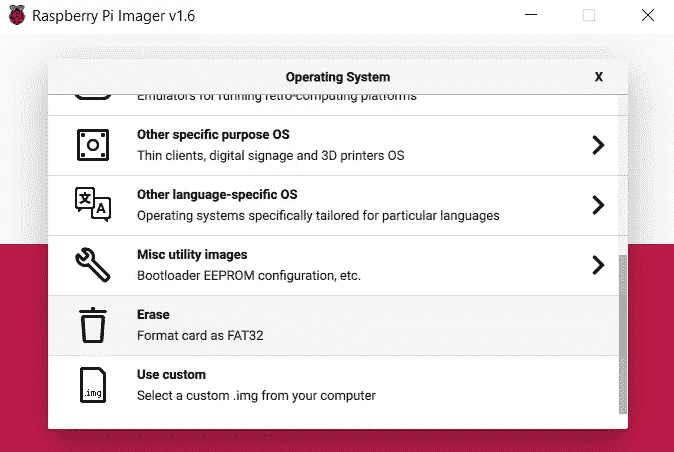

Screenshot by [Eduardo Padron](https://fullmakeralchemist.medium.com/)

要使用允许我们远程访问覆盆子的高级选项，您必须按下按键序列:

" Ctrl-Shift-X "

将显示一个窗口，我们将在其中选择“Enable SSH”框，它还将要求我们输入 pi 用户的密码，这是 Raspberry pi 中默认提供的用户，通常该用户的密码是 Raspberry，但通过此选项，您可以输入您喜欢的密码。

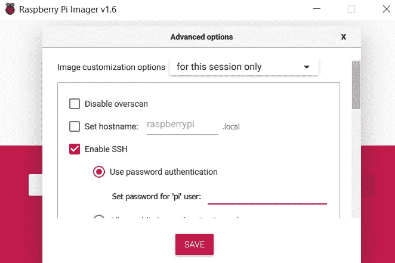

Screenshot by [Eduardo Padron](https://fullmakeralchemist.medium.com/)

在此窗口中，我们可以找到“配置 wifi”框，我们可以在其中输入网络名称和密码，正如我之前提到的，我们将使用智能手机，它将充当调制解调器(在我的情况下，我使用三星手机，它有热点选项，当设备连接到我的手机时，它会出现在连接的设备中，当我单击该设备时，它会给我 IP 地址)。 稍后我们将讨论 IP，因为它是此窗口的最后一个，它允许我们在中选择一些语言配置的国家/地区，最后我们将单击“SAVE ”,然后我们将返回主窗口。

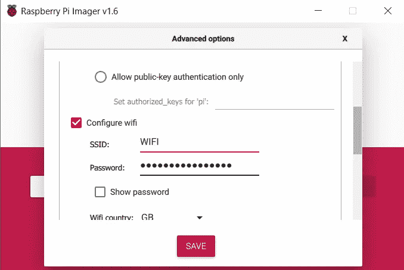

Screenshot by [Eduardo Padron](https://fullmakeralchemist.medium.com/)

现在，我们将通过单击“选择操作系统”来选择操作系统。对于那些刚开始使用覆盆子的用户，建议使用第一个选项，对于更有经验的用户，第二个选项允许我们选择针对某些特定项目推荐的精简版本。

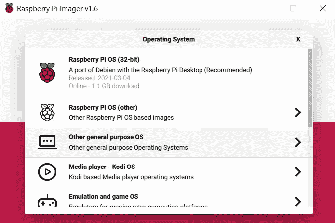

Screenshot by [Eduardo Padron](https://fullmakeralchemist.medium.com/)

现在，我们将单击“选择 SD 卡”来选择我们的卡，通过单击我们将返回到主窗口。“写入”按钮已启用，我们单击它，将出现一条消息，要求确认操作系统的写入。

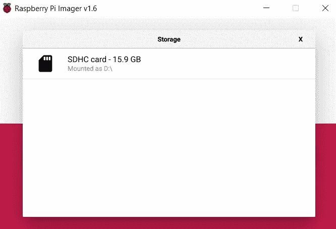

Screenshot by [Eduardo Padron](https://fullmakeralchemist.medium.com/)

在卡上写入操作系统的最后，将出现以下窗口，我们将准备好 micro SD 存储器，以将其连接到我们的 Raspberry Pi。

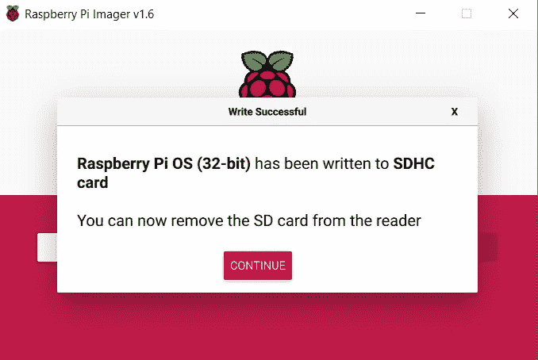

Screenshot by [Eduardo Padron](https://fullmakeralchemist.medium.com/)

要连接 SD 卡非常容易，在我们的覆盆子底部，你可以找到放置 sd 卡的插槽。

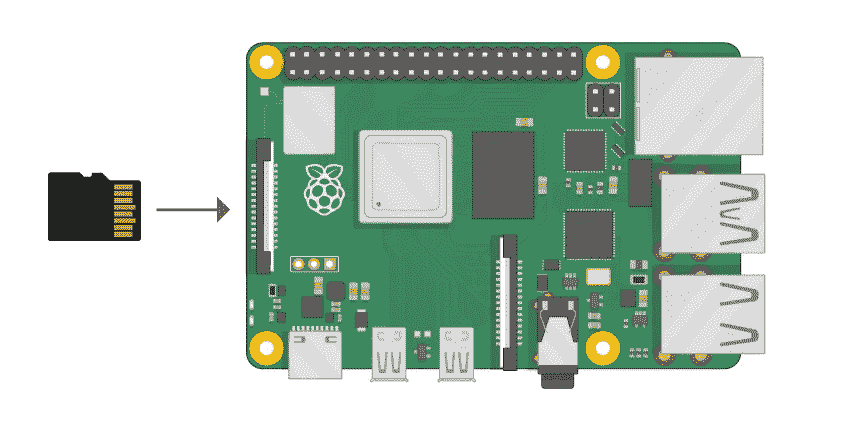

Image by [Raspberry Pi](https://www.raspberrypi.org/) from [Raspberry Pi](https://projects-static.raspberrypi.org/projects/raspberry-pi-setting-up/0d6033edf45ad2d4185ed05d6cd9a01e2f803034/en/images/pi-sd.png)

最后，我们将首先把电源连接到树莓上，然后再连接到插头上。**如果先连接到插头，再连接到树莓，我们可能会造成小短路，从而影响我们卡的使用寿命。**

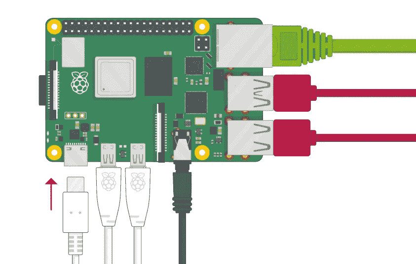

Image by [Raspberry Pi](https://www.raspberrypi.org/) from [Raspberry Pi](https://projects-static.raspberrypi.org/projects/raspberry-pi-setting-up/0d6033edf45ad2d4185ed05d6cd9a01e2f803034/en/images/pi-power.png)

**3。SSH 窗口**

您可以使用 SSH 从同一网络上的另一台计算机或设备远程访问 Raspberry Pi 的命令行。Raspberry Pi 将充当远程设备:您可以使用另一台机器上的客户端进行连接。您只有命令行访问权限，没有完整的桌面环境。要获得完整的远程桌面，请参阅下面的 VNC 及其安装指南[如何使用 VNC 浏览器](https://www.raspberrypi.org/documentation/remote-access/vnc/)远程桌面到您的树莓 Pi。

**注意:在最新版本的 Raspberry Pi OS 中，只需要启用 VNC，所以不需要像 VNC 链接显示的那样安装服务器。**

通过前面的步骤，我们已经在 Raspberry 中启用了 SSH，现在我们将第一次访问开始工作。

之前我们提到过 IP，如果没有热点功能，你可以在 [IP Raspberry](https://www.raspberrypi.org/documentation/remote-access/ip-address.md) 中查看其他获取方式

我们需要安装 Putty，这是一个为 Windows 开发的 SSH 客户端。PuTTY 是开源软件，可以通过源代码获得。要下载，请访问 [Putty](https://www.putty.org/)

当我们安装 Putty 时，将出现以下内容，我们必须选择图像中标记的内容。

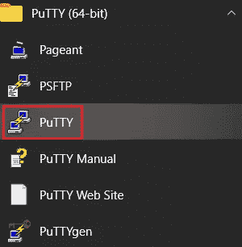

Screenshot by [Eduardo Padron](https://fullmakeralchemist.medium.com/)

当我们开始时，会出现下面的窗口，在这里我们输入我们的覆盆子的 IP。然后，我们将单击打开。它将向我们发送一条警告消息，我们将在其中单击“Yes”。

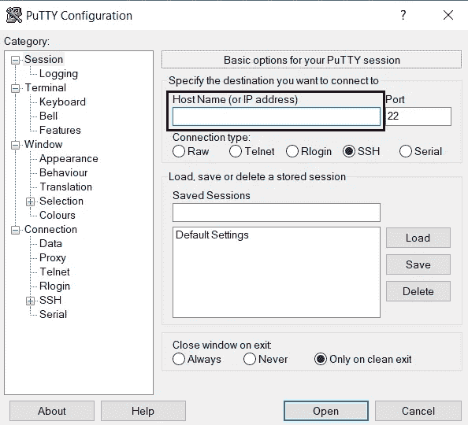

Screenshot by [Eduardo Padron](https://fullmakeralchemist.medium.com/)

单击“是”后，将出现一个窗口，如果密码未更改，将在该窗口中输入用户，工厂用户为 pi 用户，我们在前面步骤中建立的密码为 raspberry。


Screenshot by [Eduardo Padron](https://fullmakeralchemist.medium.com/)

进入后，我们的用户会要求我们输入密码。


Screenshot by [Eduardo Padron](https://fullmakeralchemist.medium.com/)

一旦输入密码，它将显示如图所示的窗口，我们将完全访问我们的覆盆子壳。现在，我们将对其进行配置，以访问桌面。

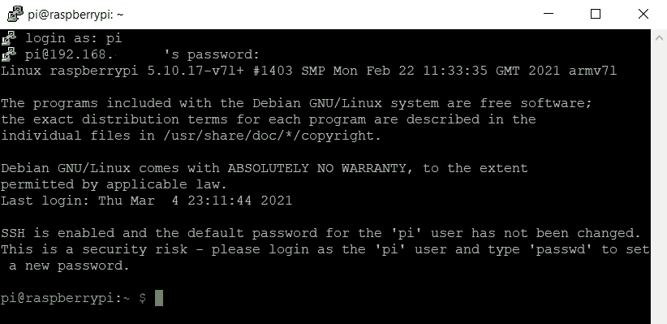

Screenshot by [Eduardo Padron](https://fullmakeralchemist.medium.com/)

**4。VNC**

有时不方便直接在树莓派上工作。也许你想在另一个远程控制设备上工作，比如你的笔记本电脑。VNC 是一个图形桌面共享系统，允许您从另一台计算机或移动设备(与 VNC 浏览器)远程控制一台计算机(与 VNC 服务器)的桌面界面。VNC 浏览器将键盘和鼠标或触摸事件传输到 VNC 服务器，并接收屏幕上的更新作为回报。您将在电脑或移动设备的窗口中看到 Raspberry Pi 桌面。你可以控制它，就像你在做树莓派一样。简而言之，它非常类似于使用 TeamViewer。从油灰我们进入我们的覆盆子终端。一旦进入我们的终端，我们输入命令:

```
sudo raspi-config
```


Screenshot by [Eduardo Padron](https://fullmakeralchemist.medium.com/)

我们将转到下一个窗口，选择选项 3“界面选项”。

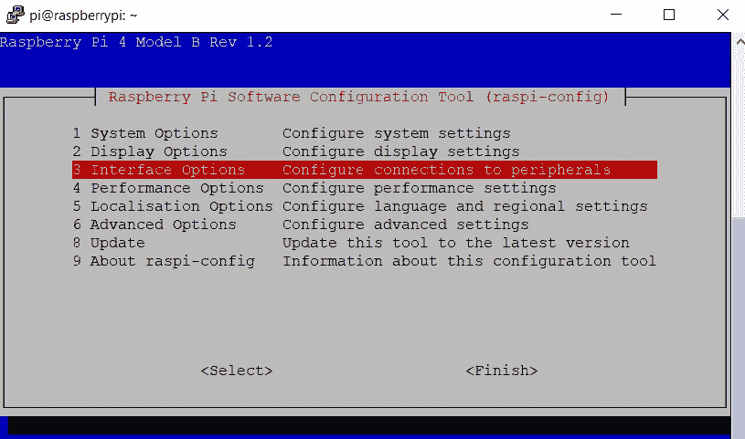

Screenshot by [Eduardo Padron](https://fullmakeralchemist.medium.com/)

现在下面的选项会出现，我们将选择 VNC。

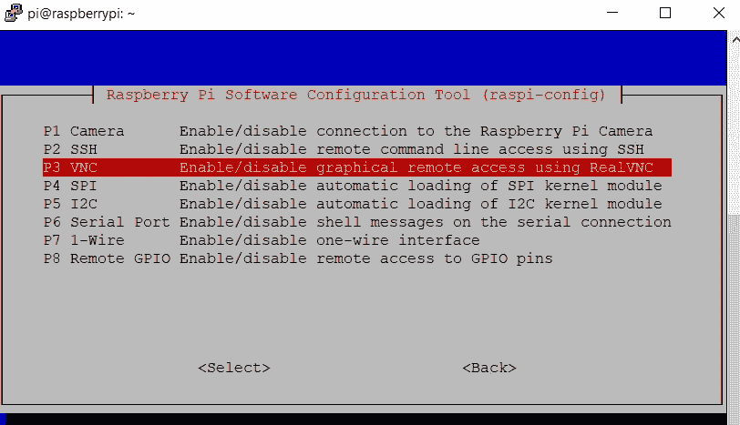

Screenshot by [Eduardo Padron](https://fullmakeralchemist.medium.com/)

我们将确认我们想要启用 VNC 服务器。


Screenshot by [Eduardo Padron](https://fullmakeralchemist.medium.com/)

我们将返回到 sudo raspi-config 菜单，现在我们将选择“显示选项”。


Screenshot by [Eduardo Padron](https://fullmakeralchemist.medium.com/)

现在我们将选择“D1 决议”。为我们的团队配置一个没有问题的解决方案。

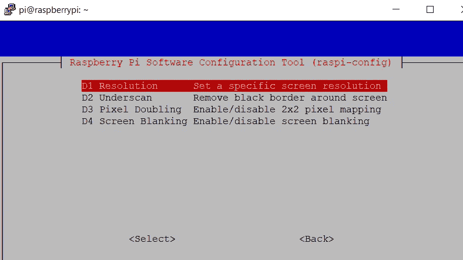

Screenshot by [Eduardo Padron](https://fullmakeralchemist.medium.com/)

我们将选择“DMT 模式 85”。1280 x 720 分辨率与当前大多数设备兼容，如果它在您的计算机上看起来不太好，请尝试使用其他一些分辨率较低的选项。

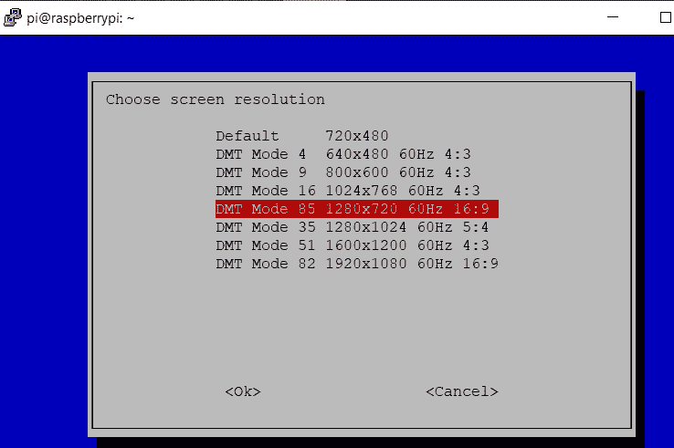

Screenshot by [Eduardo Padron](https://fullmakeralchemist.medium.com/)

确认时，它会问我们是否要重启，我的建议是“是”选项。重启后，我们的树莓就可以第一次进入桌面了。

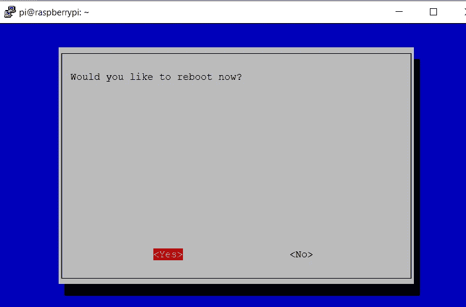

Screenshot by [Eduardo Padron](https://fullmakeralchemist.medium.com/)

我们必须在我们的电脑上安装 VNC，下载访问 [VNC 下载](https://www.realvnc.com/es/connect/download/viewer/)，一旦安装好你就可以打开我们的程序，在顶部输入我们覆盆子的 IP。


Screenshot by [Eduardo Padron](https://fullmakeralchemist.medium.com/)

将出现以下窗口，我们在其中输入 Raspberry Pi 的用户名和密码。我们将接受，它将向我们展示树莓派桌面。


Screenshot by [Eduardo Padron](https://fullmakeralchemist.medium.com/)

从我们的 Windows 计算机登录后，我们将能够远程看到我们的 Raspberry Pi 的桌面，我们将在警告窗口中单击“ok ”,然后我们将继续执行以下步骤:
当您第一次启动您的 Raspberry Pi 时，将出现“欢迎使用 Raspberry Pi”应用程序，并指导您完成初始设置。单击下一步开始配置。

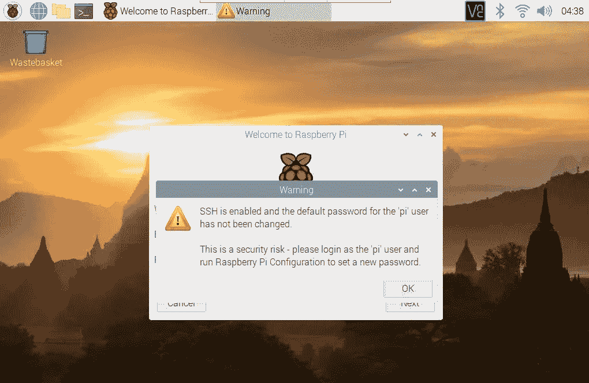

Screenshot by [Eduardo Padron](https://fullmakeralchemist.medium.com/)

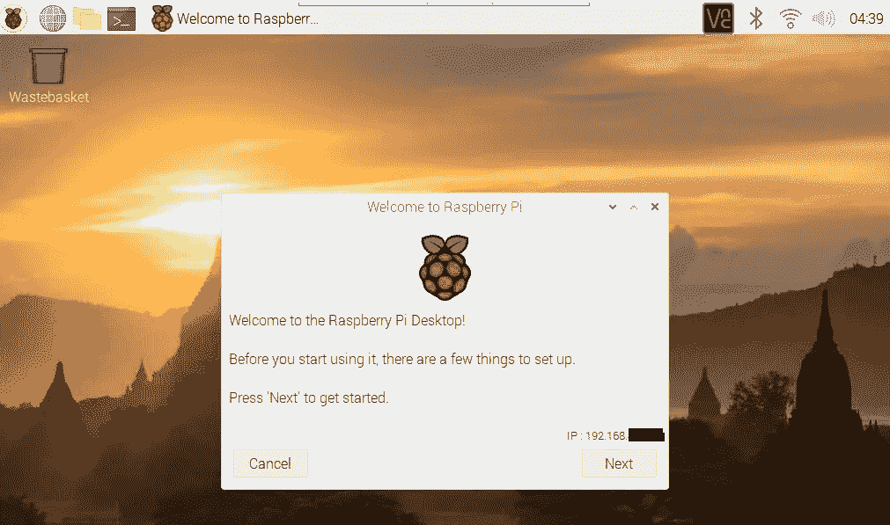

Screenshot by [Eduardo Padron](https://fullmakeralchemist.medium.com/)

设置您的国家、语言和时区，然后再次单击下一步。

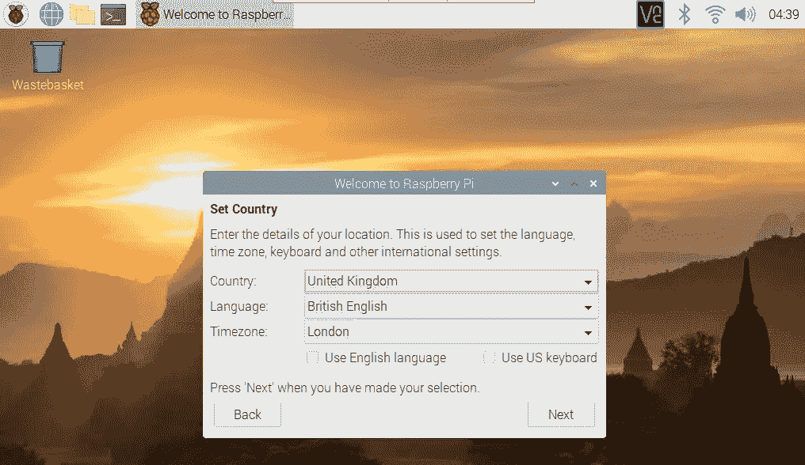

Screenshot by [Eduardo Padron](https://fullmakeralchemist.medium.com/)

它将为我们提供为您的 Raspberry Pi 输入新密码的选项，没有必要更改密码，出厂时 Raspberry 已经有了 Pi 用户名和 Raspberry 密码，更改只是为了安全起见。然后单击下一步。

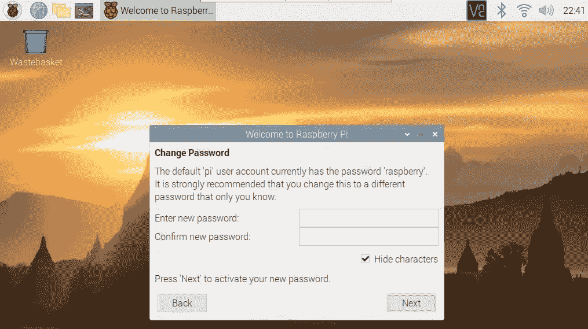

Screenshot by [Eduardo Padron](https://fullmakeralchemist.medium.com/)

它将为我们提供消除屏幕黑边的选项，因为我们使用的是远程服务器，我们看不到通过 HDMI 连接 Raspberry 时通常会出现的边缘，因此我们将跳过此选项，单击下一步。

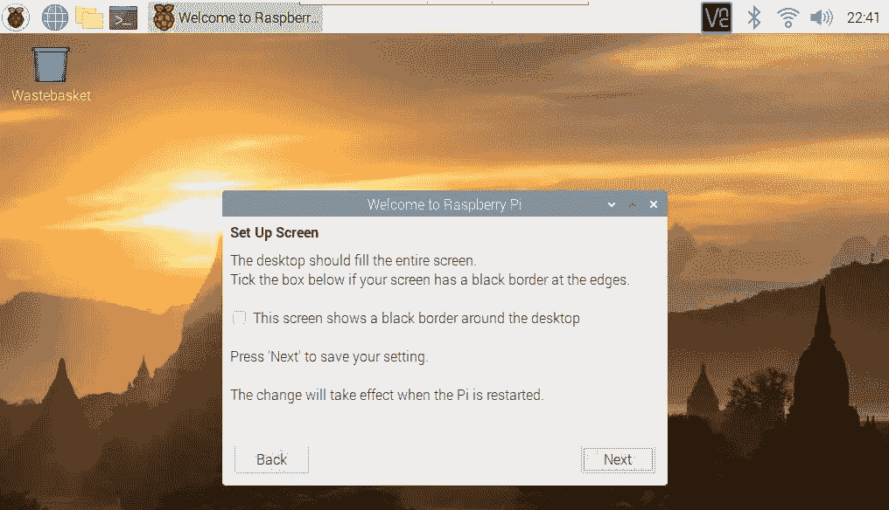

Screenshot by [Eduardo Padron](https://fullmakeralchemist.medium.com/)

它将允许我们连接到另一个无线网络，方法是选择其名称，输入密码(**注意:在 SSH 或 VNC 中更改网络将自动关闭应用程序，Raspberries 有一个动态 IP，它会更改每个连接的新网络，您必须输入新的网络 IP 才能再次远程访问**，我们将通过单击下一步继续配置。

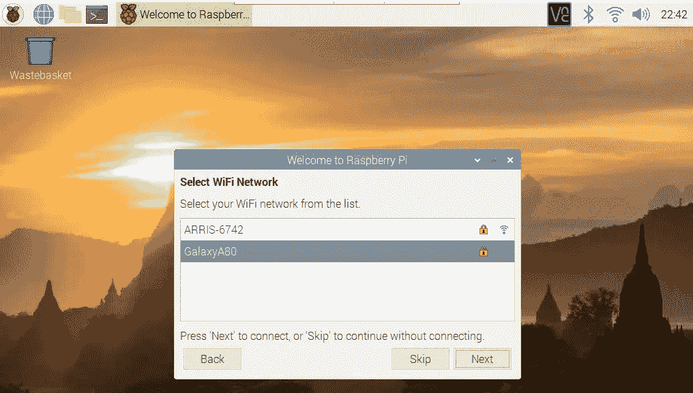

Screenshot by [Eduardo Padron](https://fullmakeralchemist.medium.com/)

将出现更新选项，最明智的做法是单击下一步，让向导查找并安装 Raspberry Pi 操作系统的更新(这可能需要一点时间)。


Screenshot by [Eduardo Padron](https://fullmakeralchemist.medium.com/)

如果更新成功执行，将出现以下窗口，如果失败，最好按照说明操作，然后通过 SSH 中的 Putty 输入命令:

```
1\. sudo apt update
2\. sudo apt full-upgrade
```

如果你愿意，请点击 Ok。

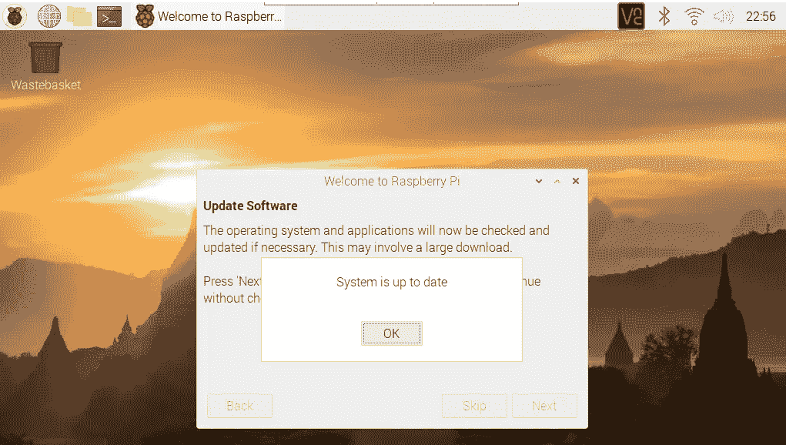

Screenshot by [Eduardo Padron](https://fullmakeralchemist.medium.com/)

我们将单击“Restart”来完成配置。**注意:您只需在必要时重启即可完成更新。**

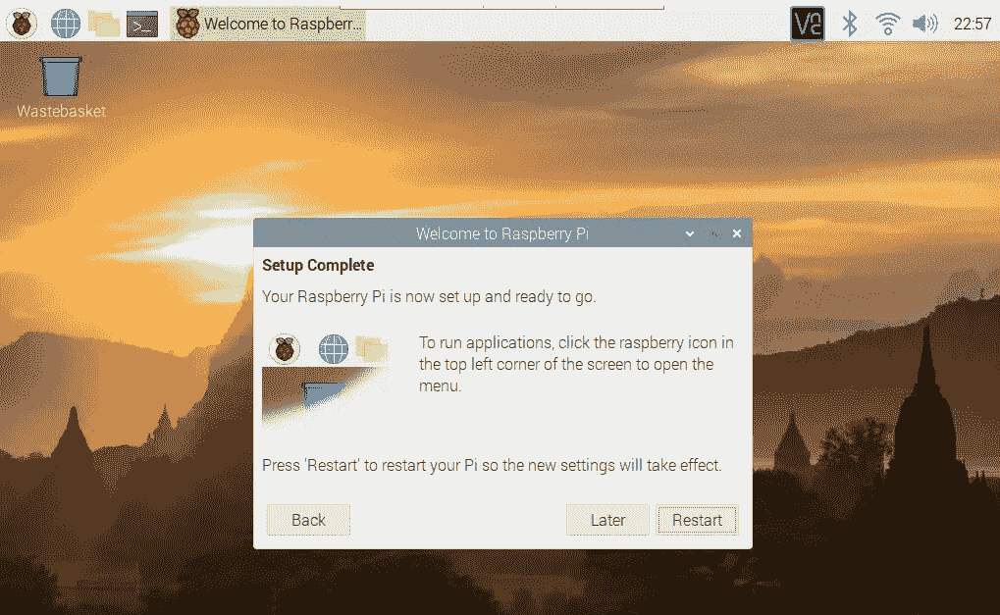

Screenshot by [Eduardo Padron](https://fullmakeralchemist.medium.com/)

完成这些步骤后，我们的覆盆子就可以用于我们的项目了。现在，您可以使用之前的任何方法输入您的覆盆子，并使用此工具进行创建。

如果你想了解更多关于如何第一次启动树莓的信息，请访问其官网[设置树莓](https://projects.raspberrypi.org/en/projects/raspberry-pi-setting-up)

如果你有兴趣的话，可以回顾一下如何在 Raspberry Pi 上安装 Visual Studio 代码和 Git 的指南。

你也可以在我的 [Github](https://github.com/fullmakeralchemist/raspberrysetup) 里查看这个帖子的资源库。