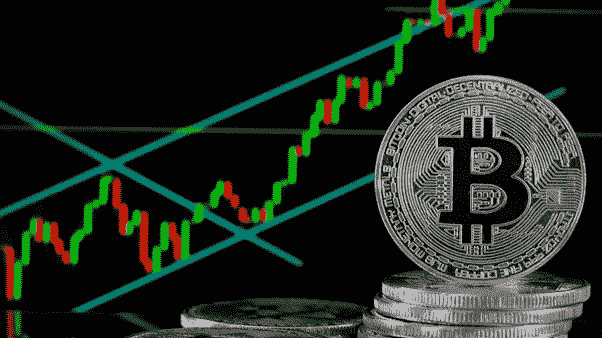
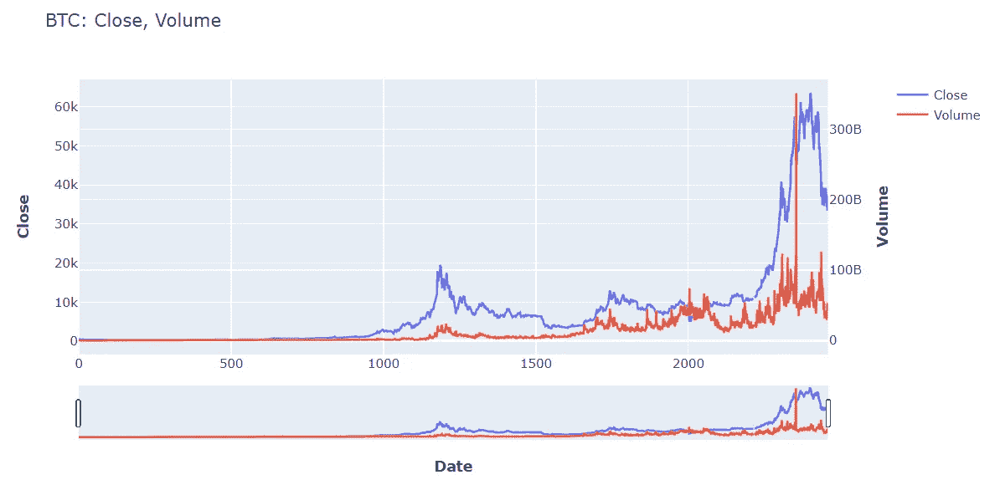
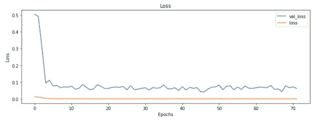
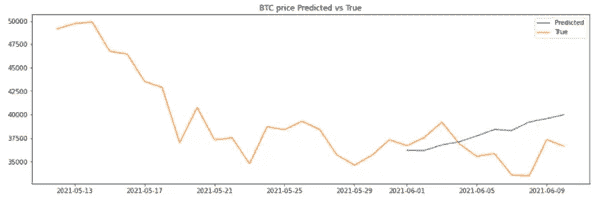

# 基于深度学习的短期比特币价格预测

> 原文：<https://medium.com/geekculture/short-term-bitcoin-price-prediction-with-deep-learning-ab4386e84b5?source=collection_archive---------11----------------------->

基于 Python 的神经网络预测加密货币价格

这篇文章是关于我的 Udacity 数据科学纳米学位顶点项目。

# 动机

由于最近对加密货币的大肆宣传——主要是 ATH 创下历史新高——我发现尝试预测比特币的价格很有意思。

# 项目定义

这个项目的目标是用深度学习来预测比特币的价格。更准确地说，我将展示一个具有长短期记忆细胞的堆叠神经网络模型(简称 LSTM)。此外，我将包括两个技术，以避免过度拟合所谓的早期停止和辍学。最后，该模型将被验证并用于预测未来 10 天的 BTC 价格。

## 问题陈述

这个项目的问题陈述是比特币价格的预测。

## 韵律学

因为目标是预测一个数值，所以这个问题被称为回归。对于这类模型，最常用的度量标准是均方误差(MSE)、均方根误差(RMSE)和平均绝对误差(MAE)。

这个问题的性能度量将是 MSE，因此在编译方法中定义的损失函数是 MSE。

损失越小，意味着预测值越接近真实值，换句话说，模型性能越好。尽管如此，我们的目标并不是让它尽可能接近 cero，因为它可能会在训练数据中表现非常好的模型上结束，但在实际预测中却不是这样。这个问题被称为过度拟合，我们应该避免它。

# 放弃

该模型和预测不会假装被用作财务建议。它们是为教育目的而创建的，并且有时间限制。不要根据结果做出财务决策。

> 记住:'*所有的模型都是错的，但有些是有用的*'乔治 E.P. Box

# 资料组

这个项目使用的数据集只是从[雅虎财经](https://finance.yahoo.com/quote/BTC-USD/history?p=BTC-USD)检索的 BTC-美元数据，包括 BTC 开盘、盘高、盘低、收盘、调整收盘和所需时间间隔的成交量。在这种情况下，我检索了所有可用的数据，在脚本中，我选择使用最新的 1200 个观察值(n_past_total ),因为考虑到第一年的行为可能与现在的行为有很大不同。

## 数据探索和可视化

为了浏览数据集，执行了一系列检查:

*   我比较了“Close”和“Adj Close”价格，以决定使用哪一个作为参考，但它们在所有价值上都匹配。做了一些研究，发现对于加密货币来说，这应该没有什么不同，因为当谈到传统股票中公司董事的决策时，它们可能会有所不同。
*   查找空值，发现有 4 天缺少数据。查了不同的相关来源，但找不到可靠的信息。因此，我决定用 Pandas 的‘ffill’方法填充缺失值，其中空值将被替换为先前的观察值(最后一个可用的观察值将被传播)。另一种方法也可以是删除丢失的值。
*   我绘制了“收盘”价格和“成交量”，以寻找任何视觉异常。事实上，在 2021 年 2 月 26 日，交易量出现了一个显著的峰值——大约是正常值的 3 倍。对于这个数据点，我检查了不同的数据源，发现它们是一致的，所以我没有采取任何进一步的行动。
*   最后，我计算了收盘价和交易量之间的皮尔逊相关性，结果是 0.799，因此我决定将交易量作为预测比特币未来价格的次要特征。

# 模型定义

选择用于这种分析的算法是长短期记忆(LSTM)神经网络。关于这种递归神经网络的细节超出了本文的范围，但是简短的要点可能会澄清要点:

1.  递归神经网络(RNN)不同于标准的前馈方法，它在计算中使用先前的输入源。
2.  训练 RNN 时可能出现的一个问题是迭代循环期间梯度误差的爆炸，导致神经网络不稳定。
3.  LSTM 通过增加记忆和更新新信息的能力或者直接删除它们来解决这个问题。由于更复杂的架构，这是可能的。

在这种情况下，模型是用 Keras 开发的，Keras 是一个 Python 库，在后端使用 TensorFlow。Keras 的 API 简化了神经网络的实现。

## 数据预处理

训练数据集是过去观察(n_past)的收盘价和成交量，输出将是未来 n 天(n_future)的收盘价预测。因为我将使用两个变量作为输入，这个模型被称为多元模型。

数据准备的第一步是缩放所有观测值，在这种情况下，我使用 MixMaxScaler，但也可以使用 StandardScaler。

其次，我将按照 RNN 要求的格式重新安排培训数据。为此，我定义了包含 n_past 观察值的 X_train 数组，用于预测 n_future 价格，如果 n_past 是 30，n_future 是 10:

*   **X_train** 将包含:Xt-30，Xt-29，…，Xt-2，Xt-1。
*   **y_train** 将包含:yt，yt+1，…，yt+8，yt+9。

理解这些向量对于时间窗口中的每个可能的迭代都是需要的是非常重要的。由于模型的输入是过去的 30 次观察，所以不可能预测前 30 次观察的值，剩下的那些数据点仅用作输入。此外，由于我们预测 n_future 天，来自数据集的最新数据点将不属于 X_train，而是仅属于 y_train。

此外，上述解释应适用于我们想要用来训练模型的每个输入特征。但是，假设我们要预测的是 BTC 价格，这意味着只有 1 个变量，y_train 将只有 1 个维度，忽略所有其他用作输入的特征。

因此，总而言之，我们最终应该得到以下矩阵:

*   **X_train** 带形状(n_past_total — n_past — n_features，n_past，n_features)
*   **y_train** 带形状(n_past_total — n_past — n_features，n_future)

## 构建和训练模型

该模型是用 Keras 构建的，使用顺序类并堆叠不同的 LSTM 图层。

对于输入层，我将节点/神经元的数量定义为 n_past，以便表示每个变量。

对于输出层，由于我们正在构建一个多步模型，神经元的数量应该与我们期望的未来预测的数量相同，命名为 n_future。

在输入层和输出层之间，可以添加多个隐藏层。没有规则来确定隐藏层的最佳数量，也没有规则来确定它们的神经元数量。在这种情况下，我使用了 8 个隐藏层，每个层有 20 个节点。

为了防止过度拟合，辍学和提前停止被包括在内。简单回顾一下:

*   Dropout 是添加的层，仅使用下一层的一部分节点，并丢弃其他节点；如果 dropout 为 0.2，下一层的 20%的节点将被忽略。
*   当受监控的指标停止改善时，提前停止会中止训练。在这种情况下，我们希望最小化的度量是“val_loss ”,耐心为 25，这是没有改善的时期的数量，在此之后训练将停止。

## 精炼

通过测试几个参数对模型进行了调整，但是仍然可以进行进一步的测试。在笔记本的开头，你可能会找到一个单元格，在那里主要参数被外推以继续探索。

尽管我进行了几次测试，但发现的主要改进是通过调整以下内容:

*   **早期停止:**对于找到大量的时期来运行非常有帮助，避免了运行几个时期来结束一个完全过度拟合的模型。
*   **Dropout:** 这种正则化技术显著提高了模型在测试数据上的性能。人们注意到，如果没有它，模型在训练数据上表现得更好，但在测试数据上表现得更差。
*   **输入特征:**初始模型仅使用收盘价格作为输入，但模型对其自身的变化过于敏感。通过将体积作为第二个特征，模型预测最终变得更加平滑。
*   **激活函数**:发现与 relu 或 sigmoid 相比，softsign 的模型收敛较慢，但平滑得多。

# 模型评估和验证

为了评估模型的性能，进行了以下分析:

## 损失度量(MSE)

用“模型.拟合”方法中定义为 0.1 (10%)的相应验证集绘制损失图。

理想情况下，随着时代数量的增加，我们希望看到这两者的融合。如果两者相互背离，这是过度拟合的迹象。在这种情况下，我们可以看到，由于丢失和提前停止，它们收敛到一个点。没有它们，一旦模型开始过度拟合，两者就会收敛，然后发散。

## 将预测值与实际值进行比较

一旦训练完成，我们对损失如何收敛感到满意，我们就根据实际数据测试我们的模型，看看它的表现如何。我们可以通过简单地可视化模型预测和实际值来做到这一点:

结果看起来不太乐观。

在分配的时间内尝试不同的参数和 RNN 架构，不可能进一步提高模型性能。这归因于 BTC 价格的高波动性，它高度依赖于外部因素，而不是其自身的价格和数量。例如，埃隆·马斯克的推文，释放批准/限制的国家，采用 BTC 的公司(VISA，PayPal，Tesla 等)。

## 正当理由；辩解

正如本文开头所引用的，所有模型都会有一定程度的误差。对于这个特殊的问题，预测比特币的价格，具有所讨论参数的递归神经网络的最新技术被证明能够以合理的误差预测未来价格(至少对于这个项目来说，可能不足以做出金融决策)。

# 结论

## 模型预测

最后，我将预测并绘制未来 10 天比特币的价格。

## 进一步的改进

由于时间限制，我无法完成我想要的项目，但在这里我将概述一些可以进一步发展的想法:

*   包括其他模型来比较结果，例如 ARIMA、萨里玛、脸书先知等等。我们也可以尝试 GRU 细胞，而不是 LSTM 的 RNN。
*   包括更多影响 BTC 价格特征。例如:一些其他股票交易价格、Twitter 数据、Whale 数据、altcoins 数据、活跃的 BTC 地址等。
*   通过减少时间间隔来增加数据点的数量。对于这个笔记本，我使用的是每日价格，但是我们也可以尝试使用每小时价格。

## 文档和代码库

请查看我的 [GitHub 库](https://github.com/sjuanandres0/crypto)以获得 Jupyter 笔记本中解释的完整代码。

如果您有任何疑问或改进项目的建议，请随时评论或联系我。

如果你想要更多关于 LSTM、比特币或其他相关主题的文档，我列出了一个在我做项目时有用的链接列表，看看吧！

## 反射

我发现这个项目特别有趣，因为它结合了我非常热衷于学习的两大主题，即数据科学和加密货币。我真的很喜欢研究这两个主题，以便获得一个足够好的模型，但我对其中每个主题的信息量感到有点不知所措。机器学习和加密货币是两个完整的知识世界，试图建立一个稳健可靠的模型绝对不是一件容易的事情。

在项目的头脑风暴中，我提出了许多想法，但由于时间限制或无法收集足够的公开数据，我最终放弃了这些想法。

一定会不断研究改进模型！

# 感谢阅读！