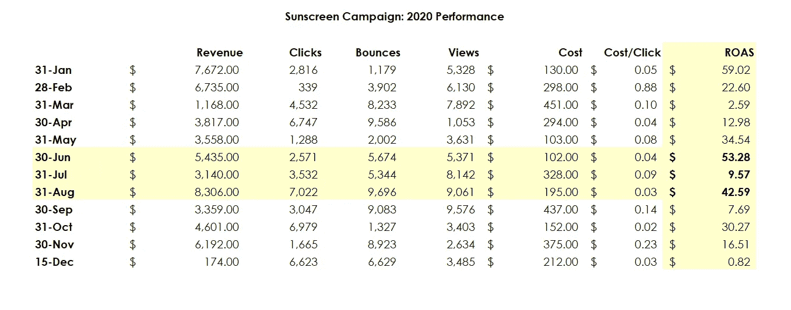
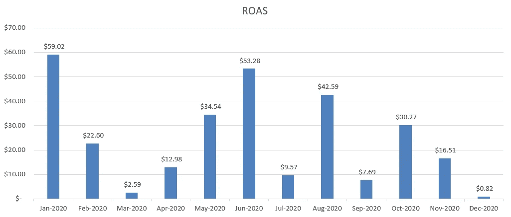
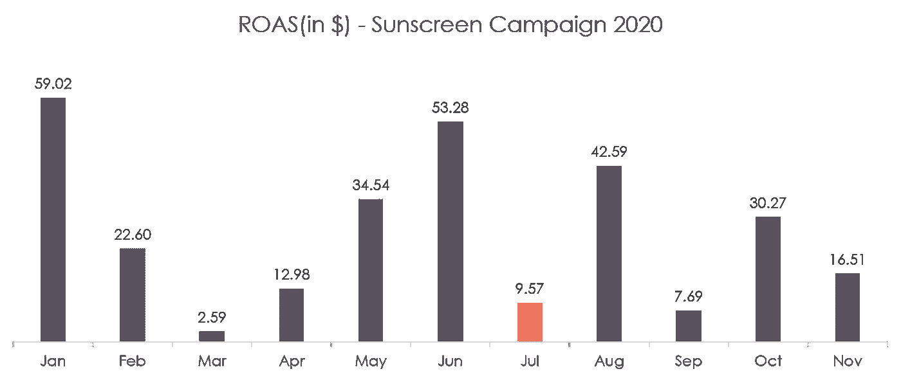

# 简单而有效的数据可视化技巧

> 原文：<https://medium.com/geekculture/simple-yet-effective-tricks-in-data-visualization-6ea87d9a0c3e?source=collection_archive---------19----------------------->

Photo by [HalGatewood.com](https://unsplash.com/@halacious) on Unsplash

我们很多人都对数据分析感兴趣，但并不是每个人都有最佳的方式来表达他们的理解和深刻的想法。有许多关于数据可视化的好课程和书籍。其中，我非常推荐 Tufte 的数据图形理论中的图形卓越概念:*“用最短的时间，最少的笔墨，最小的空间，给观者最大数量的想法”。*

这个理论被分解为以下可视化规则:

3 Simple visualization rules

LinkedIn Learning 的营销课程数据可视化讲师 Ian Lurie 全面坚持了这些原则。它们极大地补充了塔夫特的理论。首先，我们应该减少脑力劳动，因为解释数据的人越多，他们理解数据的速度就越慢。

例如，如果有人给你下表，其中包含防晒霜营销活动的表现，并询问你的见解。你看到了什么？

从这张表中你可以得到许多想法，如收入、浏览量、点击量和成本等。然而，我们需要找出管理层真正关心的是什么。是的—广告支出的回报(roa)。此外，我们知道防晒霜是不可或缺的产品，尤其是在夏天；所以我们想看看这一季是否会有上涨。将感兴趣的领域界定为:

很明显你需要经历一些步骤来找到重要的数据点，提取需要的信息。然而，这真的容易发现什么真知灼见吗？事实上，桌子给大脑在几分钟内抓住想法制造了负担。你的眼睛来回转动，你的大脑需要在途中比较这些数字。我想下面的图片可能是一个更好的代表…

这张图表生动地对比了不同时期的 roa。我们知道一月和六月表现优异，但是七月呢？这是夏季唯一一个结果不尽如人意的月份。因为这篇文章更多的是关于可视化而不是数据分析，所以我会在图表上强调并发现一些问题:

*   通信上下文不正确，因为 2020 年 12 月的数据不完整。在表中，只收集了前两周的数据。因此，图表中必须排除 12 月的数据→确保设计真实。
*   既然已经有数据标签，还需要 y 轴标签吗？—没有
*   所有数据均以美元为单位。标签$和 xtick-axis 标签 2020 可以被移除并合并到图表标题中以提供上下文。
*   当 y 轴被删除时，网格线是不必要的。

我的改良版:

这个版本不仅摆脱了上述问题，还坚持了第三条规则 ***“数据强调，而不是可视化”*** 。视觉上的每一点墨迹都需要一个理由。添加更多的东西可能不会有助于更好地交流数据，但会产生“图表垃圾”。

最后一点是关于美学方面——字体和颜色。我建议使用安全字体(大多数电脑都有的字体)来避免字体失真。圣衬线字体(没有额外的脚)如世纪哥特式是一个很好的候选人。此外，使用合适的调色板是很重要的。事实证明，颜色可以增强吸引力和沟通效果。我通常使用 [ColorBrewer](https://colorbrewer2.org/#type=sequential&scheme=BuGn&n=3) 为我的视觉效果选择颜色，以避免色盲并实现友好打印。

感谢你读到这里，我希望这些简单的技巧能帮助你提高可视化技巧。记住*【少即是多】*。