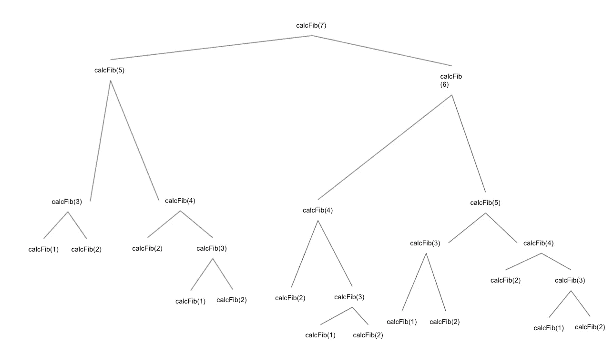
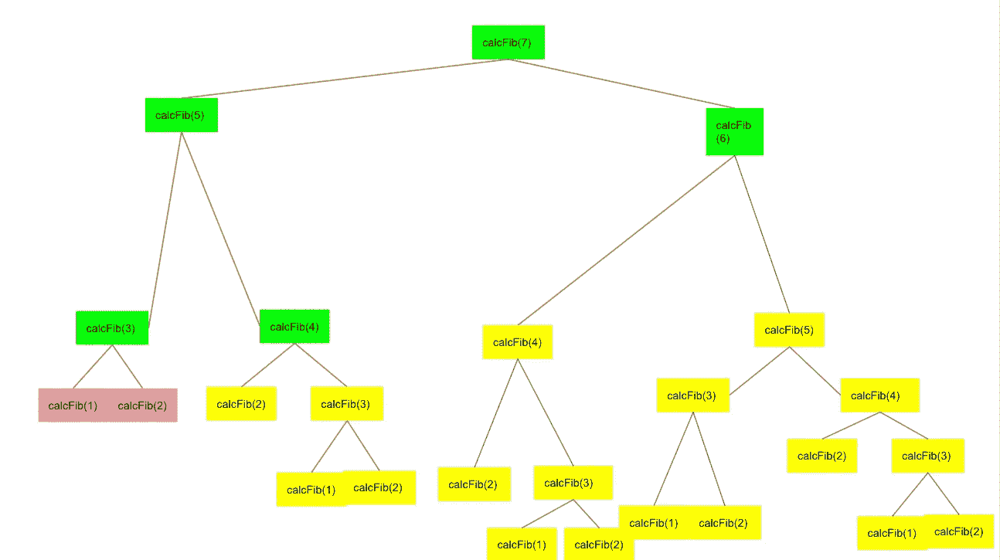

# 所以需要计算第 n 个斐波那契数？

> 原文：<https://medium.com/geekculture/so-you-need-to-calculate-the-nth-fibonacci-number-b9ae9b70fc12?source=collection_archive---------45----------------------->

Photo by [Milan Popovic](https://unsplash.com/@itsmiki5?utm_source=medium&utm_medium=referral) on [Unsplash](https://unsplash.com?utm_source=medium&utm_medium=referral)

我是通过参加一个编码训练营开始全职编码的。正如你所想象的，在课程接近尾声时，一个很大的重点是解决至少初级水平的面试问题。这是一项艰巨的任务，因为即使有经验，解决面试问题也是一项艰巨的任务。作为一个寻找我的第一个角色的初级开发人员，这个特殊的面试问题受到了我的尊敬，它是一个区分低级初级开发人员和高级初级开发人员的问题。在某种程度上，这是我大三寻找第一个角色时的面试问题中的圣杯。事实上，我从来没有在面试中被问过这个问题，现在我在面试别人时，我不会向初级开发人员问这个问题。无论哪种方式，这都是一个有趣的问题，因为有多种方法来完成，并且不同的参数在改变时会修改解决方案。如果你不熟悉斐波那契数列或者它是如何产生的，你可以查看维基百科词条[这里](https://en.wikipedia.org/wiki/Fibonacci_number)(【https://en.wikipedia.org/wiki/Fibonacci_number】)。

# 重要警告

非常重要的是，如果你在面试中被问到这个问题，你绝对应该做的第一件事就是和你的面试官澄清他们期望你如何开始撒谎。例如，序列通常从 0，1 开始。当然，从那里我们用这两个数字来计算下一个数字，1。有的面试官希望你从 0 开始，有的面试官希望你从 1 开始。所以澄清这一点非常重要。另外，典型的问题是让你计算斐波那契的第 n 个值。确保你明白 N 是什么。换句话说，N 是索引位置还是列表本身的可视位置。最大的区别是大约`n=0`是位置 0，或者`n=1`是位置 0。事实上，如果你不问的话，面试官可能会提出这个问题，也许是为了说明你应该在开始之前澄清实际需要什么。所以要谨慎这两件事。对于本文，我们将假设面试官要求我们从 1 而不是零开始，N 代表指数值。我们还将假设面试官已经让我们知道我们可以用任何可能的方式解决这个问题，并且没有引导我们走向具体的实施。

# 最简单的方法

解决这个问题最直接的方法是使用某种 for 循环迭代 N 次，每次将 Fib 序列中的下一个数字添加到一个数组中。一旦到达 N，我们就可以返回数组中的第 N 项。

要浏览这段代码，让我们从结果变量开始。我选择用前两个值填充结果数组，并从索引 2 开始我的 incrementer 变量，而不是从一个空的结果数组开始，然后实现逻辑来添加 1。这是因为我们使用前两个数字来计算下一个数字，所以这些是特例。否则，我们只需循环 N - 2 次迭代，每次计算下一个斐波纳契数并添加到结果数组中。一旦我们的 for 循环结束，第 n 个结果已经生成，现在我们可以返回它了。这实际上是一个非常可靠的解决方案，也是解决这个问题的好方法。有一点很棒，那就是它的运行时复杂性本质上是线性的，即 O(N)。换句话说，随着 N 越来越大，我们只需要做线性量的功就可以继续计算。这很好，并且伸缩性很好，这就是为什么你的计算机能够计算上面例子中的`N=50`。

# 面试官通常是如何提出问题的？

根据我的经验，这个问题有两种提问方式。第一种方式，面试官是想看看你在几乎零指导的情况下会如何解决。你会选择迭代还是递归。你能支持你为什么选择这种方法吗？如果你像我们上面所做的那样写迭代版本，面试官很可能会要求你递归地写，或者至少讨论递归地写。这个问题的第二种提问方式是直接要求递归地完成。为什么？因为计算斐波那契的递归版本涉及到许多对软件工程师来说很重要的不同技能。让我们看看它是什么样子的。

让我们试着分析一下这里发生了什么。注意我们递归函数的基本情况。我们同样不允许数字小于零，这将导致错误。对于小于 2 的 N 值，我们也总是返回 1。这应该是有意义的，因为前两个位置在我们的序列中是 1，这代表了我们递归函数的基本情况。在任何其他情况下，我们简单地通过计算前两个数字的 fib 来递归。最终，您遇到了您的基本用例，当调用从执行堆栈中弹出时，它们开始被返回并相加，最后，您的初始函数返回正确的值。它不是很直观，直到你看到它，对我的大脑来说，最好先理解 for-loop 版本，然后可视化该值数组，帮助我了解这个实现如何与递归一起工作。请密切注意，在代码中，我已经注释掉了第 10 行。实际上，我不建议在您的终端或浏览器中运行这行代码，因为它很可能会导致死机，或者需要很长时间才能运行。结果是递归版本的运行时复杂性比 for-loop 版本要差得多。事实上，这是最糟糕的运行时复杂性之一，O(2^N)或指数。这基本上意味着，随着我们的投入越来越多，需要完成的工作量也成倍增加。这是问这个问题的另一个原因。面试官想知道你是否知道这个概念，并且明白如果你真的在编写一些应用程序，向世界公开一个 API 来计算斐波那契数，你不会写完代码就收工。

# 您如何扩展解决方案？

我们现在已经使用递归解决了一个算法，我们现在必须花一些时间尝试优化它，以扩展到 N 的非常大的输入，这意味着我们应该以线性或更好的对数运行时复杂度(O(N)或 O(logN))为目标。在这种情况下，我们能做的最好的是 O(N ),但这将使我们的递归解决方案在最终运行时复杂性方面与原始 for-loop 版本持平。让我们来看看如何实现这一点。

为了完成这个优化，我将使用一种叫做记忆化的技术。在高层次上，它仅仅意味着跟踪值并重用它们，而不是再次执行计算。这相当于一个数据库前面的缓存，该数据库接收许多对相同数据的请求。我们简单地在我们的对象中存储我们所在的 N 作为一个键，对于这个值，我们使用我们已经计算的，如果我们再次看到这个 N 值，那么我们可以使用缓存的版本，而不是潜在地调用一个大的递归函数调用分支。这将运行时复杂性从 O(2^N 优化到了 O(N ),请注意，现在第 12 行(之前的第 10 行)又被注释掉了，我们可以安全地运行这段代码，而不会造成明显的延迟和潜在的冻结。

# 理解记忆如何减少工作量

下面的分支图演示了计算第 7 个斐波纳契数需要多少次调用。注意重复的分支。

Branching diagram for recursive calls where N = 7, Screenshot By Author.

我们可以看到，在这个分支图中，实际上有许多重复的工作。这就是指数级运行时复杂性发挥作用的地方，也是我们的记忆技术优化的地方。请注意，在下图中，我用绿色画出了导致其他函数调用的调用，用红色画出了基本案例。黄色的情况是当我们命中缓存时的函数调用，因此我们消除了需要执行的工作。你真的可以看到，这种记忆不仅产生了巨大的差异，而且你可以通过检查绿色/红色的节点，开始明白为什么现在这也是线性运行时复杂性。

# 结论

当深入研究时，几乎任何编码面试的实践问题都会给你很好的见解。我发现，这个特别的问题，当理解得更深入时，有助于确认雇主在软件工程师身上寻找的许多技能，并且是一个让你自己熟悉的极好的问题。记忆化的概念当然也适用于许多其他的编码问题，应该被认为是优化一个可以分解成类似子问题的问题的最简单的方法。这是一个很难递归解决的问题，如果看不到上图，理解记忆化如何影响分支树就更难了。几乎任何时候你在处理递归函数的时候，画一个简单情况的分支树来帮助你自己可视化问题，看看哪里可以进行优化是一个很好的主意。