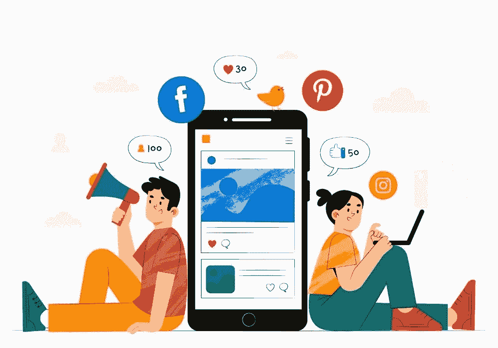
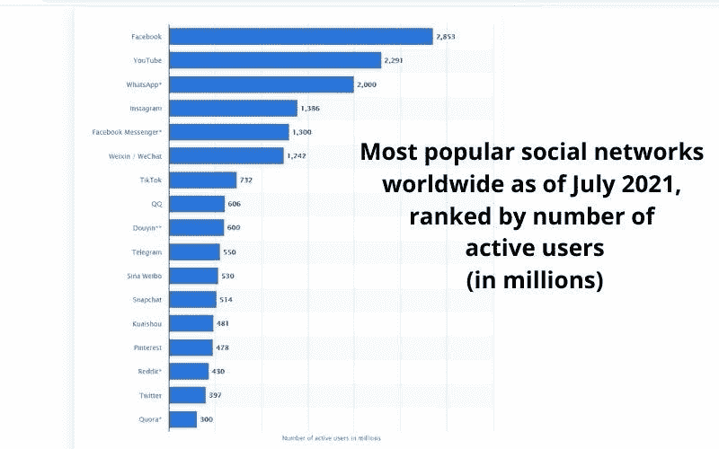
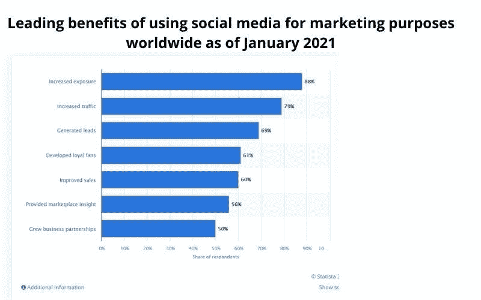
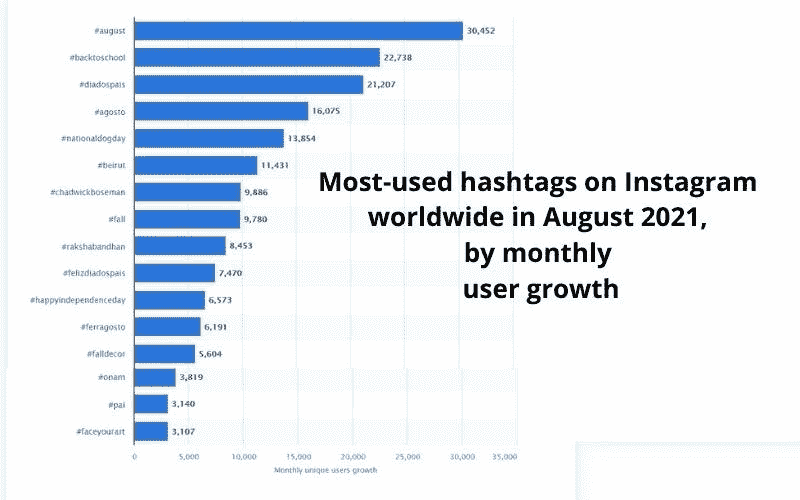
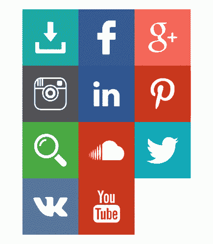

# 社交媒体与网络应用的整合:7 个技巧和好处

> 原文：<https://medium.com/geekculture/social-media-integration-to-web-apps-7-tips-benefits-f2599622bc3f?source=collection_archive---------9----------------------->

毕竟，如果没人会使用社交功能，为什么还要花时间去构建呢？事实是，人们确实在使用社交媒体——他们中的很多人希望在使用你的应用时保持联系。

为了吸引和留住更多用户，你需要为用户提供与朋友分享应用内容的途径。虽然有很多不同的方法可以将社交媒体整合到你的网络应用中，但这里有一些想法

社交媒体已经成为我们日常生活中不可或缺的一部分，随着时间的推移，它只会越来越多地融入我们的生活。假设您正在构建一个用户会定期与之交互的 web 应用程序。在这种情况下，将社交媒体整合到您的应用程序中，为客户提供更个性化、更吸引人、更高效的体验是有意义的。

在众多社交媒体平台中，脸书仍高居榜首，2021 年 7 月拥有 28.53 亿活跃用户。Youtube 紧随其后——2291 万活跃用户，WhatsApp——2000 万活跃用户，insta gram——1381 万活跃用户。

这是来自 Statista 的信息图，按等级顺序描述了它们。

来源: [Statista-全球使用最多的社交网络](https://www.statista.com/statistics/272014/global-social-networks-ranked-by-number-of-users/)

对于任何准备在全球范围内更广泛采用的软件、网站或网络应用程序来说，避免社交媒体整合都是一个错误。然而，如果你有任何最后一刻的疑虑，下面的好处列表一定会说服你。

# **将社交媒体整合到网络应用中的最大优势**

> **1。集成简单&性能高效**

像脸书、Twitter 和 LinkedIn 这样的平台都使用 API(应用程序编程接口)来让其他应用程序访问他们的数据。开发者可以直接或间接地使用这些信息来增强用户在第三方网站和应用上的体验。

例如，用户可以通过他们的社交媒体账户(如脸书)登录你的应用，而无需在你的网站上创建新账户。通过利用现有的平台，您可以让已经熟悉这些网站的用户轻松使用，同时简化新网站的入职流程。这就是我们所说的双赢！

> **2。增强与目标受众的沟通**

当你的客户可以直接通过你的应用与你和其他人聊天时，他们更有可能使用它。社交媒体的整合不仅使沟通变得更加容易，而且还允许实时聊天和提高参与率。

当你给用户一个简单的方式直接与你的公司和彼此沟通时，他们更有可能推荐它(通过口碑营销),甚至为优质服务或订阅升级付费。

随着使用量的增加，销售机会也在增加，这使得社交媒体整合成为任何想要盈利的移动业务的关键。

> **3。向更多的观众展示**

让你的应用出现在新用户面前的最有效的过程之一是社交媒体，因为每天都有数百万人访问这些网络。脸书和 Twitter 等网站上的用户账户是通向庞大的朋友和家人潜在应用用户网络的门户。

你知道社交媒体用户数量的整体增长吗？

下面的信息图描述了近年来社交媒体平台用户数量的增长。

Source: [Statista- Number of Social Network Users](https://www.statista.com/statistics/278414/number-of-worldwide-social-network-users/)

> **4。提高用户参与度**

添加几个社交媒体按钮不会削减它。在 [**顶级网络应用开发公司**](https://www.pixelcrayons.com/web-development/) 的帮助下，你需要添加真实的社交功能，真正为你的用户增加价值。这意味着赋予他们联系的能力，并给他们工具来分享他们的想法、图片和经历。

用户生成的内容比以往任何时候都更加重要。如果没有别的，它可以作为你公司的证明或案例研究；如果人们喜欢他们看到和读到的关于你的应用程序的东西，他们甚至可能想亲自尝试一下！(希望能告诉他们的朋友。)用户生成的内容也给人一种真实性的感觉，这是你从新闻稿中得不到的。

使用社交媒体作为征求产品创意和反馈的一种方式——并与你所在领域的有影响力的人建立联系。这不仅能帮助你塑造未来的发展，还能帮助你学会如何在社交媒体网络中最好地推销自己。

当需要通过广告或付费应用程序/升级来赚钱时，它会很方便！确保无论你的客户在哪里上网——无论是 Instagram、Twitter、脸书还是 Pinterest——你的品牌也应该跟着他们去。

> **5。建立信心&用户之间的信任**

当客户知道他们可以在社交媒体上联系到他们喜欢的品牌时，他们会感到更舒服。当他们在社交媒体上与一个品牌互动时，他们会获得信心，这反过来会增加他们的信任。

当在应用程序中使用社交媒体时，你的客户可能更愿意使用你的服务，因为他们已经熟悉你如何在网上处理自己。来自 Failory 的调查显示，41%的美国消费者表示，参与社交媒体的品牌有助于在他们那里购物时建立更高的信任度。

> **6。促进在其他平台上的交叉推广**

如果你正在寻找一种方法来提高你的品牌曝光率，很难击败社交媒体。你可能已经在脸书和推特上出现了，但是为什么不把它们添加到你的应用程序中来扩大你的社交范围呢？具有跨平台社交媒体集成的社交应用程序允许您推广与您的品牌相关的其他平台。

你可以将你的应用程序与 Twitter、脸书和 Instagram 等社交媒体网站连接起来。这些平台上有超过 10 亿的活跃用户，这是您提高品牌知名度的绝佳机会。

例如，如果你拥有一个瑜伽服装品牌，并且在脸书和推特上有活跃的在线形象，考虑在你的应用程序中添加社交媒体按钮，这样用户就可以与朋友分享他们的锻炼体验。鼓励你的应用程序中的社交媒体互动将有助于你建立品牌知名度，同时提高你的影响力。

> **7。积极的品牌建设**

将社交媒体按钮添加到您的应用程序中，可以让用户轻松地与他们的社交网络分享内容，提高品牌知名度并建立更大的社区。

此外，实施良好的共享功能可以通过增加口碑推荐来帮助您联系当前的用户群。如果人们喜欢你的应用，他们会告诉他们的朋友和同事。

以下是 Statista 对使用社交媒体整合进行品牌建设的看法。

Source: [Statista-Social Media Marketing](https://www.statista.com/statistics/188447/influence-of-global-social-media-marketing-usage-on-businesses/#:~:text=Improved%20traffic%2C%20lead%20generation%20and,social%20platforms%20among%20global%20marketers.)

**记住:**脸书的分享和推特推文算作推荐。你的应用越成功，那么——如果你鼓励分享——下载它的人就越多；建立一个人们认可并记住的稳固品牌，对于获得公司的认可非常重要。

这就是为什么你必须考虑将社交媒体整合到你的网络应用中。现在让我们讨论如何有效地做到这一点。

**以下是将社交媒体整合到你的网络应用中的七种方法，以提高用户保留率和客户满意度。**

> **1)定制社交登录**

随着移动用户平均拥有八个社交媒体账户，社交登录成为消除这些噪音的绝佳机会也就不足为奇了。虽然大多数应用程序都提供脸书和 Twitter 登录选项，但你可以通过整合流行的社交平台，如 Google+、Linkedin、Foursquare 等，使你的应用程序对新用户更具吸引力。

> **2)利用标签提升品牌知名度**

标签提供了一种廉价而简单的方式来获得品牌曝光。使用与你的利基市场相关的流行标签会将你的应用展示给观众，否则如果你正在构建一个社交网络应用，他们将永远不会看到它。

Source: [Statista- Instagram Top Hashtags](https://www.statista.com/statistics/1257104/instagram-top-hashtags-by-users-growth/)

请务必不要垃圾标签！目标是每篇文章最多 1-2 个，并以适当的方式使用它们。不要把你的标签作为每个单词的一部分；首先确保人们想读你要说的内容。

记住:注意力和关注者一样有价值——你需要说一些有趣的事情来让人们有兴趣听。

> **3)集成背书页签**

将社交媒体元素添加到你的网站的最直接的方法之一是在你公司的主页上添加一个链接，将用户指向他们在各种社交网络上的账户，如脸书和推特。

此外，考虑添加一个背书或签到标签，让在脸书或 Twitter(或其他地方)访问你页面的用户点击一个按钮，让他们的朋友知道他们喜欢你的公司。

> **4)显示最近的活动**

将社交媒体整合到你的网络应用的第一个也是最基本的方法是向用户展示他们朋友的活动，无论是推文、脸书和 LinkedIn 等网站的更新，还是热门博客上的评论。它可以像侧边栏一样简单，显示来自流行网络和网站的提要条目。

请记住，您不需要创建一个全新的页面来显示最近的内容；由于这些是应用程序内部的技术页面，它们将共享您希望在任何上下文中可见的任何信息。

只要记住不要用最近的数据压倒人；目标是最多四到五次喂食。否则，你可能会失去那些不想花太多时间去做他们想做的事情的读者。

> **5)嵌入来自其他网站的帖子**

许多 web 应用程序是为了与其他社交媒体平台集成而开发的。例如，你可以将来自脸书或 Twitter 的帖子嵌入到你的应用程序中，让使用你产品的人可以访问他们朋友的帖子。

此外，如果你拥有一个照片分享网站，你可以创建一个应用程序，使用 Instagram 或 Flickr 上发布的照片，让你的产品用户可以轻松搜索和查看这些照片。

> **6)从用户的脸书页面添加帖子**

人们可能并不总是想登录脸书在你的应用网站上发表评论。但是如果你嵌入了脸书的评论工具，用户可以从他们的个人资料中留言，而不必访问一个新的网站。

要启用这些评论，请转到您的脸书页面，然后单击评论。从那里，点击嵌入评论，并插入代码到您的 web 应用程序，这将使用户的文章在您的网站上。

> **7)在你的网站上显示热门推文**

如果你有一个社交网络应用，你的网站上可能有一些社交整合。虽然有些人可能会说，没有理由将 Twitter 与您的网站集成，除非它明确地处理 Twitter，但有几个很好的理由说明为什么您应该这样做，让我们面对它。

*   如果人们使用你的服务在他们的网站上发微博，他们无论如何都会在 Twitter 上发微博。那么为什么不为他们提供无缝体验呢？
*   它能让你的用户产生忠诚度。他们觉得你听他们想要什么，关心他们说什么。
*   这有助于让你的受众对你的品牌/服务/网站保持忠诚，即使他们并不总是直接访问你的平台。
*   每当有人在推特上更新你的平台上发生的事情，或者通过推特回应另一个用户说的话，你都会获得新的订户/粉丝，他们对这两个人在推特上谈论的事情感兴趣。

以下是 Statista 对 Twitter 上的品牌帖子的评论

Source: [Statista- Twitter Brand Posts Engagement](https://www.statista.com/statistics/798414/daily-twitter-brand-audience-mentions-by-vertical/)

# **结束**

社交媒体整合是每个成功应用的重要特征。如果你想让你的网络应用脱颖而出并吸引用户，在 [**雇佣的网络编码员**](https://www.pixelcrayons.com/hire-web-developers) 的帮助下，社交媒体整合是一个抓住用户注意力的简单方法，并给他们各种有趣的新方法来参与你的应用。

无论你在哪个行业，加入社交媒体整合都有好处。通过为用户提供新的联系、分享信息、了解活动和参与竞赛的方式，使您的应用程序更具社交性有助于建立信任和增加参与度。

让社交媒体触手可及是用户与使用你的应用的其他人分享乐趣的一种简单方式。即使他们没有通过你的应用程序直接互动，用户仍然会感到被包含在内，因为他们可以看到他们的朋友在社交媒体上做的一切。

# **常见问题解答**

**问题:哪个是成长型企业的理想社交媒体平台？**

**回答:**虽然确切的平台取决于业务领域，但最好的平台仍然是脸书、Twitter、Pinterest 等。=对于大部分来说。虽然许多企业仍然不确定他们应该将社交媒体的努力集中在哪里，但有一点是肯定的:如果你不在其中任何一个(或所有三个)上，你的企业就会落后。

无论你选择哪个平台(无论你决定关注哪里)，都要确保你的应用程序已经准备好并与社交媒体兼容。就像电子商务集成一样，拥有一个与公司网站完全集成并具有社交媒体登录功能的应用程序，可以让客户更容易地访问他们喜欢的网站，无论他们使用什么设备。

最重要的是，提供跨平台的无缝更新意味着用户不会错过重要信息或与其他品牌追随者互动的机会。

**问题:为什么一些企业不愿将社交媒体整合到他们的网络应用中？**

**回答:**虽然社交媒体整合极具价值，但很多公司并没有利用这一点，因为他们不明白用户为什么选择一个平台而不是另一个平台。许多企业认为脸书和 Twitter 用户会一直选择他们的平台，但他们不知道为什么。

更糟糕的是，一些企业认为将社交媒体整合到网络应用中会自动增加他们的流量，这不一定是真的。社交媒体整合的关键是确定你的目标受众使用哪些平台，然后激励他们使用你的应用，而不是仅仅使用另一个网站或另一个应用。

问题:将社交媒体整合到一个网络应用程序中要花多少钱？

**回答:**在某些情况下，一些必要的集成可能只需要 50 美元，而在其他情况下，可能需要 200 美元以上。这完全取决于开发人员需要做多少工作来完成这个过程。

例如，如果您希望在应用中使用脸书身份验证，则需要先创建一个应用，然后才能将您的社交媒体帐户集成到您的 web 应用中。

假设你想通过 Twitter 或脸书发布应用程序内容的链接。然而，在这种情况下，不涉及编码——你选择 WordPress 中可用的选项，然后通过 API 连接社交媒体网站。这将只需要几分钟，需要很少的设计投入。

**问:为什么脸书在社交媒体整合的最可行方案中脱颖而出？**

**回答:**平均每个月脸书上有超过 10 亿的活跃用户。这是一个你可以用你的应用程序开发的市场。通过将社交媒体与你的应用程序连接起来，你将为自己创造竞争优势，因为人们将分享他们在应用程序中做的事情，以及这些事情与他们在应用程序之外的生活有何关联。

除了脸书，全球超过 82%的互联网用户至少使用一个社交媒体平台，这意味着超过一半的北美和欧洲用户每天至少使用一次脸书和另一个社交网络——这只是数千个网站中的一个。

当考虑在你的应用程序中集成社交媒体的选项时，你可以放心地打赌脸书会成功，因为它拥有如此庞大的现有观众群，并且在人们的日常生活中有着坚实的存在。

这意味着用户可能会停留更长时间，更频繁地付费，并为你传播关于你的应用程序的品牌意识。