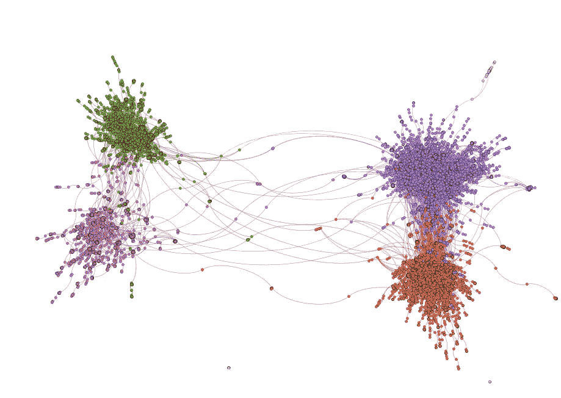
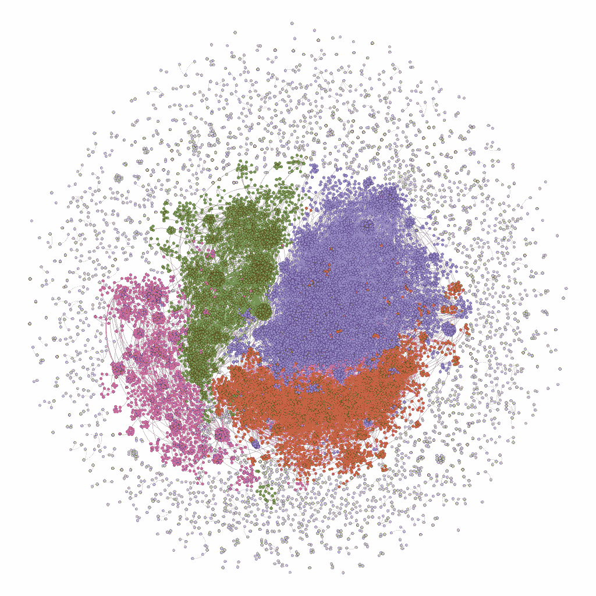
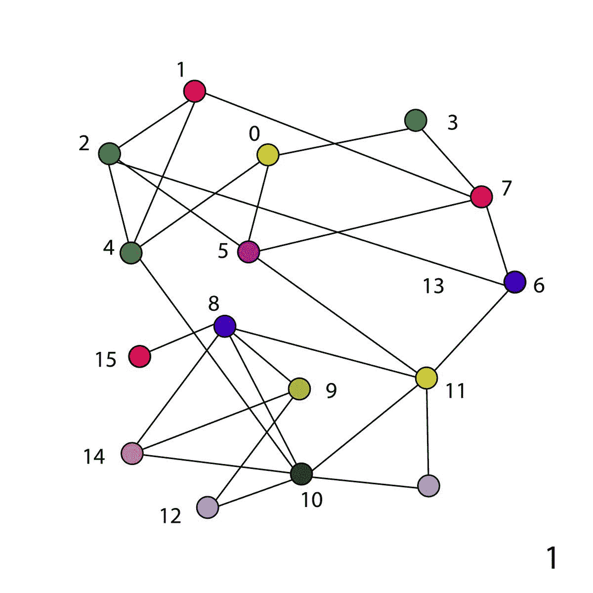

# 快速展开算法如何检测大型网络中的社区

> 原文：<https://medium.com/geekculture/social-media-network-everything-you-need-to-know-from-networks-to-communities-ed68730acf18?source=collection_archive---------0----------------------->

> 社会网络分析包括研究由数百万个节点组成的大型现实生活网络中的模式。如果你有[图论](https://en.wikipedia.org/wiki/Graph_theory#:~:text=In%20mathematics%2C%20graph%20theory%20is,also%20called%20links%20or%20lines).)的基础知识，就可以进行这些分析。

Communities in a network

数字世界开启了一种完全不同的建立关系的方式。它还释放了大量数据，我们可以通过分析这些数据来更好地理解人类行为。

社交媒体数据是指从个人的社交媒体活动中收集的所有原始见解和信息。我们可以从这些社交媒体活动中创建网络，以更好地了解那个人。

这些网络范围很广，可能包括你在脸书的朋友，你最近在亚马逊上购买的产品，你喜欢或转发的推文，你从 Zomato 订购的最喜欢的食物，你在谷歌上进行的搜索，或者你最近在 Instagram 上喜欢的图片。

公司利用这些网络将他们的用户分成不同的群体。这有助于他们

*   做市场调查
*   生成销售线索
*   更好地服务他们的客户
*   查找并共享照片和视频
*   发现和讨论热门内容
*   分享关于服务和餐馆的信息
*   围绕共同的兴趣或爱好与他人联系
*   还有更多。

这个清单几乎是无止境的。

在我们深入讨论之前，让我们快速分解一下网络不同组件之间的区别。

[Communities in Social Network](https://ieeexplore.ieee.org/document/9198574)

## 网络

网络是由相互联系的个人关系组成的网络。例如，不同的个人可以通过动态的关系网在社交媒体群中相互交流。

一个网络由*节点*(网络中的个体行动者、人或事物)和连接它们的*纽带*、*边*或*链接*(关系或互动)组成。

## 什么是团体？

Reicher S. D .在 [*集体行为的确定*](https://ethos.bl.uk/OrderDetails.do?uin=uk.bl.ethos.593332) 中把一个群体描述为认为自己是一个群体的个体的集合。同一群体的成员有一套共同的信念和行为。

## 什么是社区？

根据大卫·w·麦克米兰( [*《共同体的意义:一种定义和理论】*](https://www.researchgate.net/publication/235356904_Sense_of_Community_A_Definition_and_Theory) *)* )，共同体可以定义如下:

> "*社区意识是成员拥有的归属感，成员对彼此和团体都很重要的感觉，以及成员的需求将通过他们在一起的承诺得到满足的共同信念。*

社区或子单元是网络中的子网络，它们是高度互连的节点。

社区表明网络中存在具有特殊特征或扮演相同角色的内部结构。

这些网络中高度连接的个人或物体群就是社区。它通常位于网络和组的交叉点。

现在我们对网络、团体和社区有了一个清晰的概念，让我们更深入地了解这些网络是如何划分成小社区的。

我们就来看看流行的 [*快速展开算法*](https://arxiv.org/pdf/0803.0476.pdf) 。Vincent C. Blondel 和论文的共同作者将该算法与其他社区检测算法进行了比较。他们发现这种算法比大型网络中的其他算法都要好。

# 快速展开算法是什么？

快速展开算法被用于识别一个拥有 260 万用户的比利时移动电话网络中的语言社区。

它还被用来分析 1.18 亿个节点和超过 10 亿个链接的网络图。

在如此庞大的网络中识别社区只花了 152 分钟。因此该算法既快速又高效。

## 算法是如何工作的

该算法分两个阶段工作:

***第一阶段***

1.  为网络中的每个节点分配不同的社区。
2.  然后，对于每个节点， *i* 考虑节点 *j* 并通过从其社区中移除节点 *i* 并将其放置在*j*的社区中来评估模块性的增益
3.  节点 *i* 被放置在它获得最大模块化的社区中，但是增益应该是正的。如果增益是负的，那么节点 *i* 保持在相同的社区中。

***二期***

1.  该算法的第二阶段包括建立新的网络，其节点现在是在第一阶段中发现的社区。因此，我们通过将社区中的所有节点合并为一个节点来构建节点。
2.  节点之间的链接的权重由对应的两个社区中的节点之间的链接的权重之和给出。
3.  相同社区的节点之间的链接导致新网络中社区的自循环。
4.  重复**第一阶段**直到无法实现进一步改善。

## 模块化增益是如何计算的

划分的质量( *Q* )是由**(又名划分的模块化)来衡量的。它是一个介于-1 和 1 之间的标量值，衡量社区内部的链接密度与社区之间的链接密度。**

**通过将隔离节点 *i* 移入社区 C 而获得的模块性(⇼Q)的**增益可以很容易地通过下式计算:****

****

***中的σ是 c 内部链接的权重之和。***

****σtot*是 c 中与节点关联的链接的权重之和。***

****ki* 是从 *i* 到 c 中的节点的链接的权重之和。***

****m* 是网络中所有链路的权重之和。***

***模块化的收益是通过将 *i* 从它的社区中移除，然后将其移动到相邻社区中来评估的。如果增益为正，则该节点被放入相邻社区。***

******

***Working of Fast Unfolding Algorithm***

## ***算法的预演***

***在左侧的网络(15 个节点)中，我们首先为每个节点分配一个唯一的社区。然后，我们评估每个节点的模块性，并根据收益重新分配社区。这叫做**模块化优化**。***

***在下一阶段，我们通过将该社区中的所有节点合并成一个节点来构建节点。在绿色社区中，我们总共有 5 个节点，它们之间总共有 7 条边。***

***所以在**社区聚合**之后，绿色节点的自环的权重将是 14 (7 * 2，因为它是双向链路)。同样，红色节点的自循环权重将为 16，蓝色节点为 4，浅蓝色节点为 2。***

***绿色和蓝色节点之间的边的权重将是 4，因为在模块化优化之后，绿色和蓝色社区之间总共有 4 条边。***

***在下一步中，我们重新评估新节点的模块性，并再次执行相同的过程。***

***最后，我们得到两个社区，*绿色*和*浅蓝色。绿色社区具有 26 个自循环，因为在绿色社区的节点之间总共有 13 条边。而我们在浅蓝色社区有 12 条边，一共 24 个自循环。****

******

***Community formation in Network***

## ***算法的优点***

1.  ***其步骤是直观的，易于实施，结果是无人监督的。***
2.  ***算法速度极快。在非常大的模块化网络上的计算机模拟表明，它的复杂性在典型和稀疏数据上是线性的。这可能是因为模块性的增加很容易计算，而且社区的数量在几个回合后就急剧减少了。***

## ***算法的局限性***

1.  ***模块化优化不能识别小于一定规模的社区。因此，它对使用纯模块化优化方法计算的社区造成了分辨率限制。***
2.  ***对于小型网络，通过移动每个节点可以合并两个独立社区的概率非常低。***

# ***结论***

***如果你坚持了这么久…谢谢！我希望对你有价值的信息。***

***现在你知道快速展开算法是如何工作的了，而且它在非常大的网络中检测社区是非常有效的。***

***它计算模块性增益的方式使得该算法优于所有其他算法。如果你觉得有用或有任何后续问题，请给我留言。***

****感谢阅读！****