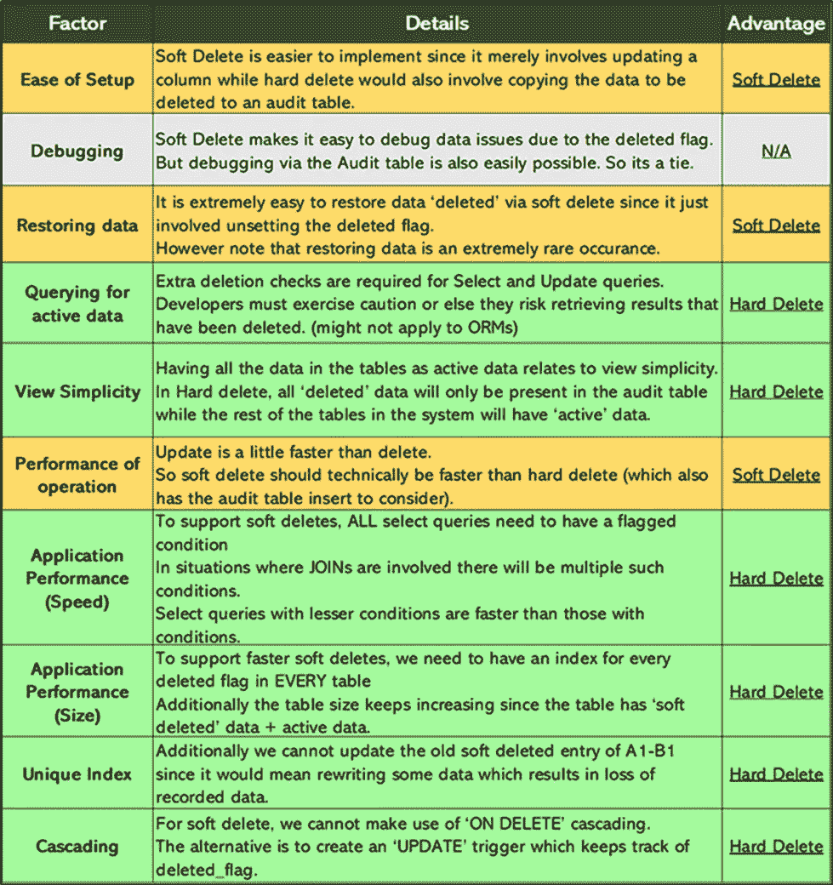

# 软删除很繁琐！没有损失的理想删除是否存在？

> 原文：<https://medium.com/geekculture/soft-deletes-are-tedious-does-an-ideal-deletion-without-loss-even-exist-9cc5d78e9b10?source=collection_archive---------9----------------------->

Photo by [Devin Avery](https://unsplash.com/@devintavery?utm_source=medium&utm_medium=referral) on [Unsplash](https://unsplash.com?utm_source=medium&utm_medium=referral)

*“什么…？您想要实际删除数据库记录！！！* ***数据丢失？*** *为什么会有人做这种事？”*

这就是弥漫在软件行业的偏执类型。对于初级开发人员来说，这可能无关紧要，但是高级开发人员，尤其是业务人员非常重视数据丢失。为什么不应该呢？毕竟数据，再少，也还是数据。

任何现在被认为无关紧要的数据在不久的将来都可能成为洞察的来源。因此，数据丢失妄想症是可以理解的，因为逻辑删除比物理删除更受欢迎。NodeJS ORM sequilize 将其软删除功能称为“[偏执](https://sequelize.org/master/manual/paranoid.html)”，暗示宣传有多真实。

但是到底什么是逻辑删除或者软删除呢？简而言之，不是从数据库中显式删除记录，而是将删除的记录标记为已删除。

但是事情是这样的:不管软删除功能对一个企业有多重要，事实上数据并没有真正消失，仍然是我的表的一部分，这让我很困扰。

事实是，数据库应该总是在某个时间点进行备份。这样，您就永远不会因为删除而丢失数据，除非删除操作是在备份间隔之间进行的(我们稍后会讲到)。此外，使用软删除会导致对已删除标志字段的额外操作。当您编写更简单的查询时，这是对资源的浪费，因为它只会增加额外的性能成本，当您连接大量的表时，这种情况会变得更糟。这种设计一点也不吸引我。我相信只有相关数据存储在表中的架构。

# 开始寻求事实！

Photo by [Jezael Melgoza](https://unsplash.com/@jezael?utm_source=medium&utm_medium=referral) on [Unsplash](https://unsplash.com?utm_source=medium&utm_medium=referral)

让我问你一个问题。您希望通过不删除表条目来实现什么？事实上，您将来可以查看这些行，对吗？那为什么不直接做一个存档表，把删除的数据移到那里呢？这有什么问题？是方便的问题吗？如果是这样的话，你真的重视便利胜过效率吗？拿我来说，我不会。但是，话说回来，我想我的工程学原理不允许我这么做。

老实说，我参与过很多主要删除功能是软删除的项目。老实说，我曾经认为软删除是业内唯一可行的删除方式。

但是后来我在用一个流行的无头 CMS[Strapi](https://strapi.io/)开发 CRUD APIs 时发现了一些东西。认为这是显而易见的，我开始在 Strapi 的文档中寻找启用软删除的方法，却发现[在 Strapi](https://github.com/strapi/rfcs/issues/13) 中没有这样的特性。这意味着 Strapi 的[用户，比如沃尔玛、IBM 和 NASA，](https://strapi.io/user-stories)可能不使用软删除。

对我来说，这一基本发现极大地改变了整个删除范式。当然，这并不意味着我会开始随意删除数据。但现在，我比以往任何时候都更有能力坚持自己的原则。因此，我开始寻找软硬删除技术的替代品。一种中间状态，在这种状态下，表项被完全擦除，而没有数据丢失。

## 深入评估软删除

采用软删除的替代方案可能是一个具有挑战性的决策。所以，和每一项比较研究一样，让我们先列出利弊。结果，我发现了一个针对软删除和硬删除的[比较因素列表。](https://abstraction.blog/2015/06/28/soft-vs-hard-delete#comparison-factors)

[Comparison factors for both soft and hard deletes](https://abstraction.blog/2015/06/28/soft-vs-hard-delete#comparison-factors)

我们应该做的另一件事是彻底评估软删除的好处。[根据 Brentozar 关于软删除实现的这篇文章，](https://www.brentozar.com/archive/2020/02/what-are-soft-deletes-and-how-are-they-implemented/)使用这种设计模式有四个主要原因。也就是说，更快的取消删除、删除历史记录跟踪、灾难恢复故障切换期间更容易的协调，以及减少可用性组辅助节点的工作负载。我相信上表总结了前三个原因。但是最后一个原因，第二个可用性组的工作负载减少引起了我的兴趣。

*可用性组到底是什么？* [根据微软文档，可用性组支持一组离散的用户数据库的故障转移环境，这些数据库被称为可用性数据库，它们一起进行故障转移。](https://docs.microsoft.com/en-us/sql/database-engine/availability-groups/windows/always-on-availability-groups-sql-server?view=sql-server-ver15#:~:text=An%20availability%20group%20supports%20a,sets%20of%20corresponding%20secondary%20databases.)当您将可用性组设置为始终开启时，您的数据将被视为高度可用。灾难管理比一般情况下更加严格。[这会导致删除记录时的行为改变，尤其是在 MSSQL 服务器上。当队列表中的行被消耗和删除时，它们产生幻影记录(和版本幻影记录)。](https://www.mssqltips.com/sqlservertip/6284/queue-table-issues-with-availability-groups-in-sql-server/)ghost 清理进程跟不上表的删除量，因为数据库可能在可读的辅助数据库中使用。这就是软删除派上用场的地方，因为你不会删除任何东西。确实，软删除一行会将其添加到第一个索引中，但也会将其从第二个索引中删除。然而，清理这些索引应该容易得多，因为您没有在一个表中散布幽灵记录；相反，您正在将这些虚记录添加到一个非聚集索引中。

但是您自动启用可用性组的事实意味着您对您的数据有足够的疑虑。所以，当然，你会尽你所能确保你总是有你的数据。这完全合理。但是，如果禁用可用性组不会危及您的数据保存，为什么不这样做呢？这无疑会提高性能。此外，这种情况不应该是选择特定方法的唯一原因。特别是，在我们的情况下，软删除。因为其他数据库系统可能不支持可用性组，所以这个场景实际上是非常特定于系统的。

# 那么…有什么选择呢？定期备份、存档…

Photo by [Marten Bjork](https://unsplash.com/@martenbjork?utm_source=medium&utm_medium=referral) on [Unsplash](https://unsplash.com?utm_source=medium&utm_medium=referral)

## 存档表

我建议为所有删除的记录创建一个单独的表，而不是在每个表中维护一个标志列。这可以通过在现代数据库系统上利用 JSON 对象支持来实现。另一种选择是保留两个相同的表，一个用于相关的行，一个用于被删除的行，比如表`employees` 和另一个名为`deleted_employees`的表。在这种情况下，您必须保持两个表模式都更新。这看起来可能很麻烦，但是这两种方法实际上都很容易管理。`CREATE TABLE deleted employees LIKE employees;`或类似的东西可以用来创建一个新的档案表。第一个选项甚至更简单:只需创建一个带有`table_name`和`record` 列的表。下面是 MySQL8 的一个例子。

MySQL 8 example for creating an archive table.

我们将在这里执行两个操作:插入到另一个表中，并从原始表中删除。如果要撤消删除，请以相反的顺序向中写入另一个 INSERT 和 DELETE。如果您担心失败的事务，请用 TRANSACTION 包装这段代码。添加一个 before delete 触发器将数据插入到存档表中，如下所示，将是一个更好的选择。

MySQL 8 example for setting up before delete archive trigger

使用触发器的好处是级联删除也将被归档，消除了手动干预的需要。[虽然 MySQL 用户应该意识到有一个 bug，阻止了对级联删除执行删除触发器。这是一个老 bug，从 2005 年就有了…对，2005 年。来吧，先知，你可以做得更好。没关系，有一个解决方案可以为父表触发器中的所有引用表链实现归档插入。](https://bugs.mysql.com/bug.php?id=11472)

如果使用存档，所有已删除的记录都将在一个位置。一个简单的联合查询返回单个表中的所有信息，该表随后可用于数据分析。此外，通过反向插入，数据恢复很简单；虽然没有软删除那么简单，但是从性能上来说还是很划算的。

## 定期备份

数据备份是显而易见的选择。无论您使用软删除还是硬删除，备份数据都至关重要。备份你的数据就像把它放在一个保险箱里，万一发生灾难，你可以方便快捷地取用。知道自己最珍贵的数据是安全可靠的，这种自信是非常酷的。

在某些方面，定期和有计划的备份解决了数据丢失的问题。只有在两个备份间隔之间插入和删除的数据才会导致问题。如果应用程序长时间更新数据库，这不是问题。然而，对于一个总是活动的应用程序来说，这是一个主要问题。为了避免任何麻烦，这样的应用程序应该总是维护一个存档表。

# 让我们把东西包起来…

决定一个软删除设计模式不是一件轻而易举的事情。起初可能看起来不多，但是随着数据库的增长，事情会变得更加复杂。虽然我相信不使用软删除有很多好处，但是许多开发人员更喜欢它，因为他们担心数据丢失。提议的替代方案将解决这个问题，迈出这一步只会让你明白它真正带来了多大的不同。