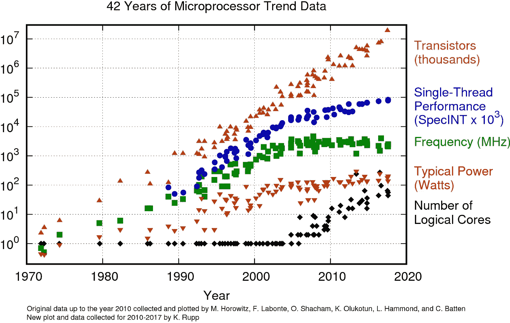

# 软件开发:什么改变了？

> 原文：<https://medium.com/geekculture/software-development-what-has-changed-cd901207fa0d?source=collection_archive---------9----------------------->

379km，约 1 小时“门对门”(登机)41 分钟的飞行。

这是由阿联酋航空公司于 2019 年夏天在迪拜和多哈之间开通的 A380 运营的最短航线。

在这次飞行中，大约有 14 吨煤油在大气中燃烧…

你觉得这很荒谬吗？然而，成千上万的公司用同样的方式处理他们的 IT，大多数时候甚至没有意识到这一点。

# 摩尔定律和兴奋

让我们回到几年前，到 90 年代初，“微型”公司正在蓬勃发展。

“云”还不存在，大规模的计算机化,“数字革命”的开端，从设备旁边经过。

所有大公司都想要他们的数据中心，或者至少是他们的服务器机房。Sun Microsystem、HP、Silicon Graphics、IBM 和法国的 Bull 等制造商以其专有的硬件和架构分享 Unix 服务器市场，而微软则说服越来越多的中小型公司加入其基于英特尔服务器的生态系统，这些服务器要便宜得多。

Linux 还不存在，Google 也不存在。

企业 IT 的钟摆现在明显站在资本支出一边:投资和摊销。

我们购买大型服务器，在 3 年、5 年甚至 10 年内分期偿还，无论它们的利用率是 5%、50%还是 100%。

软件行业刚刚进入成熟期，SaaS 和 PaaS 显然还不存在，主导战略在从软件供应商处收购(对于“内部”安装)和内部开发之间摇摆不定。

摩尔定律预测，在每 24 个月不变的价格下，CPU 中的晶体管数量将翻一番，该定律正在如火如荼地实施。英特尔 1993 年发布奔腾，差不多 10 年都不会抵触。

在硬件性能恶性膨胀的背景下，软件性能管理比开发人员的生产力更不是问题，开发人员已经是一种稀有而昂贵的资源。

语言理论研究和许多个人倡议催生了新语言，这些新语言的目标是开发人员的生产力，而不是纯粹的性能(无论如何，只要等待两年，程序运行速度就会提高一倍，除了更新硬件，什么都不用做)。

Perl 诞生于 1987 年，Python 诞生于 1991 年，Ruby 诞生于 1995 年，Java 诞生于 1996 年，此外还有许多其他的“开发环境”,比如 1993 年的 WinDev(及其 teaser ads)或 1995 年的 Delphi。

计算机化的竞赛正在加速，快速发展是必要的，即使这意味着做得不好。

# 生产力竞赛

1994 年，斯坦迪什集团发布了第一份“[斯坦迪什混乱报告](https://www.projectsmart.co.uk/white-papers/chaos-report.pdf)”，该报告分析了企业 IT 项目的成功率和失败的性质。

结果很明显:几乎 90%的项目都是失败的:要么大大超出了最初的预算(几乎一半的项目超出了预算一倍)，要么不得不牺牲部分功能来发布软件，要么项目被取消并被埋葬，当然还没有提到交付的反复延迟。

没有其他行业会接受这样的质量灾难。

为了改变这种状况，人们发明了新的项目管理方法:V-cycle、Merise、AGL，以及越来越多的硬件标准化(英特尔和微软利用了这一点)和软件标准化(ISO 模型、ASN.1、XML、X500 等)。).

尽管前景黯淡，硬件性能继续增长，几乎是线性增长，没有放缓的迹象。

硬件销售很好，因为明天的机器需要运行今天开发的程序。

因此，语言设计者被鼓励以牺牲性能为代价，甚至牺牲一点点质量来进一步提高生产率。

对象模型越来越成功，解释语言变得越来越有吸引力，1994 年第一次出现的 PHP 在当时使 Web 开发民主化。

越来越多的抽象，越来越多的间接，越来越多的层次，无论“代价”是什么，我们知道它都会被下一代 CPU 所吸收。

但那是以前。在戏剧之前。

# 冬天来了

在 2004 年，发生了一件 CPU 设计者/创始人一直害怕的事情。

如果晶体管的数量继续像摩尔定律预测的那样每 24 个月翻一倍，这一翻不再直接转化为可用总功率的增加，或者我应该说，很容易获得。

事实上，CPU 能力的不间断增长以前是通过 CPU 更快地执行一系列操作的能力来表达的。

当我们谈论“免费”性能提升时，这并不意味着向客户提供了新的机器，而是他们不必在程序中做任何特殊的事情来利用这种提升(甚至不需要重新编译)。

2004 年，由于一方面晶体管数量的增长，另一方面处理器工作频率的增加，创始人达到了热极限。

从那以后，频率一直停滞不前。

然而，加工者雕刻的精细程度的提高让摩尔感到满意。越来越多的晶体管被放在同一个硅表面和同一个热封套中，但它们必须以不同的方式使用。

所谓的“多核”处理器出现了(或者说变得很普遍)。

在 2004 年之前，创始人的目标是越来越快地处理指令，但在这关键的一年之后，战斗转移到了并行化领域:他们同时处理越来越多指令的能力。

上图清楚地显示了频率停滞与逻辑内核数量开始上升的一致性。另一方面，晶体管的数量继续悄悄地增加(双核 CPU 意味着大约是单核 CPU 的两倍多的晶体管——尽管现实中并没有那么简单)。

三十多年来第一次，升级一个人的基础设施不允许“免费”增加程序的性能…其主要被设计成以线性方式工作(非并行化)，因此不能利用额外的内核和额外的晶体管。

# 宿醉

不再有免费的性能提升，不再有新的抽象、间接、覆盖的系统吸收。

这一次，如果开发者想要提高他的产品的性能，他有三个选择:

*   回复到低级语言并优化他的程序:但是生产率可能会受到很大的影响。
*   使用并行编程:但是这要困难得多，这是难以预测和重现的多种错误的来源(竞争条件、死锁、互斥的危险管理等)。)，它需要高得多的技术水平，而且在市场上太罕见，无法推广。
*   将大型程序分割成几个较小的模块(但仍然是单线程的)，这些模块可以并行运行，从而使用一点可用的能量。

从本质上讲，第三种解决方案是最便宜、风险最小的，将会受到青睐。

然后出现了新的范式:多层架构，然后是面向服务的架构，接着是微服务架构，这种架构一直沿用至今。

因此，在 90 年代/ 2000 年代设计的大型单片程序可以被分解成小模块(比如说 20 个左右)，这些小模块将一起工作，每个模块消耗相当于一个 CPU 核心的资源，以提供相同的服务。

显然，部署、监控和运行 20 个程序的成本超过 1 个，因此我们必须找到一种方法来自动化这些任务，以避免经济灾难:向 Docker 和 Kubernetes 问好。

# 并非所有人都失去了一切…

一方面，我们有新的 CPU 架构，公司正在努力优化使用，另一方面，自动化部署和操作系统变得越来越高效。

在几家公司之间共享多核基础设施不是一个好主意吗？

云就这样诞生了。

2010 年代出现了新类型的报价，这是一场新的革命，与其说是技术革命，不如说是经济革命。

尽管硬件的使用不仅仅是部分使用，但该公司现在可以以其价格的一小部分租赁其使用，而不是投资于将在几年内分期偿还的硬件，因为几家公司将共享(原则上无意识地)相同的硬件基础设施。

从资本支出，我们切换到 [OPEX](https://en.wikipedia.org/wiki/Operating_expense) :这改变了开发者的一切。

该公司的成本现在将与其程序的性能成正比(许多公司尚未意识到这一点)。

性能越好，它们消耗的资源(CPU 时间、RAM、存储、网络)越少，云提供商的账单就越低，这是基于“按使用量付费”的原则。

我们在 2021 年，我们不得不承认:

*   很大一部分公司还没有完全意识到这一点。
*   那些已经意识到这一点的人正惊恐地发现 25 年来生产力优先所造成的损害程度。

# 技术债务

基础设施模型的发展比开发实践要快得多。

开发人员市场上的工作机会不言自明:最流行的语言是 90 年代的语言，设计时考虑到了开发人员的生产力，牺牲了性能(或资源的有效利用)。

例如:

*   [JavaScript](https://en.wikipedia.org/wiki/JavaScript) :一种解释性语言，其灾难性的性能只能通过其可靠性和安全性水平来匹配
*   [Python](https://en.wikipedia.org/wiki/Python_(programming_language)) :另一种解释语言，受到数据科学家和其他 RAD(快速应用开发)爱好者的推崇。与 JavaScript 相比，它至少有引入类型化编程概念的优点(尽管它仍然是动态的),减少了一些潜在的错误。
*   Java:发布于 1996 年，当时 CPU 架构的多样性仍然很重要，并有一个诱人的承诺:“编写一次，在任何地方运行”。它引入了一个新概念，它是一种编译语言，但针对一个不存在的 CPU。后者产生的“字节码”实际上是在一个虚拟机(JVM)上执行的，该虚拟机会动态地将其转换成底层物理 CPU 可执行的代码。

让我们看看后者，它仍然代表着公司中大多数的业务应用程序代码。

最初的承诺是诱人的，在 2000 年代，这十年见证了它的流行爆炸，公司中的服务器园区仍然非常多样化:

*   Unix 服务器(每个制造商都有自己的操作系统和专有的 CPU 架构)，
*   “Wintel”服务器(Windows + Intel)，
*   还有很多大型主机。

因此，应用程序开发被划分为与硬件目标一样多的筒仓，每个筒仓都有专用的工具(IDE、编译器、构建工具、调试器、库、框架……)和专用的人力技能。

这是集合开发和团队合理化的真正障碍。

不管目标平台是什么，只需编写一次代码的技术承诺是一个奇迹:这是许多公司的解决方案。

Java 还普及了一个以前相对保密的概念:面向对象编程。

更容易重用代码的能力，不管是自己写的还是别人写的:从长远来看，生产率提高了。

这是一个耀眼的成功，它从 1996 年在 TIOBE 排名中的第 26 位上升到 2001 年的第 3 位，并在 2005 年登上了最受欢迎语言的领奖台(这个位置它只会在 2012 年失去)。

它的采用是不可否认的，它开始在工程学校教授。
但正如在计算机科学中一样，魔法并不存在，它的两个主要品质(普遍性和生产力)再次在资源消耗领域得到了偿付。

Java 有两个大问题:

*   巨大的内存消耗:例如，比用 C 编写的同等程序高 20 到 100 倍。
*   启动时间非常慢，因为 JVM 必须分析字节码及其在运行时的实际使用，以优化其到本机代码的转录。

## 贪婪和有限的资源

Java 是贪婪的，非常非常贪婪，尤其是当它运行在机器的 RAM 上时。

这种贪食症可以用语言的三个特性来解释:

*   它的操作模式:编译“实时”:在运行时，大量使用内省，贪婪的资源。
*   它的内存分配管理模式:所有的 Java 对象都分配在堆里，效率最低，在 Java 里，一切都是对象。
*   它的对象模型:虽然它促进了代码重用，但也鼓励了不必要代码的不受控制的加载。

计算机上有两种资源:有限资源和无限资源。

*   内存和存储是有限的资源:机器有固定的数量(例如 64GB 的 RAM 和 2TB 的磁盘)，它不会随着时间的推移而增加(除非通过物理方式添加更多)。
*   CPU 是一种无限的资源:周期的数量，以及它所执行的操作的数量，随着时间的推移而增加，而时间是先验无限的(尽管并不是所有的物理学家都确定这一假设)。它的速度随着时间的推移是恒定的(它不会随着年龄的增长而加速，但也不会减慢)，但时间流逝得越多，所执行的操作的总和就增加得越多。

云提供商显然已经通过对有限资源、RAM 和/或存储的使用进行收费来建立他们的定价模式。

一个用 Java 编写的软件，比用另一种语言编写的软件消耗更多的内存，因此运行起来会更昂贵。

## 与微服务模型不兼容

Java 的诞生和普及是在一个整体为王的时代，大型软件运行在一个属于公司并且只有公司使用的大型服务器上。

它的启动时间并不重要，因为它启动了一次，然后日夜不停地运行，不管是否有用户使用它。

只要公司在财务上分期偿还服务器，不管它是否被使用，它被加载到其容量的 5%或 100%的事实就不是问题。其现有资源被浪费的事实并不重要。

20 世纪 90 年代和 21 世纪初的许多首席信息官甚至用服务器机房里排列的机器数量来衡量他们的成功和重要性。不幸的是，环境问题还不相关。

由于上述原因，微服务架构和编排器的出现改变了游戏规则。

由于微服务仍然大多无法利用现代 CPU 的多线程/多核能力，因此其想法是通过增加前端负载平衡器通常分配工作的每个微服务的实例数量来增加系统的处理能力。

现代编排器可以很容易地检测到一个实例的处理能力限制，因此它们触发服务的一个新实例的启动，然后平衡它们之间的流量。

当流量减少时，orchestrator 将“销毁”无用的实例，以减少资源的预留/消耗，从而减少客户的账单(按使用付费)，我们称之为弹性。

但是这种弹性假设:

*   新实例的启动足够快，不会对触发它的用户造成不利影响(最多一两秒钟)
*   这种启动并不意味着高资源消耗

但是对于使用 JVM 的程序来说，情况正好相反。

它可能需要 30 秒(或更长时间)才能启动，在此期间，它将消耗大量的 CPU 周期和 GB 的 RAM。

在 infra world 中，据说 JVM“变热了”，就像一台旧的柴油发动机。

因此，很明显，基于 JVM 的技术(Java、Scala、Kotlin、Groovy、JRuby……)并不是新的云范例的理想候选者……尽管它们在企业应用程序领域中存在得非常多。

用最终优先考虑性能和多线程处理的技术重写应用程序将需要时间、年甚至几十年，我们称之为(除其他外):技术债务。

# 充满生气的新的生活阶段

用更适合现代硬件和部署范例的现代技术重写(或编写)企业软件，假设这些技术存在。

确实如此。在过去的十年中，我们已经看到了新语言的出现，这些语言试图尽可能地协调生产力和性能。

[围棋](https://golang.org)和[铁锈](https://www.rust-lang.org/)是两个最显著的代表。

它们的设计都考虑到了新的计算环境:大规模多核架构和基于弹性的部署模式。

它们都是强类型的，并且是为真正的 CPU 编译的，目标是达到解释型或半编译型语言(如 Java)无法达到的性能和效率水平。

它们在并发编程管理、安全性能和合理但有效的硬件资源消耗方面都很出色。

生产率和性能是相当矛盾的，他们用不同的方法处理练习的限制:

*   当达到极限时， [Go](https://bastienvigneron.medium.com/why-i-use-go-25cd2ac5dfc6) 专注于简单和高效。
*   当达到极限时， [Rust](https://bastienvigneron.medium.com/rust-first-impressions-after-6-months-469268ed7dc) 有利于性能和安全性。

它们的受欢迎程度和被采用的程度已经开始上升，但是要在企业中取代 Java 和 Python 还有很长的路要走。

就我个人而言，我很高兴它们是可用的，我呼吁所有开发者对它们感兴趣:为了地球，为了所有管理者和决策者:为了他们的运营账户。

# 诺言终于兑现了

我不会对不同语言的程序实现的性能和消耗进行比较，因为网络上到处都是。

我将简单地确认，我的个人经验证明了这些差异是显而易见的，并且足够重要，在许多情况下证明了用这些现代语言重写许多企业程序的资金是合理的。

“运行”成本的财务收益(即云提供商的账单)通常会很快吸收重写软件所需的投资。

此外，在这种情况下，不排除后者利用这些语言的新的安全和质量控制机制(例如:集成的单元测试机制、自动或安全的内存管理、简化但高效的并发编程模型……)来消除一定数量的历史错误。

云的承诺，即降低基础设施成本和总体 IT 成本，已被证明是许多公司的海市蜃楼，总的来说，很难从纯财务角度证明他们的转变是正确的。

其他所谓的优势，如敏捷性、风险控制和我最喜欢的一个:重新专注于公司的核心业务，经常被提出来；-)

然而，现实离承诺并没有那么远:

*   通过将基础设施集中在超优化的大型数据中心，我们有效地降低了每家公司的平均能耗。
*   我们只允许他们在资源被使用时付费。
*   他们获得了以前无法想象的处理能力的灵活性和弹性。

但为了实现这一现实，他们的开发团队(或编辑)必须挖掘出一项在商业计算领域已经被遗忘了几十年的技能:寻求软件性能和效率。

# 结论

我们的行业似乎以大约 20 年为周期进化。

大型机在 70 年代和 90 年代统治了世界，微型计算机在大约 15 年后达到了全盛时期，然后云范式在 2005 年出现，到 2010 年，它花了 5 年时间才真正突破成为默认标准。

我们可以假设这种情况至少会持续到 2030 年。

因此，投资于性能、弹性和软件质量(有时以开发人员生产率的小幅下降为代价)并不是一场不合理的赌博，尤其是因为没有理由相信我们会在不久的将来看到 90 年代到 2004 年性能的“免费”增长。

我坚信这是值得的，在经济上，生态上和智力上。