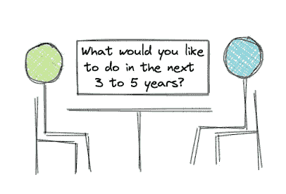
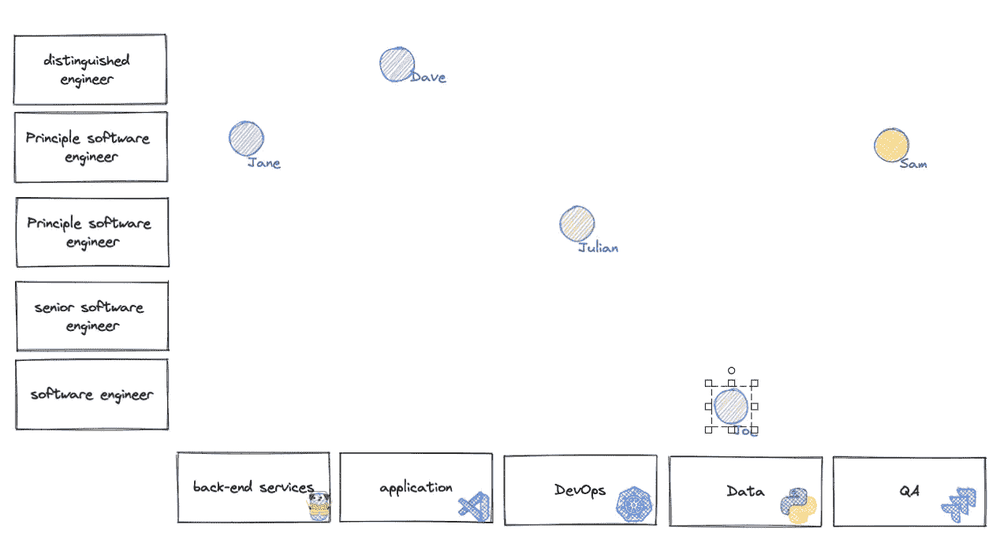
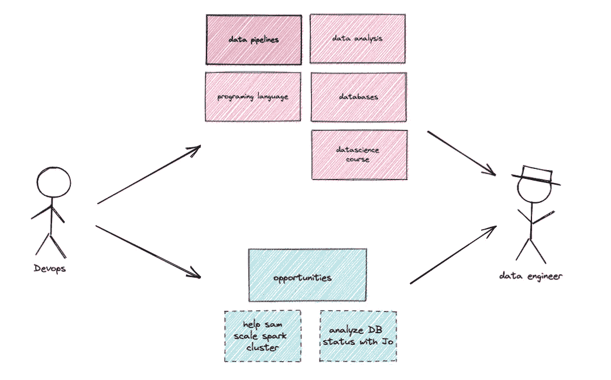
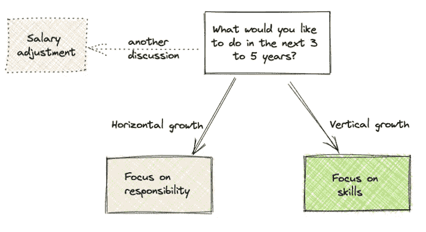

# 软件工程职业道路 101

> 原文：<https://medium.com/geekculture/software-engineering-career-path-101-f17699e6176?source=collection_archive---------3----------------------->

偶尔，我会问我的团队成员，3 到 5 年后他们想做什么？有时候，答案就像是，“我想成为一名高级工程师或技术主管。”

这是一个很好的答案，非常真实。然而，这个答案有时只反映了头衔或团队成员期望的报酬水平。它可能没有反映他们的职业抱负或他们希望获得的技能。可能这位同事性格内向，或者没有信心或知识来真正了解职业发展的可能性。一个好的经理会在这个回答之后提出更多的问题来细化他的团队成员的需求。

在这篇文章中，我将试图帮助软件工程师和工程经理正确地分析上述问题，阐明一个更有帮助的回答，并建立一个可能的职业道路。

# 职称与职位

在大多数工程组织中，每个员工都有一个反映职责和资历的**职位** **头衔**，**职位**反映专业领域。比如移动应用开发者、前端工程师、DevOps 工程师都是**工作岗位的例子。**以下是**职位名称列表:**初级软件工程师、软件工程师、高级软件工程师。下图说明了职务和头衔的组合。

> **工作位置**反映了我的日常工作。**职称**反映的是知识和责任的高低。

Title vs. Position

不同的组织对工作职位和职称有不同的内部列表。因此，一些标题可能会非常混乱。例如，在我看来，描述日常工作的架构师和技术主管在一些组织中被认为是职称。

大型科技公司的[级别](https://www.levels.fyi/?compare=Google,Facebook,Microsoft&track=Software%20Engineer)命名规则略有不同。例如，脸书的工程等级为 E3 9 级，而谷歌的等级为 L3-10 级。

# 横向与纵向职业发展

解释完职位和职称的区别，再来说成长。

晋升主要被认为是垂直职业发展。这是组织认识到一种新的技能和责任水平的方式，这种新的技能和责任水平增加了他们对整个组织的影响。这种影响可能是人的影响，也就是经理的影响，也可能是技术的影响。

内部工作流动是横向职业发展的一个例子。它反映了个人将获得一套新的技术技能。

在这两种情况下，纵向或横向增长都可以通过增加薪酬得到回报。

在大多数组织中，较高的薪酬与增长相关。基本原理是，工程师拥有的知识越多，他们对组织就越有价值。在一个理想的世界里，职称水平应该主要反映知识和责任的水平。然而，不幸的是，我已经看到组织是如何滥用平衡系统的，主要是把它们作为一种补偿工具。不幸的是，我也看到过没有复合水平增长的组织，导致非常有才华的工程师流失。

在 Red Hat，每个提名都有一个同行评审流程，强制证明被提名者对组织的贡献和价值。这一过程减少了滥用的风险。与此同时，经理们为个人贡献者和高绩效者提供了各种薪酬工具。

# 拥有你的职业生涯

最后一个重要因素是相关的愿望。“拥有自己的职业生涯”听起来可能是老生常谈，但请记住，尽管许多人可以在管理职业生涯方面提供帮助，但没人能猜到你的愿望。因此，我建议不断规划你的职业生涯。这条建议对工程师和工程经理都有意义。

每个季度都花时间设计你的未来，就像你设计一个功能一样。从问自己过去你真正喜欢的任务类型开始。把它们列成一个清单，分析你用过哪些技能。现在，拿一张白纸，试着写下不同的“未来”。下一个任务将是了解哪一个未来使用了你最喜欢的技能。做一些研究，并检查每个未来需要什么知识和经验(见下图)。根据研究列出年度目标，并把它们放在笔记本电脑的文件夹里。每个季度打开文件夹，更新每项能力的进度。最后一点:在组织内部或外部寻找指导你的导师。每年迭代一次流程。重新确认你的目标和未来规划。

Designing a future career

# 回到这个问题

搭建好舞台后，让我们回到我们的问题，“从现在开始的 3 - 5 年内，你想做什么？”这个问题旨在了解志向和感兴趣的专业领域。这是建立或验证既定职业道路的绝佳机会。

第一种情况可能是工程师希望他的职业道路通过承担更多的责任而纵向发展。在这种情况下，对工程师来说，一个好的答案应该是，“在接下来的几年里，我希望对组织有更大的影响力，我相信这也将通过职称晋升得到认可。为实现这一目标，我需要掌握哪些技能和能力？”。

另一种情况可能是工程师想要扩展他的技术知识。在这种情况下，一个好的回答应该是，“在接下来的几年里，我想更多地了解 XXX 和 YYY。你认为我在目前的职位上能够获得这些知识吗？”。可能在当前的团队或小组中存在扩展知识和技能的机会。如果不是这样，那么我建议接下来讨论一下未来的机会。

经理们必须做足功课，从他们的角度来反映当前的水平和技能，通过带来真实的情况来证明这种反映。反思应该集中在技能上，而不是个性上。个人建议遵循 [SBR 模式](https://www.athleteassessments.com/sbr-model/)。

最后一种情况是工程师要求加薪。现在，这是一个不同的对话，可能需要一个单独的文章。话虽如此，我鼓励团队成员对薪资满意度保持透明。在一些组织中，经理可以根据几个标准调整工资，主要是围绕过去的业绩和对组织的影响价值。一次好的谈话应该是关于理解薪资调整标准以及哪些任务可能被视为有影响的价值。

## 结论

上图表达了对话的潜在方向。我希望这篇文章对你有所帮助。如果你有类似的经理或工程师的经历，请在下面的评论中分享。

# 常见问题解答

## 我怎么知道我该成长了？

知道什么时候该成长是一种非常主观的感觉。个性、文化和经历在这里扮演着重要的角色。对于一些工程师来说，2-3 年后才需要成长，而对于其他人来说，几十年后才需要成长。如果你遵循我的第一条规则:你拥有自己的职业生涯，那么你可能会对自己的进步有一个清晰的认识。此外，试着问问你的经理和同事，他们的回答可能会让你大吃一惊

## 作为人事经理，我如何帮助我的团队成员成长？

在我看来，经理的部分职责是帮助团队成员成长。一个经理应该不断关注他的团队的职业发展并指导他们。帮助应该集中在教练，指导，消除障碍，并指出相关的军事。通过提供超出他们舒适区的任务来挑战他们。建立一个有可衡量目标的发展计划。创造公开演讲的机会等等。

但是记住第一条规则“拥有你的职业生涯”，团队成员应该积极主动地领导这个过程。

## 我如何从工程师过渡到工程管理？

工程管理是另一种类型的垂直增长。我上面写的关于垂直发展的一切也适用于那些希望作为工程经理垂直发展的工程师。不同之处在于技能的不同。希望成为高级或首席工程师的工程师将主要关注技术技能，而希望成为工程管理角色的工程师将主要关注人员管理和项目管理技能。