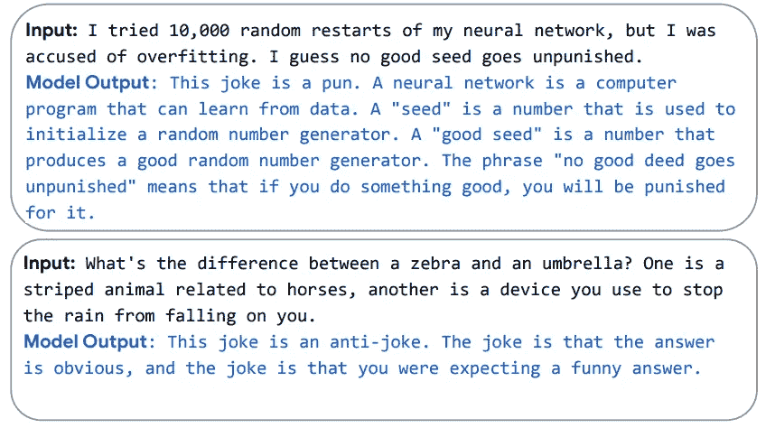
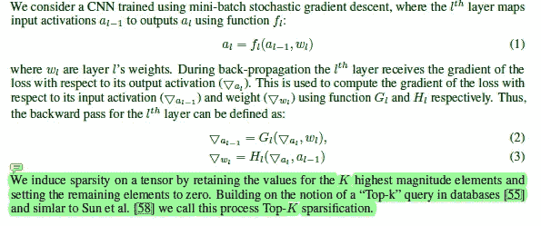
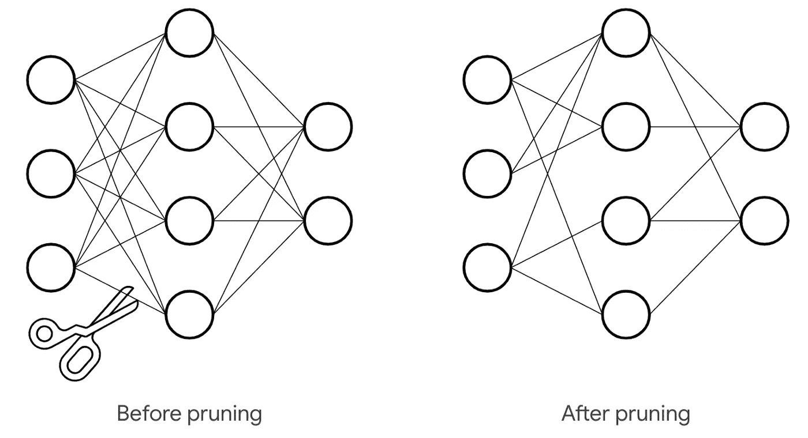
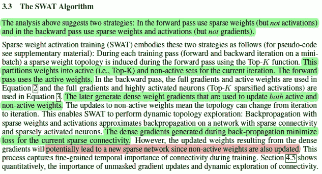
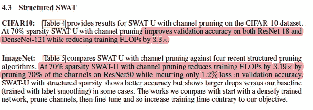
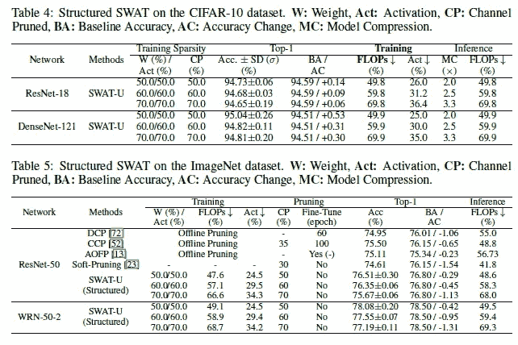

# 稀疏权重激活训练-减少机器学习中的内存和训练时间

> 原文：<https://medium.com/geekculture/sparse-weight-activation-training-reduce-memory-and-training-time-in-machine-learning-8c0fad7d5def?source=collection_archive---------5----------------------->

## 稀疏性是深度学习的下一个前沿领域之一。不要睡在上面。

为了帮助我了解您[请填写此调查(匿名)](https://forms.gle/7MfQmKhEhyBTMDUD7)

不久前，我报道了[谷歌人工智能的路径架构，称之为机器学习的革命](/geekculture/google-ai-sparks-a-revolution-in-machine-learning-403f4dbf3e70)。谷歌新方法中的一个突出之处是在他们的训练架构中实现了稀疏激活。我非常喜欢这个想法，所以我决定更深入地探索这个问题。这就是我偶然发现[稀疏权重激活训练](https://arxiv.org/abs/2001.01969) ( **SWAT** )，由不列颠哥伦比亚大学电气和计算机工程系的一些研究人员进行的。这篇论文绝对让我兴奋。

> 对于 ImageNet 上的 ResNet-50，SWAT 将**训练期间的总浮点运算(FLOPS)减少了 80%,导致在代表新兴平台的模拟稀疏学习加速器上运行时，训练加速提高了 3.3 倍**，而验证准确性仅降低了 1.63%。此外，SWAT **减少内存占用**在向后传递过程中减少 **23%到 50%的激活和 50%到 90%的权重**。

在这篇文章中，我将分享这篇文章中的一些关键见解。随着我们看到 ML 操作的扩大，操纵稀疏度的算法将处于前沿。你绝对不想错过。

Between PaLM and [Flamingo](/geekculture/3-overlooked-things-deepminds-flamingo-a-large-model-for-computer-vision-84cd9d2f738c), Google AI (and subsidiaries) are really proving the benefits of sparsity.

# 理解稀疏激活的需要

为了理解为什么稀疏激活和 SWAT 如此酷，回想一下神经网络是如何工作的。当我们训练它们时，输入流过所有的神经元，向前和向后都是如此。这就是为什么给神经网络增加更多的参数会成倍地增加成本。

Watch the [Neural Networks series by 3Blue1Brown](https://www.youtube.com/watch?v=aircAruvnKk&ab_channel=3Blue1Brown) for a more thorough explanation.

向我们的网络中添加更多的神经元允许我们的模型从更复杂的数据中学习(如来自多项任务的数据和来自多种感官的数据)。然而，这增加了大量的计算开销。

稀疏激活允许一个两全其美的场景。添加大量参数允许我们的模型有效地学习更多任务(并建立更深层次的联系)。稀疏激活允许网络学习并擅长多种任务，而不需要花费太多成本。下面的视频更致力于这个想法。

Make sure you like the video and subscribe for the most woke analysis of Machine Learning :)

这个概念让我想起了专家混合学习协议的一个更现代的转变。我们不是破译哪个专家能最好地处理任务，而是将任务路由到处理它最好的神经网络部分。**这类似于我们的大脑，我们大脑的不同部分擅长不同的事情**。MoE 本身也在大规模模特培训中小打小闹，这不是巧合。将任务委派给较小的专家或子网络是平衡规模和成本的一个惊人的方法。

[Taken from Introducing Pathways: A next-generation AI architecture](https://blog.google/technology/ai/introducing-pathways-next-generation-ai-architecture/)

既然你已经被这个奇妙的稀疏世界所吸引，让我们深入 SWAT，看看它有什么不同。

# 分解特警

顾名思义，SWAT 稀疏化了不同神经元的权重和[激活](/p/4a9d6566ba2c)。过程比较直观。它假设最大的幅度是最重要的。根据 80-20 原则，我们可以只使用这些重要的值，并将其他影响较小的值设置为 0，从而消除它们。

When it comes to building optimal solutions in tech, the 80–20 rule is one of your best friends. [This story is an example of how that rule can allow to transform very complex engineering problems to simpler solvable ones.](https://codinginterviewsmadesimple.substack.com/p/how-a-software-engineer-went-from)

这不是一个很难概念化的算法。然而，在应用这种稀疏化时，您需要实现一些设计选择。我们可以选择丢弃权重、激活、梯度(在反向传播期间计算)，或者它们的某种组合。SWAT 小组进行了一项敏感性分析，检查它们是如何影响收敛的。

Keep in mind that this study was done on 3 Computer Vision datasets. The details may be different for you. Test out what sparsity protocol works for you. ML is more of an art than it is a science.

图 2 是一个有趣的例子。b/w 下降梯度和下降权重+激活的区别是显而易见的。前者会破坏你的表现。作者自己也指出了这种现象-*“稀疏权重和激活”曲线表明，收敛对应用 Top-K 稀疏化相对不敏感。相比之下，“稀疏输出梯度”曲线表明，收敛对将 Top-K 稀疏化应用于反向传播误差梯度(5al)很敏感。后一种观察表明，丢弃反向传播的误差梯度的 meProp 在较大的网络上将遭遇收敛问题。*’

If you’re someone into Machine Learning, check out my other work on Medium/Substack/YouTube. Links at the end of the article.

这给了我们一个很好的起点——‘T8’在前向传递中使用 ***稀疏权重*** *(* ***但不激活*** *)而在后向传递中使用稀疏权重和激活***(****但不渐变*** *)。*‘还有那个我可爱的读者，是特警的基础，简单解释一下。*

**

*The results shown by this algorithm are definitely worth exploring further.*

*还有一个我认为极其重要的想法。这就是这个团队起死回生的方式。是的，我是认真的。*

# *利用僵尸和复活死亡的神经元*

*在前向和反向传播期间，只有最重要的权重用于计算。大多数人会就此打住，忽略死去的神经元进行训练。大多数网络修剪都是这样进行的。然而，这些研究人员也醒了。*

**

*In most network pruning tasks the connections are dropped, instead of setting weights + activations to 0\. [Image](https://medium.datadriveninvestor.com/why-and-how-is-neural-architecture-search-is-biased-778763d03f38)*

*它们用密集梯度计算来更新有效和无效重量(记住我们已经确定梯度不应该被丢弃)。这为以前的死重量增加了一种恢复机制。*仅仅因为它死了一次迭代，并不意味着它不会在下一次*出现。这允许网络动态地探索网络拓扑(结构)。*

*这允许算法执行一个漂亮的平衡动作。[修剪和剔除可以用来停止过度拟合，提高泛化能力，降低训练成本](/p/22d52dc74dda)。然而，减少连接是棘手的，往往会增加培训损失。尤其是如果做错了。**这种方法与删除层/神经元效果相同，但会动态更新以找到最佳配置。**以下是算法的完整描述-*

**

*To get access to my annotated papers, reach out to me.*

*现在是最后一点，让我们评估 SWAT 在一系列任务上的结果。如果没有出色的性能支持，加速和内存效率是没有用的。*

# *执行任务*

*第一张图对比了准确性下降与培训时间/成本减少的情况。如果 SWAT 能在保持合理性能的同时降低成本，那就过关了。SWAT 与其竞争对手进行了两次比较，使用了 80%和 90%的稀疏度。*

**

*SWAT compared to some of its competitors. “***At 80% sparsity, SWAT-U attains the highest validation accuracy while reducing training FLOPs.***”*

*这场表演令人印象深刻。考虑到大多数基线已经非常好了，80%(甚至 90%)稀疏度下的轻微成本降低并不是一个大问题。90%的 SWAT-U 的 8 倍减少也非常令人兴奋，并为进一步探索该算法提供了一个案例。接下来，我们来看一些原始数据。看看下面作者的分析-*

**

*This performance is amazing, especially considering the strong reduction in costs.*

*对那些好奇的人来说，这些是前面提到的表格-*

**

*There are many more such comparisons. This algorithm/approach warrants further exploration.*

*这些结果相当惊人。然而，还有很多需要探索的地方。我希望看到更多的比较，接近多种任务和政策。鉴于目前数据增强在视觉任务中的效用，比较稀疏性如何在其中发挥作用将是有趣的。像生成、分段等任务呢？我认为我们可以在很多领域测试 SWAT。*

*也就是说，这篇论文是令人惊讶的第一步。作者已经建立了一个非常令人兴奋的算法，我肯定会进一步研究这个算法。如果你有 SWAT 或其他面向稀疏性的算法/程序的经验，请与我分享。我当然希望能学到更多。*

*本文到此为止。如果你想进入 ML，t [这篇文章给你一个逐步发展机器学习能力的计划](/geekculture/how-to-learn-machine-learning-in-2022-9ef2ea904986)。它使用免费资源。与其他训练营/课程不同，这个计划将帮助你发展基本技能，并为你在该领域的长期成功做好准备**。***

**

*对于机器学习来说，结合软件工程、数学和计算机科学的基础至关重要。它将帮助你概念化，建立和优化你的 ML。我的每日时事通讯，[编码采访变得简单](https://codinginterviewsmadesimple.substack.com/)涵盖了算法设计、数学、最近的科技事件、软件工程等主题，让你成为更好的开发者。 [**我目前正在进行一整年的八折优惠，一定要去看看。**](https://codinginterviewsmadesimple.substack.com/subscribe?coupon=1e0532f2)*

**

*我创建了[编码面试，使用通过指导多人进入顶级科技公司而发现的新技术使面试变得简单](https://codinginterviewsmadesimple.substack.com/p/faqs-and-about-this-newsletter?r=4tnbw&s=w&utm_campaign=post&utm_medium=web)。时事通讯旨在帮助你成功，避免你在 Leetcode 上浪费时间。我有一个 100%满意的政策，所以你可以尝试一下，没有任何风险。[您可以阅读常见问题解答并在此了解更多信息](https://codinginterviewsmadesimple.substack.com/p/faqs-and-about-this-newsletter?r=4tnbw&s=w&utm_campaign=post&utm_medium=web)*

**

*如果你也有任何有趣的工作/项目/想法给我，请随时联系我。总是很乐意听你说完。*

*以下是我的 Venmo 和 Paypal 对我工作的金钱支持。任何数额都值得赞赏，并有很大帮助。捐赠解锁独家内容，如论文分析、特殊代码、咨询和特定辅导:*

*https://account.venmo.com/u/FNU-Devansh*

*贝宝:[paypal.me/ISeeThings](https://www.paypal.com/paypalme/ISeeThings)*

# *向我伸出手*

*使用下面的链接查看我的其他内容，了解更多关于辅导的信息，或者只是打个招呼。另外，查看免费的罗宾汉推荐链接。我们都得到一个免费的股票(你不用放任何钱)，对你没有任何风险。**所以不使用它只是失去免费的钱。***

*查看我在 Medium 上的其他文章。:[https://rb.gy/zn1aiu](https://rb.gy/oaojch)*

*我的 YouTube:【https://rb.gy/88iwdd *

*在 LinkedIn 上联系我。我们来连线:【https://rb.gy/m5ok2y】T4*

*我的 insta gram:[https://rb.gy/gmvuy9](https://rb.gy/gmvuy9)*

*我的推特:[https://twitter.com/Machine01776819](https://twitter.com/Machine01776819)*

*如果你正在准备编码/技术面试:[https://codinginterviewsmadesimple.substack.com/](https://codinginterviewsmadesimple.substack.com/)*

*获得罗宾汉的免费股票:[https://join.robinhood.com/fnud75](https://join.robinhood.com/fnud75/)*