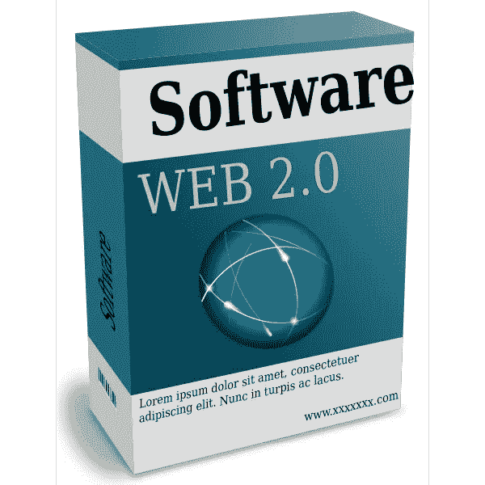

# 初学者工具包:制作案例

> 原文：<https://medium.com/geekculture/starter-kits-making-the-case-2427de84d8e7?source=collection_archive---------12----------------------->

长期以来，我一直支持尽可能多地学习我目前使用的技术。为了实现这个目标，我发现为这项技术准备一个入门工具包是很有用的。随着我了解的越来越多，我不断添加我认为在启动新应用程序时会有用的特性。

那么，什么是初学者工具包呢？因为我们说的是同一种语言，所以我将初学者工具包定义为:

> 一个存储库或应用程序，它提供了一种在很短的时间内构建新的功能性应用程序的方法，该应用程序包含一些有用的特性。

多年来，我已经为许多不同的技术创建了许多初学者工具包:Lotus Notes/Domino、Backbone、牵线木偶、React、Angular、node/express，可能还有其他技术。有些比其他的更有用，但是它们都提供了一种学习特定技术的方法和一个试验想法的平台。

# 利益

初学者工具包的明显优势是能够从初学者工具包创建新的应用程序，并在几分钟内启动和运行。这消除了将所有样板文件放在适当位置的需要，创建了基本功能并快速跟踪了环境设置，因此您可以实际开始创建，这是我们都喜欢这个行业的一部分。

我们还可以立即获得我们添加的功能。这可以防止从不同的项目中复制/粘贴或重新实现某些内容。通过维护初学者工具包并随着我们了解的越来越多而添加新的特性，这本身就证明了创建和维护的时间是值得的。

初学者工具包将提供一个尝试新事物的地方。如果你有构建一个[缓存服务](/geekculture/angular-caching-service-using-http-interceptor-ce713f421c3b?source=user_profile---------1-------------------------------)或[动态加载微调器](/swlh/angular-loading-spinner-using-http-interceptor-63c1bb76517b?source=user_profile---------4-------------------------------)、[全局错误处理](/@keithstric/global-angular-error-handling-8569fe8228f)或其他什么的想法，你的初学者工具包的一个实例是这个实验的完美地方。一旦您对实现感到满意，就将其添加到初学者工具包中。这保持了代码的新鲜，并使您的初学者工具包在将来更有用。

这是一个保存思想、想法、经验教训等的好地方。这个福利不只是给你的。如果您与您的团队或同事共享初学者工具包，他们也可以从中吸取教训，并在他们的项目中使用您的成果。如果你能让他们为初学者工具包做贡献，那就更好了。

如果你是一个内容创作者，它提供了一个充实文章/视频想法的地方。我在关于 medium 的文章中提供的大部分代码都是从某种初学者工具包开始的。因为我可以在很短的时间内建立并运行一个工作环境。

根据技术的不同，初学者工具包是在一个地方存储通用组件、实用程序、样式表、scss 混合和函数的好地方。

# 不足之处

初学者工具包也有它的缺点。最大的问题是它没有得到维护。由于 JavaScript 世界的快节奏，它可能会很快落后。在它远远落后于不值得升级之前，必须努力使它保持最新。此时，初学者工具包几乎毫无用处。

另一个缺点是技术会消亡。我在 Lotus Notes/Domino 世界呆了很长时间。我开发的初学者工具包用了很多年。然而，Lotus Notes 在企业中已经停止使用，初学者工具包也不再被使用或需要。虽然我们确实物有所值，但我们最近增加的东西从未被使用过。我们还用不同的技术开发了其他初学者工具包，用于与 Lotus Notes/Domino 通信。当 Lotus Notes 寿终正寝的时候，虽然其他初学者工具包仍然是相关的，但我们必须删除初学者工具包中的 Lotus Notes 通信部分。

乏味的缺点之一是必须从初学者工具包中删除未使用或不需要的功能。在我上面给出的例子中，与 Lotus Notes/Domino 的通信是我们的一个 Node/Express 初学者工具包背后的原因。虽然我们构建到初学者工具包中的一些工具和特性今天仍然有用，但是 Lotus Notes 特性已经没有用了。我们必须在不破坏整体的情况下移除这些功能。

# 要考虑的事情

在开发初学者工具包时，您需要考虑几个因素:

*   保持它的一般性——尽量不要包含你对 UI 库、样式等的看法。你希望这个东西在各种各样的情况下都有用。如果你决定使用角度材质 UI 组件库。如果你的项目需要使用 Bootstrap 或者其他东西，会发生什么呢？
*   保持一切可重用性-尽可能使您的功能可重用。也许您不是从零开始一个项目，但是仍然希望从您的初学者工具包中获得一个日志记录基础设施。尽量不要将该特性与初学者工具包捆绑得太紧，以便在其他地方实现它。
*   记录下来——虽然你可能现在就明白了一切，但 6 个月或 1 年后呢？尽你所能记录下一切，如果相关的话，记录下你对该特性的推理。在复杂实现的目录中包含自述文件
*   让删除功能变得容易——虽然很多功能都很方便，但有时它们并不需要，或者只是一个麻烦。确保您可以在不破坏其他东西的情况下轻松删除该功能。
*   不要忘乎所以——制作各种页面、演示和组件库很容易忘乎所以。忍住这种冲动！当你想使用初学者工具包时，你只需要移除更多的东西。
*   该表扬就表扬。如果你的初学者工具包来自你在网上找到的东西，但不是你的，一定要包括一个原始的链接。这样做可以确保文档链接到如何使用原始的。这样做也是出于礼貌。
*   保持有用——试着在新的应用程序中加入有用的东西。当您想要使用初学者工具包时，不要包括实验、失败的实现或可能被视为杂乱的东西。
*   测试它——确保单元测试存在并通过，并维护这些测试。添加新功能时测试使用情况，以确保不会破坏现有功能。

# 贸易工具

您已经开发了初学者工具包，但是现在，您如何提供一种简单的方法来分发或使用您的成果呢？当然，它将驻留在一个存储库中，但是在发行版中您有以下一些选择。其中一些选择将需要您在初学者工具包的结构中进行一些思考，以适应分发技术的细微差别。

*   克隆存储库:虽然这是一种相关的分发方式，但是它确实很容易在无意中通过错误的推送从初学者工具包中添加或删除内容。
*   Github 模板:Github 允许你定义一个库作为一个[模板](https://docs.github.com/en/repositories/creating-and-managing-repositories/creating-a-template-repository)。我发现这是使用初学者工具包的较好方法之一。它消除了克隆的缺点。
*   NPM:这是一个分享 API、工具等的好方法。但是初学者工具包呢？这是需要在初学者工具包的结构中进行一些思考的地方。这里主要关心的是初学者工具包的实例将驻留在`node_modules`而不是根`src`目录中。所以弄清楚*它将如何被使用，以及那个用例是否比它的价值更麻烦。*

# 结论

希望我已经展示了初学者工具包在您的工具箱中的位置。只要保养好，它们就能派上用场。此外，初学者工具包是一个很好的学习工具。他们让你按照自己的节奏学习技术，最终你会得到有用的东西。

下面我链接了一些我的初学者工具包和我多年来找到的其他工具包。查看其他初学者工具包是一个很好的想法来源，可以在您试图学习的任何框架或技术中教给您一些有价值的经验。

*   一个非固执己见的角度 13 stater 套件
*   [云套接字](https://github.com/keithstric/cloud-sockets) —一个可扩展的 web 套接字服务器，可连接到 express
*   [node-typescript-boilerplate](https://github.com/keithstric/node-typescript-boilerplate)—已经配置了 TypeScript 的节点项目
*   [TypeScript-node-starter](https://github.com/microsoft/TypeScript-Node-Starter)—微软的一款节点/TypeScript 启动器
*   [ngx-rocket/starter-kit](https://github.com/ngx-rocket/starter-kit)—Web 项目入门套件，包括基于 [angular-cli](https://github.com/angular/angular-cli) 的现代工具和工作流、来自社区的最佳实践、可扩展的基础模板和良好的学习基础。
*   [构建 Angular 应用的视频](https://www.youtube.com/watch?v=WA95EJGhbLc&t=1s&ab_channel=AwaisMirza)——虽然不是入门套件，但这个视频给了我无数的想法

直到下一次…编码快乐！