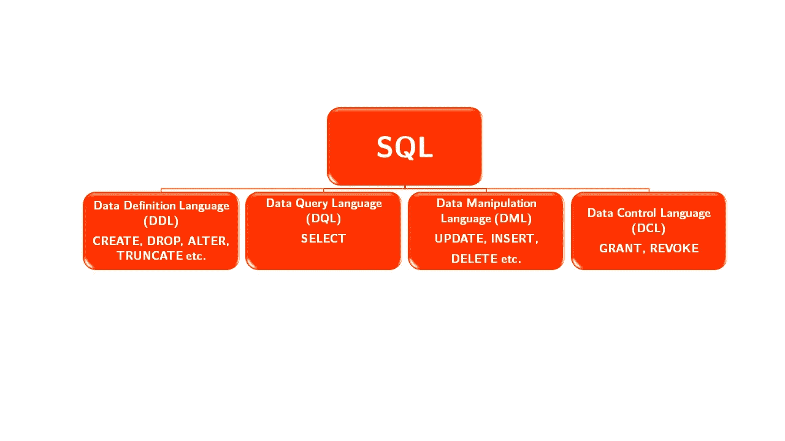

# 从 SQL 开始:第 1 部分

> 原文：<https://medium.com/geekculture/starting-with-sql-part-1-259f956f04b3?source=collection_archive---------28----------------------->

## ***每个数据分析师必须知道的基本概念！！***



*我们生活在一个被数据统治的世界里，这些数据应该得到妥善管理。数据库只是逻辑组织的数据的集合，以易于检索的格式存储。大多数基于产品的公司使用数据库管理系统(DBMS)来存储后端的信息。DBMS 是提供快速访问和修改数据的软件的集合。《出埃及记》Oracle、MySQL、微软 SQL server、PostgreSQL、Sybase 等。*

结构化查询语言的缩写。最初它被称为 SEQUEL(结构化英语查询语言)。SQL 是一种编程语言，它为用户提供了在关系数据库中读写数据的能力。RDBMS 以表和行的形式存储数据，遵循适当的模式(列表/属性的标题),不可用的值为空。SQL 编程简单易行，使用简单的英语和特定的语法，这些语法由关键字、标识符和以分号(；)来终止语句。

***SQL 关键字不区分大小写，但建议将 SQL 关键字写成大写，以区别于 SQL 语句中的其他文本。*** 用于注释，提供提示文本，#用于单行注释，以/*(斜杠后跟星号)开始，以*/结束，用于多行注释。现在我们将看到 SQL 中用于编写查询的命令。所以让我们开始吧……

1.  `CREATE DATABASE`:在 RDMS 创建数据库，在 MYSQL 服务器显示数据库:

```
*#for deleting any database previously present with same name.*
**DROP DATABASE IF EXISTS** databasename**;***#for creating anew database named databasename.*
**CREATE DATABASE** databasename**;***#Creating a database doesn't make it available for use. So for using the targeted database we have to specify USE command as below for all future statements.*
**USE** databasename**;***#for showing the existing databases on MYSQL server:*
**SHOW DATABASES;**
```

2.`CREATE TABLE`:创建数据库后，现在让我们继续使用 SQL 在目标数据库中创建一个表:

```
A table will keep the data in organized way by storing information into rows and columns.
*#for creating table*
**CREATE TABLE** tablename(column 1 data type data constraints,
column 2 data type data constraints
column 3 data type data constraints
.
.
column N data type data constraints)**;**Data type specifically tells the type of data column will store like integer, string character, date etc.
Data constraints defines the rules for the values in the column like NULL/NOT NULL, PRIMARY KEY, AUTO INCREMENT, UNIQUE etc.*#to see the column information, execute:*
**DESCRIBE** tablename**;***PS: If the table created exist already with same name inside the database it will give error. So optional clause for this:*
**CREATE TABLE IF NOT EXISTS** tablename**;***#for seeing the list of tables inside selected database, execute:*
**SHOW TABLES;**
```

3.`INSERT`:用于在创建的数据库表中插入记录；

```
*#for inserting new rows into database table with column names column 1,column2, etc. with corresponding values value1,value2 etc.***INSERT INTO** tablename (column 1,column 2....column n**) VALUES** (value 1,value 2....value n)**;**Non numeric values like string/date should be surrounded with quotes '' but non numeric values should be written as it is.*Note: If string itself contains quote like Employee's ID then it should be skipped with a backslash 'Employee\'s ID' .*
```

4.`SELECT, UPDATE, DELETE` :检索/更新/删除数据库表中的数据；

```
*##SELECT 
#for selecting and retrieving the data for one or more table
#for selecting all the values of all the columns* **SELECT * FROM** tablename**;**                 
#for selecting particular columns **SELECT** column 1,column 2....column n **FROM** tablename**;***#To retrieve rows with certain specific condition or a combination of conditions, retrieve records with where Clause.* **SELECT** column 1,column 2....column n **FROM** tablename **WHERE co**ndition**;***Operators allowed in WHERE CONDITION are =, <, >, <=, >= , LIKE, IN, NOT IN, BETWEEN. For filtering more than one condition AND/OR will 
be used with WHERE CLAUSE.* **SELECT** column 1,column 2....column n **FROM** tablename **WHERE** condition 1 **AND/OR** condition 2**;**#To remove duplicate values use keyword DISTINCT just after the SELECT statement.
**SELECT DISTINCT** columnname **FROM** tablename;Note : **DISTINCT treats NULL values**. If multiple NULL value are present, it will keep one NULL value and remove others.*##UPDATE
# for updating the records in the database:*
**UPDATE** tablename**SET** column 1=value 1,column 2=value 2...column n=value **n WHERE** condition**;** Note : If no WHERE condition is mentioned all the values of column will get updated.##DELETE
#Deleting the records from database:
**DELETE FROM** tablename **WHERE** *condition*;If we are not using **WHERE** Condition in **DELETE** statement all the data will get deleted but table structure, indexes, attributes will remain same as earlier. To delete all record in one go, execute:
**DELETE FROM** tablename;
```

5.`ORDER BY`:对数据进行升序和降序排序的语句:

```
**SELECT** column 1,column 2....column n **FROM** tablename **ORDER BY** columnname **ASC|DESC**;
# For ascending order ASC, DEFAULT sorting order is ascending.
# For descending order DESCNOTE : when multiple columns are specified for sorting ,the result sets are initially sorted by first column and then that order list is sorted by second column.
```

6.`ALTER TABLE`:通过添加、删除、重命名或对列进行任何其他更改，对现有表格进行结构性更改。

```
#for adding a new column
**ALTER TABLE** tablename **ADD** columnname data type data constraints;#When a new column is added in a table all the values are NULL by default so to make it NOT NULL we need to specify some  DEFAULT value.
**ALTER TABLE** tablename **ADD** columnname data type data constraints **DEFAULT** dafaultvalue;#Adding at specific location (after a particular column)because ALTER add new column in last by default:
**ALTER TABLE** tablename **ADD** columnname data type data constraints **AFTER** columnname;#for adding at first place:
**ALTER TABLE** tablename **ADD** columnname data type data constraints **FIRST**;#for adding UNIQUE constraint:
**ALTER TABLE** tablename **ADD UNIQUE** columnname data type data constraints;#for modifying the existing table i.e., changing the position of the column:
**ALTER TABLE** tablename **MODIFY** columnname data type data constraints **AFTER** columnname;#Changing the datatype of the column:
**ALTER TABLE** tablename **MODIFY** columnname new data type;#For renaming column:
**ALTER TABLE** tablename **RENAME COLUMN** oldname **TO** newname**;** #for deleting column:
**ALTER TABLE** tablename **DROP COLUMN** oldname **TO** newname**;**
```

7.`TRUNCATE TABLE`:删除表格中的所有行。

```
**TRUNCATE TABLE** tablename;#TRUNCATE is similar to DELETE in producing output but they are different in some way:
DELETE filters the deleting of records by using option WHERE statement where TRUNCATE removes all rows and doesn't support where clause.
```

8.`DROP TABLE` : Drop 永久删除所有数据，并从数据库中删除该表。删除数据库和表是不可逆的。

```
DROP TABLE tablename;
DROP DATABASE databasename;
```

9.`MIN, MAX, AVG, COUNT,SUM` :集合函数最大值、最小值、平均值、计数、总和等。是用于检索相应值的聚合函数。

```
#for Finding Min/Max, Count etc., execute
**SELECT** **MAX**(column name) **FROM** tablename;
Note: Aggregate functions ignores the NULL value but for case of COUNT(*) it consider all values.
**SELECT** columnname, **COUNT(*) FROM** tablename;
```

10.`GROUP BY & HAVING`:分组依据，用于根据列值对行进行分组。它与 SELECT 语句和聚合函数一起使用。为了在 GROUP BY 和 aggregate 函数中指定搜索条件，我们使用 HAVING 子句。

```
**#for grouping and specifying the conditions.
SELECT** columnname, **COUNT(*)** **FROM** tablename **GROUP BY** columnname **HAVING** COUNT(*)>2 (or any other condition);
```

11.表的克隆:用于创建原始表的精确副本或复制品:

```
Step 1 : Create a new table
**CREATE TABLE** newtablename **LIKE** originaltablename;
Step 2: Insert all values from original to new table:
**INSERT INTO** newtablename **SELECT * FROM** originaltablename;
```

12.临时表:为当前会话创建临时表，当会话关闭时，临时表将自动删除。它从不存储在数据库中，并且是特定于会话的。

```
#Creating temporary table from beginning : **CREATE TEMPORARY TABLE** temporary_tablename(column 1 data type data constraints,
column 2 data type data constraints
column 3 data type data constraints
.
.
column N data type data constraints)**;**#Copying from an existing table:
**CREATE TEMPORARY TABLE** temporary_tablename **SELECT * FROM** originaltablename ;#Since temporary table get deleted automatically but if we want to delete it before ending the session :
**DROP TEMPORARY TABLE** temporary_tablename;
```

这就是第 1 部分的全部内容。第 2 部分将包括数据类型、数据约束、操作符等。而第 3 部分将由 SQL 中的连接组成。敬请期待！！

感谢您的阅读！！