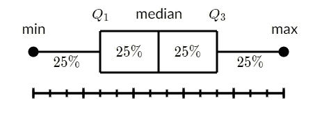
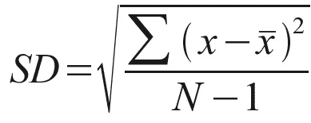
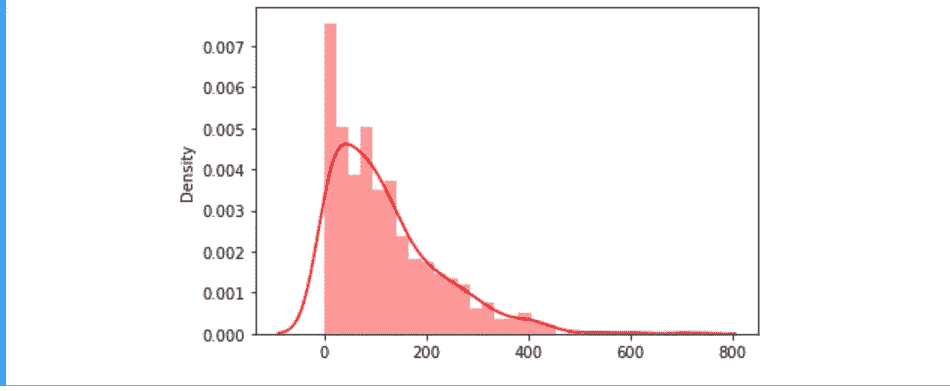
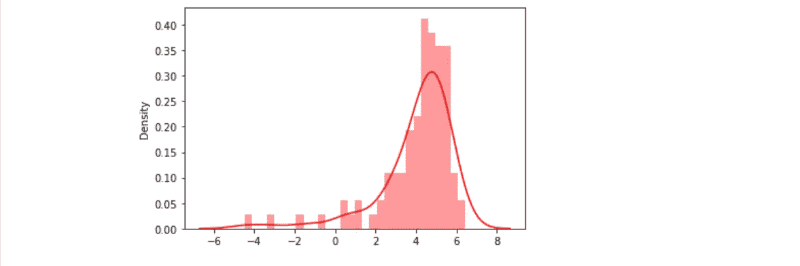
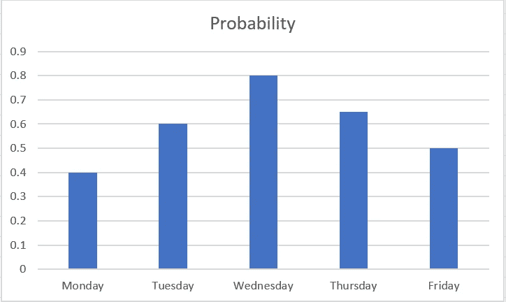
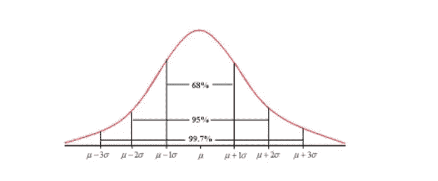
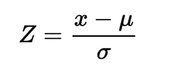
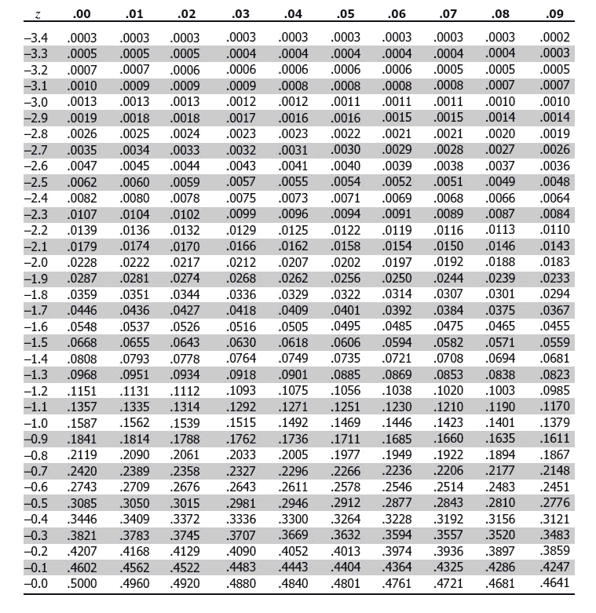
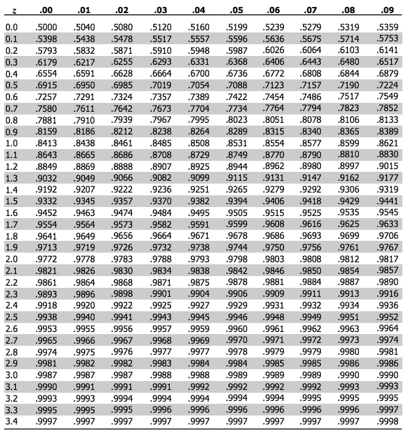
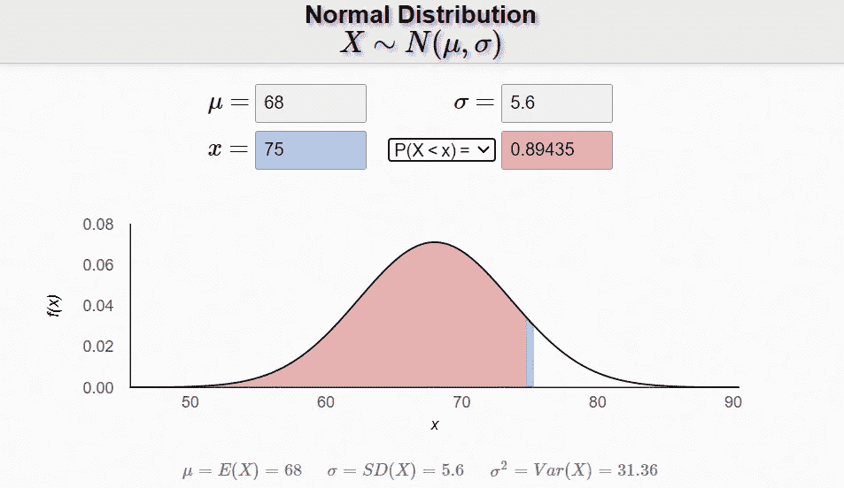

# 商业分析统计 101

> 原文：<https://medium.com/geekculture/statistics-101-for-business-analytics-e23c2b7d4bbd?source=collection_archive---------13----------------------->

一个组织的成功很大程度上取决于其技术部门和业务部门之间的紧密协作。为了最好地迎合产品的需求，工程团队必须与业务团队达成一致。

例如，想象一下这样一种情况，你拥有一家餐馆，你失望地看到，在过去的一个季度里，它的表现非常差。你坐下来思考可能是其糟糕表现的根源的原因，但没有得出任何实质性的结论。你联系你的工程团队来升级你的餐馆的在线网站，通过加入更多的功能来吸引顾客。然而，工程团队为此次升级提供了超出您的限制的预算。

这种情况在当今的商业世界中非常普遍。成本和性能之间的优化是任何产品成功的关键，组织需要遵循严格的数据驱动方法来分析问题，并基于统计基础提出解决方案，而不是简单地拐弯抹角。这种全面的、数据驱动的解决方案不仅让利益相关者信服和易于理解，而且促进了工程团队和业务团队之间的清晰沟通。商业分析专注于对一个项目或计划的需求进行精确的分析，提出最佳的、具有成本效益的实施方案，指出限制，建议合理的时间窗口，找出漏洞，并推荐可以帮助企业克服障碍并更好地发展的策略。

深入其中任何一个领域的基础和第一步是需要理解业务正在处理的数据。对数据的正确理解使得能够对项目的需求进行明确的分析，并与关键的涉众进行清晰的沟通。

在当今的现代数据世界中，我们不再处理简单的小电子表格，而是处理每秒钟从不同来源动态生成的大量数据。理解数据需要适当的数学和统计直觉，因为这将有助于数据的逻辑和合理分析。

# 数据是什么样的？….

任何业务分析师都会做的第一件事是浏览数据，找出它的样子。如果 Excel 电子表格包含的记录很少，那么这很容易从电子表格中发现。但是我们已经远远领先于如此小规模的数据。我们需要一些参数和统计数据来有效地总结我们的大块数据。参数与总体相关，而统计数据与总体样本相关。通常，不可能研究整个群体，所以我们抽取能最好地描述整个群体的样本。

## 数据集中趋势的测量:

数据的中心趋势是统计学中最重要的概念之一，它反映了数据分布的关键点或中心。

有 3 种类型的集中趋势:

**Mean:** 这是整个数据集中所有数据点的值在数据集中数据点或样本总数上的平均值。

**中值:**这是数据集的中间值。我们首先按照值的升序排列观察值，然后选择中间值。如果我们有偶数个样本，那么中位数就是两个中间值的平均值。

例如:在一个 55 人的班级里，我们测量学生的身高。平均值是所有高度的总和除以 55。为了找到中间值，我们将所有的学生按照身高的升序排列，选择中间的学生，他/她的身高就是这个学生样本的中间值。

**模式:**模式定义数据集中出现频率最高的值。一个数据集可以有多种模式，或者根本没有模式。

例如:2，3，4，6，6，6，7，7:这个数据集的模式为 6。

## 数据中心分布的测量:

中心分布的度量描述了数据的分布程度。

有 4 种测量中心扩散的方法:

**Range:** Range 是数据集的最大值和最小值之差。

**四分位数范围:**四分位数将数据集分成 4 个相等的部分，称为四分位数，每个四分位数中有 25%的数据。最低的四分位数或 Q1 是位于样本中位数左边的数据点的中位数。25%的数据位于最小值和 Q1 之间。

第二个四分位数或 Q2 是数据集的中间值，或第 50 个百分位数，或整个样本的中位数。

第三个四分位数或 Q3 是位于样本中值右侧的数据点的中值。75%的数据位于最小值和第三季度之间。四分位数间距是上四分位数或第三季度与下四分位数或 Q1 之间的差值。这可以通过如图所示的方框图来很好地描述。

例如，考虑具有以下数据点的数据集:

21,25,27,31,32,37,43,47,48

数据已经按升序排序。

Q2 是整个数据集的第 50 百分位或中位数。

Q2 = 32

Q1 =样本下半部分的中位数= (25+27) /2 = 26

Q3 =样本上半部分的中位数= (43+47) /2 = 45

IQR 或四分位距= Q3-Q1 = 45–26 = 29

**方差和标准差:**

它们描述了一个数据点离数据集的平均值有多远。

方差计算为每个数据点与样本平均值的差值，并对样本总数求和。

S is the variance, n is the number of observations

方差越大，平均值周围的数据分布越广。较大的方差表明平均值可能不是集中趋势的良好指标，因为较大的方差意味着数据在平均值的两侧更加分散和拉伸，并且样本中的观察值与平均值相差很远。

方差是平方的，以放大更大的距离，也避免任何负值。

标准差就是方差的平方根。

## 偏斜度和异常值:

异常值是那些与其余观察值有显著差异的数据点或观察值。

例如，我们有一个包含以下值的数据集:

3, 4, 7, 11, 500

在这里，与其他值相比，500 似乎是一个相当大的值。这种点称为异常值，需要在数据分析过程中加以考虑。

离群值倾向于将数据拉向自己。如果异常值位于通常数据点的最右侧，则该数据被称为**右偏数据**，因为它是一个长的**右尾**，就像我们上面的示例数据集 3，4，7，11，500 一样，其中值 500 非常靠近其他值的右侧，从而将数据的分布拖向右侧。

类似地，如果数据看起来像 2，100，150，200，225，那么 2 将是一个奇怪的观察值，将数据的分布拖到左边。这样的数据被称为**左偏数据**

A right skewed distribution, with a long right tail

A left skewed distribution with a long left tail

## 偏斜度对集中趋势的影响；

考虑数据集 3，4，7，11，500 的上述示例。如果没有 500 这个奇数值，这个数据集的平均值应该是 6.25。现在，随着这个异常值进入数据集，平均值变成了 105，这与大多数观察值相差甚远。然而，第一种情况下的中位数是 5.5，异常值是 7，所以没有巨大的差异。

这个讨论清楚地表明，离群值对平均值的影响比中位数更大，因为它们倾向于将平均值拉向自己。因此，在这种情况下，平均 if 105 并不能很好地代表我们的数据，因为它与大多数数据点不一致，并且偏向异常值。

这就是为什么应该小心处理数据集中的异常值的原因，这样我们就可以断定平均值是否代表数据。

# 概率分布:

在任何实验中，随机变量的每个可能值都有发生的概率。例如，当我们掷一个公平骰子时，从 1 到 6 的每一个结果都有相等的机会发生，等于 1/6。

让我们用一个例子来理解这一点。下表显示了一周的 5 个工作日，以及员工在上午 8:30 到 8:45 之间到达办公室的概率

从上表中可以看出，雇员在周三上午 8:30 到 8:45 之间到达办公室的概率最高，概率为 80%或 0.8，而在周一和周五，他到达办公室的概率较低，这可能是由于一周开始和结束时的交通繁忙。

概率分布是一个函数，它描述了一个随机变量在给定的取值范围内可以取的所有值。数据以不同的方式生成，不同的概率分布模拟不同的数据生成过程。

最常见和最常用的概率分布是**正态分布。**也就是俗称的**高斯分布**或者**钟形曲线**。

据说现实生活中的大多数事件都可以用正态分布来模拟。

## T 何正态分布:

正态分布有**均值=中值=众数**，均值将数据平均分配到两边，50%的数据在左边，50%在右边。

描述正态分布的数学函数由下式给出:

f(x) is the mathematical function describing the normal distribution, sigma is the standard deviation, and mu is the mean

Generating normal distribution Python

正态分布有许多优点，这就是它在统计分析中如此频繁使用的原因。

正态分布遵循**经验法则**:

经验法则表明，68%的数据位于 1 个标准偏差内，95%的数据位于 2 个标准偏差内，99.7%的数据位于 3 个标准偏差内，每个尾部弥补其余的 0.15%，总共 0.3%。

经验法则允许我们得出这样的结论:假设数据遵循正态分布，数据集中的任何随机值几乎肯定会落在 3 个标准差以内(1000 次观察中的 997 次应该在 3 个标准差以内)。

## z 分数:

z 得分给出了数据点离平均值的距离。更专业地说，它是根据一个数据点离平均值有多少标准差来计算的。

x is the data point, mu is the mean and sigma is the standard deviation. Z is the corresponding z-score of x, giving how many standard deviations away x lies from the mean mu.

让我们假设，班上的平均分数是 75 分，你得了 67 分。比如说，全班分数的标准差是 5。

z = 67–75/5 =-1.6

这意味着你的分数比平均值低 1.6 个标准差，假设全班的分数服从正态分布。

正 z 值表示数据点高于平均值，负 z 值表示观测值低于平均值。z 分又称为**标准分**。

## 标准化、Z 表和 Z 分数的实际含义:

让我们假设一名候选人参加了一项测试，并获得了 75 分(满分为 100 分)。所有参加测试的人的平均分数是 68，标准差是 5.6。候选人想知道他相对于同龄人的表现如何。为此，他需要找出他的同龄人中得分低于他的百分比，以及高于他的百分比。在这种情况下，假设整批的分数服从正态分布，我们使用标准化和 z 表的方法。

我们先把考生的分数标准化。标准化仅仅意味着，把不同的价值观放在同一个尺度上。标准化给出了标准分数或 z 分数。在这种情况下，它是(75–68)/5.6 = 1.25

这告诉我们，考生的分数比均值高 1.25 个标准差。但这并没有告诉我们，有百分之几的学生分数低于他，有百分之几的学生分数高于他。这些信息将有助于评估他相对于同龄人的表现。

这时，预定义的 z 表就派上了用场。一旦我们有了 z 值，下一步就是将 z 值映射到 z 表。

有两种 z 表可用，正 z 表和负 z 表。当我们有正的 z 值时，我们参考正的 z 表，而对于负的 z 值，我们参考负的 z 表。

Positive z-table

在上面的例子中，我们有一个正的 z 值 1.25。所以我们参考正 z 表。为了将该值映射到 z 表，我们首先找到 z 表 y 轴上的前两位数字。在我们的例子中是 1.2。然后，沿着表格的 x 轴，找到第二个十进制数，在我们的例子中是 5。交点给出的值为 0.8944。

z 得分的表格条目始终表示 z 值左侧**的曲线区域。**

这意味着，89.44%的学生得分低于我们的候选人，而(100–89.44 = 10.56%)得分高于他。

这可以想象如下:

The shaded region indicates 89.4% of the area under the curve, implying that our candidate with a score of 75, ranks higher than 89.4% of his peers. Note that, score of 75 yields a z-score of 1.25 which gives the area 0.894 to the left of the z-score. Link to online calculator used to plot the distribution:https://homepage.divms.uiowa.edu/~mbognar/applets/normal.html

# 抽样分布和中心极限定理；

与所有人打交道通常很麻烦。比如说，我们想找出美国所有数据科学家的平均工资。这是一个非常艰难的过程，因为人口众多，分布在全国多个城市、州和公司。在这种分析中，我们处理的是人口样本。我们抽取尽可能多的样本，最好地描述整个群体。

让我们用一个简单的例子来理解这一点。

比方说，我们一个班有 500 名学生，我们想找出这些学生在化学方面的平均分数。但是我们不想检查每一个学生，而是随机抽取 40 个样本，每个样本 5 个学生。然后我们计算每个样本的平均值。

每个样本都有它自己含义。这个平均值被称为**样本平均值**。样本均值可以被认为是一个随机变量，因为它随着样本的不同而不同。现在可以对每个样本均值作图，我们可以检查它们的分布。这就是所谓的**抽样均值分布**。样本均值现在是一个随机变量 X，值为 x1，x2…(73, 70.2, 72.6….69.6).x 是一个随机变量，它的概率分布和其他随机变量一样，有自己的均值和标准差。关于 X 的分布令人惊奇的是，在大多数情况下，X 是 ***正态分布的，即使原始人口没有遵循正态分布*** 。这意味着，即使总体不是正态分布的，或者我们不知道原始总体的实际分布，如果我们从总体中抽取多个相同大小的样本，计算每个样本的平均值，然后绘制这些样本平均值的分布图，抽样平均值的分布往往遵循正态分布。因此，我们可以将正态分布的所有规则和属性应用于抽样分布，如经验规则、z 得分方法等。

约束条件是，我们需要收集尽可能大的样本，n ≥ 30，其中 n 是样本大小，以便采样分布遵循正态形式，而不考虑整个总体的实际分布。

这就引出了**中心极限定理**。它说明， ***如果总体有μ的均值和σ的标准差，并且我们从总体中取足够大的样本，(n≥30)有替换，那么样本均值的分布将近似遵循正态分布*** 。抽样平均值，即单个样本平均值接近总体平均值，样本平均值的标准偏差等于总体标准偏差除以样本大小。样本量越大，近似值越好。

Sampling Mean = population mean and sampling standard deviation = population standard deviation divided by sample size n.

# **结尾注释:**

统计基础构成了商业分析的支柱，从基础开始总是好的。更高级的主题，如假设检验、显著性水平、置信区间、Z-检验和 T-检验，也对商业决策有实质性的贡献。这样的话题和更多的话题将在我随后的博客中讨论。