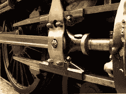
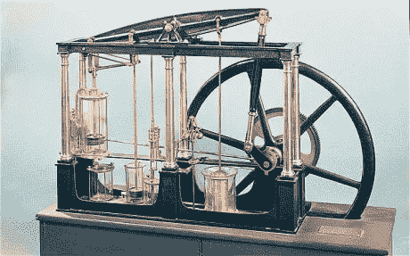

# 蒸汽动力工业 1.0

> 原文：<https://medium.com/geekculture/steam-power-industry-1-0-449c3ea203f4?source=collection_archive---------14----------------------->

# 介绍

固定式[蒸汽机](https://www.technologiesinindustry4.com/)的进步成为工业革命的一个重要细节；然而，在工业革命的早期，最大的商业能源是在水和风的帮助下获得的。在英国，使用 1800 年的帮助下，一个预期的 10，000 马力成为使用蒸汽的帮助下。到 1815 年，蒸汽能量已经增长到 210，000 马力。

蒸汽动力能源构成了商业社会的基本能源供应。在能源工厂，水被加热成蒸汽，加压的蒸汽驱动发电机产生电流。蒸汽的热能相应地转化为机械能，而机械能又通过[转化为](https://www.technologiesinindustry4.com/)电能。用来推动涡轮磨坊的蒸汽提供了世界上最大的电能。由于制造钢、铝、铜和镍，蒸汽同样被广泛用于这种商业策略；化学品的制造；和石油提炼。在家里，蒸汽早已被用于烹饪和取暖。

# 首次工业应用

1698 年，托马斯·萨弗里首次成功地将蒸汽用于商业用途。他在伦敦建造了一台低排量混合真空和压力水泵并申请了专利，这种水泵能产生大约 1 马力的功率，并在几个自来水厂和一些矿井中得到应用(因此成为它的“标志名”，矿工的朋友)。Savery 的泵在小马力水平上变得具有价格竞争力，但是在大尺寸上变得容易受到锅炉爆炸的影响。萨弗里泵坚持生产，直到迟到的 18 世纪。

# 活塞式蒸汽机

第一台成功的活塞式蒸汽[发动机](https://www.technologiesinindustry4.com/)在 1712 年之前借助于托马斯·纽科门得以增加。在英国安装了一系列纽科门发动机，用于排干迄今为止无法开采的深井，发动机在地面上；这些都是巨大的机器，需要大量的资金来建造和生产 3.5 千瓦(5.0 马力)以上。它们已被广泛用于为市政输水泵提供能量。然而，在使用尖端标准的帮助下，它们的效率非常低，而在煤炭以合理的价格在坑口定价的情况下，在允许煤矿向更深处移动的帮助下，它们在煤炭开采方面展开了巨大的扩张。

尽管有这些缺点，纽科门发动机在 19 世纪早期一直被可靠和清洁地保存和坚持在煤田内使用。到 1729 年，当纽科门去世时，他的发动机在 1722 年(首先)传播到了匈牙利、德国、奥地利和瑞典。一个普遍的一百一十是公认的已建成的援助使用 1733 而联合专利到期，其中 14 个已在国外。在 18 世纪 70 年代，工程师约翰·斯密顿建造了几个非常大的模型，并增加了一些改进。在 1800 台发动机的帮助下，总共制造了 1454 台发动机。

# 瓦特蒸汽机

大约在苏格兰人詹姆斯·瓦特的帮助下，操作标准中的一个重要替代方案[被引入](https://www.technologiesinindustry4.com/)。在他的商业企业合伙人英国人马修·博尔顿的金钱援助下，他成功地利用 1778 年完善了他的蒸汽机，其中包括一系列彻底的改进，彻底去除了汽缸顶部的一部分，从而使低应力蒸汽力优先于大气活塞的顶峰，使用蒸汽夹套和著名的独立蒸汽冷凝室。独立的冷凝器去除了立即注入汽缸的冷却水，冷却水冷却了汽缸并浪费了蒸汽。同样，蒸汽夹套防止蒸汽在气缸内冷凝，进一步提高了性能。这些改进成倍地提高了发动机的性能，以至于博尔顿和瓦特的发动机使用了最有效的 20-25%的煤，就像纽科门的发动机一样。波尔顿和瓦特于 1795 年开设了 Soho 铸造厂来制造这种发动机。

到 1783 年，瓦特蒸汽机已经完全发展成为一种双重旋转型，这意味着它可以用来立即推动制造单位或工厂的旋转设备。瓦特的两种基本发动机都在商业上非常成功，在 1800 年的帮助下，博尔顿&瓦特公司制造了 496 台发动机，其中 164 台使用往复泵，24 台为高炉服务，308 台为工厂设备提供动力；从 3.5 到 7 的最大发动机发电量。5 千瓦(五到十马力)。

# 主要应用

从矿山到工厂，蒸汽发动机被应用于许多行业。蒸汽机的出现促进了生产力和时代的发展，并允许引进更小和更高的发动机。直到大约 1800 年，蒸汽机的最大不寻常的地方形式成为梁式发动机，作为石头或砖发动机房不可或缺的一部分，然而很快许多类型的独立旋转发动机(舒适地可拆卸，但是现在不再有轮子)已经随着台式发动机一起被改进。大约在 19 世纪初，康沃尔工程师理查德·特里维希克和美国人奥利弗·伊文思开始组装更高压力的非冷凝蒸汽机，艰难地奔向大气层。经过 Trevithick 的改进，递送包裹已经变得可行，蒸汽机观察它们进入船只、铁路、农场和大道车辆的方式。

[蒸汽机](https://www.technologiesinindustry4.com/)开始被发明和完善用于矿井。在蒸汽机出现之前，浅的钟形坑伴随着地板旁边的煤层，因为煤被开采而被废弃。在不同的情况下，如果地质条件变得有利，煤就可以通过被推到山坡上的矿井开采出来。竖井开采在一些地区已经完成，然而，规定的部分变成了处理水的麻烦。它将通过将水桶运上竖井或直接推入 t 形山坡的隧道的方式完成。在这两种情况下，水需要直接排放到沟渠中，在此阶段水能够通过重力的方式漂走。1698 年通过 Savery 发明的蒸汽泵和 1712 年发明的 Newcomen 蒸汽机极大地促进了水的消除，并使矿井变得更深，从而可以开采更多的煤。这些趋势在工业革命之前就开始了，然而，约翰·斯米顿对纽科门发动机的改进以及詹姆斯·瓦特从 18 世纪 70 年代开始的额外绿色蒸汽机的采用降低了发动机的天然气价格，使矿山获得了额外的利润。

在工业革命开始时，内陆运输成为通过可航行的河流和道路的方式，沿海船只被租用通过海上方式运输重型物品。运货马车曾被用于将煤运送到河流中进行类似的运输，然而，运河现在已经不再广泛修建。动物在陆地上提供了所有的力量，而帆在海上提供了力量。第一批马车铁路是在 18 世纪初引进的，蒸汽机车是在 19 世纪早期引进的。

在波尔顿和瓦特的专利于 1800 年到期时，蒸汽机车已经在高应力蒸汽机发明之后被发明出来。高应力发动机将用过的蒸汽排放到大气中，消除了冷凝器和冷却水。这些早期的机车中有一些已经在矿井中使用。蒸汽牵引公共铁路始于 1825 年的斯托克顿和达灵顿铁路。事实证明，蒸汽机在铁路上的使用是明智的，因为现在你可能有大量的产品和未烹饪的物质被添加到城镇和工厂里。火车应该通过货车的方式将这些供应到一段距离以外的地方。

# 蒸汽机与社会进步

蒸汽机是一个特别的[说明性的](https://www.technologiesinindustry4.com/)例子，说明了通过工业化的方式引入的调整在不同的领域带来了额外的调整。水的力量是世界上最早的力量来源，即使在蒸汽机普及的高峰期也是一种重要的供应。然而，蒸汽机提供了许多新奇的好处。虽然许多人回忆起产生巨大力量的能力是主要的好处(蒸汽动力涡轮机的普通马力产生 4 倍于水力涡轮机的力量)，但其他人更喜欢凝聚的能力。

蒸汽机使人们可以毫不费力地工作、生活、生产、营销、专门化和可行地扩大规模，而不必担心几乎不太充足的水路。城市和城市现在都围绕着工厂建造，蒸汽机成为一些市民生活的灵感来源。通过出售聚集的个人，一个受欢迎的附近市场已经建立起来。随着基础设施的安装到位，城市快速发展，居住环境最终得到改善。随着物质的获取变得不那么困难和昂贵，更好的物品将被生产出来。直接邻近的反对带来了更好的专业化和努力水平，资本已经在富裕的交付。蒸汽动力城市支持了每个地区和全国范围的繁荣。

更多详情请访问:[https://www . technologiesinindustry 4 . com/2022/10/steam-power-industry-1-0 . html](https://www.technologiesinindustry4.com/2022/10/steam-power-industry-1-0.html)

YouTube 频道:【https://www.youtube.com/channel/UCbHQ84DcJ_mZG6W4L1S1b2g 