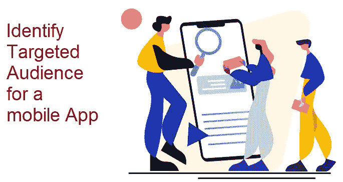

# 确定移动应用目标受众的步骤

> 原文：<https://medium.com/geekculture/steps-to-identify-target-audience-for-a-mobile-app-b471e54897e0?source=collection_archive---------56----------------------->

Identify targeted audience

因此，你是一家初创公司，已经为其业务开发了一个移动应用程序，目标受众是他们为营销目的瞄准的潜在市场。应用开发者和[移动应用开发公司](https://graffersid.com/)关注的最终目标是构建可靠可信的应用。随着各行各业对移动应用需求的快速增长，尤其是电子商务，移动应用已经成为 IT 创新的中心。现在，出现的问题是如何解决营销问题，并在应用商店上线后推广你的应用。因此，下面我们探索和研究如何在最短的时间内确定移动应用目标受众的创新点。

# 识别移动应用目标受众的输入

## 1)定义年龄范围和性别分布比例

当试图确定目标受众时，移动应用用户的年龄范围是一个重要的抽样因素。其背后的原因是，用户的兴趣和爱好随着年龄差距或年龄段的不同而不断变化。从适应性或应用程序或可用性差异到对应用程序的全面理解。年龄范围大概必须保持在一代人之内，以定义他们的好恶。今天，我们听到 X，Y，Z 一代和许多其他陈词滥调来定义一个特定的出生时期。另一个参数是，尽管男女平等，但他们实际上非常不同。这意味着女人非常重视的事情，男人可能会觉得很平淡，不是因为轻视，而是遗传。因此，不同的应用程序对两种性别都有不同的吸引力。根据研究，两种性别(男性和女性)的购物特征也不同。大多数男人通常会在需要的时候购买产品和服务，因为他们会在待办事项清单上打勾。另一方面，女性会按照自己的意愿购物，浏览、了解更多不同的产品。在试图确定目标受众时，保持这些购物特征至关重要。

## 2)确定具体位置和语言细节

物理位置是一个目标特定的因素，因为一般来说，每个地方都有其动态，如历史、文化、时间、规则、要求等。移动应用程序不可能是通用的，因为访问和使用可能是未知的或通用计算的。取决于地点、地区、国家、州、县或城市等。，app 适配变化。此外，根据应用程序的用途，全球使用不同的通信模式和语言。语言通常重新适应理性思维。因此，随着移动应用重新适应当地现实，了解文化差异至关重要。

# 教育和职业人口统计的水平如何？

教育是一个跨越几个层次的广义术语。抽样调查的平民实习生与受过小学、高中、大学或继续教育的人的比率。了解潜在受众的教育水平在很多方面都有帮助。例如，当创建广告、促销或营销策略时，你可以在文化水平高的时候采用。这对于理解应用程序应该如何最终成形或形成本地化以适应当地现实也是至关重要的。它还塑造了应用程序内部的沟通方式和整个营销策略。根据年龄统计数据，年轻观众喜欢简单的谈话方式，而成熟一代喜欢正式的称呼。职业决定支出和购买力。如果你的移动应用向目标受众提供付费或应用内购买，那么用户的购买力就至关重要。职业揭示了职责的性质，无论是全职还是兼职职业。

# 他们的婚姻、家庭和爱好状况如何？

一个人或几个人的婚姻状况或家庭背景直接影响决策。不管是单身、已婚、离婚还是丧偶。无论是长期决策还是短期决策，婚姻和家庭状况都会对决策产生影响。这是因为单身的人关注自我或个人，已婚的人包括伴侣和孩子。这些差异反映了单身或已婚人士更喜欢的应用程序的性质。家庭揭示了责任模式，无论是单一的还是包含其他成员的。爱好或兴趣也具有启示性，因为它们指出了性格特征和个人角色。潜在用户是喜欢去健身房还是喜欢旅游，是踢足球还是打板球？兴趣给用户增加了更多的人性，因为他们很容易被联系起来。这些细节至关重要，尤其是对潜在移动应用用户更容易的社交媒体描述。

# 使用了什么类型的设备和技术？

主要使用的设备和技术也提供了可能揭示目标受众的洞察力。特别是对于 IT 部门来说，了解不同类型的技术很有好处。很明显，iPhone 或 Android 有不同的应用平台，这取决于从 iWatch、平板电脑或智能手机使用的设备的性质。移动应用程序可以很容易地告诉目标受众使用内置设备识别软件的手机。这些见解有助于移动应用目标受众的初步识别和定义。

# 性格和性格的整体性质是怎样的？

心理学和个性有助于了解潜在的移动应用程序用户以及如何使用。这是因为各种各样的社会标签及其伴随而来的诡计，从经济地位，外向或内向，敏感或不敏感，智力或情感倾向。这些都是人类不同的性格特征。个性告诉我们如何应对各种情况或环境，如现实生活或数字领域。对目标受众来说至关重要的事情，如赚钱或环保活动、家庭价值观或企业家精神等。

# 有哪些共同的行为、特质和习惯？

可以有把握地说，目标受众(集体或个人)的常见行为都充满了丰富的洞察。这些因个人组织或整洁程度的不同而不同。目标受众的行为让你的[专门的开发者](https://graffersid.com/benefits-of-hiring-dedicated-developers/)调整吸引用户的应用设计和功能。

# 摘要

本质上，确定潜在的移动应用目标受众就是建立一个有凝聚力的、可靠的潜在用户数据库。随着当今移动应用程序开发中新兴技术的出现，提出这些问题并为正确的目标受众找到答案变得可能和更容易。**作者简介:** Sidharth Jain，印度网站和移动应用开发公司 GraffersID 的创始人，致力于帮助有潜力的初创公司。提供专门的远程开发人员，[在印度雇佣专门的 React JS 开发人员](https://graffersid.com/hire-dedicated-react-js-developers/)，受到 YC |哈佛|谷歌|可口可乐的初创公司的信任。80%的客户在一周内筹集了资金并扩大了他们的团队。他知道如何利用技术解决问题，并将其知识贡献给领先的博客网站。

*原载于*[*https://dailygram.com*](https://dailygram.com/index.php/blog/920693/steps-to-identify-target-audience-for-a-mobile-app/)*。*