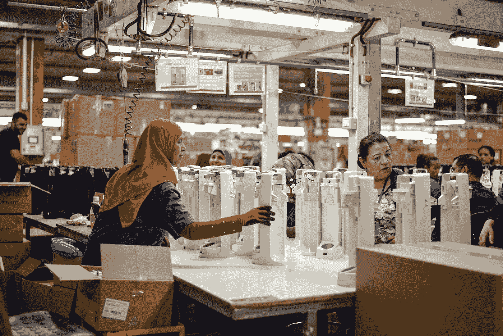

# 停止将大规模生产应用于产品开发

> 原文：<https://medium.com/geekculture/stop-applying-mass-production-to-product-development-e637166b6bbd?source=collection_archive---------3----------------------->

aiPhoto by [Remy Gieling](https://unsplash.com/@gieling?utm_source=medium&utm_medium=referral) on [Unsplash](https://unsplash.com?utm_source=medium&utm_medium=referral)

## 制造商也进行产品开发，但不是在生产线上！

早在 2000 年中期，我就开始在美国和欧洲培训敏捷软件开发过程中的软件团队。

当时，一个名为“精益软件开发”的新运动开始浮出水面，由一些非常受人尊敬的前工程师 **Poppendiecks** 带头，我被他们的工作吸引住了。这让我花了几年时间深入了解丰田、大野泰一、丰田生产方式、精益制造、通用汽车和福特向丰田方式的转变、吉姆·沃马克(Jim Womack)、金巴·沃克斯(Gemba Walks)，然后让我接触了系统思维、拉塞尔·阿科夫(Russell Ackoff)、彼得·圣吉(Peter Senge)、埃利耶胡·戈德拉特(Eliyahu Goldratt)和约束理论、爱德华·戴明(Edward Deming)的惊人故事，以及所有这些东西。它甚至把我带到了缇尔组织，并触及到我们行业中真正的*功能障碍的核心——组织和他们由谁管理，以及他们是如何被管理的。*

*这是一个了不起的工作和科学见解的主体，很久以前由一群了不起的人弄清楚了，我很遗憾，如果有更多的人更多地关注这些教导，考虑到自那时以来我们周围的软件世界没有发生任何重大变化的事实。*

*这些工作给了我一个坚实的基础，让我在技术领域做得更好，这主要集中在建立高性能的产品团队和产品组织上。*

**

*Photo by [Ryan Stone](https://unsplash.com/@rstone_design?utm_source=medium&utm_medium=referral) on [Unsplash](https://unsplash.com?utm_source=medium&utm_medium=referral)*

*然后在 2011 年，Eric Reis(来自硅谷)通过推广“精益创业”给精益打上了自己的印记，许多其他的追随者也加入了这一行列，一个工业综合体爆炸了。*

*他的信息本质上是善意的，但这种意图再次被扭曲，以认可“构建”(以及“交付”)是产品开发的唯一重要部分。对许多软件公司来说是坏消息，对他们的客户来说也是坏消息。*

*即使精益创业谈论“测量”和“学习”(尽管不那么多)，这些关键活动在大多数公司中并没有得到太多的关注。*

> *记住:产品开发公司的工作与企业开发公司的工作有很大不同。是的，两者都应用软件，但不是同一种工作，不是以同样的方式，也不是出于同样的原因。*

*现在是 2022 年，大多数“做”软件的公司仍然由相信“构建”和“尽可能快地构建”尽可能多的功能是构建伟大产品的唯一重要步骤，“测量”和“学习”步骤是次要和可选的。这是为什么呢？*

*我的看法？:(1)这种实验和学习工作实际上比更直接的技术交付工作更难，(2)它挑战您的宝贵和受保护的确认偏见，(3)它花费宝贵的时间和金钱，并且与花费在更有价值的构建工作上的时间相竞争，以及(4)这些反馈循环中的所有*负面结果和由此产生的重新设计工作*与大多数财务、销售和营销导向的人如何看待进展相竞争——以拥有越来越多的功能来衡量！*

*“精益”和跟随精益创业公司的步伐听起来很酷(早在 2011 年)，做 M.V.P(“原型”的别称)和诸如此类的事情只是加强了现有的想法，即(仅)开发人员的“[功能团队](https://www.svpg.com/product-vs-feature-teams/)应该只是匆忙“构建”新功能，并将其创造成果投入市场。没有产品战略，没有衡量客户行为，没有 CX/UX 研究的投入和验证工作在那些团队中进行，只是写代码，并且尽可能快地做。*

*更糟糕的是，这些故意构建的“特性团队”将会被更“聪明”的人(在组织中处于权威地位)驱动，他们代表那些软件团队做所有的“学习”(和“测量”)——就像那是有效和高效的一样——没有人说！*

*“产品所有者”的角色(借用自 Scrum)完美地结合了代理/傀儡角色，提供了对团队及其产出的控制，并作为引导他们的“超级聪明”的利益相关者影响的手段，这些利益相关者只是将无效的产品想法带入团队，远离他们和产品的实际最终用户。*

> *当你的利益相关者已经有了所有的答案时，你为什么还需要倾听和衡量你的实际客户行为呢？*

*对于许多组织来说，这种创业趋势的新变体是一种新的方式，你可以像硅谷一样声称自己是“精益的”，像成功的大型创业公司一样建设、衡量、学习，做出令人印象深刻的 MVP，让客户蜂拥而至给你钱，同时仍然能够指挥和控制那些讨厌的开发人员执行那些天才商业利益相关者的命令。*

> *如果你建造，他们会来…*

*当所有这一切开始在世界范围内发生时，并没有花很长时间来掌握，我决定在我的软件技术工作中不再使用精益(和敏捷)这个词。尽管如此，我真的很高兴看到敏捷教练和组织专家进入市场——这本来是很好的，但事实是，许多人在这个行业中缺乏经验，许多人没有足够的经验来指导或给苦苦挣扎的产品团队提供建议。*

*在整个 2010 年，在大多数地方(从企业到产品公司),伤害已经发生或正在发生，那些继续造成伤害的人(现在自我认证的敏捷教练和产品负责人)不知道为什么它是有害的。他们仍然没有赶上。*

*如今，大约 15-20 年后，似乎每周都会有一两个人发现这些更深入的精益和系统思考工作，这在我们行业的各个角落传播了好消息，这是一个好消息。*

*但是，有天赋、热情、有创造力的产品设计师/经理/工程师仍然困惑于为什么他们工作的酷公司不允许他们恰当地应用他们的技术。*

*尽管精益有很多优点，但在软件人员遵循的许多精益信息中，以及在自封的精益专家向软件人员推广的信息中，有一个巨大的缺陷。*

*一个对许多人来说不那么明显的缺陷，它导致了全世界软件团队糟糕的管理和待遇。*

**

*Photo by [Gemma Evans](https://unsplash.com/@stayandroam?utm_source=medium&utm_medium=referral) on [Unsplash](https://unsplash.com?utm_source=medium&utm_medium=referral)*

*T 在生产线上大规模生产实物产品的过程(**产品生产**)以及设计和开发这些产品的过程(**产品开发**)在许多有用的方面显然**不**可比！*

> *产品生产不同于产品开发*
> 
> *在制造业和软件业都没有。*

*我们真的需要停止分配例子、隐喻和推论来匹配或关联这两种截然不同的活动。这种夸张的说法很天真，误导了所有人，让他们认为制造/建造科技产品的行为就像是在生产线上制造产品的行为。*

> *产品开发不是在生产线上完成的！*

# *那么什么是产品生产呢？*

**

*Photo by [Lenny Kuhne](https://unsplash.com/@lennykuhne?utm_source=medium&utm_medium=referral) on [Unsplash](https://unsplash.com?utm_source=medium&utm_medium=referral)*

## *制造业中的产品生产*

*制造生产线是指**将预先定义的产品从其组成部分(原材料或更小的零件)大规模生产**到一个或多个分销单位。*

*这些种类的物理产品是由其他部件“组装”而成的。这些零件中的一些是由原材料“制造”的(即切割、加工或喷涂)，一些零件是预组装的。然后，所有这些部件通过各种固定装置(即焊接、螺纹连接、胶合)连接在一起，这样产品就作为一个生产“单元”被“制造”出来。一个产品。*

*完成的产品单元已经非常仔细地预先设计了它们的组成部分，以便它们在按照预先确定的步骤顺序组装时能够装配在一起(也称为生产计划)。这个生产计划然后被编码到机器和人类的流程中，每次都以同样的方式严格执行(没有不确定性，没有创造性，没有闪光)。进行这种“组装”的机器和人类被预先编程/训练，以“正确的方式”来“创建”产品单元——最有效的方式，也是唯一的方式。产品单元按一系列步骤大量生产(或多或少)，然后包装在一起，分发给购买者和消费者。*

*如果你在生活中建造过任何实物，比如说:工艺品或爱好，或者做了一顿饭或组装了宜家家具，并且在同一批作品中使用了不止一个复制品，你就会确切地知道这种生产的感觉。*

> *照着菜谱做就行了！——《美食总动员》*

## *软件产品生产*

**

*Photo by [Arnold Francisca](https://unsplash.com/@clark_fransa?utm_source=medium&utm_medium=referral) on [Unsplash](https://unsplash.com?utm_source=medium&utm_medium=referral)*

> *请注意:在软件中，我们有这个术语“产品(名词)”，它经常被用来描述我们的软件被部署和执行的环境(其他术语包括:“登台”和“现场”等)。).不要把这个术语的使用与产品生产活动相混淆。*

*现在，作为比较，让我们用一个典型的 SaaS 软件产品来描述软件产品的生产和销售。*

*“制造”它们也称为“构建”它们看起来像是:编译它们的代码库并在其上运行测试(用一台中央机器— CI 服务器)，然后将编译后的二进制文件与一些配置文件合并(用一台中央机器—CI 服务器)打包成一个可部署的包。*

*“分发”看起来像是:将这个包复制(通过互联网)到云中一组集中的机器上，然后重启这些机器来使用这个包。*

*这就是 T2 软件产品生产公司 T3 的本质。它生产一次，销售一次，所有这些都是由预先编程的机器完成的。*

> *顺便说一句，通过网络把生产出来的产品单位交付给数百万人消费需要几秒钟甚至几分钟！*

*软件中没有人*实际上*使用这个术语:**产品生产**！*

# *那么什么是产品开发呢？*

*好的，如果这就是我们所说的**产品生产**，那么什么是**产品开发**？*

## *制造业的产品开发*

*让我们以生产汽车产品的丰田公司为例。他们是大多数精益和敏捷狂热者认为他们理解的经典生产线公司，而且“精益”也起源于很久以前的丰田。*

*在他们的工厂组装的任何特定汽车，实际上都可能有买家在订购汽车时做出的一些独特选择，比如:它的颜色和一些豪华的附加部件，如发动机尺寸、车顶行李架、踏脚板、真皮方向盘和电动车窗，以及所有这些东西。所有产品“差异”将由生产线上的人工和机器组装到这个客户的特定汽车中。*

*但要明白的是，那些组装特定汽车的人和机器人没有做任何研究或测试，或验证，也没有做任何产品单元的实际设计！在这一组装过程中，没有任何设计或工程工作可言——这都是生产工作。这个过程是按部就班的。它是无限可预测的、可测量的，并且在时间和金钱上受到严格控制。这一切都是预先编程的，这条生产线上生产的每辆汽车都以同样的方式重复这一过程。这是**产品生产**不是**产品开发**！*

*尽管事实上敏捷过程的“专家”(在软件世界中)认为:设计、测试、验证、构建和测量产品开发的特性看起来就像是工厂生产线上的汽车！是**不是**。远非如此。*

*这就是一辆车的**产品开发**的样子。*

**

*Clay Modeling a new car concept*

*是的，他们正在*徒手用*模型粘土*设计*一辆新车，然后在计算机、风洞和道路模拟器上用 3D CAD 工具进行测试和验证，并在他们邀请的真人身上进行评判，在他们对最终设计满意之前建造和改进原型。*

*你在这里看到的只是这张图片中展示的汽车的化妆品。在此过程之前，数百人和数月的工作已经投入到底盘、传动系统、发动机和其他机械部件的设计和测试中。然后是所有的测试和合规性等等，你在这里看不到，比如碰撞测试，市场研究，以及在赛道上测试它的操控性等等。设计一辆新车是一个庞大而昂贵的过程。完成这个过程需要几个月到几年的时间。远在生产线出现之前。你猜怎么着？这些设计中的一些永远不会进入生产线！永远不会。*

*关键是，这是制造领域的**产品开发**，这里没有**生产线**，这款车还没有**生产**。(可以说底盘在许多车型中重复使用)这款车仍处于设计和测试阶段！*

*当然，测试像汽车这样的东西的严格性与测试软件产品完全不同。在软件方面，我们还不具备大多数软件产品的所有法规遵从性，尽管硬件产品在投入生产之前需要获得大量的安全和环境评级。*

*这种用粘土雕刻一辆汽车并提炼其属性、测试并提炼它的活动更像我们在技术产品开发中所做的:学习->构建->测量你所学到的关于精益的过程。除了 Eric Reis(原谅他的自负)说你应该从构建步骤开始——可爱。*

## *软件产品开发*

*我不想详细解释软件产品是如何经过多次迭代和多次失败的实验来研究、设计、测量和设计的。大多数阅读这篇文章的人应该已经对这个世界有了深入的了解(尽管大多数人并没有经历所有这些重要的活动——很遗憾)。*

*我只是想指出，与制造业一样，软件产品开发不是由机器人和大批人员在生产线上完成的，他们做着专门的精确任务，一遍又一遍地生产同样的东西。远非如此。*

*但尽管如此，过程“专家”(他们已经了解了精益制造)，并认为他们已经理解了它的好处以及它是如何形成的，然后继续尝试将这种心态应用到软件开发中，坚持强迫我们进入那种残酷的优化生产线模型。这是个骗局！*

*我完全赞成消除浪费、减少动作、优化整体以及应用一系列其他精益原则。我只是不想被当作生产线上的机器人，以可预测的最佳顺序执行相同的组装任务。只是因为某个经理认为这里应该这样。*

*在产品开发方面，**根本就没有生产线！没有机器或人能在一条生产线上生产出相同的产品单元代码(并对其进行测试)。没有一套预先编制好的指令去生产什么，或者如何生产，什么时候生产，也没有主生产计划，也没有劳动力在优化的预算下组装零件。这些都不可能存在。***

*设计产品不是可预测的计划任务的线性序列，可以优化以适应预算。克服它的过程“专家”！*

*这是关于创新和实验，是关于聪明的、有创造力的和有创新精神的人长期的改变和适应，他们以非最优的方式一起工作，创造出改变世界的创新事物。*

**

*Photo by [Vaclav](https://unsplash.com/@vendavlog?utm_source=medium&utm_medium=referral) on [Unsplash](https://unsplash.com?utm_source=medium&utm_medium=referral)*

# *停止排队*

*还不信我产品研发和生产线没有可比性？*

*好吧，问问你自己。*

*问 **问题**:当机器人、机器或生产线上的人出现问题，导致生产停止时，他们会在工厂里做什么？*

*答 **答**:他们只是简单地停止其余的生产线，然后冲过去解决问题，不管哪里出了问题。*

*是的，是的，是的，他们实际上可能只关闭了许多并行化进程中的一个，这些进程现在被中断以防止整个工厂停止(无关！)，关键是他们停止工作，发现问题，然后立即解决问题。机器人/机器/人被“固定”，重新启动，过程像以前一样继续。有时如果机器/人坏了，他们会被替换成一个新的正常工作的！*

*他们是如何做到如此高效的呢？因为他们*可以* 修复它，所以对于所有可能发生的问题，通常都有一个已知的修复方法，因为只有“一种方法”被用来在生产线上组装汽车的一部分——最有效的方法**。***

***它坏了->你停下->你修好它->你继续。***

***这就是制造商工厂的运作方式。这就是精益生产。***

******

***Photo by [Joshua Aragon](https://unsplash.com/@goshua13?utm_source=medium&utm_medium=referral) on [Unsplash](https://unsplash.com?utm_source=medium&utm_medium=referral)***

***现在，让我们将它与软件开发的“构建”步骤进行比较，不要介意“测量”和“学习”步骤，当这些也在混合中时，我们将省略那些血淋淋的细节。***

***问 **问题**:当软件开发中遇到问题，当这些问题阻止了编写软件的过程时，会发生什么？***

> ***例如:开发人员无法解决设计编码中的复杂问题？也许他们不知道如何解决这个问题(缺乏知识/经验)，或者对技术不够了解(缺乏技能)，或者找不到阻止他们解决特定问题的缺陷(缺乏理解)？***

***答 **答**:他们只是继续他们的工作，通过“**绕过”**问题“**选择”**另一个解决方案**。*****

***是的，你听到了，他们解决了！他们应该这样做。***

***他们当然不想停下手中的工作，坐以待毙。他们找到了另一条路！有时他们会向团队成员寻求帮助(同行评审)，有时他们会自己改变策略。有时他们会研究新的方法。***

***这种创造力、独创性和适应性是我们付钱给他们的原因，也是我们雇用聪明能干的人的原因。***

***他们如何解决面临的问题？***

***因为在软件中，总有**“不止一种方式”**在软件中实现任何解决方案。他们的“下一步”可能不是目前最理想的方式(或者也可能是同样理想的)，但这不会阻止他们努力完成工作。他们只是找到“另一种方法”来解决问题。***

***你不能在制造生产线上这样做。没有一条制造生产线能做到这一点，生产效率太低了。所以，在软件开发中，我们不要停线，既然有**就没有线可以停**，既然没有“一条路”可以走，就有很多条路。***

***正如 Mik Kersten 在他的书[项目到产品](https://projecttoproduct.org/)中巧妙地说明的那样，在软件开发中，我们的行为不像工人/机器/机器人在线性生产线上的行为，我们的行为更像我们生活在一个互连和相关解决方案的网络中。***

***比如:遍布全国的机场网络。***

******

***ASKY Route Network***

***如果我们从一个地方飞往另一个地方，而我们想要降落的机场因为天气恶劣而关闭，我们只需绕过那个机场(变通办法),通过附近的另一个机场继续我们的旅程。***

***只有当你手头有多种选择时，你才能这样做。有时，您甚至可以在需要时创建替代选项！***

> ***(任何类型的)产品开发都不是计划活动的线性序列，它是可能性图上的一系列活动，有些是计划的，有些是未计划的。***

***这意味着软件**中的产品开发不是也永远不会是预定义任务**的线性序列，这些任务可预测地串在一起以创建产品的任何部分。所以，它永远不可能是生产线。***

***算了吧！***

***你在欺骗自己，你在伤害那些参与和执行这种创造性过程的人。***

******

***Photo by [Museums Victoria](https://unsplash.com/@museumsvictoria?utm_source=medium&utm_medium=referral) on [Unsplash](https://unsplash.com?utm_source=medium&utm_medium=referral)***

# ***哪里出了问题？***

***如今，很多人在职业生涯后期才涉足软件行业，尤其是中高级管理人员和非技术型初创公司创始人。他们还没有学习和理解设计、制造和提炼软件产品所需的基本非线性过程。敏捷过程“专家”(他们中的许多人一生中从未写过一行代码)在寻求组织范围内的“敏捷”同质性时也经常受到指责，在这种同质性中，每个人都必须以同样的方式，他们的方式来实现敏捷！***

***如果没有检查，这些人继续定义、管理和优化这些过程，就好像他们正在执行一条顺序的、线性的生产线，生产出必须在预算内按时交付的功能和修复。***

***为什么？***

***我猜？他们关于如何看待商业世界中任何事物的生产的潜在心理模型源于过去的例子:***

> ***工业革命->大规模生产->运行优化的业务->安排专家按计划完成工作***

***他们也是这样认为**产品开发**工作的，因为他们在商业世界中所看到的都是**产品生产**的例子，这就是在那里工作的方式。因此，可以理解的是，这是他们见过的在商业世界中捏造任何事情的唯一的**心智模型。*****

***因此，当谈到商业时，对他们来说，制造产品的过程的最佳心理模型是:制造汽车零件，而不是从头开始设计汽车的过程。***

***也许如果他们有过用自己的双手在世界上制造东西的第一手经验(为另一个人从头开始设计和制作)，他们可能会更好地理解这个复杂的发现和设计过程。他们可能会及时意识到这一点，但要等到向他们详细解释并演示之后。***

***更有可能的是，这些人中的大多数在他们的职业生涯中没有制作过任何实质性的东西，也没有人告诉他们，做产品开发更像是木工或金匠的手艺。或者更像是用粘土模型设计和雕刻汽车，而不是用机器人将零件组装成现成的汽车。所以，他们从来没有考虑过。也许，他们今天看到满屋子的程序员坐在工作站上，认为这看起来像现代的软件工厂生产线？谁知道呢。***

***而且，当处于财务或市场压力下时，尝试和思考如何简化这些复杂的创作过程并将其编辑和简化为任何人都应该能够执行的可预测的简化线性过程是如此诱人——就像他们在 20 世纪的大规模生产血汗工厂中所做的那样。***

***这并不是设计和制造优秀软件产品的方式。乡亲们！不，一点也不。***