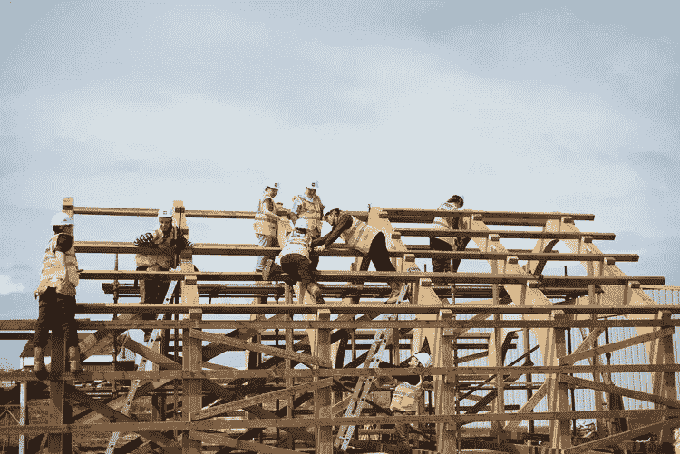

# 探索性数据分析中最短最强大的一行代码在 R

> 原文：<https://medium.com/geekculture/str-a-simple-yet-powerful-tool-for-exploratory-data-analysis-in-r-ce995e5e2a5d?source=collection_archive---------18----------------------->



编码只不过是对关键词进行重新排列，以形成机器可以理解的连贯陈述，没有这种理解，我们就无法指导机器为我们进行分析，或者输出我们想要呈现的结果。很多时候，新手会被他们遇到的太多函数弄得不知所措，一个函数调用内部的许多函数，有些甚至调用外部的函数。新手如何能容易地剖析这些函数，函数与什么变量一起工作，人们甚至使用函数做什么？今天我想谈谈 r 中一个简单而强大的函数，即`str()`函数。

先说 str()，这个函数背后的思想是以紧凑的形式返回对象的内部结构，因此得名，`str(ucture)`函数。这是一个简单的诊断工具，非常通用，可以处理任何函数和对象。一旦被调用，它旨在返回一个紧凑的输出，详细说明我们用它调用的对象或函数中包含的内容，即使它嵌套了几层。

让我们来看看它到底做了什么，为了简单起见，如果您正在练习，让我们使用 R 中已经可用的数据集。我选择的数据集是`infert`数据集，因为我以前从未探索过这个数据集。所以…

```
head(infert, 5)##   education age parity induced case spontaneous stratum pooled.stratum
## 1    0-5yrs  26      6       1    1           2       1              3
## 2    0-5yrs  42      1       1    1           0       2              1
## 3    0-5yrs  39      6       2    1           0       3              4
## 4    0-5yrs  34      4       2    1           0       4              2
## 5   6-11yrs  35      3       1    1           1       5             32
```

`infert`是一个关于自然流产和人工流产后不孕的数据集，所以如果我们想要数据的快照，我们可以检查结构…

```
str(infert)## 'data.frame':    248 obs. of  8 variables:
##  $ education     : Factor w/ 3 levels "0-5yrs","6-11yrs",..: 1 1 1 1 2 2 2 2 2 2 ...
##  $ age           : num  26 42 39 34 35 36 23 32 21 28 ...
##  $ parity        : num  6 1 6 4 3 4 1 2 1 2 ...
##  $ induced       : num  1 1 2 2 1 2 0 0 0 0 ...
##  $ case          : num  1 1 1 1 1 1 1 1 1 1 ...
##  $ spontaneous   : num  2 0 0 0 1 1 0 0 1 0 ...
##  $ stratum       : int  1 2 3 4 5 6 7 8 9 10 ...
##  $ pooled.stratum: num  3 1 4 2 32 36 6 22 5 19 ...
```

…现在我们知道数据集有 248 个观察值和 8 个变量，我们还可以看到变量名、数据的第一行和带有`str()`的数据类型。持有更多细节的数据类型，教育是一个*因素*得到阐述，我们看到它有 3 个层次，第一个层次也被列出。这让我们快速了解数据的样子。

**结构也可以作用于函数**为了展示函数所作用的参数的快照，让我们在一个函数上试试

```
str(ls)## function (name, pos = -1L, envir = as.environment(pos), all.names = FALSE, pattern, sorted = TRUE)
```

我们可以看到`ls`是一个函数，并且大部分参数已经显示出来，阅读函数文档是很好的，但是如果我们更频繁地使用`str`就可以避免阅读大部分文档。

**让我们在一个嵌套数据集**上试试，一个数据帧的数据帧。我们将在这里使用 EuStockMarkets..

```
str(EuStockMarkets)##  Time-Series [1:1860, 1:4] from 1991 to 1999: 1629 1614 1607 1621 1618 ...
##  - attr(*, "dimnames")=List of 2
##   ..$ : NULL
##   ..$ : chr [1:4] "DAX" "SMI" "CAC" "FTSE"
```

检查结构后，我们看到它是一个时间序列数据集，因此它不是一个很好的数据集来说明我将要向您展示的内容。所以让我们回到我们的第一个数据，因为数据在拆分后仍然有意义。

```
Infertile <- split(infert, infert$education)
```

我们已经将我们的数据帧分割成 3 个数据帧，所有数据帧都打包到一个名为*inflate*的数据帧中，让我们从不同的角度来看这些数据帧。

```
lapply(Infertile, head)## $`0-5yrs`
##    education age parity induced case spontaneous stratum pooled.stratum
## 1     0-5yrs  26      6       1    1           2       1              3
## 2     0-5yrs  42      1       1    1           0       2              1
## 3     0-5yrs  39      6       2    1           0       3              4
## 4     0-5yrs  34      4       2    1           0       4              2
## 84    0-5yrs  26      6       2    0           0       1              3
## 85    0-5yrs  42      1       0    0           0       2              1
## 
## $`6-11yrs`
##    education age parity induced case spontaneous stratum pooled.stratum
## 5    6-11yrs  35      3       1    1           1       5             32
## 6    6-11yrs  36      4       2    1           1       6             36
## 7    6-11yrs  23      1       0    1           0       7              6
## 8    6-11yrs  32      2       0    1           0       8             22
## 9    6-11yrs  21      1       0    1           1       9              5
## 10   6-11yrs  28      2       0    1           0      10             19
## 
## $`12+ yrs`
##    education age parity induced case spontaneous stratum pooled.stratum
## 45   12+ yrs  30      1       0    1           0      45             44
## 46   12+ yrs  37      1       1    1           0      46             48
## 47   12+ yrs  28      2       0    1           2      47             51
## 48   12+ yrs  27      4       2    1           0      48             61
## 49   12+ yrs  26      2       2    1           0      49             49
## 50   12+ yrs  38      3       0    1           2      50             60
```

然后让我们继续检查`Infertile`结构

```
str(Infertile)## List of 3
##  $ 0-5yrs :'data.frame': 12 obs. of  8 variables:
##   ..$ education     : Factor w/ 3 levels "0-5yrs","6-11yrs",..: 1 1 1 1 1 1 1 1 1 1 ...
##   ..$ age           : num [1:12] 26 42 39 34 26 42 39 34 26 42 ...
##   ..$ parity        : num [1:12] 6 1 6 4 6 1 6 4 6 1 ...
##   ..$ induced       : num [1:12] 1 1 2 2 2 0 2 0 2 0 ...
##   ..$ case          : num [1:12] 1 1 1 1 0 0 0 0 0 0 ...
##   ..$ spontaneous   : num [1:12] 2 0 0 0 0 0 0 1 0 0 ...
##   ..$ stratum       : int [1:12] 1 2 3 4 1 2 3 4 1 2 ...
##   ..$ pooled.stratum: num [1:12] 3 1 4 2 3 1 4 2 3 1 ...
##  $ 6-11yrs:'data.frame': 120 obs. of  8 variables:
##   ..$ education     : Factor w/ 3 levels "0-5yrs","6-11yrs",..: 2 2 2 2 2 2 2 2 2 2 ...
##   ..$ age           : num [1:120] 35 36 23 32 21 28 29 37 31 29 ...
##   ..$ parity        : num [1:120] 3 4 1 2 1 2 2 4 1 3 ...
##   ..$ induced       : num [1:120] 1 2 0 0 0 0 1 2 1 2 ...
##   ..$ case          : num [1:120] 1 1 1 1 1 1 1 1 1 1 ...
##   ..$ spontaneous   : num [1:120] 1 1 0 0 1 0 0 1 0 0 ...
##   ..$ stratum       : int [1:120] 5 6 7 8 9 10 11 12 13 14 ...
##   ..$ pooled.stratum: num [1:120] 32 36 6 22 5 19 20 37 9 29 ...
##  $ 12+ yrs:'data.frame': 116 obs. of  8 variables:
##   ..$ education     : Factor w/ 3 levels "0-5yrs","6-11yrs",..: 3 3 3 3 3 3 3 3 3 3 ...
##   ..$ age           : num [1:116] 30 37 28 27 26 38 24 36 27 28 ...
##   ..$ parity        : num [1:116] 1 1 2 4 2 3 3 5 3 1 ...
##   ..$ induced       : num [1:116] 0 1 0 2 2 0 1 1 1 0 ...
##   ..$ case          : num [1:116] 1 1 1 1 1 1 1 1 1 1 ...
##   ..$ spontaneous   : num [1:116] 0 0 2 0 0 2 2 2 1 1 ...
##   ..$ stratum       : int [1:116] 45 46 47 48 49 50 51 52 53 54 ...
##   ..$ pooled.stratum: num [1:116] 44 48 51 61 49 60 56 62 57 42 ...
```

这列出了数据帧，然后详细说明了每个数据帧中包含的对象的结构，通常称为元素。从这些元素的第一行我们可以看到，*0–5 岁的*有 12 个观测值，*6–11 岁的*有 120 个观测值， *12+岁的*有 116 个观测值。你想怎么处理这条信息就怎么处理。

我们现在可以看到`str()`的威力，它提供了一个尽可能简洁的数据视图，因此您可以快速了解 EDA 中缺少什么以及您需要采取的下一步措施。所以任何时候你有一个 R 对象，而你不知道里面是什么，我恳求你扔一个`str()`给它。