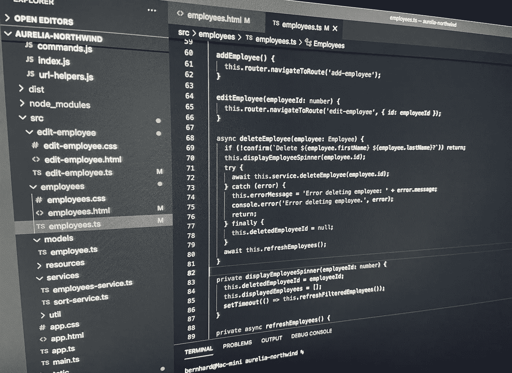

# JavaScript 中的字符串:我应该使用双引号还是单引号？

> 原文：<https://medium.com/geekculture/string-literals-in-javascript-should-i-use-double-quotes-or-single-quotes-3639342480f9?source=collection_archive---------9----------------------->



大多数 JavaScript(或 TypeScript)开发人员都知道，这种语言允许使用双引号(")或单引号(')来表示字符串文字。考虑到两种表示字符串的方式在语义上是等价的，这就引出了一个问题，哪一种是“正确的”方式。

一般来说，当谈到编码风格时，建议遵循您正在处理的特定语言的约定(例如，在 JavaScript 中使用 camelCase 作为方法，但在 C#中使用 PascalCase)。

不幸的是，对于 JavaScript 来说，似乎没有字符串引号的官方约定。因此，在决定引用的最佳风格时，我们可以做的第二件事就是尝试找出哪种约定更常见。

在 GitHub 上查看一些流行的 JavaScript 项目，我注意到 [react](https://github.com/facebook/react) 、 [moment](https://github.com/moment/moment) 和 [express](https://github.com/expressjs/express) 都对字符串使用单引号。然而，另一个流行的项目， [tslib](https://github.com/microsoft/tslib) ，使用了双引号🙄。因此，虽然单引号似乎更常见，但这一指标并不完全是决定性的。

说服我个人的决定性因素适用于使用 JavaScript 框架的 web 开发，该框架使用 HTML 模板，如 Angular 或 Vue.js。以下面的例子为例:

(由于 HTML 碰巧也允许用双引号或单引号来分隔属性值，这又把我们带回了同样的争论。然而，在 HTML 属性的情况下，我将始终坚持使用双引号，因为对属性值使用单引号是非常罕见的，而且坦率地说似乎是错误的)。

因此，假设我们对 HTML 属性使用双引号，那么我们在 JavaScript 表达式中使用双引号的唯一方式应该是这样的:

很明显这是不可能的。因此，我们基本上被迫对 JavaScript 表达式中的任何字符串文字使用单引号。

当谈到编码约定时，一致地应用约定比使用“最佳”约定更重要。如果我们要在 HTML 的 JavaScript 中使用单引号，为了保持一致性，我们必须在其他地方也使用单引号。出于这个原因，我个人对 JavaScript 文字的最终选择是使用单引号。

# 编码风格工具

现在，不管您决定在 JavaScript 中使用单引号还是双引号，更重要的问题是在整个代码库中一致地应用您的约定。ESLint 是一个工具，它将对执行一致的编码风格有很大的帮助。您向它提供一个配置文件，指定描述您的编码约定的规则列表，它将指出您的代码不符合指定规则的地方。请参阅以下链接开始使用:

*   [ESLint 入门指南](https://eslint.org/docs/user-guide/getting-started)
*   [TypeScript ESLint](https://github.com/typescript-eslint/typescript-eslint) :为 ESLint 增加 TypeScript 支持的工具
*   [ESLint 集成](https://eslint.org/docs/user-guide/integrations):定位插件，为您喜爱的 IDE 添加 ESLint 支持

将规则`quotes: ['error', 'single']`添加到您的 *.eslintrc.js* 中，使 ESLint 强制使用单引号。

如果您的代码中碰巧有很多违反风格的地方，要知道一些违反规则的地方可以被 ESLint 自动修复(包括使用错误类型的引号的字符串文字)。只需运行包含 *- fix* 选项的 *eslint* 命令，如下所示(根据您的代码是 JavaScript 还是 TypeScript 来调整 *- ext* 选项):

```
eslint -c .eslintrc.js --fix --ext .js ./
```

我也强烈推荐[更漂亮的](https://prettier.io/)来保持一致的编码风格和修复现有的源代码。

正如我所提到的，在 JavaScript / TypeScript 代码中使用哪种引用样式并不重要，重要的是要坚持并始终如一地应用这条规则。不要低估编码约定的一致性应用，因为它可以显著减少阅读代码时的认知开销。使用 ESLint 和 appearlier 等工具有助于确保编码风格保持一致，即使有许多开发人员为代码库做出贡献。