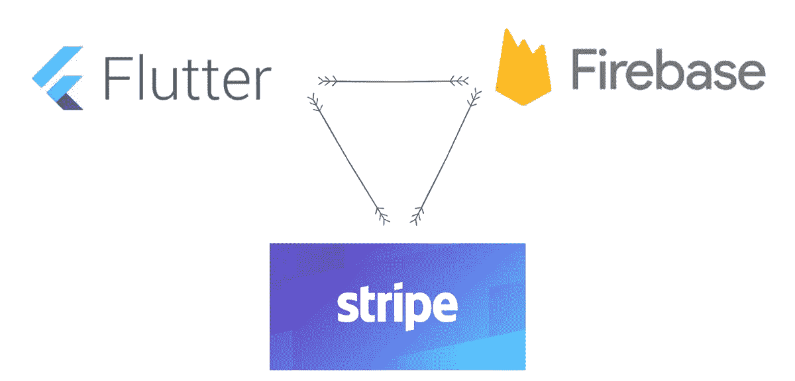

# 带颤振和火焰基云功能的条纹集成

> 原文：<https://medium.com/geekculture/stripe-integration-with-flutter-and-firebase-cloud-functions-1caac8d70166?source=collection_archive---------11----------------------->



在我最近的一个 Flutter 项目中，我被要求为支付集成 Stripe SDK，我在后端使用 Firebase。对我来说，这是一个相当具有挑战性的任务，因为没有太多的在线资源可以为这样的框架清晰地设置云功能。因此，我想写下并分享我在这方面的经验。

在我们继续深入这个话题之前，你应该已经掌握了一些关于颤振和火焰基的知识。

所以，我们开始吧，好吗？😊

让我们从创建一个样本 Flutter 项目开始。您可以将其命名为 **StripeFlutterProject** 并设置您的 main.dart 文件。

您需要将这两个包添加到您的 ***pubspec.yml*** 文件中:

> 条纹 _ 支付:^1.0.6
> 
> 云 _ 功能:^0.7.2

在此之前，您必须创建一个 Stripe SDK 和 Firebase 帐户。我不打算详细说明，但是这里有一些链接，你可以通过它们来创建你的账户。

 [## 互联网企业的在线支付处理— Stripe

### 互联网业务的在线支付处理。Stripe 是一套支付 API，支持在线商务…

stripe.com](https://stripe.com/en-sg) 

```
[https://firebase.google.com/docs/projects/learn-more#setting_up_a_firebase_project_and_registering_apps](https://firebase.google.com/docs/projects/learn-more#setting_up_a_firebase_project_and_registering_apps)
```

首先，你需要在控制台建立一个 Firebase 项目和数据库。然后，您可以添加更多的包(下面提供的版本是我在我的项目中使用的版本。或者，您可以将最新的稳定包添加到您的 Flutter 项目中，用于下面列出的 Firebase 配置；

> 燃烧基地核心:^0.5.3
> 
> 火情 _ 消息:^6.0.16
> 
> 数据库:^4.4.0

下一步是从 Firebase 控制台下载***Google service-info . plist***文件，并添加到 Android 和 iOS 文件夹中。

现在，对于后端(云函数)，您将必须创建一个节点项目，我们在其中编写所有的条带函数。将您的条形密钥和功能存储在后端更加安全，它允许您执行所有与支付相关的繁重任务。

我正在添加基本的支付云功能。我一个一个解释。要设置云函数，请创建一个 node.is 项目。或者，你也可以在谷歌云控制台中添加云功能。我将创建一个单独的云函数项目，让我们命名为*条纹云函数*。

在此之前，请安装 Firebase 工具，并使用命令行登录到您的 Firebase 帐户。

> NPM install-g fire base-工具

您可以通过以下链接设置您的云功能项目:

[](https://firebase.google.com/docs/functions/get-started) [## 开始:编写、测试和部署您的第一个功能| Firebase

### 编辑描述

firebase.google.com](https://firebase.google.com/docs/functions/get-started) 

您可以在 index.ts 中添加以下函数:

您需要在 firebase 控制台上部署这些云功能。下一步是从你的 flutter 应用程序中调用这个云函数，让我们在你的 flutter 应用程序中添加代码，通过 http 从你的应用程序中触发上述云函数。

**注意**:在你的 *pubspec.yaml* 文件中添加云函数包；

```
cloud_functions: ^0.9.0
```

不要忘记运行 ***flutter pub get*** 一旦你在项目中添加了新的包，现在在你的 flutter 项目中创建一个***firebase service . dart***文件，这个 dart 文件应该基本上可以处理你的 firebase 调用和引用。你可以用下面的意图添加你的云函数引用，这里要注意的一点是你需要在你的可调用实例中传递云函数名。

```
//Cloud functions referencestatic final HttpsCallable CREATE_INTENT =   FirebaseFunctions.instance.httpsCallable('createPaymentIntent');static final HttpsCallable GET_PAYMENT_INTENT =
FirebaseFunctions.instance.httpsCallable('getUserPaymentIntent');static final HttpsCallable CONFIRM_PAYMENT_INTENT = FirebaseFunctions.instance.httpsCallable('confirmPaymentIntent');static final HttpsCallable CREATE_CUSTOMER_CHARGE = FirebaseFunctions.instance.httpsCallable('createCustomerCharge'); 
```

从你的 flutter 应用程序调用这些意图，它将基本上触发相应的云功能，你应该始终在后端处理支付业务逻辑(在这种情况下是云功能)，因为它更安全，并由 stripe 推荐。

要触发这些意图，您需要从相关的 dart 文件中调用它们(在我的例子中，它是显示我的卡的详细信息并要求用户付款的页面),如下所示:

```
FirebaseService.CREATE_INTENT.call(<String, dynamic>{ 'methodId':paymentMethod.id, 'amount': nAmount, 'currency': 'sgd', 'application_fee_amount':fee, 'stripeId':  widget.cardModel.stripe_account}).then((response) { print("itent response: " + response.data.toString());
   hideLoading(); confirmDialog(response.data["client_secret"],response.data["payment_method"], response.data["id"]); //function for confirmation for payment}).catchError((error) { print("intent error: " + error.toString());
   hideLoading();});
```

一旦您调用这个 firebase 服务意图，您的后端逻辑将运行，并在确认付款意图，用户的付款方式将被收费。在我的情况下，我使用卡支付方式，并在我的应用程序中提供的任何特定服务上收取用户卡的费用。

这就是现在，你们可以试试这个，如果我错过了什么，请在评论中告诉我，或者如果你们有更好的方法，请告诉我。

希望你喜欢阅读这篇文章😊。编码快乐，干杯！🍻