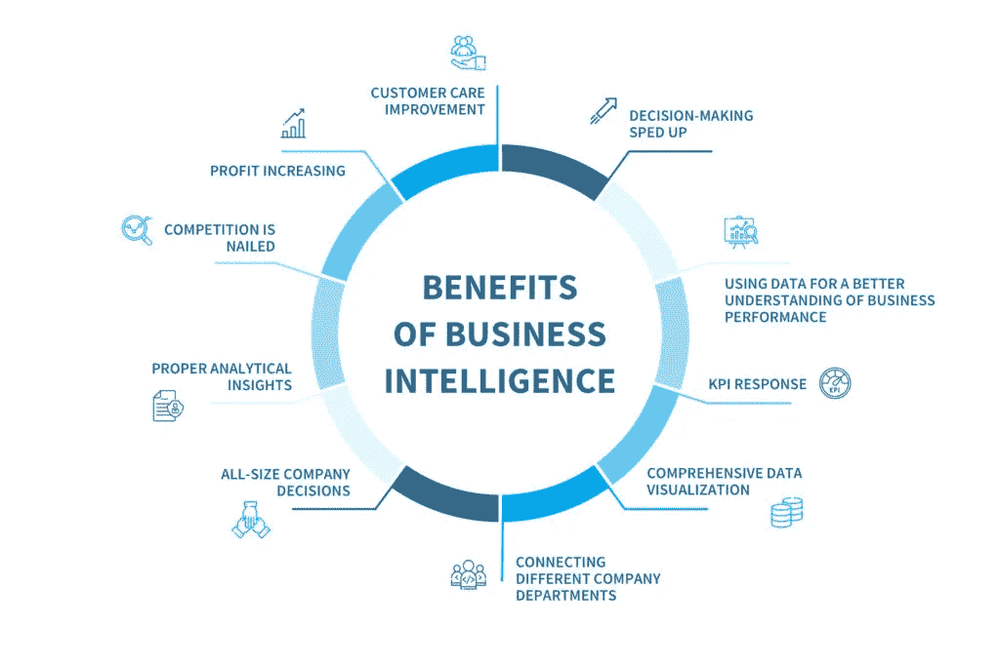
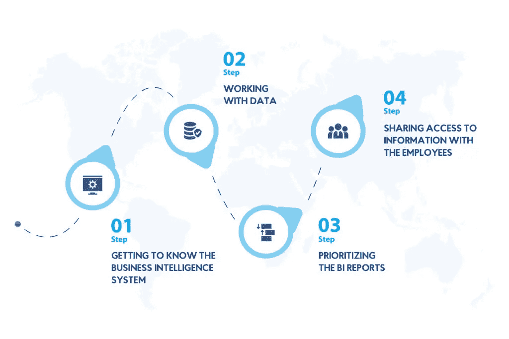

# 成功的商业智能示例— NIX United

> 原文：<https://medium.com/geekculture/successful-business-intelligence-examples-nix-united-ed5417bb97f1?source=collection_archive---------21----------------------->

商业智能(BI)如何帮助企业家塑造他们的企业环境并实现他们的目标？商业智能的想法非常简单:它允许不同类型的公司专家更有效地处理数据，并就其业务的发展做出更好的决策。做出明智的决策不仅有助于组织改善其职能活动，还能确定无效的流程、增加收入，并获得超越市场竞争对手的实质性优势。探索各种商业智能系统示例的价值有助于您客观地评估 BI 软件对您公司发展的重要性。

商业智能包括一套收集、分析和处理数据的工具和技术。例如，执行申请提交的机构使用几个渠道，他们需要收集销售的一般统计数据。或者有一个广告活动在几个不同的平台上进行，有必要比较每个平台的效果。BI 帮助配置所有这些流程。

通过利用商业智能软件，可以将从不同来源收集的原始数据转化为全面且可操作的分析。有许多商业智能软件的例子，如 Microsoft Power BI、SAP Business Projects、Looker、Tableau、Qlik Sense 等。任何行业或领域的公司都可以在公司层面、特定分支机构以及某些产品或服务中使用 BI 解决方案。

# BI 系统的工作原理和使用方法

商业智能系统提供了广泛的分析数据，可以有效地用于建立适当的商业发展战略。任何 BI 软件解决方案的用户端都是直观设计的，成功使用不需要任何严肃的技术知识。需要将系统与数据源连接起来，然后将数据移动到数据仓库进行[数据挖掘](https://nix-united.com/blog/top-14-most-important-data-mining-techniques-to-use/)，并转换成现成的分析报表。

至于数据源，可以是云存储，如 Google BigQuery、Microsoft Azure、Oracle Cloud 等，也可以是文档，如 Excel、PDF、XML 等。，以及各种基于 SQL 的系统。

看似简单的分析过程背后是复杂的数据挖掘过程和分析准备。不同的商业智能示例提供了完全相同的特性列表。商务智能解决方案包括:

*   数据集成和提取(ETL)工具:ETL 工具从外部源系统中提取数据，转换、清理并上传到一个统一的[仓库](https://nix-united.com/blog/data-warehouse-and-data-lake-definitions-what-is-the-difference/)
*   分析数据存储:构建和分析数据的数据库
*   数据分析:由于使用了能够估计各种数据观点并确定趋势和相关性的 OLAP 仪器，完整、全面的数据分析是可能的
*   数据可视化工具:为了呈现数据处理结果，有一些信息仪表板，显示带有专门指示器的分析结果

一家公司的一个很好的商业智能应用示例是在财务、营销、销售和运营部门处理数据分析。不同的专家可以应用 BI 系统来达到不同的目标:

1.  **金融。**借助商业智能工具，可以跟踪公司的财务活动，评估公司的市场和信用风险，以及所选择的策略对利润的潜在影响
2.  **市场营销。**利用不同的商业智能示例，营销人员保持实时活动跟踪，评估每个绩效场景，并规划未来的活动。营销专家可以获得对公司整体绩效的全面评估，并使他们能够在公司其他部门的数据分析方面分享他们的全面愿景
3.  **销售。**参与销售和运营的专家与 BI 仪表板和 KPI 统计数据密切合作，以便及时获得客户终身价值、客户盈利能力等信息
4.  **操作。**为了确保公司不会在低效的运营绩效上浪费时间和金钱等资源，运营经理使用 BI 解决方案来收集和分析相关数据
5.  [**数据分析师。**](https://nix-united.com/blog/data-science-team-structure-roles-and-responsibilities/) 公司有专门的数据分析部门，其中的专家使用公司数据和不同的分析服务来确定业务改进机会，并与公司领导层分享他们的建议。

# 商业智能的优势

利用商业智能的主要好处当然是它能够生成可操作的见解，从而做出数据驱动的决策。一些其他商业智能成功案例指出，重新考虑所提供的特定产品或服务的性能，有助于节省大量资源。但是，通过应用 BI，组织可以获得一系列好处:

*   决策速度加快。当企业家准备好简明相关的数据驱动分析时，对公司业绩战略的决策就变得更加容易和快速
*   **利用数据更好地理解经营业绩。**借助现代 BI 系统示例，组织可以清楚地了解发生了什么、为什么会发生以及应该发生什么，以确保优化其运营。
*   **KPI 响应。**得益于此，t 数据可以从不同的角度进行分析，公司可以根据每个案例制定出可行的解决方案。
*   **全面的数据可视化。**在具有用户友好界面的交互式仪表盘上查看数据有助于更好地理解所展示的见解。
*   **连接不同的公司部门。**来自财务和销售部门的不同公司支持和客户关怀部门会收到数据驱动的改进建议。
*   **全尺寸公司决策。**现代商业智能解决方案允许在一个组织的许多用户之间传播特定数据或整体数据分析
*   **恰当的分析见解。** BI 能够分析广泛的数据，以确保所选公司的战略是最新的。
*   **竞争是板上钉钉的。**商业智能支持竞争分析，揭示市场特征和竞争对手的业务优势和劣势
*   **多平台解决方案。**尖端的商业智能软件有网络版和移动版。因此，更多的信息被更快地分发给更多的用户。
*   **节约成本的见解。**商业智能系统以这样一种方式分析原始数据，以便它们能够确定旨在削减企业成本的最佳机会。BI 解决方案有助于节省人力资源、营销、库存、过多供应商等方面的资金。
*   利润不断增加。公司通过利用描述预算差异或低效的商业智能洞察来增加利润。
*   **员工满意度。** BI 系统有助于分析涵盖团队效率主题的数据。使用现成的商业智能报告，它可以评估整个团队以及特定部门团队或特定团队成员的生产率。
*   **客户关怀改善。** BI 报告有助于确定公司的客户是否对可用的产品线或提供的服务范围感到满意。这些报告还向企业家通报客户行为，建立用户角色的图像，并使用实时数据估计客户反馈，以便添加必要的纠正措施来改善客户服务。

# 真实的商业智能成功案例

由于基于数据的决策，全球各地的企业都证实了在工作中利用 BI 系统和增加收入的有效性。无论是大公司还是小公司，都必须不断应对不断增长的客户需求、激烈的竞争以及通常较低的利润率。然而，有一些聪明的 BI 例子证明，在构建智能策略时，数据驱动的方法可以保证更好的结果。

现实世界中的商业智能示例以服务于公司的必要业务需求为前提。很长一段时间以来，只有大企业才普遍使用 BI 系统来管理他们所有的流程和运营。如今，大公司更加需要智能数据分析，以数据为中心的中小型公司往往会快速增长。在每种情况下，该过程都包括收集、存储和分析来自各种企业运营和活动的数据，以简化和优化绩效。

了解使用商业智能的公司如何从增加的收入、更长的客户生命周期和保留率、有效的员工管理等诸多方面获益:

1.  **亚马逊。**先说一个巨头——众所周知，亚马逊是一家零售巨头，在全球拥有超过 1 亿名 prime 客户，销售超过 1200 万件产品。全球市场就是要集中大量的数据，这些数据应该被快速有效地处理，以确保所有个性化的用户推荐、有针对性的营销和价格优化都是最新的。所有这些分析工作导致了关于每个客户的各种指标的扩展收集，并有助于将用户体验带到这样一个新的高质量水平，使亚马逊成为美国领先的电子零售商。亚马逊使用 BI 系统来优化其物流并简化供应链的工作流程。利用现代 BI 工具，亚马逊通过预测分析、选择最佳运输时间表、路线和产品分组来加快订单交付。
2.  可口可乐装瓶公司(CCBC)。这家公司过去在准备大量手动报告方面存在困难。可口可乐数据分析师团队必须将从 100 个不同系统收集的 2 亿多行数据的工作流报告和各种指标汇集到企业数据仓库中。所有这些工作都是为了准备一个单一的数据分析仪表板。在他们开始应用尖端的 BI 技术后，他们设法简化了数据分析和报告流程。可口可乐的领导层每天早上都可以免费轻松地获得分析报告，而数据分析师团队可以专注于不同的任务。因此，将现代商业智能示例引入数据分析流程有助于 CCBCC 团队优化其工作流程并提高团队整体绩效。
3.  **美国运通。**可靠的数据分析是任何金融机构的基本工具之一。美国运通采用强大的商务智能解决方案，为用户创造新的支付方式和市场优惠。防止欺诈性交易、遵守反洗钱合规性以及出色的客户维系都是实施高效的 BI 软件来收集和分析数据的结果。美国运通就是这样一个商业智能用例，它也成功地从使用商业智能中受益，极大地优化了他们的客户获取，并最终简化了所有客户的在线行动。
4.  **星巴克。**由于星巴克本身有着独特的成功故事，该公司应用的商业智能服务与竞争对手相比也有着显著的不同。由高级 BI 软件驱动的星巴克忠诚卡计划允许收集其七位数客户受众的数兆字节的个性化购买数据。根据收到的数据分析，这家咖啡巨头很容易预测特定客户的个人偏好和报价。因此，星巴克的顾客会定期收到他们可能感兴趣的优惠信息，这有助于公司保持强大的顾客忠诚度。星巴克的故事属于以持续的收入和受欢迎程度增长而告终的商业智能成功故事。这种策略最终会带来收入的大幅增长和用户群体内部信任的增长。
5.  **REI。**面对海量的在线和店内交易、运营管理、客户统计数据等，REI 不得不面对处理超过 90tb 数据的挑战。为了确保提供更加个性化的客户体验，REI 应用了智能和有效的商业智能解决方案，能够更快地收集和评估关键的客户见解。通过持续监控客户终身价值、流出率和保留率、每件商品的价格、每份订单的商品数量等指标。，这家大型户外零售商获得了每个用户的全方位图像。基于获得的数据分析，该公司设法建立有利的战略，而不浪费时间和金钱在无用的解决方案上。

# 如何提高你的商业智能使你的公司繁荣

采用商业智能的例子可能是势不可挡的，并且需要花费大量时间来简化过程中包括的所有周期。然而，一旦公司开始获得更高的收入和更高的保留率，利用 BI 解决方案促进业务增长将不可避免地成为一个绝妙的主意。通过采取以下步骤，努力建立一个恰到好处的 BI 活动来实现业务目标将变得更加容易:

*   **了解商业智能系统。**在开始处理任何 BI 系统时，有必要花时间了解该系统在规划、执行和分析数据方面的实际能力。
*   **处理数据。**在向 BI 系统提交大量数据之前，有必要了解这些数据的特征和特性，它们来自哪里，以及这些数据分析能够为决策过程带来哪些好处。
*   **确定商业智能报告的优先级。**有些商业智能报告根本无法为特定的业务或特定的目标达成而工作。为了充分利用数据分析，确定分析本身的目标非常重要。
*   **与员工共享信息。以某种方式参与数据分析的所有员工都应该能够访问商业智能项目所需的所有数据。**

# 结论

找到解决您的 BI 任务的正确工具将显著提高您的数据分析性能。NIX Solutions 为公司提供了一个强大而全面的[商业智能系统](https://nix-united.com/services/business-intelligence-services-bi/)，帮助测量大量数据，并根据您的发现和分析创建有用的预测。借助完全定制的先锋软件解决方案，丰富您的数据处理和决策，帮助企业实现最大胆的业务目标。

*原载于 2022 年 3 月 16 日*[*【https://nix-united.com】*](https://nix-united.com/blog/examples-of-business-intelligence-systems-for-improving-decision-making/)*。*