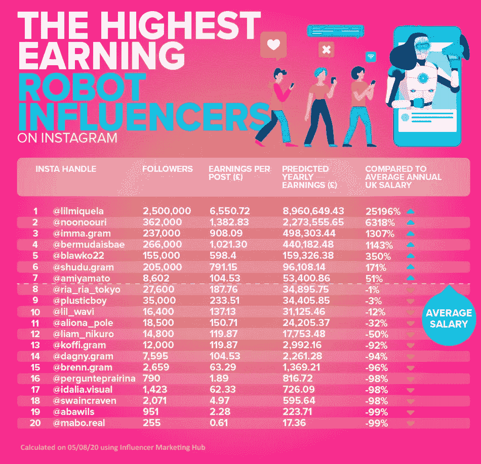
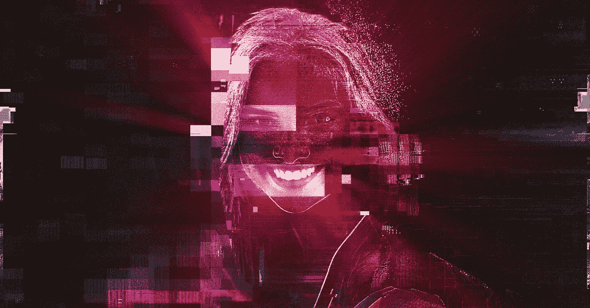

# 合成脸正在建立一个新的市场——而且非常好

> 原文：<https://medium.com/geekculture/synthetic-faces-are-building-a-new-market-and-its-terribly-good-15be13390ac1?source=collection_archive---------12----------------------->

## ***AI 能否塑造出值得千万人信赖的形象？***

Lil Miquela 的 Instagram [上 10 月份的一个帖子让 300 万用户兴奋不已:她宣布了一个新的升级。这位年轻的洛杉矶模特第一次升级已经过去了将近五年，她的脸完全变了，她的风格和兴趣也变了。Lil Miquela 才 19；她的皮肤很完美，雀斑和牙齿间的小缝隙给了她独特的魅力。不过，莉莉·密凯拉实际上并不存在。她是一个虚拟的影响者，这是她与其他博主的唯一区别。据 HypeAuditor](https://www.instagram.com/p/CU0MMuuFPZy/) 称，2020 年，Miquela 的脸吸引的观众几乎是真正的博客作者的三倍。她的脸也是票房最高的。

[OnBuy](https://www.onbuy.com/gb/blog/the-highest-earning-robot-influencers-on-instagram~a243/)

合成生成的人脸越来越受欢迎，人类的脸正在通过技术彻底改变和扩展其意义。我们在口袋里放着面部的数字副本，用于个人身份识别；我们在拍摄故事时使用 AR 滤镜和遮罩，并通过 Face ID 保护我们的数据。我们[通过娱乐应用程序交换](https://www.techtimes.com/articles/265493/20210917/face-swap-apps-generate-photos-make-laugh.htm)面孔，成为我们想要的任何人，并创建虚拟化身；我们使用表情符号和迷因来传达我们的情绪，并且仍然渴望对我们发布在社交网络上的自拍照的喜欢。*技术如何改变我们的面貌，为什么今天需要这些转变？AI 能塑造出值得千万人信任的形象吗？*

*我们生活在一个* [*加速精细化*](https://strelkamag.com/en/article/face-as-infrastructure) *的时代:随着社会景观和自然条件的变化，我们的脸变得更光滑、更优雅、更锋利。* ***数字化正在成为一种不可逆转的趋势——它理想化了我们的脸，但它与世界的互动更加复杂。***

我们很少深入细节，但人类的面部由 43 块肌肉组成，可以呈现几十种表情。我们对面部信息进行加密，并“解码”他人的面部信息，作为某人信息的主要来源。人们喜欢我们吗？别人在想什么，这对我们有什么影响？

脸从来不是静止的；它会随着我们的一生而改变。这是我们不断想要更新它的原因之一，无论是新的头像还是意想不到的图像变化。但早在数字技术出现之前，人类就在化妆和仪式的帮助下尽可能地改变了角色。哲学家约翰·赫伊津哈在他的作品《人类》中指出，游戏是创造社会的主要文化形式。人们玩游戏已经有几千年了；毕竟，这是互动和生活的一个基本要素——从入会仪式到婚姻甚至死亡。21 世纪也不例外:我们仍然使用面具来分配角色，无论是社交还是在 Snapchat 上使用 AR 滤镜。现在，这个游乐场已经大部分转移到了数字世界。

尽管变脸仪式有助于维持古代世界的历史进程以及秩序感和安全感，但我们今天的需求更加个性化。对我们来说，在照片和生活中传播特定范围的情绪仍然很重要，可以成为品牌的“面孔”，拥有一张完美无瑕的面孔来增强吸引力，或者将其作为自我表达的平台。最主要的区别是，现在脸是我们唯一的财产。

# 面具的角色:从古代仪式到 Instagram 过滤器

科学家维克多·特纳把面具定义为仪式的一个重要象征，因为它是一个行动、语言和社会关系(祈祷、咒语、歌曲等)的系统。)是在角色的执行者之间建立的。

面具也让 T2 成为我们接受对方的一种方式。对于我们的祖先来说，面具帮助他们探索世界，体验男人/女人，人类/非人类，朋友/敌人的对立。今天，你可以在 Instagram 上试戴黄瓜、长胡子的女人或巫婆的角的面具，面部交换应用程序允许你“试戴”任何人或生物的脸。在数字世界中，我们用来修饰面孔的技术不能像古代那样严肃，但这种崇拜的反思元素依然存在。

几个世纪后，面具被证明是一个如此必要的概念，甚至中世纪的基督教也无法消除它作为一种异教属性。相反，它获得了新的含义，例如，宗教裁判所的酷刑面具和监狱系统中出现的“耻辱”面具。2000 年代末，大规模反对运动开始使用面具:还记得匿名面具(盖伊·福克斯的形象，作为争取社会权利的象征)和 Pussy Riot 的面具团体吗？

尽管一些文化中仍然保留着面部带有神圣和日常角色的可怕仪式，但现在世界上大多数人更喜欢无痛地给脸上色，比如使用面部映射、[人工智能驱动的](https://www.bbc.com/news/business-48369970)化妆品打印机或 Photoshop。

# 新的视觉语言

为了帮助面孔在数字世界中无缝传播，我们必须创造一种新的图像语言。世界上最受欢迎的十个应用程序中有一半是消息和视频通话服务。然而，我们并不总是能够在交谈中看到对方，并从我们脸上读出必要的情绪。因此，创造一种超越文字的视觉语言的想法并不新鲜。

2014 年，“❤️”成为年度最热门词汇。第二年，《牛津英语词典》将这张“喜极而泣的脸”([😂](https://emojipedia.org/face-with-tears-of-joy/) ) emoji 史上最牛的词。到目前为止，我们在书面交流方面最重要的成就不是一个单词，而是一个表情符号。每年，非营利的 Unicode Consortium 都会批准来自世界各地的志愿者发送的新表情符号。其中两个，一个打哈欠的脸和一个华夫饼，是一名记者——The Verge 新闻编辑杰伊·彼得斯创造的，他花了两年时间才完成。

但是这个过程对于 AI 来说需要的时间更少。例如，365 AED 艺术团队教会神经网络将表情符号变成人脸。该算法原本应该将草图转化为现实的人的照片，但开发人员决定通过神经网络运行表情符号，突然创造了一种新的艺术。人性化的表情符号被拍卖为 NFTs ，起拍价为 28 美元。

另一个想法是，脸的概念如此普遍，以至于它远远超出了视觉图像。你同情革命者的新面孔；你谴责膝跳政治和疫苗反对者的图像，你被 Instagram 上的肥猫感动(当然还有 Lil Miquela 的脸)。生物学家和著名的科学普及者理查德·道金斯认为你是由想法或迷因驱动的生存斗争的见证人。45 年前，道金斯创造了“模因”一词，作为信息空间中基因的类似物。在他看来，两者都是信息的单位，它们在携带者的环境中繁殖、变异和竞争。

## 因此，与流行的观点相反,“模因”的概念比互联网上的酷图要宽泛得多。根据道金斯的说法，即使是对上帝的信仰也源于迷因。如你所知，他有很多面孔。

# 合成脸的市场

早在 20 世纪 60 年代，人工智能的先驱们经常[预言](https://spectrum.ieee.org/rodney-brooks-ai/particle-5)人类水平的智能机器离我们只有十年之遥。这种形式的人工智能是基于使用符号的逻辑推理，以今天的标准来看，是用慢得离谱的数字计算机实现的。顺便说一下，这些先驱审查并拒绝了神经网络。在 20 世纪 80 年代，基于规则的专家系统和由新学习算法推动的神经网络的复兴预示着人工智能的第二个时代。关于人类智力优势终结的预言并没有停止。第三个也是当前的人工智能时代出现在 21 世纪初，伴随着基于能够解决一类问题的算法的新符号推理系统的出现，即所谓的 3SAT，以及另一项称为同步定位和地图绘制的进步。在 2010 年代初，随着从海量数据中学习的神经网络的出现，它得到了更新。很快，一波前景和利润丰厚的基于人工智能的应用冲击了市场。

数字脸现在是一个很好的赚钱工具，可以创造成功的品牌合作(例如像 [Lu do Magalu](https://www.instagram.com/Magazineluiza/) )。第一批数字人出现在 20 多年前:虚拟组合街头霸王乐队，其专辑多次获得白金销量，自 1998 年就已存在。初音未来，一个来自日本的虚拟歌手，在 2007 年见证了她的事业腾飞。她最大的演唱会发生在 2009 年，有 25000 人参加。

## 今天生成的人脸太好了，以至于很难把它们和真实的区分开来。贾斯汀比伯甚至将 [*误认为*](https://www.dailymail.co.uk/news/article-10075463/Justin-Bieber-fooled-challenging-deepfake-guitar-playing-Tom-Cruise.html) *是汤姆·克鲁斯弹吉他的翻版，而不是真正的演员。*

数字角色是万能的士兵。数字脸随时待命；它可以用于广告活动和流行的应用程序。它不会疲倦或生病，不会衰老；很容易适应任何行业(时尚、电竞、汽车、能源等。)和品牌需求。

Lil Miquela 在很多方面都领先于其他“传统”有影响力的人，而且还有很多像她一样的人。火车正在离开，公司越来越多地在业务中使用虚拟影响者，以跟上数字化的步伐。玩具公司 Superplastic 也让它的角色栩栩如生，并且[成功地表演了](https://www.instagram.com/superplastic/)，服装品牌 Yoox 创造了它的虚拟助手，取名为 [Daisy](https://www.instagram.com/p/CUxSTe3MtnU/) 。

[Statista](https://www.statista.com/statistics/755331/worldwide-spending-on-cognitive-ai-systems-segment-share/) 表示，2020 年，包括软件、硬件和服务在内的人工智能市场的全球收入约为 2810 亿美元。2021 年还没有结束，但根据[福布斯](https://www.forbes.com/sites/davidjeans/2020/10/20/bcg-mit-report-shows-companies-will-spend-50-billion-on-artificial-intelligence-with-few-results/?sh=3294ed497c87)的报道，今年公司预计将在人工智能系统上花费超过 500 亿美元，而 [IDC 预测](https://www.idc.com/getdoc.jsp?containerId=prUS46794720)到 2024 年，人工智能投资将超过每年 1000 亿美元。

Lil Miquela 是一个 CGI 角色，即使很多媒体称她为“100%程序化”。但这并不能改变她的脸比其他很多人更受欢迎的事实。“我希望自己被描述成一名艺术家或歌手，或者其他能表明我技艺的东西，而不是专注于我是谁的表面品质，”米凯拉在聊天中告诉一名时尚记者。

虽然 Miquela 的帖子目前是由一个大型团队创建的，包括艺术家，作家，设计师和其他创意人员，但人工智能的未来可能会等待着她。人工智能已经在创造数百万人喜爱的图像，我们对技术的恐惧可能是矛盾的。我们不再害怕从一切事物中产生迷因并创建虚拟化身，但有时看《终结者》仍然会感到害怕。1994 年，美国人戴安娜·迪泽尔吃不下早餐，因为在她看来，圣母玛利亚的脸出现在了她的一块奶酪吐司上。由于害怕破坏这张神圣的脸，这位妇女将这块面包保存了十年，它在电视上播出，最终在易贝以 28000 美元的价格售出。时代在变:脸的价值在不断转化，它的作用和意义越来越由技术决定。也许如果我们给这项技术一个机会，我们对人工智能的刻板印象将像恐龙一样消失。