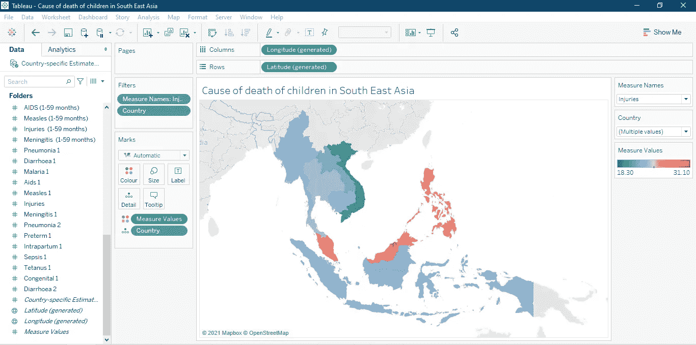
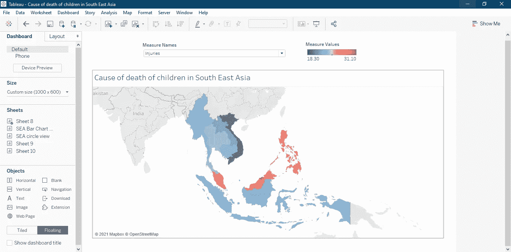
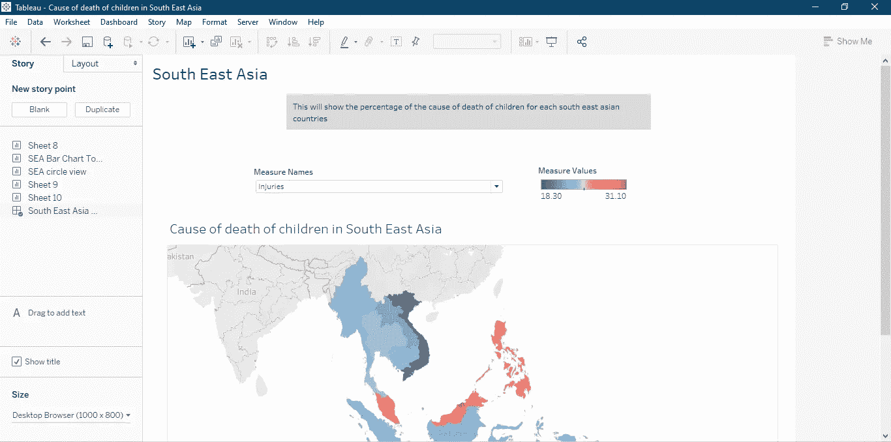

# 营救场景！

> 原文：<https://medium.com/geekculture/tableau-to-the-rescue-a69ff28c1f50?source=collection_archive---------10----------------------->

## *一个关于 Tableau 如何改变我生活的小故事*

D ata 给我们讲了很多故事。在现实世界中，数据非常复杂。通过数据检索信息的一种方法是进行数据可视化。数据可视化可以帮助我们将复杂的数据转化为艺术的视觉效果，让我们的观众只需看着这些视觉效果就能轻松理解其中的真知灼见。有不同的工具可以用来可视化数据，其中之一是 Tableau。

Tableau logo retrieved from tableau.com

据 [Tableau 的网站](https://www.tableau.com/why-tableau/what-is-tableau)称，Tableau 是一个可视化分析平台，改变了我们使用数据解决问题的方式——让人们和组织能够充分利用他们的数据。

在 Tableau 进入我的生活之前，我正在使用 pandas、matplotlib 和 seaborn 等 python 包进行数据可视化。老实说，我很难使用这些软件包来创建视觉效果。在我可以使用代码显示想要的输出之前，我需要花很多时间来修改和操作数据。

这就是为什么在我们数据可视化课程的第一个任务中，我想探索其他易于理解和短期使用的数据 viz 工具。当我听说 Tableau 为学生提供的[许可证时，我借此机会学习了这个工具。](https://www.tableau.com/academic/students)

我的第一次 Tableau 之旅是势不可挡的，我真的很喜欢它对用户和初学者的友好。您可以通过上传数据集并拖动所需的要素来轻松创建可视化效果。

Tableau 有一个“演示”部分，根据您选择的功能，建议您使用不同的情节和视觉效果。作为初学者，这真的很有帮助！

Show Me section in Tableau

在这段时间里，我只探索了 Tableau 的冰山一角，直到我们上一次在数据可视化课上讨论 Tableau。“神奇”、“酷”、“精彩”是我们讨论时从我嘴里蹦出的词。尽管我在第一次作业中使用了 Tableau，但我对我在课堂上学到的东西感到惊讶，如排序、添加过滤器和使用标记部分(颜色、标签、工具提示和大小)。

Adding filters and marks in Tableau

我还了解到，在 Tableau 中，你也可以轻松地绘制地图！

Plotting South East Asian Countries using Maps in Tableau

我真正喜欢的 Tableau 改变了我的生活，是它的仪表板和故事功能。对我来说，创建视觉效果，然后将它们放入 PowerPoint 演示文稿中是非常耗时的。你需要确保每张幻灯片对观众来说都是可展示的和可读的。然后，如果你想有一个互动的介绍，你也需要添加效果。但是在 Tableau 中，你可以很容易地把你的视觉效果放到仪表盘上，然后把它们编辑成一个故事。你也可以通过添加过滤器、标签、工具提示等来使你的仪表板具有交互性。从那里你只需要组织你的工作，你可以用它来展示。

Dashboard in Tableau

Creating a story in Tableau

Tableau 中还有很多特性需要我深入研究。期待在我的数据科学之旅中探索和使用这个工具:)

读者你好！谢谢你的来访。我希望你喜欢读这个博客:)如果你对 Tableau 有任何建议/意见，请在❤下面留言