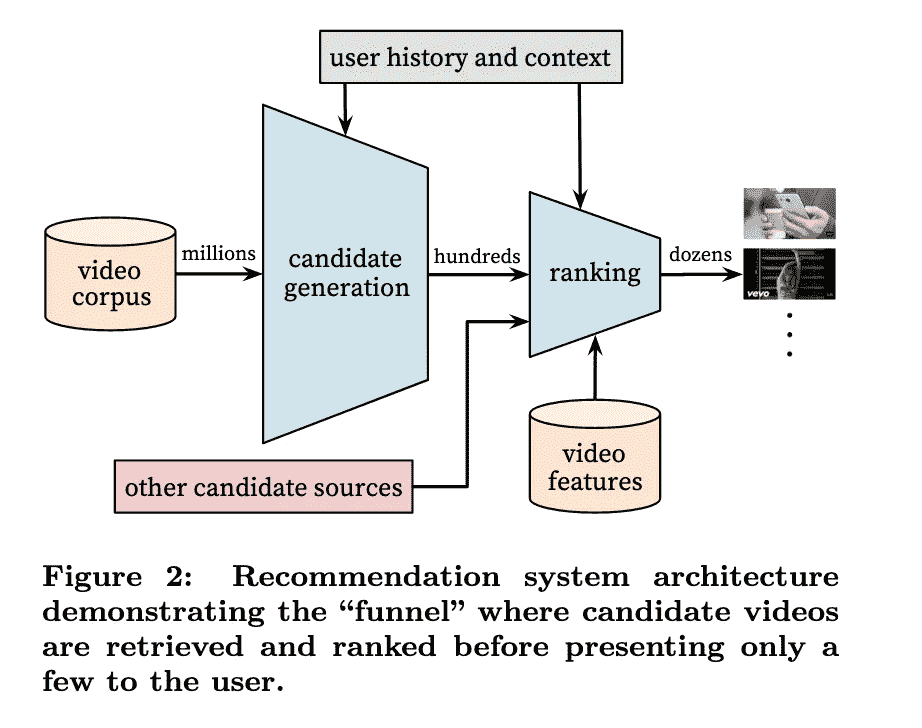
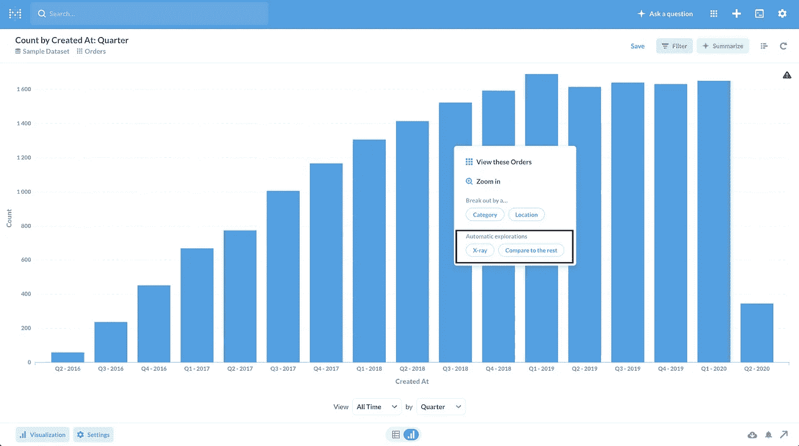
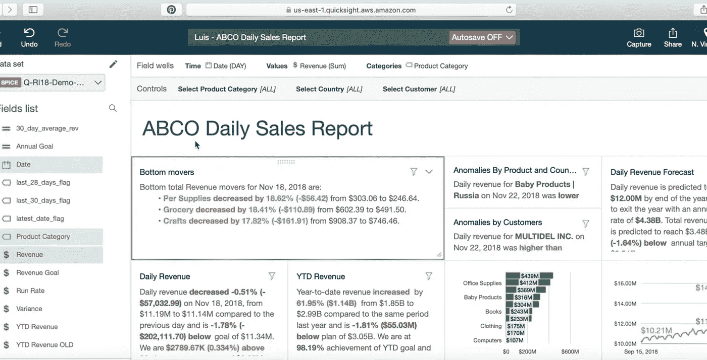

# 在数据分析中与机器和自助服务对话

> 原文：<https://medium.com/geekculture/talking-to-machines-and-self-service-in-data-analytics-6df978b59c63?source=collection_archive---------28----------------------->

## 自助服务在算法的帮助下是否可以更加自助？

Photo by [Charles Deluvio](https://unsplash.com/@charlesdeluvio?utm_source=unsplash&utm_medium=referral&utm_content=creditCopyText) on [Unsplash](https://unsplash.com/s/photos/youtube?utm_source=unsplash&utm_medium=referral&utm_content=creditCopyText)

本文是我对 [Benn Stancil](https://medium.com/u/b3c63c3caf8e?source=post_page-----6df978b59c63--------------------------------) (创始人@ Mode)的文章:自助是一种感觉的回应。在简讯的最后，本提到我们应该*“追求让我们和我们的客户感觉最自在的自助服务体验”。*本文分享了我对如何利用当前社交媒体消费行为实现这一目标的想法。

—

2008 年，YouTube 在[推出了第一个推荐系统](https://blog.youtube/inside-youtube/on-youtubes-recommendation-system/)，纯粹根据受欢迎程度对视频进行排名。13 年，22.9 亿用户，超过 800 亿美元的收入，Youtube 的算法是现存最大规模和最复杂的行业推荐系统之一。

我可以让这个整体系统为我工作。

只需一次点击(以及几个小时的连续观看)，我就可以轻松地将狗的视频淹没在我的整个 feed 中，这些视频已经被完全不同主题的视频占据了。甚至在我说出来之前，Youtube 就神奇地显示了大量与我的其他兴趣相匹配的视频，从 Lofi 音乐到启发性的关于拖延症的 Ted 演讲(哈！).

我们真的不需要知道代码就能和机器对话。

# 算法星球的崛起

如果我们按用户数量来看[前 10 大社交媒体平台](https://www.statista.com/statistics/272014/global-social-networks-ranked-by-number-of-users/)，其中一半有推荐系统。

我们每天都通过这些系统与新闻源交流。

我们点击一个视频，我们在一个卷轴上停留很长时间，我们订阅一个频道，我们保存一个帖子供以后使用。所有这些非语言的交流方式相当于我们口头上说:“嘿，我想看/读/看更多类似的东西”。唯一的区别是:我们不必这么说。

换句话说，我们的被动消费变成了我们与机器的主动交流。如果有的话，这些机器是“行动胜于语言”这句话最极端的狂热分子。见鬼，他们甚至不需要我们说什么就知道我们想要什么。然而，我们仍然每天在抖音和 Instagram 上花上几个小时。

Youtube’s recommendation system. Image source: [Google](https://static.googleusercontent.com/media/research.google.com/en//pubs/archive/45530.pdf)

算法(我捆绑这些推荐系统的方式)不仅影响了我们娱乐自己的方式。

它影响了我们购物的方式。

你有没有在你最喜欢的电子商务平台上点击一个产品，却发现它像蘑菇一样出现在同一个应用的 feed、你的脸书 feed、Instagram stories 以及你正在玩的游戏中？然后，有一天你意识到，你已经买了，没有一个具体的计划。

它影响了我们找工作的方式。

试着在 LinkedIn 上查看并保存一些职位信息，你会发现在接下来的几周里，类似的职位会出现在你的收件箱里。或者你可以简单地联系一个你想要这个职位的招聘人员，LinkedIn 会推荐数百个其他可能寻找相同职位的招聘人员。再也不用四处寻求工作推荐或浏览无尽的招聘信息。这就是为什么当我目前(也很开心地)被雇佣时，我很少和招聘人员联系。来自牛逼公司的招聘人员的建议和我已经联系好的招聘人员互动的展示帖子(主要是招聘)的行为只是分散注意力。

它影响了我们寻找灵魂伴侣的方式。

我记得 3 年前，Tinder 还只是一个简单的左右滑动应用程序。现在，它推荐*受欢迎的*个人资料(大概被许多人刷过),引诱你升级以便也能查看和刷过。与我们的兴趣相匹配并且距离很近的个人资料也会被推荐，以增加匹配的机会。随着 Tinder 的算法找到更多方法来用更多的多巴胺波攻击我们(从比赛中，从知道我们被某人超级喜欢中…)，我们倾向于求助于我们的手机，而不是与朋友一起出去玩真正的约会体验。

# 数据分析中的算法和自助服务

我想知道，我们还要多久才能看到算法对人们在 BI 工具中自助服务的方式产生更显著的影响。

尽管自助服务仍然是数据行业的一个时髦词，并且[与我们的感觉](https://benn.substack.com/p/self-serve-is-a-feeling)有很大关系，但我们不能否认我们在社交媒体上“自助”信息的方式与我们“自助”报告和仪表板的方式之间的相似性。

*(请注意，我是从一个非技术数据/洞察力消费者的角度，而不是报告创造者的角度来说的)*

Image source: [Benn Stancil’s Substack](https://benn.substack.com/p/self-serve-is-a-feeling)

首先，信息需要被管理，以便被消费。由于不断扩大的信息库以及我们不断变化的兴趣，这是一个固有的挑战。

为了一个视频(出十亿！)要被“正确地”推荐给我们，YouTube 的算法必须首先尝试基于我们的观看行为建立一个档案，然后建立与该档案匹配的主题集合。类似地，数据消费者会看到来自不同数据源的数百个表。除非有人(是的，您，分析师)告诉我们要查找哪个表，或者最理想的是挑选出所需的字段，否则我们—数据消费者—要花几天时间才能找到一个简单的业务指标。即使我们自己设法浏览这些表格并找到我们需要的指标，更多的陷阱还在前面。正如 Laurie Voss(Netlify 的高级数据分析师)所言[非常好](https://www.heavybit.com/library/podcasts/the-right-track/ep-6-domain-expertise-with-laurie-voss-of-netlify/)，数据消费者很可能会使用错误的统计方法来计算一些东西(例如，中位数与平均值)，这相当于灾难性的自助服务。

第二，社交媒体和分析的消耗品共享同一套衡量标准。我们有观看时间，喜欢，不喜欢，在社交媒体上分享，我们也有 BI 工具。我们甚至可以记录仪表板被查看的次数，或者当人们浏览数据集时哪些指标被使用得最多。如果我们能利用这些信息去触摸“未知的未知”会怎样？

比方说，当一个人反复查看关于按国家划分的*公司收入的报告时，我们可以(建立一个算法)建议类似的与衡量*收入*相关的报告，例如按城市划分的*收入*(下钻)或按类别划分的*收入*(钻取)。如果过去几个月的收入同比持续下降，我们的报告甚至可以自动提醒我们。*

尽管下钻和穿透钻取的概念早已被大玩家付诸实践，如 [Holistics](https://www.holistics.io/) 、 [PowerBI](https://powerbi.microsoft.com/en-au/) 或 [Tableau](https://www.tableau.com/) ，但它仍然需要数据分析师预先定义某些逻辑和构建仪表板/报告的方式。如果算法可以为分析师处理设置，它肯定会给他们更多的空间来进行具有挑战性的探索性分析，同时给业务用户他们不知道要问的洞察力。

在我之前的例子中，我提供了我对公司收入的偏好作为输入，算法给了我它认为我会关心的东西。Youtube 推荐系统就是这么运作的。

**事实上，我们已经见证了数据行业这一趋势的一些早期信号。**

[Metabase](https://www.metabase.com/) 有一个名为“自动探索”的创新特性，顾名思义，它会根据我们正在探索的指标自动生成报告。

Image source: Metabase

从技术上讲，元数据库将我们的指标与不同维度(例如位置、类别)相结合，或者使用不同的分析计算(例如分布、前 N 名、总和、平均值……)。虽然这在很大程度上消除了寻找维度来创建这些报告以及修补可视化设置所需的工作，但这还不够“智能”。有些报告根本没有任何意义。即使他们知道，也需要一些知识来确定报告中发生了什么。

元数据库“自动探索”的高级版本是亚马逊 QuickSight 的机器学习功能，名为“ [ML Insights](https://aws.amazon.com/quicksight/features-ml/) ”。这个特性更进一步检测整个数据集的异常，然后生成用户友好的叙述。我记得和我的一个客户(我在 BI 行业工作)聊过，他们简直无法停止漫谈这个特性对他们有多么神奇的帮助。那一刻，我意识到我们可以尽量减少用户的“自助服务”体验。

ML Insights narratives. Image source: [AWS QuickSight](https://aws.amazon.com/quicksight/features-ml/)

尽管这种从 BI 工具中轻松获得洞察力的方式不符合我们[对“自助服务”](https://www.gartner.com/en/information-technology/glossary/self-service-analytics)的传统定义，但它*仍然是*自助服务。是的，我们似乎没有采取任何物理上确定的行动，但我们的需求通过被动、微妙的行动被清楚地传达和精确地解释。只要我们能够自己达到提取所需数据的目标，这就是自助服务。

简而言之:我们不一定对技术采取更好的行动。但是科技越来越擅长描绘我们的行为。因此，人工智能驱动的自助服务的未来似乎并不遥远。

# 我们要解雇分析师吗？

我不这么认为。至少现在还没有。

甚至 YouTube 仍然依靠认证专家对他们的“边缘”内容进行质量检查。然后，这种人工评估会训练算法对其决策进行建模，并在整个视频库中进行自我调整。

> *为了确定边缘内容，评估者评估的因素包括但不限于内容是否:不准确、误导或欺骗性；不敏感或不宽容；有害的或有可能造成伤害的。*

即使是在使用人工智能和人工智能为其 BI 产品提供支持方面的领先先驱 Domo，也仍然[承认让机器学习系统自行运行的挑战](https://www.domo.com/learn/article/new-perspectives-on-ai-and-ml):

> *例如，根据种族、性别、年龄或性取向做出招聘决定是违法的，但在大数据集中这些属性是有替代物的。*

与 Youtube 类似，我们仍然需要人类来确定机器要遵守的道德数据惯例。

该算法可以用来处理大量的数据，但还不能处理业务问题的本质。分析师将知道何时使用，比如说，中值(我们的大多数客户完成入职所需的时间)与平均值(完成入职流程的平均持续时间)。商业问题本质上是复杂的，因此对于机器来说不够公式化。

此外，数据分析师仍然在数据治理中发挥着重要作用。维护单一的事实来源并培训业务用户提出正确的问题是任何可持续和可扩展的自助服务体验的先决条件。

例如，您的用户将**销售量**和**价格**相乘，然后在报告中称之为**收入**。几周后，同一个用户用**乘以顾客数量**和**价格**，然后称之为**收入**。现在，从文本上看，收入是一样的，但它们可能会有很大不同。如果 100 名顾客下了订单，但只有 80 名顾客成功购买，20 名顾客退回了订单，该怎么办？这将返回与使用**销售数量 x 价格不同的结果。**

想象一下，这两个收入字段在报告中交替使用，而没有人真正注意到…

*原载于 2021 年 10 月 25 日 https://tuanmon.com**T21*[。](https://tuanmon.com/talking-to-machines-and-self-service-in-data-analytics/)