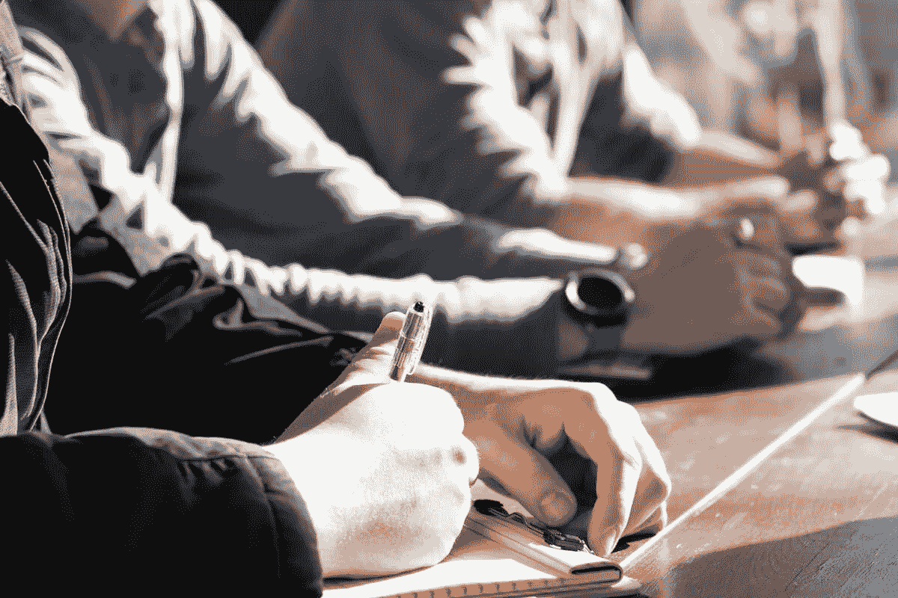

# 技术面试笔记

> 原文：<https://medium.com/geekculture/tech-interview-notes-380c1a7d16dc?source=collection_archive---------17----------------------->

## 我的技术面试经历笔记

Photo by [Bannon Morrissy](https://unsplash.com/@dylandgillis) on [Unsplash](https://unsplash.com/photos/KdeqA3aTnBY)

小心点！这不是处理技术面试的教程。这篇文章旨在将我的知识和经验形式化。

今天，我终于在 EPAM 完成了“技术面试认证”。期末考试是被考核的面试，导师要决定我是否准备好拿证了。这对我来说不是问题，因为我已经练习面试两年了。这个认证项目只是向我自己证明我的技能。

所以！让我们来看一下主要话题。

# 准备

这是一个探究候选人个性和经历的好方法。我甚至准备了面试时要涉及的话题。为什么？仅仅因为讨论候选人没有经历过的话题是没有意义的。作为面试的主要目标——识别优秀候选人的特征。在那之后——弱点。

如果你是处理面试的新手，你可以创建一个问题而不是主题的列表。这会让你感觉更自信。因为不仅是候选人，面试对被面试者来说也是有压力的。

# 与会者介绍

每个参与者都应该介绍自己:面试官和被面试者。当一个被采访者对评估他的人没有想象力时，这真的是一件可怕的事情。

# 保持冷静

只记得你作为候选人参加的最后一次面试。你对每个问题都很在行吗？不确定。没有对所有问题都有详尽答案的理想候选人。并且，一个糟糕的答案不是生气的理由。

但是如果候选人完全不好呢？也许，这是一个很好的不在场证明吗？一点也不！世界很窄，面试上吸的那个人，以后就可以成为你的队友。所以请保持冷静。

# 进行视频录制

我认为在会议期间做笔记是错误的。这可能会分散您和其他参与者的注意力。会议结束后，您可以拿着录音，在一旁回顾会议。这加强了更清晰和公正的反馈。

还有，我喜欢“睡过头的想法”这个主意。我总是使用这个规则。因为会话后的反馈可能会有偏差。会话录音会帮助你记住所有的细节。

不要忘记征求每个参与者的视频录制同意。

# 友好的讨论，而不是审判

尽量保持友好的气氛。有些人可能会因为面试而感到紧张。当一个人在放大镜下时，这是很自然的。你可以使用不同的技巧保持友好的氛围，比如:

*   会话开始时的闲聊。
*   复杂问题和目标问题中间的“放松”问题。
*   在某些特殊情况下——甚至是友好的玩笑。

也许还有别的。即兴表演可能会有所帮助。每个疗程和候选人都是独一无二的。

# 星形技术

这是一种简单而有用的讲述技巧。适用于小故事。所以，你可以依靠它来倾听候选人的故事。或者甚至提供一个行为任务。

*   情境(语境)。例如，“我是……的工程师”。
*   任务(挑战)。例如，“我面临一种情况……”。
*   动作(你扮演的一个角色)。例如，“我采取了以下措施来解决…”。
*   结果。例如，“我的行为有助于(或没有)解决……”。

在这里你可以找到对这种技术更好的描述。

[Bioscience Careers](https://biosciencecareers.org/2018/01/how-to-be-a-star-performer-at-interview.html)

# 清晰有用的反馈

反馈应该对团队、客户和候选人有用。

*   描述候选人的优缺点(这对招聘方很重要)。
*   尽量清楚地描述被检查技能的水平(对各方都很重要)。
*   创建一个建议列表，以填补公认的差距(这对候选人和面试方很重要，这可能是改进计划的切入点)。

其实就是这样！有几个要点可以让我有效地应对技术面试，没有压力。请记住，会议应该对各方都有利:受访者、面试官、招聘方。

我不打算为这个话题提供大量有用的链接。这是一个需要大量练习的领域。而理论对成为一个好的面试官没有任何帮助。我建议你在你的技术面试过程中逐渐了解这个理论。

[这里](https://balovbohdan.github.io/#/posts/tech-interview-notes)你可以在我的个人博客里找到这篇文章。不要把它判断得太强，它处于非常初级的阶段。