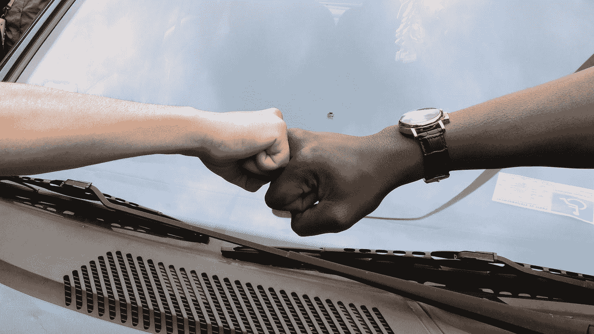
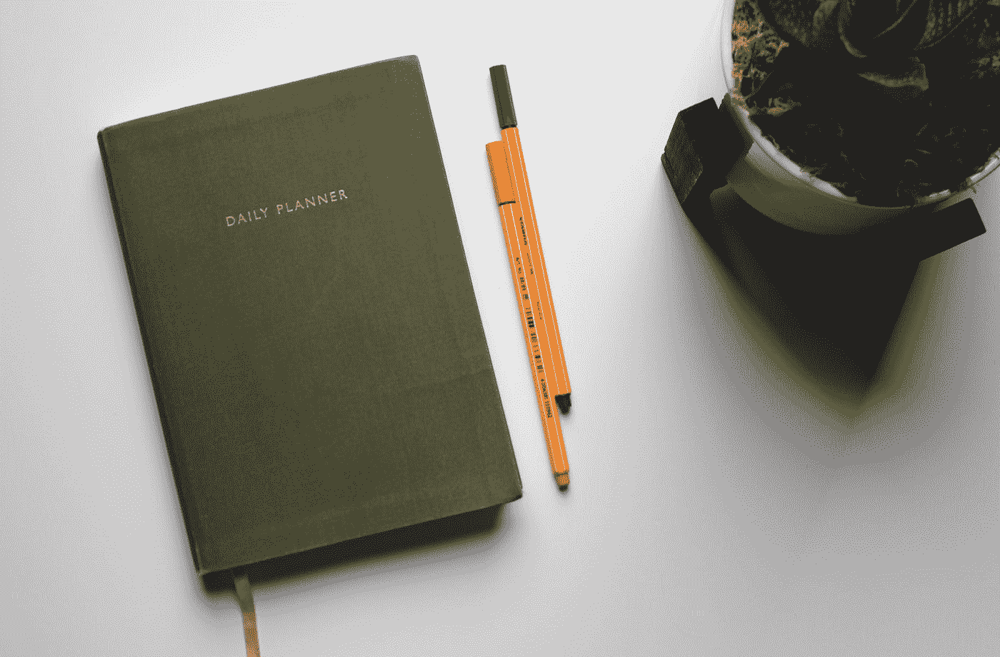
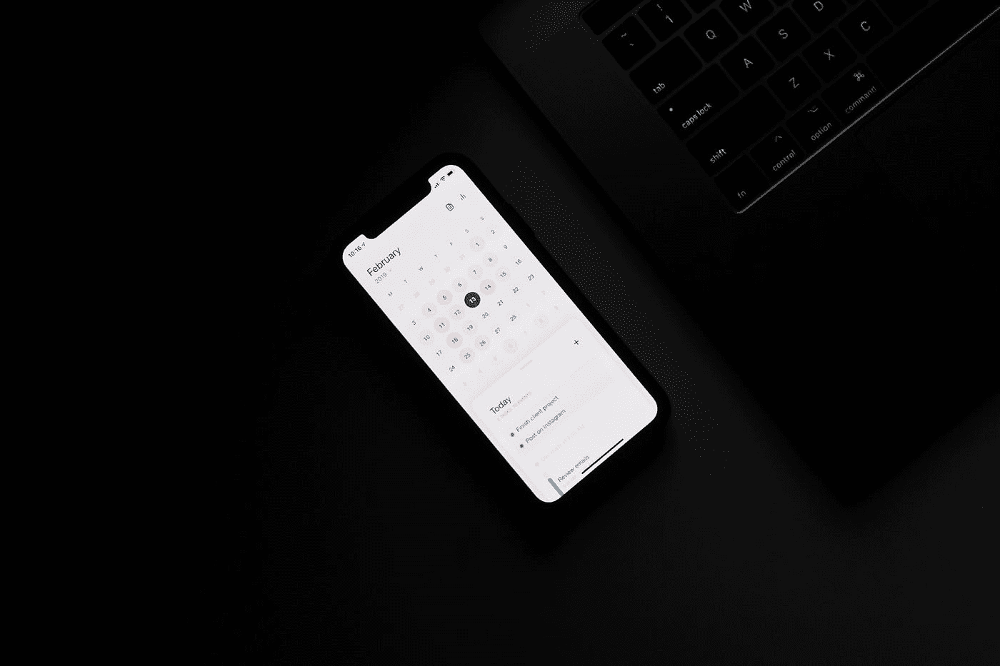

# 科技只会让你变聪明。

> 原文：<https://medium.com/geekculture/technology-is-only-making-you-smart-bd38779f2e61?source=collection_archive---------27----------------------->

## 创新的好处完全取决于你如何看待它。

> 妈妈:儿子，关掉手机，开始学习吧。儿子:妈妈，我的手机电池再过 10 分钟就要没电了。妈妈:孩子，你已经说了半个小时了。

Photo by [Alex Kotliarskyi](https://unsplash.com/@frantic?utm_source=medium&utm_medium=referral) on [Unsplash](https://unsplash.com?utm_source=medium&utm_medium=referral)

在说任何话之前，我们必须承认，我们在家里也看到过类似的对话。我们已经看到自己如此程度地利用技术，以至于弊大于利，即使在意识到这一切之后，我们大多数人都倾向于忽视它。所以这需要一个很好的引用:

> “技术和我们创造的一样聪明”

我根本不知道是谁写了这句话，但是这句话背后的意思非常清楚。这完全取决于用户如何利用这项技术。例如，如果你一整天都在狂看你最喜欢的网络连续剧的新一集，而不是仅仅为了从日常生活中放松而看，那就完全不同了。

我们不必把科技中的所有东西都硬塞进我们的大脑，但反之亦然。我们应该把技术作为我们身体的延伸，来完成我们不想做的重复性工作。

## 了解区别

Photo by [Alexis Fauvet](https://unsplash.com/@childeye?utm_source=medium&utm_medium=referral) on [Unsplash](https://unsplash.com?utm_source=medium&utm_medium=referral)

让我们讨论一下区分聪明用户和附加用户的那条细线。总的来说，我们有一种倾向，认为在技术的保护伞下只有数字技术，但技术不仅仅是技术，一个小例子是用一个按钮来摇你的车窗也是一种技术。

在 YouTube 上消费视频的用户和那些付出额外努力来创作那些成为许多人视觉享受的视频的人之间，可以看到一个主要的区别。他们都可以使用电话、笔记本电脑、麦克风等技术，但一个人用它来消费可用的内容，而另一个人付出额外的努力，这使他变得聪明。

智能手机被认为是人类最伟大的发明，但对一些人来说，它可能会上瘾，因为他们会浏览整个社交媒体账户。但是，如果我们考虑它的另一面，那么它可以帮助你创建提醒，警报，与你所爱的人联系如此之快。

作为这些智能手机的聪明用户，你可以安排你的一天，并与合适的人联系，这些人可以帮助你成长为一个聪明人。

Photo by [Markus Spiske](https://unsplash.com/@markusspiske?utm_source=medium&utm_medium=referral) on [Unsplash](https://unsplash.com?utm_source=medium&utm_medium=referral)

负责监督网络持续发展的万维网联盟(W3C)主任蒂姆·伯纳斯·李说:“当我们犯错误时，我们不能责怪技术”。这是正确的说法，如果我们滥用技术，那是我们的错，我们不能正确地利用它，而不是技术。

让我们来讨论一下我用来提高工作效率的技术，现在我高度依赖谷歌生态系统来保存和管理我的日常事务。

## 谷歌任务

Photo by [Savannah Wakefield](https://unsplash.com/@sw_creates?utm_source=medium&utm_medium=referral) on [Unsplash](https://unsplash.com?utm_source=medium&utm_medium=referral)

谷歌任务，我用它来维护我在未来几天应该做的事情，因为它有一个提醒功能，可以帮助我设置工作提醒，这样我就不会拖延。

## Google keep

Photo by [Leon](https://unsplash.com/@myleon?utm_source=medium&utm_medium=referral) on [Unsplash](https://unsplash.com?utm_source=medium&utm_medium=referral)

如果你在苹果生态系统上，你一定用过迄今为止最好的 notes 应用程序 Apple notes app，但 Apple notes app 的跨平台支持很差。虽然我喜欢苹果笔记的应用程序版本，但我同样不喜欢苹果笔记应用程序的在线版本。所以我转而使用 Google keeps，它为你提供小标签，你可以用它来存储你的信息，并根据标签进行分类。谷歌的 USP 坚持认为它是跨平台的。你可以在任何流行的浏览器上打开它的在线版本。

## 谷歌日历和提醒

Photo by [Ales Nesetril](https://unsplash.com/@alesnesetril?utm_source=medium&utm_medium=referral) on [Unsplash](https://unsplash.com?utm_source=medium&utm_medium=referral)

不言而喻，一个好的日历应用程序是我们都需要的。有些事情发生在一年左右之后，但作为个人，我肯定记不清所有的事情了。对我来说，谷歌日历是一个救星，我可以在谷歌日历的帮助下提醒任何小事，比如维修我的自行车，支付一些经常性的账单。

所以这个列表是无限的，我可以继续解释我如何有效地使用技术。我个人使用谷歌的应用程序来成为智能技术用户，但你可以使用任何你觉得有用的软件或应用程序。另外补充一下，我可以随时从谷歌切换到任何其他平台。谷歌生态系统是我现在喜欢的东西，也许在未来，如果我喜欢别的东西，我可以很快跳上去。

我并不是说我不浪费我的时间在那些无休止的滚动上，但我尽量把它们减到最少，我尽量利用技术好的一面。

现在大多数数码设备都有时间跟踪功能，我会推荐使用这些功能。试着了解你的大部分时间都花在了哪里，这样你就可以为自己制定一个总体计划来减轻这些挑战并充分利用技术。你必须做所有的斗争，没有人能替你做。你可以从无限的来源得到建议，但是除非你有做某事的意愿，否则你无法实现它。

## 最后的想法

我将把我的案例放在这里，因为这篇文章的目的是向这个全球世界的其他公民展示技术如何对我们有用。用一种能帮助你成长的方式来利用它，即使是看一部网络连续剧。首先，不要责怪自己沉迷于某件事，而是去做那些事情，因为我们在这个地球上的时间非常有限，要充分利用它。