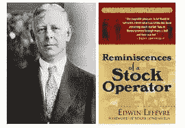

# 来自“交易者剧本”和华尔街故事之狼的十个永恒的投资教训

> 原文：<https://medium.com/geekculture/ten-timeless-investing-lessons-from-the-traders-playbook-and-the-original-wolf-of-wall-streets-8cda6316fd0b?source=collection_archive---------18----------------------->

> 选自埃德温·勒菲弗尔的《股票经纪人回忆录》

杰西·利弗莫尔是华尔街的鼻祖。他开始在当地的桶装商店行骗，最终垄断了棉花市场，并策划了重大的市场操纵。他赚了几百万，破产了三次。

Jesse Livermore and *Reminiscences of a Stock Operator*

埃德温·勒菲弗于 1923 年出版了《股票经纪人回忆录》,讲述了杰西·利弗莫尔的一生。如今，他更为人所知的身份是华尔街之狼。这本书受到了高度赞扬，被许多人称为“投资者剧本”。前美联储主席 Alan Greenspan 称这些教训是投资智慧的源泉。

那么，一本 98 岁高龄的股票操作者传记能教给我们什么呢？在过去的 5 年、10 年、20 年里，发生了令人难以置信的巨大变化，市场也在不断发展。投资从未像现在这样容易获得。任何人、任何地方都可以在瞬间投资任何东西。点击一下，你就拥有它了。这就带来了一个问题:生活在 100 年前的人的教训有什么关系？第一课很简单:

1.  **“华尔街没有什么新鲜事。这是因为投机活动由来已久。”**

从一本有将近 100 年历史的书中来看，这是相当丰富的，但它仍然是真实的。问题刚刚变了。AAPL 会超过收益吗？美联储会降息吗？通货膨胀会上升吗？考虑到当前的市场状况、媒体、你过去的经历以及一千种其他可能的因素，你的推测可能与你旁边的人不同。不管你是摩根大通的分析师还是普通交易员，投机都是不可避免的。每个人都有自己的看法，你如何投机决定了你是赢是输。

**2。“在市场上生气对你没有任何好处”**

你会输的。你会再次失败。你越快意识到这一点，你就会越快成为一个更好的投资者。最好的对冲基金，哈佛博士，沃伦巴菲特都输了。期待有时会失去。它发生在最好的投资者身上，也会发生在你身上。从你的失败中吸取教训，继续寻找下一个机会。用现代的话来说就是:不要为打翻的牛奶哭泣。

**3。一种是普通的傻瓜，认为自己在任何时候任何地方都做错了事情；另一种是华尔街的傻瓜，认为自己必须一直交易**

我相信这句话比 100 年前更加贴切。这是如此容易的一天交易和跳跃的下一个趋势股票。许多人陷入了一个谬论，认为每天交易从长远来看是有益的。只有一小部分日内交易者最终是积极的。

**4。“根据经验程度不同，傻瓜也各不相同”**

即使有经验也不能让你免于犯愚蠢的错误。事实上什么都不会。市场上有一千种亏损的方式，这个列表永远不会是零。尽管人工智能和定量分析程序的开发者在金融市场和计算机科学方面有丰富的经验，但它们也会出错。这就引出了下一句话:

**5。“没人能免于做傻事”**

精英中的精英也会犯错。无论你的信念、假设或猜测有多好，总有可能会出现一场糟糕的比赛。杰西·利弗莫尔做到了，沃伦·巴菲特做到了，你也会。从中吸取教训，继续前进。

**6。“公众每年因为接受这种“半官方”的说法而损失数百万美元，因此是可信的”**

根据通货膨胀调整这个报价，公众每年会因此损失数十亿美元。是的，u/tothemoon69 刚刚在华尔街 bets 上发布了一些可靠的 DD，评论使它看起来可信。随着互联网和媒体的普及，很容易陷入确认偏见和“半官方”声明。自己的尽职调查，一分钱一分货。

**7。“既能正确又能静观其变的男人不多见”**

这句话在今天相当于尽职尽责地拥有一双钻石手。一旦你原来的头寸出现亏损，减少亏损并继续前进似乎不是一个坏主意。没有人能把握市场时机，长期头寸需要时间才能转化为利润。有很多人可以不犯错，也有很多人可以正确，不会退缩。找到正确的中间立场并坚持到底是一个伟大的长期投资者的标志。

**8。“当一个人错了的时候，唯一能做的就是通过停止犯错来变得正确”**

再一次，大家都输了。你不可能每次都是对的。有能力并谦逊地承认自己错了，并在无法挽回之前抽身而出，这是一种美德。另一个流行的现代说法是:市场保持非理性的时间比你保持偿付能力的时间更长。把握市场时机是不可能的，但如果情况发生变化，当机会变得更有利时，你总是可以重新投资。

**9。一个交易者，除了研究基本条件、记住市场先例、记住外界公众的心理以及他的经纪人的局限性之外，还必须了解自己，并针对自己的弱点做好准备**

情绪一直是市场的驱动力。骄傲、贪婪和恐慌驱使许多投资者。哪一个驱动你？从长远来看，意识到自己的缺点并保护自己免受其害会比任何一场胜利都让你赚更多的钱。了解市场和你自己的心理将防止快速亏损，并可能为长期成功铺平道路。

10。“我已经说过很多次了，而且怎么说都不为过，多年的股票操作经验让我相信，没有人能持续跑赢股市”→“尽管在某些情况下，他可能在个别股票上赚了钱。”

大多数投资者都有他们的时刻，他们的一个大胜利。每个人都吹嘘这些，但很少谈到他们的损失。新投资者可能会对市场的真实运作和人们的真实记录有所误解。退休规划者、沃伦巴菲特(Warren Buffet)和财富管理公司推荐广泛的多元化投资组合和 ETF 是有原因的。从长远来看，它被证明是有效的。

但是，总有撞上大戏的机会。一夜成功确实会发生。最初的华尔街之狼抓住了机会，你也应该如此。你的风险承受能力可能比你的邻居高，比你的朋友低，反之亦然。记住这些建议，你将更难失败。自从*出版《一个股票操作者的回忆》以来的 98 年里，发生了很多变化。然而，更多的人保持不变。*

嘿，谁知道呢，如果你能设法做到正确并耐心等待，你可能会很幸运。**或者你可能是个笨蛋。**