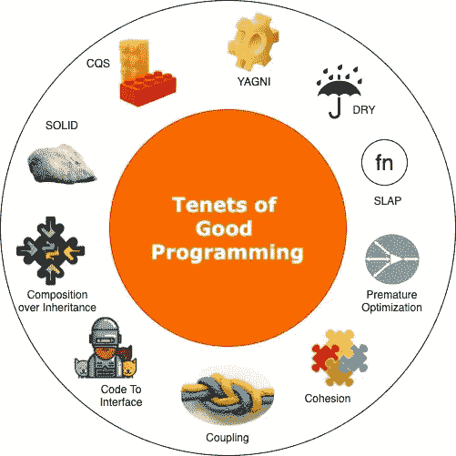
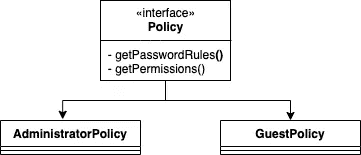
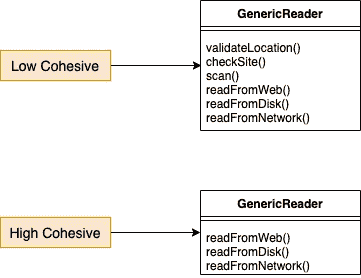
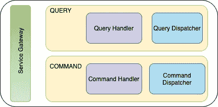
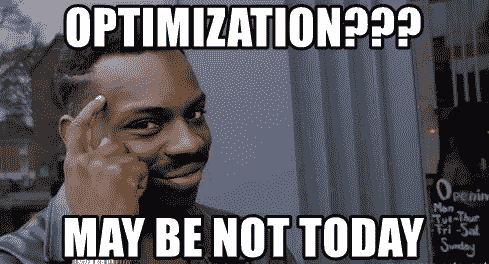

# 优秀编程的原则:2021 年每个开发人员都应该知道的十个常青软件开发原则

> 原文：<https://medium.com/geekculture/tenets-of-good-programming-263c583cef24?source=collection_archive---------12----------------------->



作为一名开发人员，我们都喜欢编写代码，解决业务问题或自动化流程，并努力写出好的代码。但是，怎样定义一个好的代码呢？好的代码是干净的、专注于一件事的、易于他人阅读的、可重用的，并且做预期要做的事情的代码。但是我们如何确保我们的代码具有所有这些属性呢？

嗯，我们作为开发人员并不完美，也没有这样的系统可以告诉我们代码中的所有问题或者将来会出现的问题。即使通过拉请求、单元测试和 sonar 规则的手工代码审查也永远不会发现代码中的每个错误。偶尔你甚至会想，为什么以前的程序员会用这么扭曲的方式实现一个特定的方法或者一个类。这是因为相同的功能可以用大量不同的方式实现，每种方式都是独特的。有这么多的可能性，哪一个是最好的呢？什么是好的解决方案？为什么一个比其他的好？事实是，只要目标实现，所有这些都是有效的。但是，在选择正确的解决方案时，确实需要考虑一些方面。这就是编码标准和质量在编程中变得重要的原因。作为负责任的开发人员，我们应该实践代码质量，遵循编程标准，以确保高质量的代码。

让我们来看看优秀编程的 10 个常青原则，从长远来看，它们将有助于构建和维护高质量的代码。实践这些的正确方法是不断地使用它们，并在我们编写代码时应用它们。

**1。单级抽象原则(SLAP)**

这对代码抽象和编写高质量的程序起着非常重要的作用。这个原则在鲍勃大叔的《干净的代码》中有所解释，并在尼尔·福特的《高效程序员》一书中被创造出来。基本思想是一个类中一个方法的所有语句应该属于同一抽象层次。如果有一个属于较低抽象级别的语句，它应该转到包含该级别语句的私有方法。这样做将会产生更小的方法。让我们通过一个例子来形象化这一点。

之前:

```
**public** **static** **boolean** isActuallyEmpty(String str) {
   String result = str == **null** ? **null** : str.trim();
   boolean isEmpty = result == **null** || result.isEmpty();
   return isEmpty;
}
```

掌掴后:

```
**public** **static** **boolean** isEffectivelyEmpty(String str) {
   **return** *isEmpty*(*trim*(str));
}
**private** **static** **boolean** isEmpty(String str) {
   **return** str == **null** || str.isEmpty();
}
**private** **static** String trim(String str) {
   **return** str == **null** ? **null** : str.trim();
}
```

所以，我们可以看到 post 拍打代码的效果，看起来是多么的干净优雅。因此，从技术上讲，这可以通过两种方式实现:

*   **提取方法** —从一个(可能很长的)方法中提取一部分代码到一个新的方法中，以提高源代码的内聚性和可读性。
*   **提取类** —有时候提取方法会导致新方法有大量的参数。或者，可以将参数转换为该类的字段。但是这通常会导致不良的内聚性。因此，在这种情况下，提取一个新类更好。

**2。编程到一个接口，而不是一个实现**

这是一个非常简单的原则，但却是编程的一个非常基础的构件。**编程到一个接口在这里实际上意味着编程到一个超类型，它可以是一个接口或者一个抽象类**。这里的要点是通过对超类型编程来利用多态性，这样实际的运行时对象就不会被锁定在代码中。简单地说，客户不应该调用类的具体实现，而是应该调用类的 API 接口，不应该知道实现的细节。这个原则是策略模式、DAO 设计模式和工厂模式的构建块。



从 Java 的角度来看，接口编程的另一个重要方面是 Java 不支持多重继承，这意味着一个类不能一次扩展多个类，但是一个类可以实现多个接口，从而提供更多的控制。

**3。高内聚力**

**内聚**指的是类能做什么。**低内聚力**将意味着该类正在做很多事情，它是宽泛的，并且在职责方面不明确。**高内聚**意味着类专注于它应该做的事情，即只关注与类的意图相关的方法。这里的想法是，应该在同一个组件中找到具有相似功能的代码。用高内聚创建的类或方法是针对一个特定的目的，而不是执行许多不同的目的。我们应该努力增强凝聚力。这可以通过德米特的**定律和**单一责任**原则策略来实现。**



上面的例子展示了低内聚 API 和高内聚 API 的对比。例如， *GenericReader* 类应该只包含如何从不同来源读取数据的方法。 *GenericReader* 类不应该负责验证源或位置，甚至扫描。更好的方法是将验证责任转移到另一个类。

**4。松耦合**

**耦合度**定义为一个类了解其他类的程度。**紧耦合**意味着一组类高度依赖于彼此。当一个类承担了太多的责任，或者一个问题分散在许多类中而没有自己的类时，就会出现这种情况。紧密耦合的类会使更改和维护代码变得困难；因为类是紧密结合在一起的，所以做出改变可能需要改变其他相关的类，因此从长远来看维护应用程序会变得很困难。鉴于**松散的** **耦合**意味着类之间的接口会更少，所以如果我们需要更改一个类的公共接口，其他类中需要更改以保持同步的地方会更少。因此，基本上，这个想法是为了减少耦合，这可以通过编程接口技术和单一责任原则来实现。

```
public interface IRun {
    void doRun();
}
public class MyRunner implements IRun {
  void doRun() {
     // run
  }
}// Tight Coupling
public class TightCoupled {
   MyRunner runner;
   public TightCoupled(MyRunner runner){
      this.runner = runner;
   }
   public void run(){
     runner.run();
   }
}// Loose Coupling
public class LooseCoupled {
   IRun runner;
   public LooseCoupled(IRun runner){
      this.runner = runner;
   }
   public void run(){
     runner.run();
   }
}public class MainApp {
   public static void main(String[] args) {
     // tight
     TightCoupled tc = new TightCoupled(new MyRunner());
     // loose
     LooseCoupled lc = new LooseCoupled(new MyRunner());
   }
}
```

比方说明天，如果我们需要一种新的流道类型，如下所示

```
public class MyRunner2 implements IRun {
  void doRun() {
     // run
  }
}
```

你能猜到会发生什么吗？是的，你是对的。您需要对紧密耦合的代码进行修改，并添加这个新的 runner，然而，另一方面，您不需要对松散耦合的代码进行任何修改。您可以通过新的具体实现，它将被多形态地应用。

**5。重组合轻继承**

当设计一个类来构建另一个类的行为时，我们有两种选择: ***继承*** ，其中一个类扩展另一个类；或者 ***复合*** ，其中一个类包含另一个类的实例。组合和继承都通过不同的方法促进代码重用。那么选哪个呢？我们需要根据一个类 ***的每个实例是*** 另一个类的实例还是 ***有*** 另一个类的实例来选择。


通过继承创建的类和对象是紧密耦合的，因此改变继承关系中的父类或超类有破坏代码的风险。因此，我们耦合的基本原理在这里失效了。我们更喜欢类之间的松散耦合，使用组合技术，我们可以实现这一点，并且可以更容易地在不破坏代码的情况下更改组件。

**作文受青睐，不应该意味着完全不用继承**。在一个系统中使用继承是安全的，在这个系统中，子类和超类的实现都在同一程序员的控制之下，或者当扩展专门为扩展设计和记录的类时。继承更多的是在编译时范围内，但是在有些情况下，我们可能需要在运行时动态地扩展类的行为，并向对象添加新的职责，这是我们在设计时可能没有想到的，组合非常适合。当有疑问的时候，记得选择组合而不是继承。

**6。固体**

**坚实的**原则是编程的基础。重要的是，我们应该理解其含义，并将其应用到我们的日常编码中。历史上， **SOLID** 是罗伯特·c·马丁(Robert C. Martin)发明的首字母缩写词，也被称为面向对象编程五大基本原则的鲍勃大叔。但是这些原则并不局限于面向对象的设计，它的威力还不止于此。这些原则也是现代分布式微服务和 API 的基础。换句话说，通过实践这五个原则，我们不仅能够创建一个持久的、可维护的应用程序，而且能够在设计微服务时使用它们。

*   **单一责任原则**:一个类应该有一个*且只能有一个*变更原因。如果一个类有不止一个改变的理由，这意味着它有不止一个责任，那么从长远来看，它可能成为一个容易出错和维护的噩梦。
*   **开闭原则**:一个类应该是开放的用于扩展，封闭的用于修改。这归功于伯特兰·迈耶。写可以扩展的类(相对于可以修改的类)，把变化的和不变化的分出来，把变化的抽出来放到自己的类里，封装起来。
*   Liskov 替换原则:这是 Barbara Liskov 创造的，她说一个类应该可以被其他扩展该类的人替换。换句话说，程序中的对象应该可以用其子类型的实例替换，而不会改变程序的正确性。
*   **接口分离原则**:几个专用接口比一个通用接口更好。将 fat 接口减少为多个更小、更具体的特定于客户端的接口。接口应该更依赖于调用它的代码，而不是实现它的代码。类不应该实现违反 SRP 的方法。
*   **依赖倒置原则**:一个类应该依赖抽象而不是实现。这意味着类依赖必须专注于做了什么，而忘记它是如何完成的。

**7。命令查询分离**。

这也是一个非常重要的原则，简单来说，这意味着我们应该有独立的读和写功能。这个原则规定查询不应该改变状态，只有命令应该对此负责。换句话说，类中的每个方法要么是执行某个操作的命令，要么是向调用者返回数据的查询，但不能两者都是。方法只有在不产生副作用的情况下才应该返回值。



读写分离将满足关注点分离原则，并为软件带来规模和效率。这个原则已经发展成为**事件驱动架构的标准，比如 CQRS 和事件源**。它很好地坚持了坚实的原则，并促进了低耦合和高内聚。

**8。你不需要它**。


你不会需要它或者 YAGNI，这个术语来自极限编程(XP)的简单设计概念。该设计声明只实现当前需要的东西。现在为未来构建的更强大的解决方案可能会增加构建成本，因为需求可能会发生变化，并且今天的解决方案可能在未来变得不可用。所以，总是在你真正需要的时候实现，而不是在你预见到你需要的时候。我们拥有的代码越少，我们要维护的代码就越少，引入 bug 的可能性就越低。

**9。保持物品干燥**。


不要重复自己，又名**干**也称为真理的单一来源。这是一个非常简单明了的原则，但是对于编写易于维护和重用的代码来说非常重要。它说要避免重复的代码，就这么简单，通过抽象出共同的东西，然后把它们放在一个位置。DRY 原则背后的想法是重用我们以前编写的代码，而不是重复它。好处是维护更少的代码，重用已经工作的代码，并帮助人们发现代码中新的抽象层次。

那么，**是不是就是把重复的代码去掉，移到一个地方**？嗯，这不仅仅是避免在多个地方更新代码的需要。如前所述，DRY 指的是某一特定信息或行为的单一来源。但是单一来源也必须有意义！因此，DRY 不仅仅是消除重复，它也是关于如何分解系统功能的良好决策。

**10。避免过早优化**。

过早优化是这样一个过程，我们从一开始就试图使我们的代码更有效，或者说，即使你的代码没有 100%地工作，我们也在考虑如何使它更通用，我们应该使用线程池等。如果你有一个清晰的设计，并对产品如何在开始时随着时间的推移而发展有明确的要求，那么就不要停止这样做。如果我们有这些，我们就永远不会敏捷。对吗？作为开发人员，我们的第一个猜测应该是顺序解决方案应该足够快。只有在你衡量了你的代码性能，它很慢，不符合你的要求，你应该去优化像多线程。



那么，**避免过早优化是不是意味着我们永远不应该进行任何类型的优化？**从技术上来说，没有。避免过早优化意味着我们应该避免微优化，比如如果我们可以并发运行程序，它会更有效，或者如何管理内存泄漏，但相反，我们应该更多地关注于实现有效的算法和编写更好的程序。基本上，不要优化，直到你有一个非常清晰的和未优化的解决方案，并总是衡量性能之前和之后的每一次优化尝试。

**参考书目**

[](https://www.oreilly.com/library/view/head-first-design/9781492077992/) [## Head First 设计模式，第二版

### 你将从这本书中学到什么？你知道你不想重新发明轮子，所以你寻找设计模式:

www.oreilly.com](https://www.oreilly.com/library/view/head-first-design/9781492077992/) [](https://www.oreilly.com/library/view/clean-code-a/9780136083238/) [## 干净的代码:敏捷软件工艺手册

### 即使是糟糕的代码也能运行。但是如果代码不干净，它会使开发组织陷入困境。每年…

www.oreilly.com](https://www.oreilly.com/library/view/clean-code-a/9780136083238/) [](https://www.oreilly.com/library/view/the-productive-programmer/9780596519780/) [## 高效的程序员

### 任何以开发软件为生的人都需要一种成熟的方法来更好、更快、更便宜地生产软件。富有成效的…

www.oreilly.com](https://www.oreilly.com/library/view/the-productive-programmer/9780596519780/)