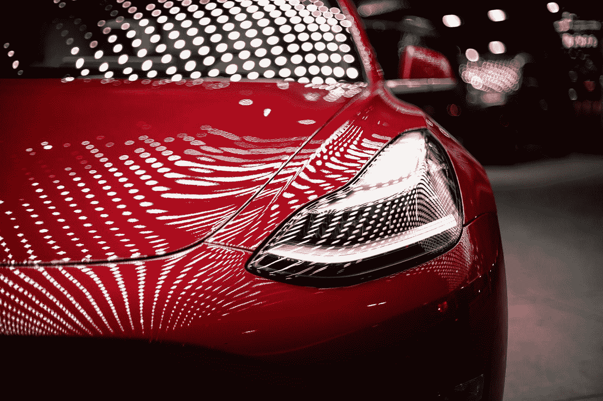
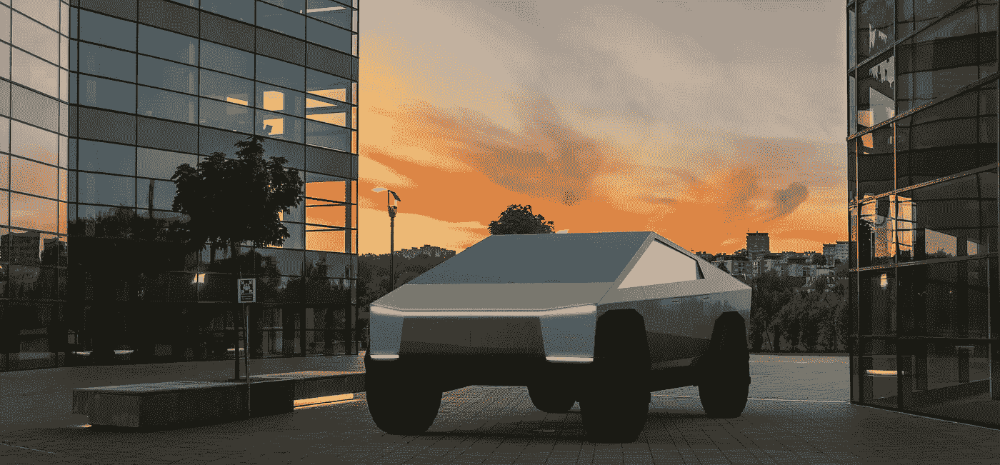

# 特斯拉即将解决 Autonomy，这是如何

> 原文：<https://medium.com/geekculture/tesla-is-about-to-solve-autonomy-this-is-how-455884936648?source=collection_archive---------4----------------------->

## 它比你想象的要近

## 特斯拉在数据和技术上的海量优势；他们迷人的自动驾驶能力

Photo by [Vlad Tchompalov](https://unsplash.com/@tchompalov?utm_source=medium&utm_medium=referral) on [Unsplash](https://unsplash.com?utm_source=medium&utm_medium=referral)

特斯拉目前正在推出完整的自动驾驶测试软件。这将使其整个车队几乎可以在任何地方自主驾驶。这个软件包括像召唤你的车(有点像蝙蝠侠或神奇先生)、自动变道和停车、交通和停车标志控制等功能。在本文中，我将讨论他们是如何做到这一点的，以及这些年来他们的方法是如何改进的。

# 介绍

毫无疑问，特斯拉在人工智能研究方面处于世界领先地位。在过去的几年里，它已经表明它不仅仅是一个汽车制造商，证明了它在技术方面的能力。

当特斯拉首次推出 autopilot 时，正如今天的大多数其他汽车制造商一样，汽车可以留在自己的车道内，并与前面的汽车保持适当的距离。它不能变道、出口、超车、避免撞车等等。自动驾驶汽车的最终目标是能够驾驶到人类可以驾驶的任何地方，同时与人类驾驶员一样安全，甚至比人类驾驶员更安全。

从许多方面来看，特斯拉的自动驾驶在某些方面是成功的，在统计上比普通司机安全得多。在 2021 年的 Q2，开着自动驾驶仪驾驶特斯拉会让你发生事故的可能性降低三倍以上。事实上，**特斯拉自动驾驶仪变得如此之好，以至于他们没有收集足够的车祸数据来训练他们的模型。当然，这是一个好问题。但是特斯拉想出了一个变通办法。**

随着全自动驾驶(FSD)测试版的推出，特斯拉比以往任何时候都更接近解决自主性问题。

# 它是如何工作的？

自动驾驶汽车**从传感器数据中提取信息，然后用于生成周围道路的矢量空间表示**。从这个向量空间，**汽车可以决定**何时转弯、加速和刹车。

本文将探讨特斯拉生成这个向量空间的方法这些年来是如何改进的。

# 传感器

汽车制造商正在实施各种各样的传感器来实现自动驾驶。常见的传感器有雷达、激光雷达和相机。业内人士认为，使用纯摄像头驾驶将被证明是极其困难的。像激光雷达这样的其他传感器可以穿透雨水、雾影和阳光。雷达还提供了更精确的深度表示。出于这些原因，该行业的其他市场领导者，如 Waymo，选择利用所有三种传感器。然而，在其他问题中，激光雷达和雷达传感器需要额外的成本，这使得它们在设计自动驾驶汽车时不那么有吸引力。

特斯拉选择仅在他们的最新车辆上使用视觉系统。从 2021 年 5 月起，特斯拉汽车不再配备雷达传感器，取而代之的是纯粹依靠摄像头视觉[2]。这对该行业来说是一个突破性的转变。我们人类只利用两个可见光传感器。理论上，一辆装有八个摄像头的特斯拉可能比任何人都安全得多，而且没有必要使用其他传感器来实现这种安全水平。

# 旧管道

几年前，特斯拉的自动驾驶仪是这样工作的:

*   从传感器捕捉图像并收集数据
*   图像由 Res-Nets 逐一处理(Res-Nets 是一种常用的卷积神经网络架构，支持相关特征提取)
*   然后，特征通过 BiFPN 模型(在图像内具有空间意识的模型，改进相关的特征提取)
*   然后，处理后的图像用于物体检测、标志检测、车道检测等。

所以图像被一帧一帧的处理，一个相机一个相机的处理。然后提取特征，根据汽车的空间感知，通过拼接来自每个传感器的信息来重建汽车周围区域的向量空间。

这种方法是成功的，因为它在对物体检测、标志检测和车道检测进行预测之前共享相同的预处理流水线。驾驶汽车时，速度是关键，几毫秒的时间可能是撞车或避免撞车的差别。

尽管这种方法足以成功地沿直线行驶，但是当试图识别路缘和道路上的其他特征时，矢量空间的拼接使得系统不准确。当汽车试图在除高速公路以外的任何道路上行驶时，这导致了许多困难。

# 今日特斯拉

新的模型架构从所有摄像机获取图像，然后使用这些图像直接更新向量空间，而不是对单个图像进行预测，然后缝合一个潜在空间，然后在其中驾驶汽车。

这有很多好处。从单帧预测来看，图像不能彼此共享信息，因此，如果某个东西超出了该帧的视野，它就不能在向量空间中被解释。而且一个物体在两个摄像头之间，物体会被检测到两次，如果拼接不正确可能会在向量空间出现两次。

新系统提供了更加准确和稳定的预测。向量空间被更新为最高概率估计，同时考虑道路测量的所有先前输入。这是通过空间递归神经网络架构来完成的。这允许模型选择何时更新向量空间。例如，如果相机视觉中存在遮挡，如汽车挡住路缘，则模型可以选择不更新该帧的向量空间中的路缘位置。

使用这种方法，特斯拉的自动驾驶仪可以接近完美地呈现周围的道路，方便汽车的导航。

# 决策

除了他们的视觉模型和解释汽车周围的空间，特斯拉还有非常强大的规划工具，允许汽车决定道路上的最佳路径。这条路径将考虑到驾驶员以及道路上其他用户的舒适性，同时实现其目标，无论是超车、出口、到达道路上的某个点、停车还是其他。

# 数据

因此，你可能会想，特斯拉的所有竞争对手需要做的就是开始直接预测向量空间，而不是逐个图像地进行预测，并拼接一个不太准确的向量空间。但是，要在向量空间中进行预测，您需要数据来训练您的模型。更具体地说，您需要标记的向量空间数据。

特斯拉在美国有自己的专业数据贴标机团队，由 1000 名数据贴标机组成。标记不再在每个图像帧中执行，而是直接在向量空间上执行。这极大地提高了生产效率，在这个向量空间中标记一次会在所有相机和许多帧中产生该对象的标签。

Photo by [Mopic](https://www.shutterstock.com/g/nder) on [Shutterstock](https://www.shutterstock.com/image-illustration/autonomous-driving-concept-illustration-3d-rendering-1192385923)

为了扩展数据集，特斯拉使用了自动标记技术。他们通过多辆汽车对同一位置的向量空间进行预测，并结合这些预测来产生准确的标签。

特斯拉的无限数据优势使其领先任何竞争对手数年。他们的整个车队都配备了传感器，收集用于改善自动驾驶的数据

最后，特斯拉开发了一种极其逼真的模拟引擎，用于进一步的培训，特别是在模型可能表现不佳的边缘情况下。

Photo by [Mike Mareen](https://www.shutterstock.com/g/Mario+Marini) on [Shutterstock](https://www.shutterstock.com/image-illustration/szczecin-polandmay-2021tesla-cybertruck-city-illustration-1982800043)

特斯拉的数据优势是巨大的。生产的每辆特斯拉汽车都在收集数据，特斯拉车队每天都在增长。特斯拉收集的数据越多，这些模型就越好，它们学到的边缘案例就越多。我们离完全自动驾驶不远了。

# 结论

特斯拉自动驾驶仪最近改进的最大推动因素之一是模型架构的变化。他们的模型不是一帧一帧、一个摄像机一个摄像机地预测，而是直接输出到一个向量空间，供汽车在驾驶时做出决策。这是不可能的，因为他们动员了巨大的力量来为此目的收集足够的标记数据。在我看来，**用不了多久，你就可以开车去学校接你的孩子，**未来就在这里！

## 支持我

希望这对你有帮助，如果你喜欢它，你可以 [**跟我来！**](/@diegounzuetaruedas)

您也可以成为 [**中级会员**](https://diegounzuetaruedas.medium.com/membership) 使用我的推荐链接，访问我的所有文章以及更多:[https://diegounzuetaruedas.medium.com/membership](https://diegounzuetaruedas.medium.com/membership)

# 你可能喜欢的其他文章

[可微发电机网络:介绍](https://towardsdatascience.com/differentiable-generator-networks-an-introduction-5a9650a24823)

[傅立叶变换:直观的可视化](https://towardsdatascience.com/fourier-transforms-an-intuitive-visualisation-ba186c7380ee)

## 参考资料:

[1]特斯拉汽车安全报告，特斯拉，Q2 2021，[https://www.tesla.com/VehicleSafetyReport](https://www.tesla.com/VehicleSafetyReport)

[2]特斯拉支持，特斯拉，过渡到特斯拉愿景，[https://www.tesla.com/support/transitioning-tesla-vision](https://www.tesla.com/support/transitioning-tesla-vision)