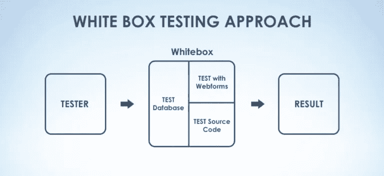

# 我从 DAST 转到了 SAST，事情就是这样的

> 原文：<https://medium.com/geekculture/testing-is-a-tedious-job-db94253f58d2?source=collection_archive---------32----------------------->

由 [Unsplash](https://unsplash.com/s/photos/two-computers?utm_source=unsplash&utm_medium=referral&utm_content=creditCopyText) 上的[伯克利通信](https://unsplash.com/@berkeleycommunications?utm_source=unsplash&utm_medium=referral&utm_content=creditCopyText)拍摄的照片

测试是一项乏味的工作。有如此多的方法，以及你必须运行的各种测试。与此同时，测试也不是我们可以忽视的东西，因为它对于确保我们的程序高效且正确地运行是如此重要。有单元测试、集成测试、安全测试——清单是无穷无尽的。SAST 和 DAST 也是重要的测试形式。

我过去经常使用 DAST 在我的应用程序中进行测试。然而，我的一个朋友建议我也应该去 SAST 看看，因为这可以改善我的测试过程。所以，有一段时间，我从 DAST 转到了 SAST。它们各有利弊，这取决于你想要达到的目标，所以在时间有限的情况下，一个可能比另一个更可取。在这篇文章中，我将写下我从 DAST 转到 SAST 的想法。首先，让我们回顾一下 DAST 的意思。

# 什么是 DAST？

DAST 是一种基于[黑盒测试](https://en.wikipedia.org/wiki/Black-box_testing)的测试方法。黑盒测试包括在没有底层架构、代码实现或关于应用程序如何构建的足够细节的情况下应用测试(任何类型的测试)。它根据输入和输出测试应用程序。

[来源](https://binaryterms.com/black-box-testing.html)

DAST 用于无法访问应用程序源代码的情况，或者不管应用程序是如何构建的都要进行测试的情况。它支持对您的应用程序进行实时测试。这种安全性测试大多是在应用程序处于生产或测试环境时完成的。

DAST 用于通过模拟恶意攻击来检测安全漏洞，以确定应用程序如何响应这些攻击。有了 DAST，您可以针对 SQL 注入和跨站点脚本等攻击测试您的应用程序。它还可以帮助您识别服务器配置错误。一些 DAST 工具也提供了关于如何解决此类漏洞的见解。

DAST 对我来说很有效，但是一旦我的朋友推荐了 SAST，我就不得不尝试一下。

# 什么是 SAST？

与 DAST 相反， [SAST](https://www.perforce.com/blog/kw/what-is-sast#what-is-sast) 基于对应用程序的结构和代码实现的完整了解来工作。这被称为白盒测试。在这种方法中，您正在根据应用程序的架构进行测试。SAST 通常用于在应用程序投入生产之前检测安全漏洞。它用于像开发人员一样测试应用程序。

[来源](https://testinggenez.com/types-of-white-box-testing-techniques/)

根据所使用的语言，SAST 通常用于解决已知问题。例如，在后端语言中，SAST 工具根据应该遵循的语言安全模式来分析源代码。任何违反这种模式的行为都会在编译过程中导致警告或错误。正如存在安全模式一样，也存在被证明有缺陷的已知模式。测试工具也会注意这些。

此外，一些 SAST 工具还会扫描应用程序的依赖关系。已经发现依赖项的一些包版本有缺陷，并且这些结果已经被一些组织记录在可公开访问的数据库中。一些 SAST 工具会根据这些记录检查您的依赖关系，并在使用了易受攻击的包时发出警告。

以我的经验来看，当我只有时间的时候，从 DAST 转到 SAST 是一次很好的经历。事实上，我发现它更好。

# 为什么 SAST 比 DAST 好？

值得注意的是，如前所述，选择哪种方法取决于你的优先顺序。对于另一个开发商/公司来说，DAST 可能是比 SAST 更好的选择。但是在这一部分，我将陈述为什么我发现 SAST 比 DAST 更好。以下是一些原因:

## 1.更容易调试

有了对组成应用程序的底层结构和代码的访问和了解，当发现安全问题时，调试起来就更容易了。​​

## ​​2.bug 的早期发现

尽管有一些错误(如[服务器配置](https://docs.microsoft.com/en-us/sql/database-engine/configure-windows/server-network-configuration?view=sql-server-ver15)错误或来自外部服务的错误)可能会进入生产，并且只能由 DAST 调试，但 SAST 向您保证，任何通过开发进行扩展的代码都很可能是安全的。在这种情况下，如果您依赖 DAST，攻击者可能会在您的 DAST 工具发现它们之前利用您的应用程序。

## ​​3.更容易修复错误，无需成本支出

对于在生产过程中发现的错误，可能需要立即更新，这可能是成本密集型的，并且可能在一段时间内限制您的用户，甚至使他们离开应用程序。另一方面，在应用程序投入生产之前发现的 bug 可以在不影响用户的情况下得到修复。

此外，DAST 可能会捕捉错误，但这是留给你，开发人员，找出哪里存在的错误。另一方面，SAST 向您展示了有错误的确切文件中的确切行。

## 4.基于软件的测试

DAST 是基于平台的测试方法，而 SAST 是基于软件的。这意味着 DAST 操作依赖于安装测试应用程序的平台。从所需资源的角度来看，配置这样的平台来满足您所有的测试需求可能是费力且昂贵的。相比之下，SAST 工具可以安装在代码编辑器或构建管道中。

# 结论

DAST 也有它的好处。有些 bug 只能在运行时发现，尤其是在应用程序依赖于第三方组件的情况下。但是，对于 DAST 和 SAST 都能发现的错误，我更喜欢在应用程序上线之前发现并修复它们。

这让我想到了最好的情况:SAST 和 DAST 的结合。不管需要额外的资源，这两种方法都是相关的。使用这两者可以让您在开发的早期阶段发现错误，也可以发现生产中存在的任何错误。测试是那些你可以做无数次的过程之一，因此找到一个好的策略和流程是很重要的。使用 DAST 和 SAST 都可以使你的测试过程更加全面。所以，如果你像我一样只用一种，试着两种都用！

​​

​​