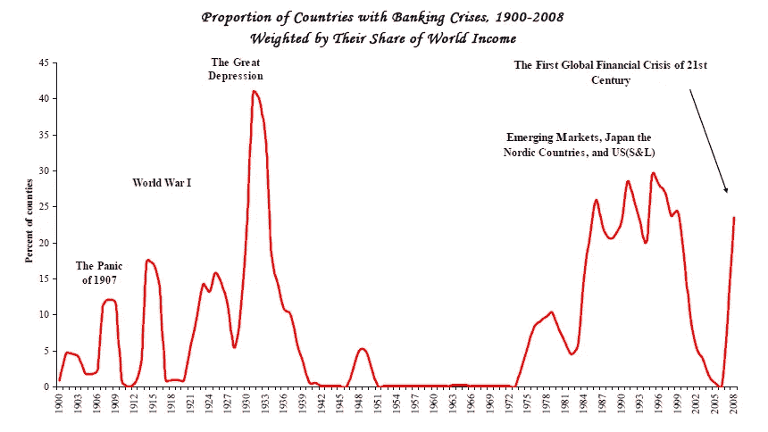
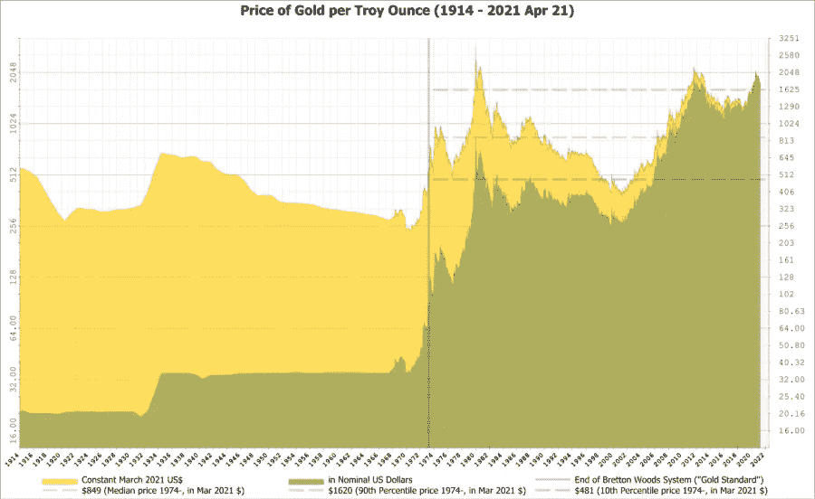

# 系绳作为中央银行

> 原文：<https://medium.com/geekculture/tether-as-a-central-bank-dedac6a8cf99?source=collection_archive---------11----------------------->

央行通常在没有任何准备金支持的情况下发行货币。Tether 能做同样的事情，成为第一个分散的中央银行吗？

我在[之前已经表达了对限制](https://sunzulab.com/research/is-tether-a-48-bln-scam/)(又名 USDT)的怀疑，以及支持代币发行的实际储备水平仍存在高度不确定性的事实。尽管这种不确定性造成了负面报道，但历史上类似的情况经常发生。在中央银行成为规范之前，许多商业银行和政府在发行货币方面很随意，哪怕只是为了资助不时发生的战争。事实上，在 2008 年金融危机和 2020 年初的 COVID 经济灾难之后，今天的央行难道不能说同样的话吗？

第二次世界大战结束时，为了避免过去的货币危机重演，并为重建和国际贸易奠定稳定的基础，发达经济体的政府形成并坚持一个新的货币协定，即[布雷顿森林体系](https://en.wikipedia.org/wiki/Bretton_Woods_system)。

The Mount Washington Hotel where the Bretton Woods conference took place from Jul. 1st to Jul. 22nd 1944

这个想法很简单:固定最重要货币之间的汇率，用可测量和可控的实物资产库存支持流通中的每一美元，你就能立即抑制通胀压力。此外，你还可以防止政治议程干扰货币政策(比如以贸易战的形式)。

布雷顿森林体系选择的资产是黄金，这是当时的自然选择。由于供应量巨大但增长缓慢，黄金已经是一种交易活跃的商品，其交易和储存已经组织得很好。等式的最后一个要素是*可兑换性*:任何拥有黄金的人都可以以固定汇率获得美元(或任何其他货币)，反之亦然。实际上，只有政府和央行能够兑换黄金，这一限制导致了两个截然不同的黄金市场:一个面向央行行长，一个面向私人参与者。可兑换不是一件容易的事:因为它影响到每个参与者控制其在国际市场上资本流动的能力，所以花了 10 多年才完全实现。1958 年，只有当西欧经济体强大到足以容纳自由浮动的资本流动时，它们才实施了自由兑换。

结果相当显著，一段前所未知的金融稳定时期反过来为大规模经济增长铺平了道路。30 年来，世界经历了非凡的增长，几乎没有金融危机:

*Source: “Banking Crises: An Equal Opportunity Menace”, Carmen M. Reihnart, Kenneth S. Rogoff, NBER Working Paper 14587.*

不过，失衡很快就出现了，原因很简单:美元实际上成了参考货币，而且需求量很大。黄金供应的增加并没有满足这一需求。两者之间的差距造成了央行黄金价格与私人市场价格之间的套利，以及美国黄金储备不可持续的流失:

Author: Alexander Zhikun He, from Wikipedia

1971 年，尼克松单方面中止了黄金与美元的兑换，一个浮动汇率体系逐渐形成。

这和系绳有什么关系？嗯，Tether 被有效地用作比特币交易的结算货币。许多加密交易所甚至不把 BTC 对列为法定货币。比特币涨到 60，000 美元的同时，大量发行了 Tether(顺便提一下，还有其他稳定的硬币)。[注意:这有两个原因:一个是技术性的(解决 BTC/USDT 的交易比解决 BTC/美元的交易容易得多)，另一个是补充性的:USDT 完全不受监管，任何人都可以用它做生意，而用美元做生意会立即让你置身于美国监管机构的范围之内]。

在加密生态系统中，系绳相当于二战结束时金融系统中的美元:它是在整个系统中流动的货币，使参与者能够随时随地进行交易。实际上，美元相当于布雷顿森林体系中的黄金:无可争议的价值储存手段，所有其他货币单位都是从这里获取价值的。我们有固定汇率(1 泰铢= 1 美元)和自由兑换:别再看了，这是一个迷你布雷顿森林。

如果 Tether 明天宣布他们不想再强制实行可兑换性，顺便说一句，“我们实际上没有 1 比 1 的储备池”，那会怎么样？该公司可以继续发行它认为合适的 USDT，为市场提供足够的流动性来“维持下去”。如果所有 USDT 持有者都认为他们有很好的理由持有 Tether，因为它有助于他们交易，那么他们真的没有理由卖掉它。在“尼克松冲击”中，Tether 将宣布不再实行 1:1 的平价汇率，随之而来的可能是浮动汇率的新规则。这有什么根本性的问题吗？绝对不是。当尼克松宣布美国将不再实施对等时，这是一个单方面的决定，毫无疑问，会有直接的赢家和输家。这是一个经济上和政治上的冲击，但并不是世界末日。由此产生的 Tether 角色将成为事实上的全能央行，控制加密生态系统的参考货币。如果你问我，我会说这是一个令人羡慕的职位。

那么他们为什么不呢？虽然听起来很有趣，但这个想法引发了一些问题:

1.  浮动汇率意味着一些人会损失很多钱。与由国务卿和央行行长组成的布雷顿森林体系不同，Tether 是一家私人公司，如果该公司无法按照最初的承诺偿还 USDT 持有者，那么让 USDT 与美元脱钩无异于欺诈。当然，最初的承诺是如何契约化的？它的法律效力是什么，个人在这种情况下能做什么？这很难说，这取决于系绳情况的细节和法律约束的措辞。)文档。
2.  布雷顿森林体系是一个国际公共政策问题，泰瑟是一个不受监管的私人代理人。有多可信？如果它改变了一次规则，它还能再做一次吗？
3.  中央银行非常透明。它们的章程规定了它们能做什么和不能做什么，它们的操作通常被称为“公开市场”，因为它们确实是在公开市场上公开进行的。规则是公开的，可供所有人使用，并适用于所有人。他们的资产负债表也是公开的(即使是事后的，但如果不这样就很难操作)。透明度的标准如此之高，是因为他们对经济的控制力。被赋予如此权力的泰特尔会愿意遵守这样的标准吗？至少可以说，迄今为止的记录并不太好。
4.  最终，美联储获得了其国家政府的特许(所有央行都是如此)。老实说，我不知道“公共利益”的概念是否在其章程中明确，但肯定的是，加强货币稳定和充当最后贷款人都符合公共利益。央行在 2008 年和后 COVID 时代所扮演的角色不可否认地证明了这一点。泰瑟愿意致力于促进更大的利益吗——而不是促进个人利益，不管是什么？我们如何一劳永逸地说服自己事实确实如此？
5.  美联储的合法性来自普布利克将军对美国法治和军事力量的信心(美元也是如此)。系绳的合法性从何而来？这可不是一个简单的答案。

中央银行是政府支持的最值得信赖的第三方。加密生态系统的诞生在一定程度上是因为拒绝了“政府支持”的部分，即有可能建立一个绕过现有金融系统、不受政府干预的“算法”可信第三方。泰瑟能应对挑战吗？