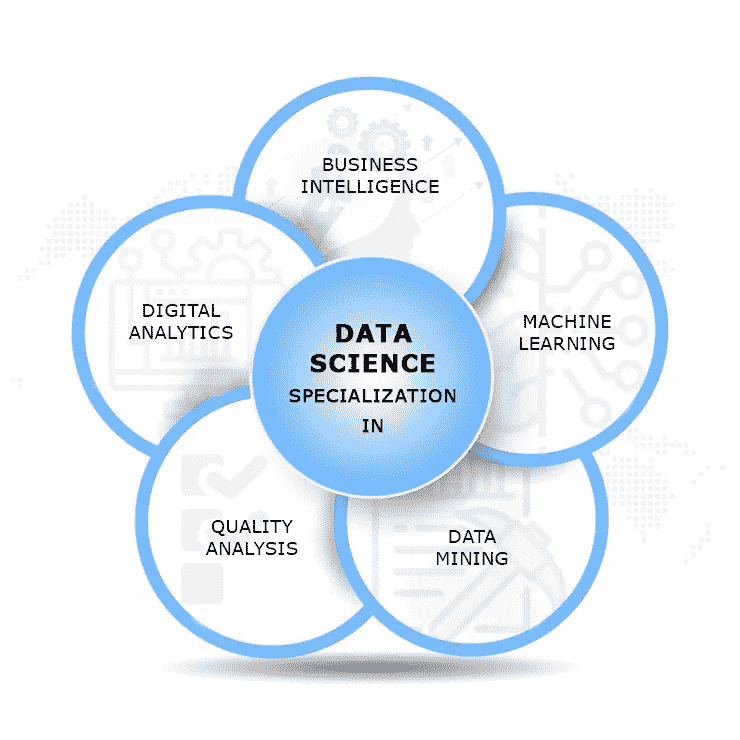

# 数据科学家的最佳 MOOCs 和书籍

> 原文：<https://medium.com/geekculture/the-best-moocs-and-books-for-data-scientists-dcf6d76e95b5?source=collection_archive---------7----------------------->

[Source](https://www.google.com/url?sa=i&url=https%3A%2F%2Fwww.upgrad.com%2Fdata-science-course%2F&psig=AOvVaw2y_MRpVM5QZHxyWM0HWncc&ust=1672316150886000&source=images&cd=vfe&ved=0CBAQjRxqFwoTCNjJ6qKlnPwCFQAAAAAdAAAAABAJ)

在这个故事中，我想和你们分享我在数据科学领域迄今为止上过的最好的课程和读过的最好的书。我希望这个故事可以帮助人们在学习数据科学时找到一条好的道路，因为在过去几年中，数据科学课程和书籍有了巨大的增长，可能很难猜测正确的道路来找到一份好工作。

# MOOCs

1.  Tensorflow 机器学习简介(Udacity)

在这个 Nanodegree 中，您将通过使用 scikit-learn 和 Tensorflow 框架(也有一个使用 Pytorch 框架的等效 Nanodegree)来处理神经网络，了解 Python 的监督和非监督学习的基础。这些项目是监督学习(简单级难度)、创建图像分类器的密集神经网络(中级难度)和创建客户细分的非监督学习。这个纳米学位是基础的，如果你愿意，你可以跳过它去找数据科学家纳米学位。

2.数据分析师纳米度(Udacity)

虽然这个纳米度不是必不可少的，但是我觉得一个数据科学家去做还是不错的。当我这样做的时候，课程包括 SQL、Web 抓取、数据探索、统计学(起初并不容易理解)，以及机器学习方法的介绍。对于真实世界的大项目，我在那时(两年多前)已经获得了对数据科学方法的良好理解，并且我可以自信地参与数据科学面试和来自面试的任务。我觉得绝对值得做。

3.数据科学家纳米学位(Udacity)

这个纳米学位是互联网上最著名的数据科学课程之一。它从数据科学问题的定义和常用技术、自然语言处理中的机器学习、推荐系统和期末项目开始，你可以从列表中选择或搜索一些数据并完全根据自己的需要进行定制。因此，我将简要讨论这个纳米学位的四门课程中的每一门课程的项目，并讨论我从它们中学到了什么。首先，你可以想学就学软件工程(非强制)，之后你会对数据科学方法和 [CRISP-DM](https://towardsdatascience.com/crisp-dm-ready-for-machine-learning-projects-2aad9172056a) 方法有个大概的了解，在一些可能的数据集中应用学到的方法，比如 [Airbnb](/becoming-human/analysis-of-airbnb-data-the-influence-of-time-day-of-week-and-client-distribution-35b73c4b1c1d) 。在第二个项目中，您将学习如何在机器学习中构建管道，以及 NLP 工具，以预测许多类来构建灾难响应管道。在第三部分，你将学习统计测试，比如 A/B 测试和推荐系统来制作你的推荐引擎。最后一部分是 Capstone 项目，您可以在工作区中预先提供的一些项目中进行选择，或者定制您自己的项目。我选择了 Sparkify 项目，用 PySpark 编码，可以在这里找到[。我建立的项目的完整列表可以在我的 GitHub 帐户中找到，其链接在这里提供。即使你是一个经验丰富的数据科学家，也绝对值得做这个纳米学位。](/geekculture/sparkify-using-pyspark-to-predict-customer-churn-10060cff9d71)

4.深度学习专业化(Coursera)

毫无疑问，这被认为是来自 Coursera 的最佳专业化。由 Andrew NG 教授，在这个专业中，您将学习如何从零开始构建几乎任何类型的神经网络。此外，您将在现实世界的项目中应用在课程中学到的概念。这些项目包括从零开始创造 DNN、CNN 和 RNN 到计算机视觉应用。与 Udacity 相比，我不是 Coursera 的忠实粉丝，但这个课程很突出，而且它比 Udacity 深度学习纳米学位便宜得多(也短得多)；

5.MLOps 专业化(Coursera)

我会说这个专精更像是一种“MLOps 入门”。在本课程中，您将学习如何设计端到端的 ML 生产系统:项目范围、数据需求、建模策略和部署要求。您还将学习数据漂移和概念漂移的概念，以及一个名为 Tensorflow Extender (TFX)的有价值的工具，它可以执行特征工程、转换和选择。同样，您将学习如何为离线/在线推理请求提供服务。您还将大致了解如何应用最佳实践和渐进交付技术来维护持续运行的生产系统。这种专业化很容易达到中级水平，可以在一个月的时间内努力完成。就一句话，我个人不太喜欢 Coursera 教授云计算的方式，因为它只是一种复制/粘贴任务。

[6。AWS 云上的实用数据科学(Coursera)](https://www.coursera.org/specializations/practical-data-science?)

在这个专业中，我认为对你所学的和你所付的进行权衡是非常公平的，你会得到一个关于如何使用 AWS SageMaker 云工具的总体概述，以及一些中级任务。您将在 AWS 云上了解如何获取、注册和浏览数据集、检测统计偏差、使用 AutoML 以及在要素存储中保存和管理要素。此外，由于在课程中进行了情感分析，我们使用内置算法和自定义 BERT 模型，调试、分析和比较模型以提高性能，创建端到端 ML 管道，并在 AWS 上执行超参数调整，之后，我们部署和监控模型。我认为该课程最有趣的方面是建立一个人在回路中的管道来提高模型性能，其中当模型不能超过预测类的确定性阈值时，模型会要求人工干预。

# 技术书籍

1.  [数据科学从无到有](https://www.amazon.com.br/Data-Science-Scratch-Principles-English-ebook/dp/B07QPC8RZX/ref=sr_1_2?keywords=data+science+from+scratch&qid=1664736935&qu=eyJxc2MiOiIxLjgzIiwicXNhIjoiMS42NCIsInFzcCI6IjAuNjgifQ%3D%3D&sprefix=data+science+%2Caps%2C210&sr=8-2&ufe=app_do%3Aamzn1.fos.db68964d-7c0e-4bb2-a95c-e5cb9e32eb12)

如果这是你学习数据科学的第一步，我推荐这本书。在本书中，您将通过从头开始实现(简单的)算法来了解数据科学是如何工作的。这对于初学者来说很重要，因为 ML 算法通常被视为黑盒模型，对这些算法的更精确的观点将帮助您理解在引擎盖下发生的事情，从最简单的朴素贝叶斯到推荐系统。本书还展示了用例，可以帮助您熟悉行业中使用的数据科学程序。

[2。商业数据科学](https://www.amazon.com.br/Data-Science-Business-Data-Analytic-Thinking-ebook/dp/B00E6EQ3X4/ref=sr_1_2?crid=3I39M6STVP31Y&keywords=data+science+for+business&qid=1664736975&qu=eyJxc2MiOiIxLjU0IiwicXNhIjoiMS4zMCIsInFzcCI6IjEuMTEifQ%3D%3D&sprefix=data+science+for%2Caps%2C210&sr=8-2&ufe=app_do%3Aamzn1.fos.6121c6c4-c969-43ae-92f7-cc248fc6181d)

本书面向已经具备基础数据科学基础的人，旨在展示数据科学如何为您的公司带来真正的价值。为了了解行业对数据科学工作者的期望，这是一个很好的机会。基本上，您将学习如何提出数据科学问题，包括学习相关性和分段、模型拟合、相似性和聚类。作者还讨论了什么是好的模型，如何可视化模型性能，以及如何探索挖掘文本。

[3。使用 Python 的数据科学项目](https://www.amazon.com.br/Science-Projects-Python-Stephen-Klosterman/dp/1838551026/ref=sr_1_2?__mk_pt_BR=%C3%85M%C3%85%C5%BD%C3%95%C3%91&crid=V49MIODM2IF6&keywords=data+science+projects+with+python&qid=1664736754&qu=eyJxc2MiOiIxLjQxIiwicXNhIjoiMC4wMCIsInFzcCI6IjAuMDAifQ%3D%3D&sprefix=data+20science+20projects+20with+20python%2Caps%2C201&sr=8-2&ufe=app_do%3Aamzn1.fos.6a09f7ec-d911-4889-ad70-de8dd83c8a74)

这本书详细介绍了一个数据科学项目。通过提出业务问题，作者展示了当决定如何在现实世界的情况下探索、清理和建模数据时会出现什么、为什么出现以及如何出现。他很好地解释了整本书使用的代码中到底发生了什么。这本书最好的一点就是编码简单，建模部分用到的机器学习算法都是不用深入的数学来解释的。

[4。接近(几乎)任何机器学习问题](https://www.amazon.com.br/Approaching-Machine-Learning-Problem-English-ebook/dp/B089P13QHT/ref=sr_1_77?__mk_pt_BR=%C3%85M%C3%85%C5%BD%C3%95%C3%91&crid=2WN3AT1H5Z74J&keywords=machine+learning&qid=1664737095&qu=eyJxc2MiOiI1LjA1IiwicXNhIjoiNC41MCIsInFzcCI6IjQuMDgifQ%3D%3D&sprefix=machine+learning%2Caps%2C221&sr=8-77&ufe=app_do%3Aamzn1.fos.db68964d-7c0e-4bb2-a95c-e5cb9e32eb12)

这本书更关注解决数据科学/机器学习问题的方法和好方法。这本书里面有很多代码，但是由于复制的代码没有托管在任何地方，这本书的目的是扩展您的工具，并讨论作为数据科学问题解决者的思维方式。书的流程很好，从基础概念到覆盖图像，还有很多高级概念！

[5。巴西统计局](https://www.amazon.com.br/Estat%C3%ADstica-B%C3%A1sica-Wilton-Bussab/dp/8547220224/ref=sr_1_1?__mk_pt_BR=%C3%85M%C3%85%C5%BD%C3%95%C3%91&crid=16HMFFHPZUOYY&keywords=estat%C3%ADstica+b%C3%A1sica&qid=1665347833&qu=eyJxc2MiOiIyLjM1IiwicXNhIjoiMS42NyIsInFzcCI6IjAuOTEifQ%3D%3D&s=books&sprefix=estat%C3%ADstica+b%C3%A1sica%2Cstripbooks%2C211&sr=1-1)

这本书(巴西葡萄牙语)为您提供了解决现实世界问题所需的统计数据，以便进行有价值的数据分析。它展示了如何进行数据可视化以从数据中获得洞察力，如何处理和应用概率，以及在一些真实数据中使用回归模型的情况。这本书更侧重于理论上的解释，因此，我推荐给那些没有扎实甚至基础统计学背景的读者。

[6。使用 Scikit-Learn、Keras 和 Tensorflow 进行机器实践学习:构建智能系统的概念、工具和技术](https://www.amazon.com.br/Hands-Machine-Learning-Scikit-Learn-TensorFlow/dp/1492032646/ref=sr_1_1?keywords=hands-on+machine+learning+with+scikit-learn%2C+keras%2C+and+tensorflow&qid=1665347808&qu=eyJxc2MiOiIxLjQ2IiwicXNhIjoiMS4zOCIsInFzcCI6IjEuMzUifQ%3D%3D&s=books&sprefix=hands%2Cstripbooks%2C218&sr=1-1&ufe=app_do%3Aamzn1.fos.db68964d-7c0e-4bb2-a95c-e5cb9e32eb12)

在本书中，您主要以一种聪明的方式学习如何使用常见的监督机器学习模型，如 KNN、基于树的模型、支持向量机等等。但在我看来，强大的部分是通过使用 Tensorflow 来使用神经网络。这本书最强的部分是，它用神经网络在理论和现实世界应用之间架起了桥梁。

[7。SQL 入门:初学者实用方法](https://www.amazon.com.br/Getting-Started-SQL-Thomas-Nield/dp/1491938617/ref=sr_1_18?__mk_pt_BR=%C3%85M%C3%85%C5%BD%C3%95%C3%91&crid=3DTO0NOOWL8YA&keywords=introduction+to+sql&qid=1665348000&qu=eyJxc2MiOiIxLjMwIiwicXNhIjoiMC4wMCIsInFzcCI6IjAuMDAifQ%3D%3D&s=books&sprefix=introduction+to+sql%2Cstripbooks%2C210&sr=1-18&ufe=app_do%3Aamzn1.fos.6121c6c4-c969-43ae-92f7-cc248fc6181d)

这本书给你基本的，有时足够的 SQL 知识，以便在数据集中执行中级查询。它解释了 SELECT、WHERE、GROUP BY 和 ORDER BY 语句，用于更新表和使用联接。对初学者来说是理想的，它可以在两周或更短的时间内很容易地被吸收，这取决于你的速度。

# 有趣的数据科学/人工智能书籍

1.  人工智能超级大国:中国、硅谷和新的世界秩序

这本书基本上是关于美国和中国之间的技术争端，以及人工智能优势如何成为主导国家的关键。作者讨论了四次“人工智能浪潮”以及为什么从长远来看中国将拥有人工智能优势。

[2。AI 2041:我们未来的十大愿景](https://www.amazon.com.br/AI-2041-Visions-Future-English-ebook/dp/B08QMFMJ1H/ref=sr_1_1?__mk_pt_BR=%C3%85M%C3%85%C5%BD%C3%95%C3%91&crid=2MM173KT1YZX3&keywords=AI+2041&qid=1665348131&qu=eyJxc2MiOiIxLjU2IiwicXNhIjoiMS42NCIsInFzcCI6IjEuMzIifQ%3D%3D&s=books&sprefix=ai+2041%2Cstripbooks%2C264&sr=1-1&ufe=app_do%3Aamzn1.fos.6d798eae-cadf-45de-946a-f477d47705b9)

这本书讨论了二十年后的未来。在短篇小说中，将展示人工智能如何可能塑造工作重新分配、虚拟现实和混合现实、区块链量子计算、可能的 COVID 场景以及未来日常生活中的计算机视觉。这有点像科幻小说，对喜欢它的人来说很棒。我个人觉得这本书太密太长了。

[3。生活 3.0:成为人工智能时代的人类](https://www.amazon.com.br/Life-3-0-Being-Artificial-Intelligence/dp/1101970316/ref=sr_1_1?__mk_pt_BR=%C3%85M%C3%85%C5%BD%C3%95%C3%91&crid=3I6LLH0JGBCO4&keywords=Life+3.0%3A+Being+Human&qid=1665348155&qu=eyJxc2MiOiIwLjYwIiwicXNhIjoiMC4wMCIsInFzcCI6IjAuMDAifQ%3D%3D&s=books&sprefix=life+3.0+being+human%2Cstripbooks%2C248&sr=1-1)

这本由 Max Tegmark(麻省理工学院物理学教授)撰写的未来主义书籍展示了随着人工智能在我们日常生活中的快速增长，可能出现的生活场景。它首先讨论了人生的三个阶段:

1.  生命 1.0 指的是生物起源，比如病毒；
2.  生活 2.0 指的是人类的文化发展；
3.  生活 3.0 指的是像[人工通用智能](https://en.wikipedia.org/wiki/Artificial_general_intelligence) (AGI)这样的技术，也许有一天，除了能够自己学习，还能够重新设计自己的硬件和内部结构。其他两种生命做不到的事情。

在回顾了人工智能的当前问题后，泰格马克接着考虑了一系列可能的未来，包括智能机器或人类。这本书还涵盖了可能发生的潜在结果，如社会结构的改变，人类和机器的融合，以及积极的(AGI 帮助我们或 AGI 被“奴役”)和消极的场景，如专制的人工智能或人工智能启示录(AGI 可能奴役或征服地球，我们甚至很可能不会注意到这一点)。

最后，泰格马克展示了对从现在起一千年或一万年后世界将会如何的前瞻性见解。

[4。超级智能:路径、危险、策略](https://www.amazon.com.br/Superintelligence-Dangers-Strategies-Nick-Bostrom/dp/0198739834/ref=sr_1_1?__mk_pt_BR=%C3%85M%C3%85%C5%BD%C3%95%C3%91&crid=17ET2MOKG2HHS&keywords=Superintelligence%3A+Paths%2C+Dangers%2C+Strategies&qid=1665348180&qu=eyJxc2MiOiIxLjUxIiwicXNhIjoiMS40OSIsInFzcCI6IjEuNDYifQ%3D%3D&s=books&sprefix=superintelligence+paths+dangers+strategies%2Cstripbooks%2C197&sr=1-1&ufe=app_do%3Aamzn1.fos.db68964d-7c0e-4bb2-a95c-e5cb9e32eb12)

作者讨论了关于“超级智慧”兴起的特征和后果的几个概念和有趣的问题。作者指出了不受控制的超级智能的风险和潜力，以及如何明智地管理它。这本书不是给傻瓜看的，至少有计算机科学、政治和经济学知识是必不可少的。

[5。Você，Eu e OS robs:Como se transformer no professional Digital do future](https://www.amazon.com.br/Voc%C3%AA-Eu-Rob%C3%B4s-Transformar-Profissional/dp/8597027576/ref=sr_1_1?__mk_pt_BR=%C3%85M%C3%85%C5%BD%C3%95%C3%91&crid=1LFA1XBOGX3BP&keywords=Voc%C3%AA%2C+Eu+e+os+Rob%C3%B4s%3A+Como+se+Transformar&qid=1665348213&qu=eyJxc2MiOiIwLjc5IiwicXNhIjoiMC4wMCIsInFzcCI6IjAuMDAifQ%3D%3D&s=books&sprefix=voc%C3%AA+eu+e+os+rob%C3%B4s+como+se+transformar%2Cstripbooks%2C201&sr=1-1)(巴西葡萄牙语)

这本书包含了数字革命的影响，以及我们将要经历的变革、挑战和机遇。这本书分为三个主要部分:

—你和我—人类，关注被数字技术改造的人类；

—他们:数字生命的提升，讨论人工智能、机器人和技术趋势；

——我们:混合的未来[人类+数字生物]，在这里我们问自己我们要去哪里，我们如何与机器融合，以及机器如何以技术方式拓宽我们。

那都是乡亲们！我想我经历了很多事情。

如果你喜欢这个故事，请给它一些掌声。

你可以在 LinkedIn [这里](https://www.linkedin.com/in/vagner-zeizer-carvalho-paes-31494b43/)加我。

最美好的祝愿！