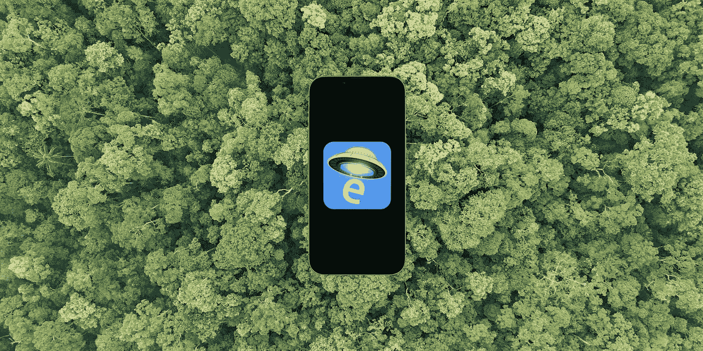

# 一个字节的成本

> 原文：<https://medium.com/geekculture/the-cost-of-a-byte-3d675d00c25e?source=collection_archive---------2----------------------->

应用程序的大小对用户体验有着深远的影响。乍看之下，您可能会认为安装速度更慢，安装失败次数更多，卸载率更高。但这并不止于此。不必要的代码导致编译时间增加。大型二进制文件增加了运行时查找符合的工作量，降低了应用程序的速度。你拥有的类越多，dyld 完成的工作就越多，应用程序启动变慢，内存使用增加。一些用户为带宽使用付费，产生了下载你的应用程序的直接成本。这种影响甚至超越了你的用户，影响到了互联网传输应用下载时的能源使用。

随着越来越多的时间花在网上，人们已经对互联网的能源使用和环境影响产生了兴趣。来自麻省理工学院、普渡大学和耶鲁大学的研究人员甚至证明了在变焦会议期间关闭摄像头可以减少 96%的环境足迹。这让我想到了应用程序大小的环境足迹。虽然与直播视频流相比，应用程序下载量很小，但下载规模可以达到数亿次。正如大规模开发中经常出现的情况一样，发送给如此广泛的用户群的单个决策给了我们一个巨大的机会。

# 互联网的足迹

有一些关于互联网对全球排放的贡献的估计，大约占全球总量的 3%。这与航空业产生的收入相当。随着技术变得越来越高效，连接到互联网的人数和他们需要的带宽量也在迅速增加。

2019 年，Shift project 的一份[报告成为头条新闻，声称 30 分钟的视频流排放 1.6 千克二氧化碳，相当于行驶 4 英里[1]。这一数字被证明是错误的，并已被更新。最近的估计值在 30-80 克之间，只有最初估计值的 2-5%。对于个人的贡献来说，这是个好消息，但不会改变技术和互联网的全球贡献。](https://theshiftproject.org/en/article/unsustainable-use-online-video/)

# 一个应用的足迹

互联网带宽现在主要由视频流组成，在移动网络上占据了超过 60%的份额。当然，一些网络使用将用于应用程序下载，我们可以使用公开信息来估计这种流量的足迹。首先，我们需要确定通过互联网传输的每 GB 能耗。有许多估计，包括来自国际能源协会的[报告反驳了 Shift 项目的原始报告，以及来自 Shift 项目](https://www.iea.org/commentaries/the-carbon-footprint-of-streaming-video-fact-checking-the-headlines)的后续[回应。研究人员一直在比较这些发现和更多的发现，以确定哪些数据是最准确的。许多差异来自不同的边界定义(数据中心、网络、终端设备)、数据需要在网络中传输多远(CDN 服务的数据可能更有效)或网络类型(蜂窝与 Wi-Fi)。Shift 项目创建了一个](https://theshiftproject.org/en/article/shift-project-really-overestimate-carbon-footprint-video-analysis/) [1 字节报告](https://theshiftproject.org/en/lean-ict-2/)，其中 Wi-Fi 使用 2.24 e-10kWh/字节，蜂窝使用 9.56 e-10kWh/字节。

网络效率总是在提高，尽管部署新技术需要时间，所以让我们乐观地假设 Wi-Fi 估计可以适用于所有的应用程序下载。美国平均每度电产生 0.386 千克二氧化碳，总排放量为 8.646-5 千克二氧化碳/立方米。

假设每周发布更新(每月 4 次)，应用程序的碳足迹由下式给出:

> **8.6464e-5 * (S_D * D + S_U * U * 4) =千克二氧化碳/月**

**S_D =应用程序下载大小(MB)**

**D =每月应用下载次数**

**S_U =应用更新大小(MB)**

**U =更新**的用户数量

让我们输入优步 iOS 应用的数字。

`8.6464e-5 * (110 * 4e6 + 69 * 23e6 * 4)=**586.92** metric tons CO2/month` [3]

在相同的使用统计数据下，您可以改变大小数字来查看**增加 1MB 的应用下载大小会增加 8，300kg CO2/月的排放量**。

# 相对大小

这些数字是粗略的估计，因为我们不知道用户的确切分布或他们使用什么网络。尽管如此，与通常提到的碳足迹相比，一个月内增加/删除 1MB 的应用程序大小具有惊人的巨大影响。

*   [从伦敦到洛杉矶国际机场的往返航班](https://www.theguardian.com/environment/ng-interactive/2019/jul/19/carbon-calculator-how-taking-one-flight-emits-as-much-as-many-people-do-in-a-year)是 1 MB 的**的 20%**
*   [1kg 牛肉](https://interactive.carbonbrief.org/what-is-the-climate-impact-of-eating-meat-and-dairy/)比 1 MB 的**少 1%**
*   [驾驶一辆特斯拉 Model S](https://ecocostsavings.com/electric-car-kwh-per-mile-list/) 行驶 **76，800 英里**消耗 1MB 的能量

当你下载一个很小的 1 MB，然后乘以像优步这样的应用程序被下载的数百万次，这个巨大的比例系数会产生意想不到的大碳足迹。这并不是说制作更小的应用程序会对气候变化有很大的帮助，恰恰相反。尽管我们已经展示了所有这些，移动设备消耗的大部分能量在用户得到它之前，在制造过程中就已经消失了[2]。预订满员的长途航班将产生比 1 MB 多 50 倍的排放，只是人均排放更低。更不用说转向可再生能源可以将一个字节的成本降低到零。

当寻找减少个人对环境影响的方法时，比如步行/骑自行车而不是开车，或者用蔬菜汉堡代替汉堡，考虑到这些个人选择的相对较低的影响可能会令人沮丧。在设计系统时，了解这些降低带宽的个人选择也有影响，这很好。根据用户基数的大小，这可能是一个更有效的改变。尽管如此，每一点都很重要。

[1][https://ny post . com/2019/10/28/why-climate-change-activities-are-coming-for-you-binge-watch/](https://nypost.com/2019/10/28/why-climate-change-activists-are-coming-for-your-binge-watch/)

[https://doi.org/10.1145/3490165](https://doi.org/10.1145/3490165)

[3]根据[传感器塔](https://app.sensortower.com/ios/publisher/uber-technologies-inc/368677371)的数据，每月有 400 万次下载。[9300 万活跃用户](https://backlinko.com/uber-users)，其中 50%在 iOS 上，假设其中一半启用了自动更新。从 iPhone 13 下载和更新尺寸。