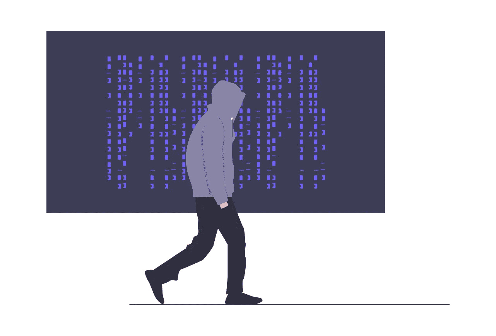

# NPM 的阴暗面

> 原文：<https://medium.com/geekculture/the-darker-side-of-npm-42dedfe41aa4?source=collection_archive---------52----------------------->

## **NPM 软件包从你的 Windows 机器上窃取密码！**

## **真实的丑闻！**

在最近的一系列事件中，**节点包管理器** (npm)已经成为数字世界的威胁。发布到 npm 上的代码被发现**通过**谷歌 Chrome** 中安全合法的账户恢复工具窃取了用户的**密码。

经过调查，发现有两个恶意的 npm 软件包窃取了存储在 Chrome 中的密码。这种恶意软件是多功能的，即它可以监听攻击者服务器的命令，也可以滥用受感染系统的隐私。它可以从受害者的相机和麦克风记录和上传文件，也可以播放 PowerShell 命令。

在这篇文章中，我们将尝试分析黑暗网络开发者是如何设法滥用 Chrome 和 npm 的安全性，并能够将恶意软件添加到用户的本地机器中的。

> 什么是 Npm？
> 
> 这是怎么曝光的？
> 
> chrunlee 如何设法滥用 chrome 的安全工具？
> 
> 获得对持续 npm 配置的控制
> 
> 开发者陷入了自己的陷阱。
> 
> npm 是第一次面对这个吗？
> 
> 结论

## **什么是 NPM？**

**NPM** 被认为是 **Node.js** 运行时环境的默认包管理器，类似于 GitHub 的包管理器。它在 **JavaScript** 包的供应和管理中起着关键作用。它拥有超过 150 万个独特的 JS 包，并在 24 小时内管理超过 10 亿个 JS 请求。

这个威胁是如何暴露的？一个拥有超过 120 亿用户的存储库是如何感染这种恶意软件的？它是如何被忽视超过 6 个月的？

这些问题的答案就藏在 windows.exe 的档案里，这些档案是由**翻转实验室**的研究人员在名为`nodejs_net_server`和`temptesttempfile`的包裹里找到的。

有趣的是。exe 文件被命名为`Win32.Infostealer.Heuristics`。

## 这件事是怎么曝光的？

`nodejs_net_server`的总下载量超过 1.3 千次，`temptesttempfile` 的总下载量超过 800 次。这个恶意软件可疑地被 **ReversingLabs** 平台静态分析引擎捕获，该引擎基于[机器学习](/@randylaosat/a-beginners-guide-to-machine-learning-dfadc19f6caf)算法工作。

大约 6 个月前，GitHub 上一位名叫 *chrunlee 的活跃开发者对`nodejs_net_server`进行了更新。*通过静态分析，研究人员发现，`Win32.Infostealer.Heuristics`原本是一个**单字母。exe** 文件，通常是单个字母。exe 文件对威胁猎人来说是一个危险信号。

进一步深挖，发现 exe 竟然是 **ChromePass** ，一个合法的密码恢复工具。

## **chrun lee 如何设法滥用 chrome 的安全工具？**

*Chrunlee* 成功发布并缓冲了带有 **12 个版本** &的包，在最终版本中他成功插入了一个**脚本**，用于在开发者托管网站时下载密码窃取器。该脚本启用了**TeamViewer.exe**的使用，这当然允许攻击者在用户不注意的情况下访问用户的信息，并且这也失去了恶意软件和网站之间的链接，以保持恶意软件不被不同的云网络安全注意到。Chrunlee 于 2020 年 4 月开始在不同版本的软件包中测试他的软件，并于 2020 年 12 月发布了密码窃取脚本。

进入 *chrunlee 的*第二个包，即`temptesttempfile`，给研究人员带来了各种问题，因为主页 readme 和 GitHub 存储库链接都被重定向到**不存在的网页**。

这个包中的一个文件 test.js 实现了与`nodejs_net_server`中相同的远程 **shell 功能**，但是这个包没有执行任何类型的劫持，而且还缺少一个持久性机制，这使得格言可疑且不清楚。

## **获得对持续 npm 配置的控制**

Npm 包依靠像**域名仿冒**和**依赖混淆**这样的方法来捕捉包管理器内部的恶意活动。

然而，据**反转实验室**的研究人员称，两个包中都没有发现**仿冒**，这仍然是一个困惑， *chrunlee* 是如何吸引人们安装这个包的。

有趣的是，人们发现每当开发者安装`nodejs_net_server`软件包时，恶意软件就会试图通过滥用`bin`选项来访问本地机器。

`bin`选项存在于`package.json`文件中，它旨在通过著名的`jstest`包感染和断言访问。

根据统计数据，`jstest`是下载量最大的 JavaScript 测试框架之一，这使得它肯定会出现在大多数 **NodeJS** 开发者中。

恶意软件并不完全依赖于`jstest`的存在才能发挥作用，但它的存在通过提供持久性来简化感染过程。

*Chrunlee* 设法**自动化**软件包中的`jstest`命令，这两种方式都为恶意软件提供了持久性，并且它还执行后门功能。

默认情况下，恶意软件执行的命令会覆盖现有的`jstest`文件，并添加一个`test.js`文件，为恶意软件访问 **windows** 机器提供持久性。

这项新增的`test.js`服务开放了 ***端口 7353*** ，允许执行各种监控活动和访问用户数据:

*   反转主机和端口配置
*   文件上传和搜索
*   目录内容列表
*   shell 命令执行
*   屏幕和摄像机访问和录制
*   通过 ChromePass 恢复实用工具窃取密码

**唷**！为什么我们现在使用我们的 Windows 机器？

劫机者可以接触到任何东西。这听起来很危险。希望您安全地浏览和开发。

根据研究人员的说法，只有`nodejs_net_server`是可以为劫机者提供多重访问的包，而`temptesttempfile`只能为劫机者提供**外壳命令**访问。

## 开发者陷入了自己的陷阱。

在调查这一事件的过程中出现了一个有趣的事件，即在早期版本中，chrunlee 泄露了他自己计算机的凭证。

在测试恶意软件时， **ChromePass** 实用程序打开了 *chrunlee 的*个人密码，超过 250 个登录凭证存储在存储库中的一个. txt 文件中，该文件被命名为**a.exe**。

有趣的是，研究人员还发现 *chrunlee* 从不关心密码策略实践，而是使用蹩脚而常见的密码，如 1234。

就这样， *chrunlee* 自己掉进了自己的陷阱，公开发布了自己的个人怪异密码。

## **NPM 是第一次面临这种情况吗？**

不，这不是恶意软件第一次进入 npm，

*   2021 年初，三个恶意软件包被发布到 **npm** 上，它们能够从 **Discord** 用户那里窃取令牌和信息。
*   2018 年 11 月，发现了一个恶意包，该包基本上是著名包`event-stream`3 . 3 . 6 版本的依赖。这个名为`flatmap-stream`的恶意软件包包含一个加密的有效载荷，旨在从 **Copay** 应用程序中窃取**比特币**。

## **结论**

经过内部调查后，国家预防机制安全部门已经从国家预防机制手中拿走了这两个包。

随着近来技术劫持数量的增加，维持和依赖我们安装在本地机器上的第三方包变得非常困难。

发生在**公共存储库**上的攻击数量正在迅速增加，而安全实验室正在尽最大努力保持存储库中的清洁，但作为一个负责任的开发者，我们应该在使用第三方包之前弄清楚它。

编码快乐！安全编码！

如果你喜欢我的博客，那么你可以支持我

