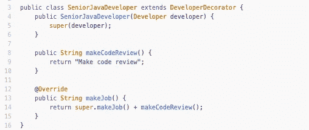
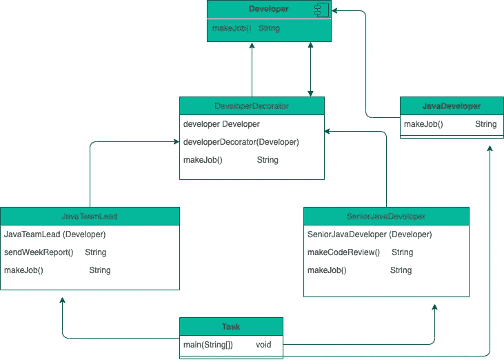
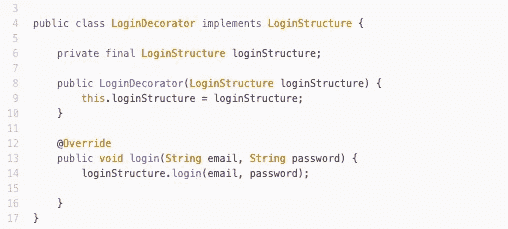
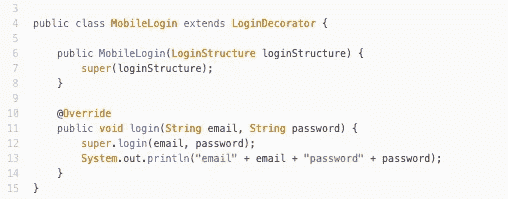
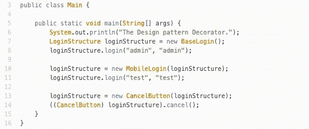

# 装饰者设计模式。

> 原文：<https://medium.com/geekculture/the-decorator-design-pattern-723359027a09?source=collection_archive---------10----------------------->


装饰器(decorator)是一种结构设计模式，通过将这些对象放入包含行为的特殊包装对象中，可以将新行为附加到对象上。

**结构设计模式**关注的是如何组合类和对象，以形成更大的结构。

结构设计模式通过识别关系来简化结构。

这些模式关注的是，类如何相互继承，以及它们如何由其他类组成。

在软件工程中，结构设计模式是通过识别实现实体间关系的简单方法来简化设计的设计模式。

*   [**适配器**](https://sourcemaking.com/design_patterns/adapter)
    匹配不同类的接口
*   [**桥**](https://sourcemaking.com/design_patterns/bridge)
    将对象的接口从其实现中分离出来
*   [**复合**](https://sourcemaking.com/design_patterns/composite)
    一个树形结构的简单复合对象
*   [**装饰者**](https://sourcemaking.com/design_patterns/decorator)
    动态地给对象添加职责
*   [**外观**](https://sourcemaking.com/design_patterns/facade)
    代表整个子系统的单个类
*   [**Flyweight**](https://sourcemaking.com/design_patterns/flyweight)
    用于高效共享的细粒度实例
*   [**私有类数据**](https://sourcemaking.com/design_patterns/private_class_data)
    限制访问器/赋值器访问
*   [**代理**](https://sourcemaking.com/design_patterns/proxy)
    一个对象代表另一个对象

为了理解如何应用装饰模板，让我们看一个抽象的例子。假设我们有某个**接口开发者**并且这个接口只有一个 **makeJob** 方法:


让我们创建这个接口的一个实现，并将其命名为 **JavaDeveloper。**我们的 JavaDeveloper 类将实现开发者接口。makeJob 方法将返回字符串 write java code。


让我们创建一个客户端程序，并将其命名为 Task。我们的任务创建一个开发人员实例。并将执行 makeJob developer 方法的结果输出到控制台。


```
write Java code.Process finished with exit code 0
```

假设现在我们需要 makeJob 方法来执行高级 Java 开发人员。客观上这个 Java 开发人员的 makeJob 方法不同于高级 Java 开发人员的方法。假设现在我们需要 makeJob 方法来执行高级 Java 开发人员。客观上，这个 Java 开发者的 makeJob 方法和高级 Java 开发者的方法是不一样的。高级 Java 开发人员有额外的职责。例如，执行代码审查。

为了使这个实现方便实用，我们需要使用某种模板。我们将使用装饰模板，而不是从开发人员界面进行实现。

让我们创建一个装饰器，并将其命名为 **DeveloperDecorator** 。 **DeveloperDecorator** 类是开发人员接口的一个实现。它有一个开发人员实例。它还有一个构造函数。makeJob 方法调用 developer 方法。


现在让我们创建一个高级开发人员实现。创建高级开发人员类并用开发人员装饰器扩展它。让我们创建 **makeCodeReview** 方法，该方法将返回字符串 makeCodeReview。之后，我们重新定义 makeJob 方法，并为其添加 **makeCodeReview** 方法。它看起来会像这样:



现在我们将改变我们的任务程序如下。现在，实现将围绕 SeniorJavaDeveloper 进行，它接受 Java 开发人员作为构造函数:


```
write Java code. Make code review.Process finished with exit code 0
```

通过与高级 Java 开发人员类比，我们将创建一个新的 Java 团队领导实现。


我们在我们的客户端类中做了一些改变:


```
write Java code. Make code review. Send week report to customer.Process finished with exit code 0
```

让我们以图表的形式展示我们的实现。



为了固定关于装饰模板的材料，让我们看一个更近似的例子。这个例子并不抽象，你在做项目的时候可能会想到。让我们开始吧。

经常有这样一种情况，自动化框架必须支持不同版本的网站组件。通常，这是因为 web 或移动应用程序在不断变化和更新。这种方法最常见的例子是，如果一家公司使用 A / B 测试，并且它是在组件级执行的。

如果您有类似的需求，并且您的情况与上面描述的非常相似，那么装饰器模式可能是最适合您的方法。该模板允许您将组件打包在所谓的附加“信封”中，这些信封仅覆盖或补充某些功能。您不需要为组件的每个新特性编写一个新的类:只需要实现更改。如果应用程序的 web 组件根据浏览器的大小或设备的类型而变化，装饰器模板同样是理想的。


下面我们将看一个使用装饰模板的更真实的例子。在我们的示例中，为授权和登录提供了两个组件或表单。第二个表单有一个额外的“取消”按钮。

在通常的方法中，您可以为每个组件创建类来解决这个问题。然而，问题是第二个类将拥有第一个类的完整副本，并且只有一个“cancel”方法的实现。然而，创建一个以上的类会导致代码重复，并使组件的每个新变体与其对等体断开连接。如果您有多个登录组件，比如针对桌面和移动设备，这将变得更加复杂。

让我们尝试使用装饰模板来解决这个问题。从本文的第一部分，我们已经知道了装饰模板的理论部分。现在我们将把这些知识付诸实践。

**LoginStructure** 是每个登录组件的接口。它规定每个组件都需要有一个定义好的登录方法。


**基本登录**有一个登录方法的具体实现。在这个例子中，它只是在命令行上输出“基本登录”。


这个类是模式的核心。一个 **LoginDecorator** 可以接受任何 **LoginStructure** 并包装一些功能。在这之后，结果仍然是一个 LoginStructure。



这个 **MobileLoginDecorator** 用一个特定于移动设备的新类覆盖了基本的登录功能。同样，它只是输出“移动登录”来保持这个例子的简短。



这个**取消按钮**可以为任何登录组件添加取消功能。


现在我们可以测试它是如何工作的。



```
The output of it all is:The Design pattern Decorator.Basic login:admin,admin
Basic login:test,test

Click the cancel button.Process finished with exit code 0
```

尽管一开始这看起来开销很大，但从长远来看，工作量会减少。您只需要在装饰器中实现更改或添加的功能，并将其添加到您想要更改的组件中。这使您的测试代码保持简洁和模块化。

# 结论。

在本文中，我们看了一下装饰设计模式。在下列情况下，这是一个很好的选择:

*   当我们希望添加、增强甚至删除对象的行为或状态时。
*   当我们只想修改单个对象的功能而保持其他功能不变时。


[https://test-engineer.site/](https://test-engineer.site/)

# 作者[安东·斯米尔诺夫](https://www.linkedin.com/in/vaskocuturilo/)