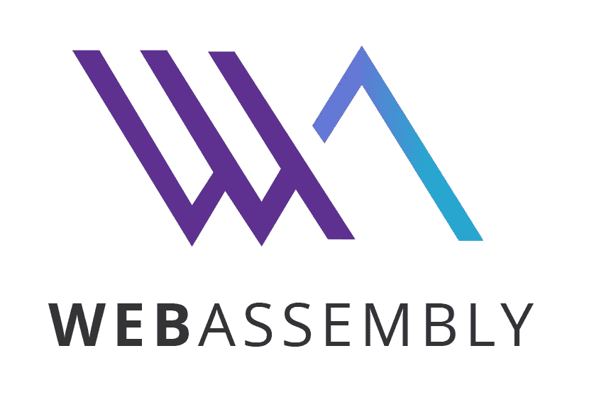

# 发现 Deno — WebAssembly

> 原文：<https://medium.com/geekculture/the-deno-post-high-speed-hello-world-part-i-webassembly-d2c86a4326e1?source=collection_archive---------4----------------------->


Image credit: Pablo Barría Urenda

近年来，出现了一种可以提高 JavaScript 应用程序性能的新技术:WebAssembly。在这篇文章中，我们将制作一个 WebAssembly 模块来生成 Hello World 问候，并使用 Deno 为他们提供服务。为了实现这一点，我们需要制作一个小型 Rust crate(库)，使用`wasm-bindgen`和`wasm-pack`工具将其编译成二进制文件，针对速度和大小进行优化，最后将其加载到 Deno HTTP 服务器应用程序中，以便通过互联网发送。

那么所有这些术语代表什么呢？WebAssembly 是一种为在 web 上使用而设计的汇编语言(惊喜！).Rust 是一种低级系统编程语言，可以编译成 WebAssembly，Deno 是一种 JavaScript/TypeScript 运行时，内置于 Rust 中，支持使用 WebAssembly。基本上，Rust + WebAssembly 的运行速度比 JavaScript 快得多(在速度上与 C/C++相似),并且被设计为与 JavaScript 一起使用，以提高关键应用程序组件的性能。

我们开始吧！

**生锈部分**


Rust 实际上并不是以铁的氧化来命名的，而是以锈斑守卫蟹命名的，这解释了为什么 Rust 的官方标志是一种微小的甲壳类动物。如果以前者命名，至少可以说有点讽刺，因为铁锈并不完全是铁锈！

为了开始，我们必须安装 Rust 和它的软件包管理器。你可以在这里找到他们两个。设置完成后，使用 Cargo 安装`wasm-pack`，它会创建运行编译后的 WebAssembly 所需的包:

```
cargo install wasm-pack
```

接下来，在您选择的目录中创建一个新的包:

```
cargo new --lib hello-wasm
```

新项目包含一个`Cargo.toml`文件，如果你熟悉 Node.js/npm,，它有点像`package.json`，我们需要配置 Rust 项目，这样它的代码可以被 JavaScript 理解和使用。为此，将以下内容添加到`Cargo.toml`:

```
[package]
name = "hello-wasm"
version = "0.1.0"
edition = "2018"[lib]
crate-type = ["cdylib"][dependencies]
wasm-bindgen = "0.2"
```

在上面的代码片段中，`crate-type = ["cdylib"]`告诉 Rust 生成一个从另一种语言加载的库。`wasm_bindgen`是一个库，负责创建 Rust 和 JavaScript 类型之间的绑定。

现在让我们转到包含一些测试代码的文件`src/lib.rs`。用下面几行替换它:

```
use wasm_bindgen::prelude::wasm_bindgen;#[wasm_bindgen]
pub fn greet(name: &str) -> String {
  return format!("Hello, {}!", name);
}
```

这里我们导入`wasm_bindgen`并在函数的顶部放置一个`#[wasm_bindgen]`注释。现在，如果这个`greet`函数被 JavaScript 程序调用，它将知道如何将 JavaScript 字符串映射到 Rust 字符串，反之亦然。

**装配零件又名问候库优化**



是时候将 Rust 代码编译成 WebAssembly 二进制文件了，但在此之前，我们想进行一些微调。关于铁锈板条箱的一个伟大的事情是，它们可以以各种方式优化速度和大小。今天软件工程中的大事当然不是区块链也不是机器学习，而是问候库优化。在一个快节奏的数字世界里，用户必须尽可能快地被问候，否则他们就会离开，再也不会回来。:)

我们可以向`Cargo.toml`添加一些配置，以优化具有以下部分的板条箱:

```
[profile.release]
lto = true
opt-level = "s"
```

在这里，我们启用了链接时间优化(LTO ),以增加编译时间为代价，减少了二进制文件的大小，提高了生成速度。我们还将`opt-level`设置为`s`以优化*速度*。这也可以设置为`z`来优化*的大小*，但有趣的是`opt-level = "s"`可以产生更小的二进制文件，这实际上是一个测试问题，看哪一个工作得最好。让我们用`wasm-pack`将 Rust crate 编译成 WebAssembly:

```
wasm-pack build --target web
```

将生成与 Deno 一起工作的二进制文件，以及其他 web 目标，如浏览器。您现在应该在项目中有一个包含一个`hello_wasm_bg.wasm`文件和一些`.js`和`.d.ts`文件的`pkg`目录。

使用名为`wasm-opt`的构建工具可以做更多的优化，它是更大的`Binaryen`库的一部分。对于像这样的小项目来说，NPM 是一个安装它的简单方法，否则你也可以在他们的 GitHub 发布页面上找到这些工具。

```
npm install -g binaryen
```

现在，您应该能够从终端调用`wasm-opt`并执行另一个优化。注意，您需要将它指向调用`wasm-pack build:`时创建的`pkg`目录中的`.wasm`文件

```
wasm-opt -O -o output.wasm pkg/hello_wasm_bg.wasm
```

如果您在 Linux 机器上或者使用安装了 WSL 的 Windows，您可以使用带有`-c`的`wc`工具来获得二进制文件的*字节计数*:

```
wc -c output.wasm
```

在为每个优化运行它之后，它给出了以下结果:

```
Before optimizations: 16276 bytes
With lto = true: 14083 bytes
With lto + opt-level s: 13894 bytes
With lto + opt-level + wasm-opt -o -O: 13812 bytes
```

字节大小减少了 2914 字节！注意，有可能用压缩工具如`gzip` 或`brotli`进一步压缩二进制文件，但是因为我们没有通过网络发送这个 WebAssembly，所以没有必要。但是，请记住，许多优化都需要在执行速度和二进制文件大小之间进行权衡。现在，是我们把这个代码带到德诺大陆的时候了。

**天龙部**


Image credit: Hashrock

在项目中创建一个文件`server.ts`，最好是在包含 Rust 代码的`src`目录和包含 WebAssembly 的`pkg`目录之外。首先导入用`wasm-pack`生成的`init`和`greet`函数:

```
import init, { greet } from "./pkg/hello_wasm.js";
```

使用`init`函数初始化 WebAssembly 模块，我们可以使用`Deno.readFile`从文件系统加载该模块:

```
await init(Deno.readFile("./pkg/hello_wasm_bg.wasm"));
```

现在我们准备调用`greet`并向客户发送问候。如果您查看`pkg/hello_wasm.js`中的`greet`函数，您可以看到它调用 WebAssembly 二进制文件来发出问候。为了提供给浏览器，我们需要一个简单的 HTTP 服务器。对于这个例子，我们可以使用 Deno 的本地服务器，尽管您也可以选择 Deno land 中任何丰富的第三方 HTTP 服务器模块或 Deno 标准库`std/http`中的模块。本机服务器的代码如下所示:

```
import init, { greet } from "./pkg/hello_wasm.js";await init(Deno.readFile("./pkg/hello_wasm_bg.wasm"));const server = Deno.listen({ port: 8080 });for await (const conn of server) {
  handle(conn);
}async function handle(conn: Deno.Conn) {
  const httpConn = Deno.serveHttp(conn);

  for await (const requestEvent of httpConn) {
    try {
      await requestEvent.respondWith(new Response(
        greet("World"), {
          status: 200,
          headers: {
            "content-type": "text/html",
          },
        },
      ),
    );
    } catch (e) {
      console.error(e);
    }
  }
}
```

注意，我们发送回一个带有`greet`函数结果的响应对象。如果你用`deno run --allow-net --allow-read server.ts`运行这个服务器，你应该能够在浏览器中进入`localhost`并收到一个 Hello World！结果可能看起来微不足道，但这个问候是由更快的 WebAssembly 编译器生成的，而不是由浏览器使用的 JavaScript 即时编译器生成的。对于真实世界的应用程序来说，这可能会对性能产生重大影响，并且它正被越来越多的地方用来加速 web。

这篇文章的灵感来源于 MDN 上的[这个指南](https://developer.mozilla.org/en-US/docs/WebAssembly/Rust_to_wasm)和新堆栈上的[这篇文章](https://thenewstack.io/using-web-assembly-written-in-rust-on-the-server-side/)等等。我希望你喜欢它，并学到了一两件事！下次见！