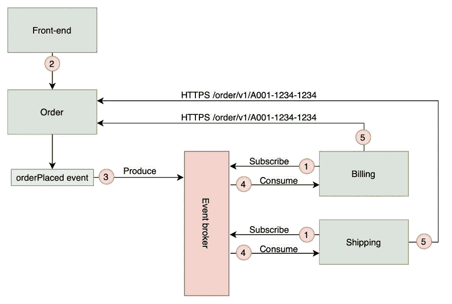

# 事件通知模式

> 原文：<https://medium.com/geekculture/the-event-notification-pattern-a62d48519107?source=collection_archive---------8----------------------->

## 了解事件通知模式如何帮助您构建事件驱动的系统，以及您需要注意哪些缺陷。

Photo by [Kristina Tripkovic](https://unsplash.com/@tinamosquito?utm_source=medium&utm_medium=referral) on [Unsplash](https://unsplash.com?utm_source=medium&utm_medium=referral)

在“事件驱动架构工程师指南”系列的第二篇博客中，我讨论了设计和实现成功的事件驱动架构的关键概念。其中之一是建立常用事件驱动软件设计模式的知识。

还有很多设计模式要讨论，但是从事件驱动系统中常见的设计模式开始似乎更合适:事件通知模式。让我们来探索使用这种模式如何影响事件的设计、组件之间的通信，以及非常重要的是，它带来的权衡和一些潜在的陷阱。

# 事件通知模式如何工作

使用事件通知模式，事件用于通知系统中的其他微服务发生了有趣的变化。通知事件小而简洁，因为它只包含对已更改状态的引用。这可能是一些唯一的标识符，由一些有用的元数据支持，可以帮助消费者确定更改是否与他们的责任相关。

举一个有用的元数据的例子，不要为不同的变更实现一系列单独的事件，客户可以对他们的配置文件进行变更，您可以有一个 customerProfileUpdated 事件，该事件带有一个指定变更了哪些配置文件属性的字段。这将允许消费者监听那些事件，但只对地址变化感兴趣，以决定是否以及如何响应事件。请注意，这确实有可能降低代码级意图的清晰度，所以这是一个权衡。

客户下订单的通知事件可能如下所示(使用 [cloudevents.io](https://cloudevents.io/) 标准建模):

使用与发布/订阅消息模型相结合的事件代理来发布类似上面的事件，允许系统以适当的响应进行响应。这是在一个简单的商业系统中，坚持使用我们的订单处理示例时可能出现的情况(以下是对步骤的详细描述):

Using event notification pattern in a product ordering flow

这是在使用事件通知模式的微服务架构中下订单时发生的情况:

1.  在这个系统中，计费和运输微服务需要在下新订单时就知道。由于我们使用发布/订阅，这些微服务将在事件代理中订阅已下订单的事件。
2.  当客户下订单时，前端应用程序向订单微服务发送一个 https 请求，其中包含订单详细信息。这些详细信息由订单微服务存储在其数据库中。
3.  订单微服务通过向事件代理产生一个 orderPlaced 事件来通知系统中的其他微服务。订阅了该事件类型的所有微服务现在都可以使用订购微服务刚刚生成的事件。
4.  计费和运输微服务都使用该事件。像我们前面的例子一样，该事件只包含订单标识符，以及指示可以从哪里检索订单细节的源。
5.  现在，计费和发货微服务知道了新订单，它们对订单微服务的 https 端点进行回调，以检索订单上的详细信息，这样它们就可以执行后续处理。

将使用事件通知模式与纯粹的 RESTful 微服务架构相比较，有两个主要优势:

*   通过自然耦合实现更好的可维护性
*   降低事件生产者的复杂性

# 通过自然耦合实现更好的可维护性

该模式带来的一个主要好处是，能够使用由事件代理提供的发布/订阅消息传递模型来反转订单微服务和系统中其他微服务之间的依赖方向。订单微服务不再有责任**明确地**通知计费和运输微服务以及未来可能添加的每个关注订单的微服务。

它使用发布/订阅模型将事实作为事件发出，仅此而已。它既不知道也不关心哪些组件感兴趣。这导致了系统中更加自然和可管理的耦合级别，因为引入了需要了解订单的附加服务，而无需更改订单微服务。

# 降低事件生产者的复杂性

除了更自然的耦合，订单微服务的复杂性也大大降低，因为不再需要明确了解系统中的其他域和组件。此外，确保下游消费者收到通知的责任从订单微服务转移到了具有发布/订阅消息的事件代理。这进一步降低了订单微服务的复杂性。

鉴于这两个相当大的好处，对于大多数使用 RESTful 通信的微服务架构来说，使用事件通知模式绝对值得考虑。

现在，让我们也来探索一些潜在的陷阱，我觉得当涉及到这种模式时，您应该意识到这些陷阱。

# 可用性权衡的一致性

对于任何构建分布式系统的人来说，CAP 定理是一个非常重要的概念，我在“事件驱动架构工程师指南”系列的第一篇博客中解释过。任何分布式系统都被迫做出权衡，事件通知模式更倾向于一致性而不是可用性。这可能是优点，也可能是缺点，这取决于系统试图解决的挑战。

当使用事件通知模式时，数据复制是最小的，因为状态不存在于事件中。因为状态只能通过对生产者的回调来获得，所以数据所有权是明确的。

通过不在整个系统中复制数据，最终一致性、数据副本聚合和数据冲突解决等挑战被回避了。这是一个巨大的好处，因为要真正做到正确是非常具有挑战性的。然而，这确实是以可用性为代价的。

因为消费者必须执行回调来获得状态，所以生产者需要在任何时候都可用，否则消费者不能执行其任务来响应事件。回到我们之前的例子，如果订单微服务不能提供订单细节，商品的计费和运输就不能发生。这些依赖性可能是分布式架构的最大敌人之一。

同样，事件通知模式做出的权衡可能是系统试图解决的挑战的正确选择，也可能不是。这是社区中激烈辩论的一个话题，就整体复杂性而言，哪一个“更好”,或者哪一个“更坏”:

*   优先考虑一致性而不是可用性，并实施弹性措施来处理令人头痛的微服务依赖性，并最大限度地减少它们对整体系统可用性的影响。
*   通过复制数据支持微服务自主运行，支持可用性而非一致性保证，代价是在系统中引入最终一致性、数据副本聚合和数据冲突解决挑战。

我不知道答案，但我觉得一个关键的考虑因素是团队在处理上面提到的影响一致性的数据复制和影响可用性的运行时依赖的复杂性方面做了多少准备。一般来说，在 API 端点上实现弹性措施以最大化可用性并限制中断的影响，对于构建 API(这是许多现代系统的一部分)的团队来说是一种相对众所周知的实践。对他们来说，事件通知模式是一个很好的模式，用它他们可以在短期内成功地生产，因为可用性挑战是相当众所周知和理解的。

# 回调压力

除了前面讨论的可用性影响之外，回调到生产者还有一个潜在的非常重要的缺点。这是它给制作人带来的潜在压力。如果一个事件被九个消费者消费，那么就有九个对生产者的传入呼叫可能会快速连续发生。在一些操作场景中，这种压力可能会进一步增加。例如，如果其中一个用户停机进行维护，并且正在“追赶”处理该期间累积的所有事件。

生产者要么需要适当地确定规模来管理这种压力，但在某些情况下，如遗留系统和难以扩展的系统，这并不容易。在这种情况下，限速或其他保护措施可能是必要的，这可以解决倒车系统翻倒的问题，但它确实会大大降低消费者的速度。如果您需要接近实时的结果，其中涉及到您无法控制的遗留系统，并且当您看到它们时会翻倒，那么事件通知模式可能不是最佳选择。

# 事件处理

对于分布式系统中的任何通信，总是存在网络故障的风险，事件也不能幸免于这个问题。这就是为什么大多数事件代理提供至少一次交付语义作为默认行为。如果你对这些概念不熟悉，可以看看我之前的博客,在那里讨论过。

由于网络故障，消息可能会被重新发送，从而被消费者多次使用。因此，事件必须是幂等的，这意味着您可以多次处理它们而不会使状态无效，或者消费者需要跟踪以前消费的事件。

处理事件的另一个潜在问题是无序处理。这些年来，我见过的大多数事件通知模式实现都是在业务流程或操作(成功)结束时产生一个事件。在这些情况下，无序处理不是问题。

当在整个业务流程或操作中产生相关事件时，您将希望确保事件消息以正确的顺序处理。有序处理最常见的解决方案是使用支持 FIFO 的事件代理，并应用分区消费模式，而不是竞争消费者设置。如果你不熟悉这些概念，它们在我的[前一篇博客](/swlh/the-6-things-you-need-to-know-about-event-driven-architectures-38e11fdcb5a)中有所涉及。另一种方法是在消费者内部实现一个健壮的重新排序策略。需要注意的是，这确实会变得很复杂，因为分布式系统中的[时间](https://plumbr.io/blog/monitoring/time-in-distributed-systems)本身就是一个挑战。

# 事件流的复杂性陷阱

正如[马丁·福勒所警告的](https://martinfowler.com/articles/201701-event-driven.html)，当系统的复杂性增加，并且出现了运行各种事件通知的逻辑流时，简单的事件通知模式可能是一个陷阱。与查看一段代码相比，观察、理解、调试和修改这样的流程更加困难。设计可维护的事件流可能具有挑战性，因此一定要了解要使用的常见模式。我的同事 Xavyr Rademaker [最近发表了一篇关于这个话题的好文章](https://xavyr-rademaker.medium.com/peer-to-peer-choreography-and-orchestration-544af8b1bcfb)，绝对值得一读。

那么，这就总结了使用事件通知模式的最重要的缺陷，让我们总结一下。

# 结论

事件通知模式是事件驱动架构中最常见的模式。它为常见的通信模式提供了好处，并且对于正在进入事件驱动架构的团队来说是一种相对容易接近的模式。

需要注意的最重要的一点是，模式更倾向于一致性而不是可用性，因为状态不包含在事件中。因此，如果可用性保证和(接近)实时处理是您正在寻找的，那么这不是您正在寻找的模式。如果你没有得到星球大战参考，我正式失望。

“事件驱动架构工程师指南”博客系列的第三篇文章到此结束。请继续关注下一篇文章，我将讨论事件承载的状态转移模式，以及它带来的好处。直到下一篇博客，祝你牛逼一天，编码快乐！