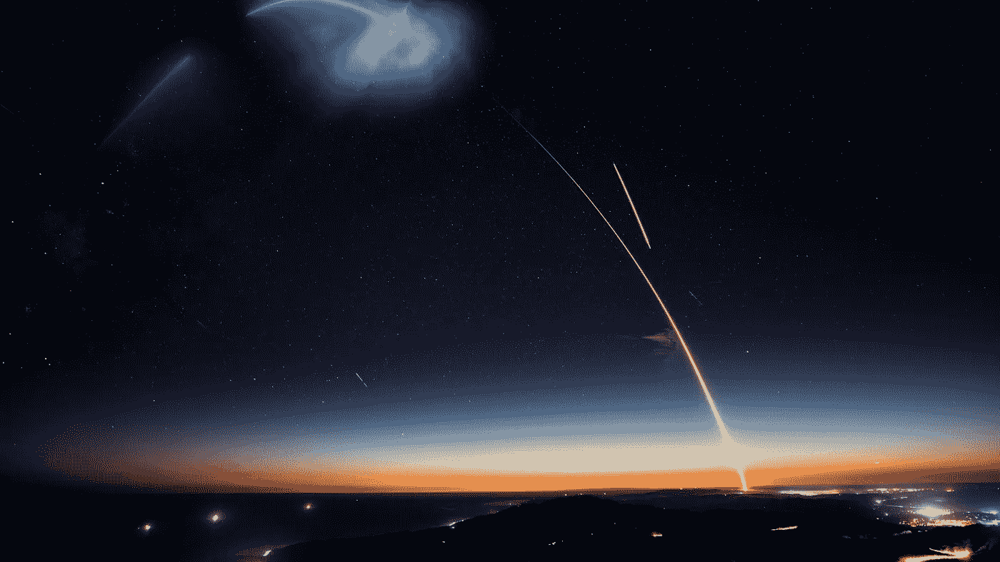

# 《每天的宇航员》让我们又一次看到了私营航天工业

> 原文：<https://medium.com/geekculture/the-everyday-astronaut-gives-us-yet-another-glimpse-into-the-private-space-industry-289682880a88?source=collection_archive---------24----------------------->

## 萤火虫航空航天公司内部的一瞥

本周，创造者和科学传播者蒂姆·多德，更广为人知的是日常宇航员，向我们详细介绍了德克萨斯州奥斯汀的萤火虫航空航天试验场和工厂。这次采访和旅行之前还有一个由埃隆·马斯克亲自指导的 SpaceX 星际基地的三段视频旅行。星际基地之旅为我们提供了大量信息，而 SpaceX 的[外部观察者](https://twitter.com/NASASpaceflight)只能猜测。

虽然我们这次只获得了[一个小时长的视频](https://www.youtube.com/watch?v=ac-V8mO0lWo&t=2168s)，但 Firefly 的首席执行官 Thomas Markusic 对 Tim 的采访和访问与他所有的视频一样深入。采访以 Firefly 无畏的领导者站在公司的掠夺者引擎旁开始。其中四个用于阿尔法火箭的第一级。你可以从他脸上的烟灰看出，托马斯对弄脏自己的手并充分利用他的机械和航空航天工程博士学位没有任何意见。直觉告诉我，我们不会很快看到杰夫·贝索斯深陷 be4。

几乎就在蒂姆让我们进入令人兴奋的细节时，托马斯指出了导致萤火虫的阿尔法火箭首次飞行发动机关闭的电气连接器，最终导致无法到达轨道。经历了第一次失败的尝试后，托马斯让我们知道他们仍然从这次任务中学到了很多，并兴奋地准备在下一次尝试中证明自己。

你可以看出蒂姆以他的座右铭“为普通人把太空带回到地球上”来生活。就像在他所有的视频中一样，蒂姆并不回避这种复杂的感觉。相反，他努力为我们带来简单而全面的火箭科学复杂细节的解释。然而，当讨论膨胀比和塞式发动机相对于传统钟形喷管的优缺点时，你只能做这么多的简化。

蒂姆和汤姆在发动机测试台上完成了极客活动后，我们走进了新建的机械车间。我们被带着以第一人称的方式穿过大楼的上层，那里的小隔间是为程序员和其他办公室人员准备的。Tim 谈到了办公室的空间大小，并表示公司必须寻求扩张。托马斯证实了这一假设，所以如果你想进入这家充满活力的初创公司，现在可能是时候开始润色你的简历了。

在机械车间的底层，我们被用来制造金甲虫发动机零件的大型机械工具所吸引。散落在一个工人的桌子上的是大量的论文，这些论文是由《每日宇航员》的团队努力模糊掉的。这提醒人们，虽然私营航天工业比过去政府和军方经营的航天项目更加开放，更愿意分享，但仍有许多秘密需要保守。

我们的旅行在令人兴奋的金甲虫引擎点火测试中达到高潮。蒂姆提供了一些精彩的镜头，展示了带有亮绿色火焰的强大引擎。之后，托马斯很快让蒂姆知道他必须回去工作。这是 CEO 直接参与开发公司技术的又一个提醒。我对《萤火虫》和蒂姆·多德的下一部作品充满了兴奋和期待。宇航员的日常生活已经激发了很多人对了解太空的兴趣，包括我自己，我迫不及待地想知道他下一步的计划。

请务必查看每日宇航员 YouTube 频道，可以在这里找到。更多关于萤火虫航空的信息可以在他们的[网站](https://firefly.com/)找到。