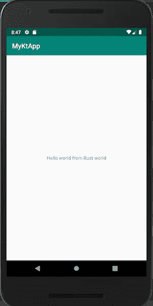
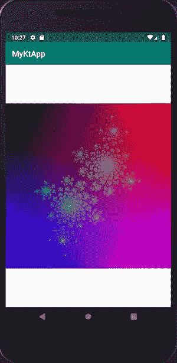

# 铁锈促进 NDK 发展

> 原文：<https://medium.com/geekculture/the-following-are-examples-to-render-fractal-images-in-android-bitmap-with-rust-22a9fb5d648b?source=collection_archive---------12----------------------->

下面是用 Rust 渲染 Android 位图中的[分形](https://en.wikipedia.org/wiki/Fractal)图像的例子。

为了进行 Android 开发，我们需要设置我们的 Android 环境。首先，我们需要安装[安卓工作室](https://developer.android.com/studio/index.html)。一旦安装了 Android Studio，我们就需要安装 [NDK](https://developer.android.com/ndk) (本地开发套件)。

**首先，为您的应用程序创建一个新的 Kotlin Android 项目**
*打开 Android Studio，在欢迎屏幕或文件|新建|新建项目中单击开始一个新的 Android Studio 项目。*


> *选择一个定义应用程序行为的* [*活动*](https://developer.android.com/guide/components/activities/intro-activities) *。对于您的第一个“Hello world”应用程序，选择只显示一个屏幕的空活动，然后单击 Next。*


*建设和运行项目*


*打开安卓工作室。从工具栏进入* **Android Studio >首选项>外观&行为> Android SDK > SDK 工具。** *勾选以下安装选项，点击确定。*

```
* Android SDK Tools
* NDK
* CMake
* LLDB
```

一旦安装了 NDK 和相关工具，我们需要设置一些环境变量，第一个是 SDK 路径，第二个是 NDK 路径。设置以下环境变量

```
export ANDROID_HOME=/Users/$USER/Library/Android/sdk
export NDK_HOME=$ANDROID_HOME/ndk-bundle
```

*如果您还没有安装 Rust，我们需要现在就安装。为此，我们将使用 rustup。rustup 从官方发布渠道安装 Rust，让你轻松在不同发布版本之间切换。这对你以后所有的 Rust 开发都是有用的，不仅仅是这里。rustup 也可以和家酿一起使用。*

```
curl https://sh.rustup.rs -sSf | sh
```

*创建铁锈项目*

```
cargo new rust-lib && cd rust-lib
```

下一步是创建 NDK 的独立版本供我们编译。我们需要为每一个我们想要编译的架构做这件事。我们将使用主 Android NDK 中的 `*make_standalone_toolchain.py*` *脚本来完成这个* *现在让我们创建独立的 NDK。一旦创建了 NDK 目录，就不需要在里面做这些了。*

```
mkdir NDK && cd NDK
${NDK_HOME}/build/tools/make_standalone_toolchain.py --api 26 --arch arm64 --install-dir arm64
${NDK_HOME}/build/tools/make_standalone_toolchain.py --api 26 --arch arm --install-dir arm
${NDK_HOME}/build/tools/make_standalone_toolchain.py --api 26 --arch x86 --install-dir x86
```

*创建一个新文件，* `*cargo-config.toml*` *该文件将告诉 cargo 在交叉编译期间在哪里寻找 ndk。将以下内容添加到文件中，记住用项目目录的路径替换* `*<project path>*` *的实例。*

```
[target.aarch64-linux-android]
ar = "<project path>/rust-lib/NDK/arm64/bin/aarch64-linux-android-ar"
linker = "<project path>/greetings/NDK/arm64/bin/aarch64-linux-android-clang"[target.armv7-linux-androideabi]
ar = "<project path>/rust-lib/NDK/arm/bin/arm-linux-androideabi-ar"
linker = "<project path>/greetings/NDK/arm/bin/arm-linux-androideabi-clang"[target.i686-linux-android]
ar = "<project path>rust-lib/rust-lib/NDK/x86/bin/i686-linux-android-ar"
linker = "<project path>/greetings/NDK/x86/bin/i686-linux-android-clang"
```

*为了让 cargo 看到我们的新 SDK，我们需要将此配置文件复制到我们的。货物目录是这样的:*

```
cp cargo-config.toml ~/.cargo/config
```

让我们继续将我们新创建的 Android 架构添加到 rustup，这样我们就可以在交叉编译期间使用它们:

```
rustup target add aarch64-linux-android armv7-linux-androideabi i686-linux-android
```

*打开* `*rust-lib/Cargo.toml*` *并修改 config。*

```
**[dependencies]**
**[target.'cfg(target_os="android")'.dependencies]**
jni = { version = "0.5", default-features = false }**[lib]**
name = "rust"
crate-type = ["dylib"]
```

*打开* `*rust-lib/src/lib.rs*` *。在文件底部添加以下代码:*

```
/// Expose the JNI interface for android below
#[cfg(target_os = "android")]
#[allow(non_snake_case)]
**pub** **mod** android {
    **extern** **crate** jni; **use** super::*;
    **use** self::jni::JNIEnv;
    **use** self::jni::objects::{JString, JClass};
    **use** self::jni::sys::jstring;
    **use** std::ffi::CString; #[no_mangle]
    **pub** **unsafe** **extern** **fn** **Java_com_example_myktapp_MainActivity_greeting**(env: JNIEnv, _: JClass) -> jstring {
        **let** world_ptr = CString::new("Hello world from Rust world").unwrap();
        **let** output = env.new_string(world_ptr.to_str().unwrap()).expect("Couldn't create java string!");
        output.into_inner()
    }
}
```

*为 Android x86(模拟器)构建库*

```
cargo build --target i686-linux-android --release
```

*将动态库链接到 Android 项目*

```
cd app/src/main
ln -s <project_path>/rust-lib/target/i686-linux-android/release/librust.so jniLibs/x86/librust.so
```

*编辑布局* `*activity_main.xml*` *为文本视图添加 id*

```
<**TextView**
        android:id="@+id/txtHello"
        android:layout_width="wrap_content"
        android:layout_height="wrap_content"
        android:text="Hello World!"
        app:layout_constraintBottom_toBottomOf="parent"
        app:layout_constraintLeft_toLeftOf="parent"
        app:layout_constraintRight_toRightOf="parent"
        app:layout_constraintTop_toTopOf="parent" />
```

*在* `*MainActivity.kt*` *文件中，添加以下代码。这里我们定义了 Rust 的本地接口。这个* `*greeting*` *方法简单地调用了那个本地函数* `*Java_com_example_myktapp_MainActivity_greeting*`

```
**private** external fun **greeting**(): String
```

*我们需要调用函数从 Rust 获取消息并加载我们的 Rust 库*

```
**class** **MainActivity** : **AppCompatActivity**() { **private** external fun **greeting**(): String override fun **onCreate**(savedInstanceState: Bundle?) {
        **super**.onCreate(savedInstanceState)
        setContentView(R.layout.activity_main)
        val textView: TextView = findViewById(R.id.txtHello)
        textView.text = greeting()
    } companion object {
        init {
            System.loadLibrary("rust")
        }
    }}
```

> *再次构建并运行项目*



*编辑布局* `*main_activity.xml*` *添加* `*BitmapView*`

```
<?xml version="1.0" encoding="utf-8"?>
<**androidx.constraintlayout.widget.ConstraintLayout** xmlns:android="http://schemas.android.com/apk/res/android"
    xmlns:app="http://schemas.android.com/apk/res-auto"
    xmlns:tools="http://schemas.android.com/tools"
    android:layout_width="match_parent"
    android:layout_height="match_parent"
    tools:context=".MainActivity"> <**ImageView**
        android:id="@+id/imageView"
        android:layout_width="match_parent"
        android:layout_height="match_parent"
        app:layout_constraintBottom_toBottomOf="parent"
        app:layout_constraintLeft_toLeftOf="parent"
        app:layout_constraintRight_toRightOf="parent"
        app:layout_constraintTop_toTopOf="parent" /></**androidx.constraintlayout.widget.ConstraintLayout**>
```

*在* `*MainActivity.kt*` *文件中，添加以下代码。这里我们定义了 Rust 的本地接口。* `*renderFractal*` *方法简单地调用本地函数并创建新的* `*Bitmap*` *，它将被本地函数*修改

```
**package** com.example.myktapp**import** android.graphics.Bitmap
**import** android.os.Bundle
**import** android.widget.ImageView
**import** androidx.appcompat.app.AppCompatActivity**class** **MainActivity** : **AppCompatActivity**() {**private** external fun **renderFractal**(bitmap: Bitmap)override fun **onCreate**(savedInstanceState: Bundle?) {
        **super**.onCreate(savedInstanceState)
        setContentView(R.layout.activity_main)
        val bitmap = Bitmap.createBitmap(800, 800, Bitmap.Config.ARGB_8888)
        renderFractal(bitmap)
        val imageView: ImageView = findViewById(R.id.imageView)
        imageView.setImageBitmap(bitmap)
    }companion object {
        init {
            System.loadLibrary("rust")
        }
    }}}
```

*打开* `*rust-lib/Cargo.toml*` *，添加* `[*image*](https://docs.rs/image/0.22.3/image/)` *和* `[*num-complex*](https://github.com/rust-num/num-complex)` *货箱到依赖*

```
**[dependencies]**
**[target.'cfg(target_os="android")'.dependencies]**
jni = { version = "0.5", default-features = false }
image = "0.22.0"
num-complex = "0.2"
```

*打开* `*rust-lib/lib.rs*` *，在* `*android*` *mod、* `*graphic*` *模块里面添加下面的代码只是一个* [*NDK C++位图头*](https://developer.android.com/ndk/reference/group/bitmap) *，你可以在* [*分形. rs*](https://github.com/hoangpq/rust-ndk-example/blob/master/rust-lib/src/android/fractal.rs) 上找到 `*fractal::render*` *的代码*

```
#[no_mangle]
**pub** **unsafe** **extern** **fn** **Java_com_example_myktapp_MainActivity_renderFractal**(env: JNIEnv, _: JClass, bmp: JObject) {
    **let** **mut** info = graphic::AndroidBitmapInfo::new();
    **let** raw_env = env.get_native_interface(); **let** bmp = bmp.into_inner(); // Read bitmap info
    graphic::bitmap_get_info(raw_env, bmp, &**mut** info);
    **let** **mut** pixels = 0 **as** ***mut** c_void; // Lock pixel for draw
    graphic::bitmap_lock_pixels(raw_env, bmp, &**mut** pixels); **let** pixels =
        std::slice::from_raw_parts_mut(pixels **as** ***mut** u8, (info.stride * info.height) **as** usize); fractal::render(pixels, info.width **as** u32, info.height **as** u32);
    graphic::bitmap_unlock_pixels(raw_env, bmp);
}
```

> *构建并再次运行项目*



[**找到代码**](https://github.com/hoangpq/rust-ndk-example)