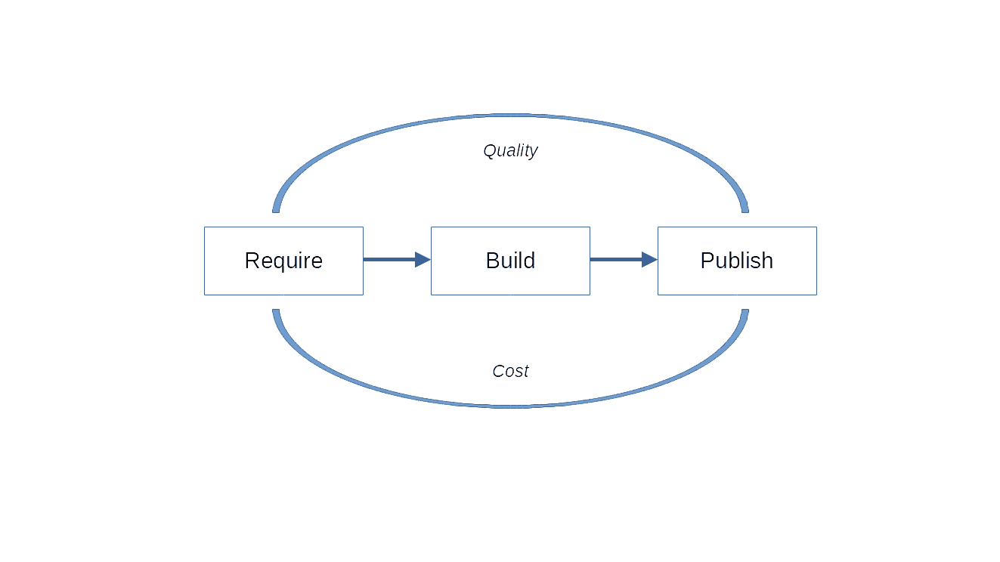

# 软件开发的基础:核心过程

> 原文：<https://medium.com/geekculture/the-fundamentals-of-software-development-the-core-process-9ffaa6f8fabf?source=collection_archive---------7----------------------->

软件开发是一个有趣的世界，在这个世界中，不需要正式的教育、认证、学徒、考试，甚至不需要太多的财务成本就可以开始工作，甚至获得成功。任何年龄的儿童、青少年和成人都可以参与进来，修补、构建和解决问题。随着时间的推移，“编码”变得越来越容易，比以前需要更少的技能、金钱和时间。另一方面，业务赖以建立并从中获取财富的“有趣”软件比过去更加复杂，需要大量的技能、时间和金钱。

软件开发的这种“缩放”,从一个简单的个人项目到需要数百(或更多)人的数十亿美元的多年项目，提供了一个有趣的机会来探索和理解所涉及的构建块和基本方面。不管复杂程度和规模如何，构建软件都必须做些什么？什么不是必需的，为什么？每个软件开发人员遵循的核心流程是什么，是有几十年经验的有成就的开发人员，还是想为学校的理科项目建网站的青年？一组高技能开发人员如何构建一个人工智能系统来理解厨师的英语口语，与同一个厨师将使用该系统对智能烤箱进行口头“编程”，这两者之间有本质区别吗？(“烤箱，把温度升到 400 度，保持那个温度，直到食物达到 204 度；然后将温度降低到 250 度两个小时，并将湿度增加 30%。”)

对于生产软件来说，什么是必要的，什么是充分的，这个问题可能看起来过于简单或者无趣。然而，当我们探索生产软件的基本原理时，我们可能会发现一些见解，这些见解可以改变我们未来处理软件的方式。这些见解可能不会帮助我们编写智能烤箱的程序，但它们可能会帮助我们建立人工智能系统。软件开发的基础是个人和团队开发软件的基础。

## **核心流程**

什么是生产软件的必要和充分条件的问题的答案是一个关于过程的问题。答案不是关于使用特定的工具或语言，而是关于采取什么步骤。以下段落详细介绍了这一过程。尽管这个过程被介绍得好像它是事实一样，但我承认这最终是我对上述问题的答案的看法。

第一，你要有要求。你需要知道软件必须做什么才能有意义。猴子在打字机上打字不会产生任何意义，直到你决定打字中有意义的是什么。换句话说，需求代表了对某人或某事有意义的软件的最终状态。

第二，必须努力“构建”软件。这可以是某种计算机语言的代码。它可能是现有软件的复杂配置。甚至可能是厨师以特定方式操作智能烤箱的口头命令。在某种程度上，我们花费精力来表达需求中指定的需求，以使计算机做我们想要的事情。

最后，无论构建了什么，都必须“发布”。对一些人来说，这意味着将数百个软件实例部署到数百个运行在“云中”的服务器上。对于其他人来说，这可能是向老师的助手展示你所做的东西，以获得家庭作业的分数。它可能只是运行一次简单的脚本来配置某个服务器，也可能是烤箱在烹饪你的食物。

这一过程的简单可能令人失望。这就是生产软件的全部吗？真的有人会用这种方式构建软件吗？希望不会。这不是故事的结尾，因为过程中的*不是*是关键，过程中的*不是*是由于问题的性质。问题*没有*问什么是构建*质量*软件的必要和充分条件。这就是洞察力所在。

## 质量怎么样

如果按照你必须遵循的过程来说，生产软件所必需的就是需求、构建和发布，那么对于任何非平凡的软件项目来说，你都会弄得一团糟。在这里，专业人士通常会拿出他们的干草叉，把我赶到树林里。然而，这仅仅展示了承认这个核心过程的真正洞察力:从理论上讲，你添加到核心过程中的任何东西都必须保证软件的质量。架构和设计，执行代码审查，测试(各种风格和类型):所有这些事情都是确保软件质量的实践。事实上，在软件生产过程中，任何无助于实现软件“质量”的事情都是可以停止的。没什么用。

如果没有某种形式的成本，你就不能增加实践来提高质量。无论是用金钱、时间、复杂性还是其他什么来衡量，所有的质量过程都是有成本的。你可能会说，对于一个给定的实践，它是值得的。这很公平，事实上，这是假设。如果得不偿失，那就不要做。事实上，大量的“过程改进”活动可以通过仅仅分析一个给定的实践和它的成本来确定它是否真的值得:它是否帮助你达到你想要的质量？如果没有，就不要做了。

因此，总而言之，软件是由一个简单的核心过程产生的:需求、构建和发布。只要有价值，您就可以添加实践来提高质量。如果你回顾今天存在的每一种软件开发方法，无论是瀑布、Scrum、极限编程，还是许多其他方法中的一种(甚至是定制开发的方法)，你会发现它们都有嵌入其中的核心过程，并且它们都添加了实践，以某种方式提高软件的最终质量。

## **什么是品质？**

这里有一个关键的方面没有提到，它是理解上述所有内容的关键。因为我们在谈论一个过程和这个过程的输出，术语“质量”已经被不严格地使用了。许多书籍和文章都是关于质量及其含义的。对一些人来说，这意味着软件中没有缺陷。对其他人来说，它代表了软件被使用者接受的程度。我一直很喜欢这句话:“它做了它应该做的事，还是没有做它不应该做的事？”它通常只与最终产品相关。然而，就核心过程而言，质量实际上不仅指所创建的软件的属性，还指该创建所涉及的过程。

质量代表了那些参与软件创建的人(包括任何利益相关者)的价值。例如，质量的一个方面可以指软件生产的速度。它可以代表开发人员的快乐，或者没有缺陷，或者可用性，或者总的财务成本，或者任何其他涉及到的价值。

例如，一个企业可能生产出一个有成千上万个缺陷的软件，而这个软件对于构建它的公司来说在财务收益方面可能是非常成功的。另一个组织可能生产一个软件，其中一个缺陷会导致灾难性的失败。软件开发得太慢可能会错过营销窗口，导致公司倒闭，数千名员工失业。构建成本过高的软件可能永远也不会被构建出来，因为没有人愿意为此付费。

## **结论**

核心过程、质量和成本之间的关系之所以如此重要，是因为它使组织、公司、团队和个人能够就如何生产软件做出有目的的决策。如果他们有意识地思考质量的含义和相关的成本，他们可以选择一个合适的方法(或者开发他们自己的方法)，根据需要改进它，并最终成功地构建软件。对于个人开发者来说，这些见解可以帮助我们以不同的方式看待软件生产。它成为改进我们已经遵循的流程的强大工具，因为我们可以更有目的地思考我们所做的事情。