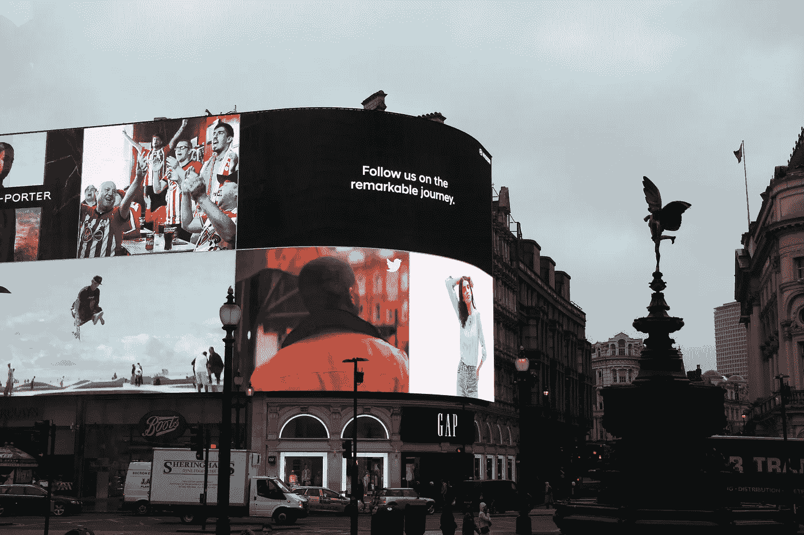

# 广告的未来:追踪的新方法

> 原文：<https://medium.com/geekculture/the-future-of-ads-new-ways-to-track-9fa5be5e2359?source=collection_archive---------66----------------------->

Eleni Afiontzi

定向广告是塑造我们体验互联网的巨大力量。通过 cookies 和追踪器收集我们的私人信息，公司将这些信息提供给算法，以确定我们看到什么，何时看到以及多长时间看到一次。但是，随着互联网不再是一个奇迹，而是一个平凡的事物，人们开始更多地选择它的过程，导致对隐私的更大关注。在这一点上，任何用户都可以通过简单地安装 Firefox 和一些阻止跟踪器和隐藏第三方广告的插件来减少他们看到的广告数量。

这使得广告行业争先恐后地重塑广告，清理它们的形象，使它们的服务成本更低，更精确。毕竟，随着看广告的人数减少，广告需要变得更聪明才能生存。我已经在之前的一篇文章中谈到了 Google 的 FLoC，但是未来还会有更多的变化。今天，让我们来看看未来广告的形状。

# 把饼干放下

Carlos Muza

部署任何一种改变网络的想法都将是一个挑战，尤其是当其当前的统治者正在尽一切努力让系统对他们有利的时候。最近[针对谷歌](https://appleinsider.com/articles/21/04/11/google-bernanke-revealed-in-ad-business-antitrust-lawsuit-error)的反垄断诉讼，涉及到它的伯南克项目，凸显了少数几家公司对市场施加了多大的控制。只有像谷歌这样的巨头才有能力以絮凝的形式进行变革，而其他人都在努力创新。

大多数提出新的定向广告方式的公司都是在考虑完全或部分替代 cookies。其中一个想法包括使用[你的电子邮件或电话号码](https://www.eff.org/deeplinks/2021/04/after-cookies-ad-tech-wants-use-your-email-track-you-everywhere)来追踪你的网络活动。基本上，你进入一个网站，要求你提供两个标识符中的一个——电子邮件或号码——你照做了，因为否则网站不会让你进去。该标识符被记录并发送给第三方，第三方使用它来生成您的“个人资料”(uid 2)——跟踪您喜欢什么、您阅读了什么、您在哪里以及他们如何才能最好地锁定您。

这可能听起来像是对隐私的可怕侵犯，因为确实如此，但这些事情对 cookies 来说或多或少都是真实的。当然，除了更明显的可疑之处——收集你的联系信息。具体来说，这使得这种解决方案不太可能实现。虽然作为一个社会，我们已经很大程度上接受了无处不在的广告，但人们仍然意识到事情令人毛骨悚然的一面。当广告过于精确时，目标就被推迟了。对于数据收集过于明显的情况也是如此，正如脸书在 WhatsApp 新隐私政策失败后最近学到的一样。

# 关键是什么？

Nicolai Berntsen

一个更奇怪的案例是 Cloudflare 试图摧毁 CAPTCHA 的新尝试。是的，那些烦人的“点击所有路灯”和“用车辆挑每一个方块”的东西，通常是用来训练 AI 的，浪费一个随便用户的时间。摆脱这个系统似乎是一个不错的计划，特别是如果它仍然带有防止 DDOS 攻击和垃圾邮件的保护措施，就像 CAPTCHA 现在做的那样。

[Cloudflare 提出的](https://www.zdnet.com/article/cloudflare-wants-to-kill-the-captcha/)很有趣，而且几乎很棒——完全抛弃验证码，使用“物理认证设备”代替。这意味着像 YubiKey 甚至你的手机内置的 NFC 阅读器这样的东西可以向网站证明你的身份并允许进入。现在，这可能会给你敲响警钟——当然，使用一个唯一的安全密钥，即使是一个加密的密钥，也能使你在网上被识别，从而被跟踪？嗯，Cloudforce 的答案听起来与 FLoC 惊人地相似——键实际上并不像“每人一个”那样唯一。它们在每批发行的硬件中都是独一无二的，这意味着你将与其他 1000 个人共享密钥。借用谷歌的术语，你被认为是某个群体中的一员，你和这个数字家庭的其他用户一起浏览网页。这没有考虑到群体和广泛的跟踪，以及单个密钥获取可能会被追踪到用户的想法，这意味着你的加密密钥会变成枷锁，而不是通往自由的道路。

所以，当你可以推销更高效浏览的承诺时，谁还需要 cookies 呢？当然，Cloudflare 的新想法远不是最糟糕的。尽管这并不理想，而且我们已经用了很长时间的折中方案。

# 最后

Solen Feyissa

随着 cookies 的退出，这场比赛将会看到什么将成为跟踪领域的下一件大事。实际上，我会把赌注压在谷歌身上，因为尽管受到了负面的影响，这家公司还是太大了，难以超越。这意味着，只有当谷歌做出这样的决定，或者出现足够大的竞争对手时，FLoC 或其任何分支才会失败。

目前，作为一名消费者，你可以也应该通过使用注重隐私的软件、无跟踪插件或不跟踪用户的服务来阻碍跟踪。