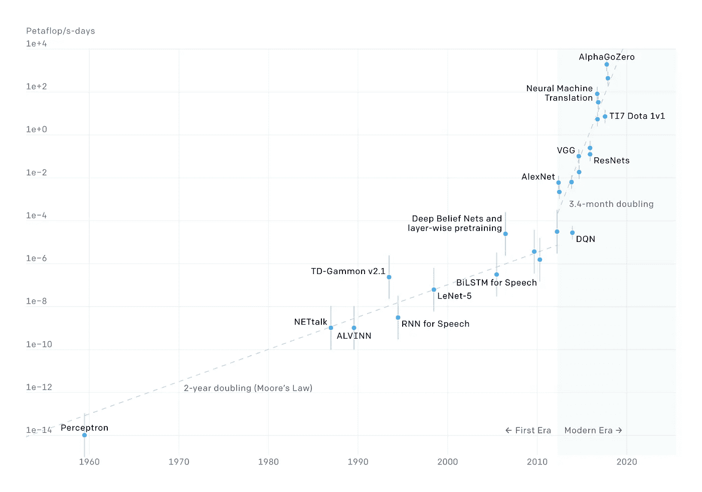

# 数据科学计算的未来

> 原文：<https://medium.com/geekculture/the-future-of-computing-for-data-science-45fc2c6b171c?source=collection_archive---------29----------------------->

## 从当前到未来几十年的技术:几个例子

Photo by Annamária Borsos

在摩尔定律和冯·纽曼架构的指导下，经典计算取得了显著的进步。摩尔定律告诉我们，每两年，我们将处理器中的晶体管数量增加一倍，同时我们将性能提高两倍或成本降低两倍。在过去十年中，这一速度已经放缓，我们目前正在看到新兴技术。我们必须重新思考信息技术(IT ),特别是转向具有特定加速器的异构系统架构，以满足性能需求。同样有趣的是，上个世纪理论科学的进步如何帮助我们推进今天的计算。如果我们以数据科学工作负载为例，就会出现许多问题，例如无限的计算需求。自 2012 年以来，OpenAI 表明，训练计算需求以 3.4 个月的倍增时间呈指数级增长。计算的进步是人工智能进步的关键因素。

从 AlexNet 到 AlphaGo Zero:计算能力提升 30 万倍

Source: OpenAI, AI and Compute, [https://openai.com/blog/ai-and-compute/#fn1](https://openai.com/blog/ai-and-compute/#fn1)

从一个新兴的人工智能，我们进入了一个具有颠覆性、普适性、多任务、多领域、多模型的广义人工智能时代。为了应对这些挑战和处理计算限制，科学家们正在研究能够用少得多的数据进行训练的人工智能(例如，改进的算法，降低的精度)，并找到加速工作负载的新方法(例如，模拟硬件，量子)。未来的数据中心肯定会由异构系统组成，这些系统将运行异构工作负载。它将配备二元、生物启发和量子加速器。这些架构将成为应对下一代挑战的基础。就像管弦乐队的指挥一样，所有维度的云(混合云、多重云、分布式云)将使这些系统能够为音乐伴奏，这也要归功于智能自动化的人工智能层。

# 从信息论到管理我们的社会

这并不意味着这是二进制系统的终结！克劳德·香农(1916–2001)是工程师、数学家，信息论之父之一。他在麻省理工学院工作了 20 年，除了学术活动，他还在贝尔实验室工作。经典计算机使用的二进制出现在 20 世纪中期，当时数学和信息以一种新的方式结合起来，形成了信息论，推动了计算机行业和电信行业的发展。二进制的优势在于它的简单性和可靠性。一个比特可以是零，也可以是一，这是一种易于测量、计算、交流或存储的状态。今天的计算机和高性能计算机就是基于这一原理，运行着我们的社会和经济。

今天，我们可以很容易地举出一些二进制系统不可思议的可能性的例子。第一个例子是 IBM z15 的功能，其芯片采用 14 纳米技术，包含 91 亿个晶体管。单个系统每天能够处理 190 亿次加密交易和 10000 亿次网络交易。安装在全球各地的 IBM z15 系统每年处理 87%的银行卡交易和 8 万亿次支付。可以在一个系统中部署 240 万个 docker 容器。因此，它的整合能力大大减少了数据中心空间、降低了成本并节省了大量能源，同时始终保持了 IBM Z 的优势，如安全性、可靠性和弹性。我们还可以举出世界上最强大的计算机之一，Summit。这台计算机帮助模拟超新星或新材料，探索对抗癌症的解决方案，研究遗传学和环境。Summit 配备了 9216 个 IBM Power9 CPUs，27648 个 NVIDIA Tesla GPUs，并在节点之间提供 200 petaflops(百万亿次)，每秒 25 千兆字节，并具有 250 petabytes 的存储容量。即使有了这种惊人的尖端技术，我们也无法计算一切。我们不能储存所有的东西。存在严重的瓶颈，尤其是基于冯纽曼的架构。

# 生物启发

今天，在数据科学领域，通过将工作负载转移到能够实现所需数字功能的 GPU 或 FPGAs(现场可编程门阵列)来补偿对计算能力的需求。但是需要找到其他的计算方法。我们可以通过神经科学领域的进展找到灵感，这将允许设计一种直接受大脑传输信息方式启发的新型处理器。由于西班牙组织学家和神经科学家圣地亚哥·拉蒙·y·卡哈尔(Santiago Ramon y Cajal)与卡米洛·高尔基一起获得了 1906 年的诺贝尔生理学或医学奖，我们更好地了解了神经系统的结构以及神经元之间相互通信的方式。神经元的轴突向靶细胞传递神经冲动，即动作电位。

在《科学》杂志上发表的一篇文章中，IBM 及其大学合作伙伴开发了一种由一百万个电子神经元组成的新型处理器。该芯片的功耗仅为 70 毫瓦，每秒每瓦能够进行 460 亿次突触运算，简直就是一台握在手中的突触超级计算机。研究人员已经从神经科学转向超级计算机，一种新的计算架构，一种新的编程语言，算法，应用程序，现在是一种叫做 TrueNorth 的新芯片。TrueNorth 就是我们所说的神经形态 CMOS 集成电路。这是一个众核处理器网络，有 4096 个核，每个核有 256 个可编程模拟神经元，总数略超过一百万个神经元。反过来，每个神经元有 256 个可编程突触，允许信号传输。因此，可编程突触的总数略多于 2.68 亿。基本晶体管的数量是 54 亿。由于内存、计算和通信是在 4096 个神经突触核心中的每一个中管理的，因此 TrueNorth 绕过了冯诺依曼架构的瓶颈，并且非常节能。它的功率密度是传统微处理器的万分之一。神经形态计算市场预计将从 2020 年的 660 万美元增长到 2027 年的 2.729 亿美元。

Source: The Scientist, Building a Silicon Brain, [https://www.the-scientist.com/features/building-a-silicon-brain-65738](https://www.the-scientist.com/features/building-a-silicon-brain-65738)

DNA 也是灵感的来源。一个团队最近在《科学》杂志上发表了在 DNA 分子上存储数字数据的能力。他们能够在 DNA 链中存储一个操作系统、一部 1895 年的法国电影(路易斯·卢米埃尔的《火车到站》)、一篇科学文章、一张照片、一个病毒和一张价值 50 美元的礼品卡，并准确无误地检索数据。

事实上，DNA 分子天生就是用来储存信息的。遗传信息是组成 DNA 分子的四个含氮碱基(A、C、T 和 G)。今天，把数字数据转录成新的代码是可能的。DNA 测序使得读取储存的信息成为可能。编码通过软件实现自动化。一个 DNA 分子是 30 亿个核苷酸(含氮碱基)。一克 DNA 可以存储 215 的数据。将人类创造的所有数据储存在一个房间里是可能的。此外，DNA 理论上可以在极其长的时间内保持数据的完美状态。在理想的条件下，据估计，由于“长寿基因”，DNA 在几百万年后仍然可以被破译。DNA 可以承受最极端的天气条件。它仍处于实验室阶段，肯定会面临许多挑战，例如高成本和处理时间可能会非常长，但绝对是一种有前途的数据存储技术。

# 物理学

物理定律也帮助我们想象未来的计算机。让我们从原子开始。在《自然》杂志发表的一篇文章中，IBM 物理学家和工程师描述了他们如何在稀土元素钬原子中实现读写数据的壮举。这是一个象征性的进步，但证明了这种方法是可行的。有一天我们可能会有原子数据存储。为了比较这意味着什么，想象一下我们可以在一个信用卡大小的设备上存储 3500 万首歌曲的整个 iTunes 库。在论文中，纳米科学家展示了在一个原子上读写一位数据的能力。相比之下，今天的硬盘驱动器使用 10 万到 100 万个原子来存储一位信息。

当然，我们不能避免讨论量子计算。量子位——或量子位——将物理和信息结合在一起，是量子计算机的基本单元。量子计算机在基于量子物理定律的计算模型中使用量子位，这肯定能够解决非常复杂的问题。除了这一技术进步，量子计算开辟了处理计算机任务的道路，这些任务的复杂性超出了我们当前计算机的能力。量子计算机将与今天的计算机截然不同，不仅是它们的外观和制造方式，更重要的是，它们能做什么。

我们还可以引用曾在 IBM 工作的物理学家罗尔夫·兰道尔的一句名言:“信息是物理的。”当然，计算机是物理机器。因此，有必要考虑信息比特的计算、记录和读取所产生的能量成本以及热量形式的能量耗散。在热力学和信息之间的联系是许多问题的主题的背景下，罗尔夫·兰道尔试图确定在给定的物理系统中操纵一个比特的信息所需的最小能量。因此，在 1961 年发现了一个极限，今天称为朗道极限，它定义了任何计算机系统都必须散发最少的热量，因此消耗最少的电能。这项研究非常重要，因为它表明任何计算机系统都有一个我们无法超越的最小热和电阈值。这将意味着我们将达到计算机芯片的最低消耗，它将无法释放更少的能量。现在不是，但科学家解释说，在设计量子芯片时，这种限制将特别存在。IBM 的 Charles Henry Bennett 最近的工作包括重新检查信息的物理基础，以及将量子物理学应用于信息流问题。他的工作在物理学和信息之间的相互联系的发展中起了重要作用。

在我们需要计算的应用中，有简单的问题，有经典计算机难以解决的问题，也有不适合量子计算机的问题，量子可能具有真正的优势，如因式分解或模拟量子力学，以及通过执行量子模拟、机器学习(分类)、微分方程、通过计算线性系统或优化的网络分析、搜索、碰撞发现、图形属性等在化学、物理、材料发现中的应用。我们已经可以探索基本的计算构建模块，如量子内核和量子神经网络([https://medium . com/qi skit/introducing-qi skit-machine-learning-5f 06b 6597526](/qiskit/introducing-qiskit-machine-learning-5f06b6597526))。

# 结论

计算的未来将由异构系统构建，这些系统由称为二进制或位系统的经典计算、生物启发计算和称为量子或量子位系统的量子计算组成。这些异构组件将由一个云架构来编排和部署，该云架构屏蔽了复杂性，同时允许安全地使用和共享私有和公共系统及数据。AI 也将带来进步的机会，并应用于未来整个数据中心的管理和优化。

**来源**

计算的未来:比特+神经元+量子比特，达里奥·吉尔和威廉 M. J .格林，【https://arxiv.org/pdf/1911.08446.pdf·

未来的数据中心由异构加速器组成

https://arxiv.org/pdf/2003.10950.pdfXavier 瓦斯奎斯

OpenAI，AI 和 Compute，[https://openai.com/blog/ai-and-compute/#fn1](https://openai.com/blog/ai-and-compute/#fn1)

[https://en.wikipedia.org/wiki/Claude_Shannon](https://en.wikipedia.org/wiki/Claude_Shannon)

[https://www . IBM . com/thought-leadership/innovation-explaints/Dario-Gil-quantum-computing](https://www.ibm.com/thought-leadership/innovation-explanations/dario-gil-quantum-computing)

[https://www . mccourier . com/neuromorphic-computing-market-outlook-and-opportunities-in-grooming-regions-edition-2021-2026-leading-players-IBM-Samsung-electronics-Intel-corporation-hrl-laboratories-2/](https://www.mccourier.com/neuromorphic-computing-market-outlook-and-opportunities-in-grooming-regions-edition-2021-2026-leading-players-ibm-samsung-electronics-intel-corporation-hrl-laboratories-2/)

单原子磁体的读写。自然 543，226–228(2017)。[https://doi.org/10.1038/nature21371](https://doi.org/10.1038/nature21371)

[https://www . IBM . com/blogs/research/2017/03/meet-IBM-nano scientists/](https://www.ibm.com/blogs/research/2017/03/meet-ibm-nanoscientists/)

【https://www-03.ibm.com/press/us/en/pressrelease/51787.wss 