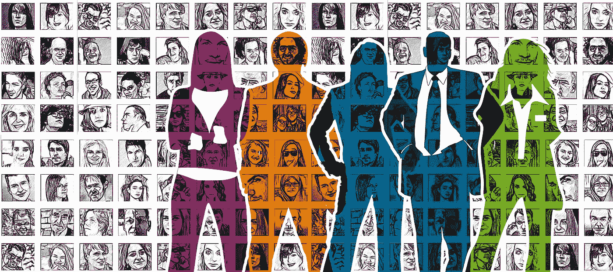

# 布拉斯的游戏

> 原文：<https://medium.com/geekculture/the-game-of-biasses-the-hiring-process-b0689fd15c85?source=collection_archive---------4----------------------->

我们可以花很多精力来设计世界上最好的面试流程。我们可以花大量的时间寻找不同背景的人。我们可以尽最大努力公正地评判他人，并提出有见地的问题。但是，最终，我们做什么并不重要，因为招聘过程是一场偏见的游戏，无论我们喜欢与否，我们都是其中的一部分。所以，如果你觉得这个总结冒犯了你，并且仍然相信你是与众不同的，独一无二的，特别的，它并不适用于你，我建议你停止欺骗自己。

走出仓鼠轮的第一步是承认我们并不完美，事实上，我们对特定类型的候选人有偏好。**没关系，说真的。**

> "意识是改变的最大动力。"

## **你**知道…？

*   我们更有可能雇佣一个长得好看的人，而不是一个“不怎么好看”的人？
*   我们更有可能雇佣一个和我们同性别的人吗？
*   我们肯定会对来自相同国家或文化的人更加积极？
*   我们会更容易被与我们有着相同价值观和工作态度的人所吸引？

如果你足够幸运，曾经参与过招聘过程，甚至更幸运，并且记录了所有的面试，我强烈建议你仔细阅读。通读你给出的所有反馈，寻找模式。他们会说很多关于候选人的事情，但会透露更多关于你的信息。即使你没有笔记或者你的反馈很短，它仍然能说明一些事情，在这种情况下，大部分是关于你的。

我们倾向于相信我们所持有的人格特质和价值观比其他人更重要。例如，如果你是一个内向的人，你将更有可能雇用一个稍微安静一点的人。如果你重视勤奋，你自然就不太可能接受那些经常混乱且让人感觉不可预测的高创造力的人。我们都在寻找我们所理解和联系的相似性和偏好。

> “我们看不到世界的本来面目，我们看到的是我们自己”——阿奈斯·宁

## 有偏过程

在一个团队中，人们行为相似的情况并不少见。但是，如果你稍微挖掘一下，我们会注意到，这一切都是从这个对招聘决策影响最大的人开始的。功能失调的团队就是这样形成、不成比例地成长和蔓延的。当然，每个人都在试图对抗它，但很少解决核心问题。

我注意到，那些对多样性喊得最多的公司，其实是那些在这方面做得很差的公司。工作说明书中关于他们如何关心平等、多样性、薪酬差距的段落越长，废话就越多。他们试图吸引更好的组合和多样性的努力很少让人感觉真实，我们可以看到这一点。我无法摆脱“多样性”只是另一个时髦的时髦词，仅仅是一个很好的营销工具的想法。虽然有大量证据表明，小公司了解实际利益，并真正努力雇用能够提供不同思维方式的人，但另一方面，大公司让我们怀疑他们的真实意图——这又是为了钱吗？

## 重力

不了解重力和空气动力学，人类永远不会飞。如果不了解我们自己的情绪、价值观、个性、诱因和偏见，我们将永远无法创建一个稳固的团队。除非我们努力变得更有自我意识，有意识地理解你自己，否则招聘过程将会被看不见、理解不了、甚至不知名的力量扭曲。我们都只是人类，我们有我们的缺点。

# 建设包容性环境

这很容易，但却很难。

*   从工作规范开始。
    考虑一下你如何描述这个角色，设定明确的期望，避免写要求时好像你已经有了一个特定的人选。关注所有的候选人，了解他们的动机以及他们申请这个职位的原因。是什么吸引了他们？
*   **面试流程。**
    它应该涉及不同的人，包括初级团队成员，他们可以对流程做出贡献。不要将对话仅限于您的团队。不要害怕从和你不属于同一个组织的人那里得到反馈。
*   **面试目标。**
    在面试过程中围绕自己想学的东西有切实的目标。目标之一应该是了解候选人的个性特征，而不要投射你的期望。问随机的问题没有帮助，也没有灵活的僵硬的“照章办事”的过程。在招聘过程的早期(5 分钟内)决定你是否要聘用该候选人，并专注于质疑你的决定和发现真相。
*   **求异。**
    搜索不同经历、技能水平、学历、背景、性格、爱好的人。多元化不仅仅是性别和肤色。外向、开放，甚至像远程工作偏好这样简单的事情呢？你会惊讶于看似不重要或不相关的过去经历会对你的公司未来的表现产生怎样的影响。找一个和团队其他成员完全一样的人并没有真正的好处，所以不要为了“文化契合”而雇佣。
*   每个人都可以畅所欲言。
    这意味着倾听所有团队成员的意见，而不仅仅是最大声或最勇敢的那一个。鼓励挑战现状，相信人们的意见。如果你雇佣了合适的人，你的角色就是给他们声音的责任，并且不要挡他们的路。倾听人们的心声，在挑战变成问题之前解决它们。
*   **停止周五啤酒日。**
    在办公室里免费饮酒的啤酒星期五并不是一种将人们聚集在一起的“包容而有趣的创业氛围”。对于那些正在与体重、食欲或情绪作斗争的人来说，周二吃油炸圈饼是不健康的，也是一种挑战。他们会发现很难抗拒它们。给你的团队高薪，他们就能买得起啤酒、糖果或任何他们认为重要和相关的东西。没有人需要“虚假的快乐日”。
*   假期不仅仅是圣诞节。
    尤其是在完全偏远的时候，要考虑不同国家的人是怎么过节的。不仅如此，许多人实际上根本不在乎圣诞节，所以如果他们想工作，你为什么要强迫他们休息呢？如果你还想这么做，难道你不应该庆祝公司的所有活动吗？
*   **要透明。**
    人都是害怕未知的，都是自己写故事和辩解的高手。合作是一种应该建立在信任基础上的关系，这为透明度提供了机会。让每个人都能拿到薪水，提供反馈，并允许任何人都能看到。没有真正的理由不这样做，除非你在一个花了几十年时间在部门和团队之间建墙的组织里…
*   真诚地关心你的同事。听起来不是很多，但我了解到对一些公司来说这是最难的部分。同理心是取得进步的关键，必须双向努力。

# 为正确的事情而战

对抗偏见的唯一方法是先了解自己。这将让我们在面试过程中做出更好的决定，并根据**文化契合度、**停止招聘，这意味着“聘用像我们这样的人”，与“聘用安全”同义。经理们通常不希望有强烈意见的团队成员挑战现状，因为他们认为这只是太多的工作和痛苦。

基于文化贡献的招聘带来了多样性，可以激发批判性思维和新想法，帮助企业发展。回到我之前说过的——我们首先需要了解自己。这些知识将帮助我们更好地了解我们的团队。这些知识将引导我们做出更好的招聘决定，并对不同的思维方式持开放态度。每一个新加入者都可以带来新的东西，增加额外的知识，不同的行业经验，或者只是对同一主题的意想不到的看法。使用它。

# 招聘“餐巾测试”

这不是真正的餐巾测试，而是一些简单的规则，帮助我找到合适的候选人加入我的团队，并尽可能减少我的偏见。

> “我雇用你是因为你有足够的技能和足够的意愿，有一天你会得到我的工作……不管你愿不愿意”——管理人类

OCEAN——我努力去了解我的候选人是谁，通过识别和提问来帮助我理解他们的五大性格特征，通常被称为海洋。这是开放、尽责、外向、随和和神经质的缩写。我从不寻找这些特征的特定组合或平衡。没有期望。相反，它有助于我将面试过程集中在具体的想法上，而不是仅仅通过技术技巧，问大量无用和无组织的问题，最终什么都不会透露。我已经了解我的团队，我会一直寻找不同的人。

分享我的笔记——这听起来可能很奇怪，但是让一个新人加入公司最重要的一点是回答自己一个问题“我会和他们分享我的采访笔记吗？”。我在寻找这样的人，他们理解真诚的反馈有时会带来伤害，并包含他们可能不想听到的东西。与此同时，他们没有过度膨胀的自我，想要学习，并且知道这对他们来说是一个机会，可能是有史以来最好的事情。当我确信候选人是合适的人选时，我应该会毫无问题地真诚分享所有信息，并给予指导和建议。在这个过程中，我们都会对自己有新的认识。上一次有人与你分享真诚的反馈是什么时候？

给团队带来新的东西——我希望每个人都能给团队带来新的东西。当过老师的工程经理。表现出卓越领导能力的初级开发人员。一个魔术师般的网络工程师。内向的数据工程师女生会给外向的男性团队带来平衡。一个试图让我相信 TypeScript 优于普通 JavaScript 的人…名单很长。

## 行动，而不是言语。

在引入新成员之前，了解一个团队当前的个性和品质是多么重要，这一点我怎么强调都不为过。不要为了**适合**而雇佣，而是为了**的贡献**，并为随之而来的挑战做好准备。当(如果)他们这样做了，这将是一个发现的时刻，你会发现你没有意识到的问题。这是一个学习的机会，也是一个让事情变得更好的机会。这就是你如何建立自己的领导技能，获得团队的信任，并且永远不必谈论多样性。**重要的是行动，而不是言语。**

只关注适合和技术技能的招聘，你在领导、经理和人的工作上都失败了。

多元化不仅仅与肤色、性别或宗教有关。讲的是不同的思维、经历和想法。只要你真诚地向他们敞开心扉，你的团队就会拥有正确的、自然的平衡，以及来自各种背景的人的完美融合。