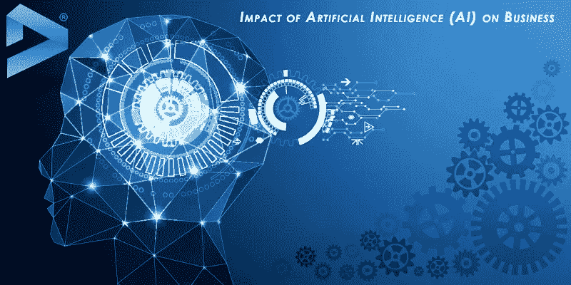
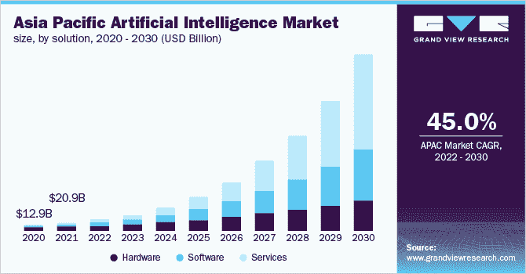
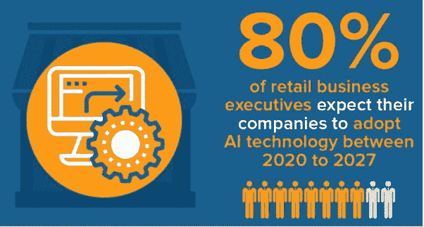
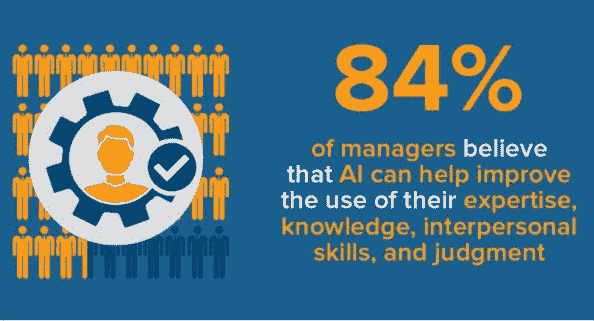

# 人工智能对商业的影响:你需要知道的事情

> 原文：<https://medium.com/geekculture/the-impact-of-artificial-intelligence-on-business-things-you-need-to-know-e7aeb94ffa9?source=collection_archive---------9----------------------->

Source: Decipher Zone

听到“人工智能”你会想到什么？这让许多人想起好莱坞电影的画面，如《前任玛奇纳》或《终结者》。

虽然这些描述可能有点牵强，但人工智能已经对全球企业产生了重大影响。

它影响着企业的方方面面，从市场营销到销售再到客户服务。许多公司已经在使用人工智能来自动化任务，并提高运营效率。

根据一份[报告](https://www.grandviewresearch.com/industry-analysis/artificial-intelligence-ai-market)，2021 年全球人工智能市场规模价值 935 亿美元，预计到 2030 年将增长*18110 亿美元。*

Source: grand view research

然而，如果你不熟悉人工智能，没有将它融入到你的业务中，你就错过了一些重要的东西。

在这篇博客中，我们将揭示人工智能对商业的影响，并讨论我们可以期待在未来几年看到的一些趋势。

我们也将为你提供一些在你的行动中使用人工智能的重要提示。

让我们出发吧…

# 人工智能:简要概述

人工智能，也称为 AI，是计算机科学的一个分支，涉及设计和开发智能计算机系统。这些系统可以执行通常需要人类智能的任务，例如理解自然语言和解决问题。

# 人工智能对商业的影响

人工智能对商业的影响是巨大的。它可以自动执行任务，改进决策，甚至创造新产品和服务。企业使用人工智能的一些最常见的方式包括:

*   **自动化招聘**

招聘是一个漫长而乏味的过程。这不仅要花很多时间，而且要找到具备特定技能的人才也非常具有挑战性。一些公司已经在使用人工智能(AI)来自动化他们的部分招聘流程。

Source: FinancesOnline

这些服务使用在网上找到的信息(如专业社交网站上的公开资料)自动将候选人与空缺职位匹配起来。与更传统的招聘方式相比，它们能提供更好的匹配。

这样，人工智能可以帮助企业提高效率，节省时间和金钱。

*   **个性化营销和销售**

近年来，世界变了，企业也需要改变。营销人员越来越意识到，他们不能只是向人们推销他们的内容；他们必须把它私人化。

这意味着将每一位顾客作为个体对待，并使用数据分析(和人工智能)等工具来确定他们的偏好。

越来越多的客户关系管理软件正在将人工智能融入其产品中，以使销售和营销更加个性化。

人工智能的应用意味着你可以更仔细地观察每个客户，以便你可以更好地为他们服务。你也可以[雇佣人工智能开发者](https://www.valuecoders.com/hire-developers/hire-machine-learning-experts?utm_source=GuestPost%28Medium%29&utm_medium=Anu_B11&utm_id=ImpactofArtificial+Intelligence)将人工智能技术整合到你的业务中。

此外，据 Gartner 称，到 2022 年，20%的客户与企业的互动将在没有任何人工互动的情况下进行。

这可能意味着任何东西，从在线聊天机器人到自助结账，再到基于先前购买推荐产品或服务的复杂算法。

*   **知情决策**

人工智能的关键在于其处理数据和做出不依赖于人类的明智决策的能力。通过使用人工智能，企业可以做出比以往任何时候都更好的商业决策——因为它们将建立在坚实的信息基础上。

Source: FinancesOnline

从本质上讲，人工智能通过更明智的分析，帮助企业在客户服务、金融甚至产品开发方面做出决策。

因此，公司将在竞争中保持领先，并做出更好的战略决策来推动增长和成功。

*   **简化客户支持**

人工智能对企业最重要的影响是改善客户支持。客户服务通常是企业的瓶颈，为所有客户提供及时、实用的支持并不容易。

人工智能聊天机器人正在改变这一切。这些聊天机器人可以处理许多客户支持任务，例如回答简单的问题，处理投诉，甚至处理退货。

此外，他们可以快速有效地完成任务—一周七天，一天 24 小时。这使得人工客户服务代表可以自由地解决更复杂的问题。

因此，企业可以以更低的成本提供更好的客户服务。他们也可以比以往更快更有效地做到这一点。你也可以利用[人工智能开发服务](https://www.valuecoders.com/ai-ml-development-services-company?utm_source=GuestPost%28Medium%29&utm_medium=Anu_B11&utm_id=ImpactofArtificial+Intelligence)将人工智能技术整合到你的业务中。

*   **提高安全性**

人工智能可以以多种方式用于改善业务。然而，人工智能对企业最直接的影响之一是提高安全性。

由于企业需要保护大量数据，跟踪所有数据变得越来越困难。

这就是人工智能的用武之地。人工智能可以帮助企业监控其网络的潜在威胁，并自动做出反应。这样，公司可以保证数据的安全，而不会给员工带来额外的压力。

*   **降低运营成本**

从在线订购到仓库自动化，人工智能有很多方式来降低运营成本，并让人类员工执行更高级的任务。

例如，销售助理可以专注于客户服务，而不是在零售店使用自动库存系统清点商品。这意味着他们可以为客户提供个性化的关注，从而提高客户满意度并增加销售额。

*   **精简供应链**

任何企业最重要的功能之一就是确保它有一个高效和有效的供应链。然而，提供这一点可能很困难，特别是在与供应商协调和按时交付货物时。

然而，印度最好的人工智能公司可以帮助企业精简供应链。你可以使用人工智能来管理供应商关系，预测需求，优化送货路线。这使得公司节省了时间和金钱，同时还能按时交货。

简而言之，人工智能可以帮助企业在供应链中变得更加高效和有效。这使他们能够节省资金并按时交货，同时保持高水平的客户满意度。

# 人工智能有哪些趋势？

随着技术的发展，人工智能的趋势也在不断变化。然而，在未来几年，我们有望看到一些关键趋势:

*   **更多企业将采用人工智能**

随着人工智能变得更加先进和实惠，我们可以看到更多的企业采用它。事实上，据估计，到 2025 年，95%的公司将以某种形式使用人工智能。

*   **AI 将变得更加专业化**

目前，大多数人工智能系统都是多面手，你可以用它来完成各种任务。然而，我们将开始看到为特定任务设计的更专业的人工智能系统。例如，可能会有一个专门用于客户服务的人工智能系统或另一个用于产品推荐的系统。

*   人工智能将变得更像人类

随着人工智能变得越来越先进，它将开始越来越像人类。这意味着我们可以期待看到能够进行自然语言处理和情感识别的人工智能系统。

*   **人工智能产品和服务的增长**

随着企业采用人工智能，我们可以看到人工智能产品和服务的相应增长。这包括虚拟助手、聊天机器人和智能家居设备等。

# 总结

正如你所看到的，人工智能对大大小小的企业都有一些影响。它可以改善客户服务、安全性和运营成本。

此外，它还能帮助企业简化供应链，提高整体效率。

这些优势使人工智能成为企业在当今竞争激烈的市场中寻求发展和成功时需要考虑的重要工具。

现在，还有什么可想的呢？今天就联系安 [**人工智能软件开发公司**](https://www.valuecoders.com/ai-ml-development-services-company?utm_source=GuestPost%28Medium%29&utm_medium=Anu_B11&utm_id=ImpactofArtificial+Intelligence) ，开始享受人工智能技术的好处。