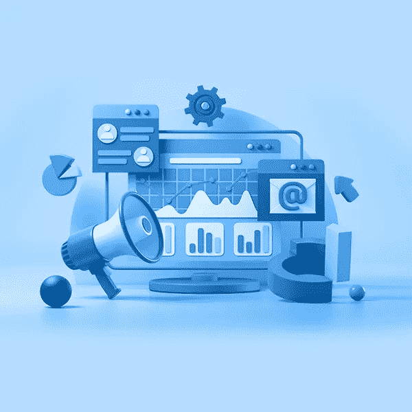
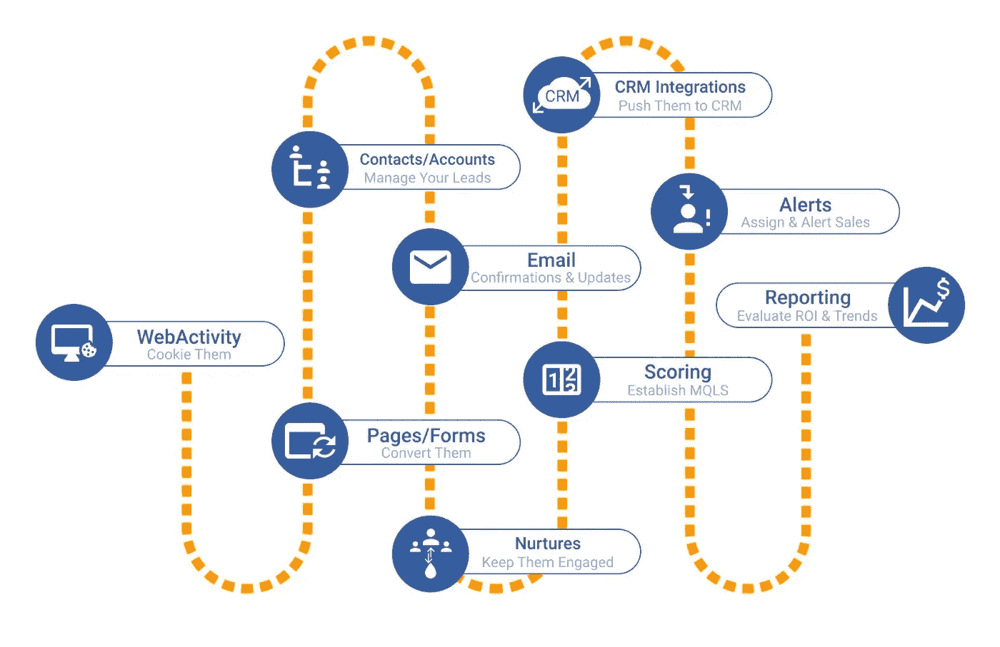
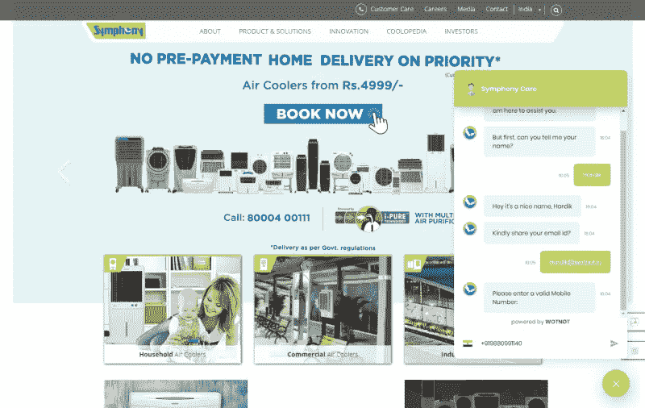
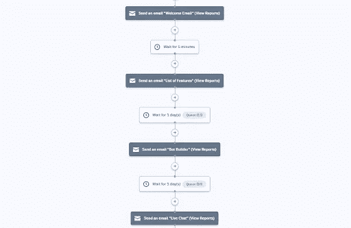
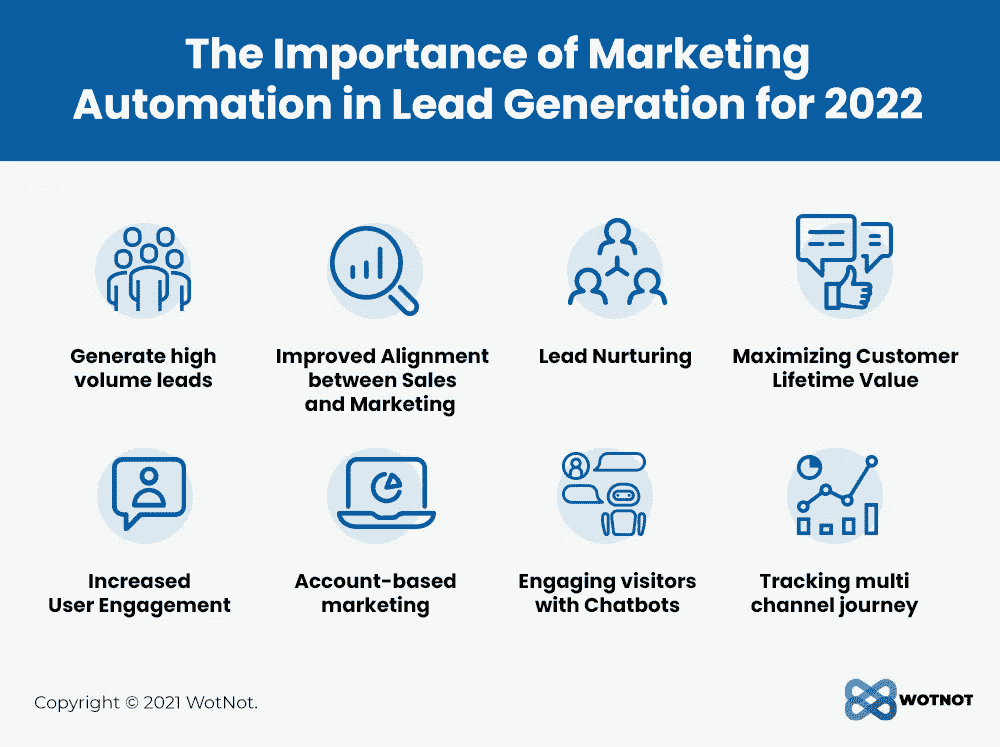
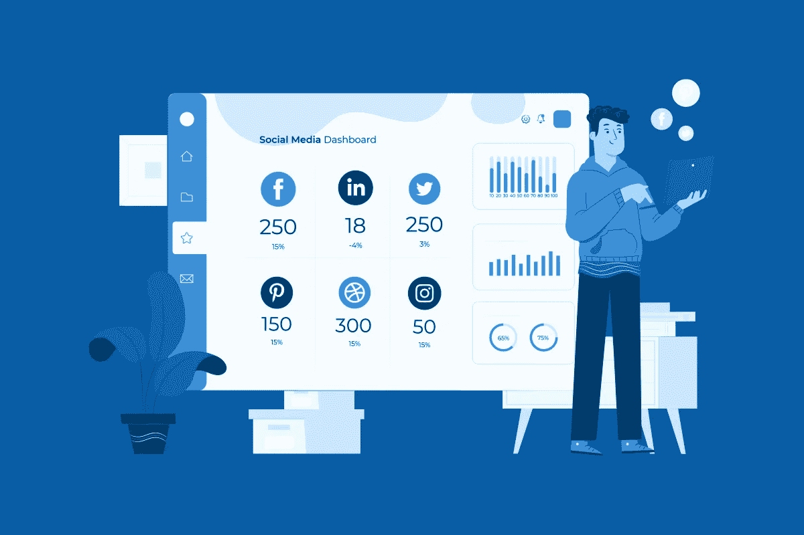

# 营销自动化在 2022 年销售线索挖掘中的重要性

> 原文：<https://medium.com/geekculture/the-importance-of-marketing-automation-in-lead-generation-for-2022-346fb664755b?source=collection_archive---------16----------------------->

尽管市场营销的本质是动态的，但其核心价值或多或少保持不变，即“让销售更容易”。但毫无疑问，我们实现目标的方式已经发生了变化，这要归功于营销自动化。毕竟，客户是不断发展的，他们不断提高的期望应该消耗我们的时间，而不是花费时间手动发送电子邮件或过滤好的线索。这就是问题所在，不是吗？我们一直在寻找优化工作流程的方法。营销自动化的引入使这成为可能。

# 什么是营销自动化？

HubSpot [将营销自动化](https://www.hubspot.com/marketing-automation-information)定义为“所有关于使用软件来自动化营销活动的事情。”理解营销自动化的作用的最简单的方法是一系列工具，这些工具使营销人员的工作更容易，同时也节省了时间。但是通过多年的营销工作，我们可以肯定地说，营销自动化不仅使营销*变得容易*，也使*变得更好*。如果您正在考虑采用营销自动化，您不应该有“我可以手动完成这项工作”的想法自动化的全部意义在于扩展。扩展你的网站转化率，扩展你的[潜在客户生成](https://wotnot.io/blog/generate-qualify-leads-automatically/)，扩展你的电子邮件营销，等等。

企业主要使用营销自动化的一些主要领域是:

*   领导的产生和培养。
*   滴滴电子邮件活动。
*   社交媒体发布日程安排。
*   分析和报告。
*   搜索引擎优化，付费媒体和数字广告。

最近，营销自动化已经成为数字空间中的一个独立领域，这是理所当然的。研究表明，到 2025 年，营销自动化将成为一个价值 76.3 亿美元的产业！

# 营销自动化在销售线索挖掘中的重要性

大多数营销活动都围绕着创造更多商机的目标，这意味着更多的机会，并最终带来更多的客户。从收集详细联系信息到设计战略营销活动，从整体上来说，销售线索挖掘是一个至关重要的过程，但也是一个耗时的过程。如果这些线索得不到培育，这些努力很容易变成徒劳。

在 [WotNot](https://wotnot.io/) 时，我们相信销售团队的比例为 10:3:1。这意味着你创造了 10 条线索。除此之外，3 人会表现出真正的兴趣，并与你的销售团队交谈，最终其中一人会成为付费客户。我们或者我们可以代表大多数企业说，拥有更高的销售线索量并不能保证有更多的客户。话虽如此，我并不是说数字在产生销售线索时不重要。他们是。但是，产生大量的线索不应该需要大量的人力和时间。这是一个可以而且应该自动化的过程，这就是为什么营销自动化在销售线索生成过程中最能让人感受到它的存在。

为了更好地理解这一点，让我们来详细了解一下营销自动化对销售线索挖掘的好处。

# 产生大量销售线索

# 问题是

回到 10:3:1 的比例，捕到的是先达到十再达到三加一。但是手动生成大量销售线索是一项耗时且具有挑战性的任务。还有在更短的时间内做更多事情的压力——实现目标，增长一定的百分比，并产生更多的收入。它通常会变得势不可挡，并损害团队的士气，尤其是当团队花费时间在没有转化的线索上，或者由于不及时的响应而导致热点线索变冷时。

# 营销自动化有什么帮助？

营销自动化在数字游戏中有很大帮助。像[自动聊天工具](https://wotnot.io/blog/guide-to-ai-chatbots/)和电子邮件营销软件这样的工具将营销团队从耗费时间的重复任务中解放出来，让他们专注于战略任务。[根据 VentureBeat](https://venturebeat.com/2015/05/05/marketing-automation-best-bets-80-of-companies-increase-leads-77-increase-conversions/) 的数据，80%使用潜在客户挖掘工具的营销人员见证了潜在客户的增加。自动化工具也给我们带来了难以手动获取的数据。

[**举例:交响乐有限公司**](https://wotnot.io/customers/symphony-limited/)

Symphony Limited 是世界领先的蒸发式空气冷却公司之一，其运营规模庞大，拥有 30，000 多家零售商，业务遍及 60 个国家。由于拥有数百万现有客户和数百种不同的产品，该公司经历了高流量。然而，它没有任何自动化来处理流量并将其转化为线索。

他们做了一些研究来寻找解决方案，发现机器人是采用营销自动化的公司的主导趋势，并从试点开始。

它根据其网站上的用例构建和部署了机器人，主要目标是从网站访问者那里获得线索。该机器人迎接 web 访问者，并作为他们的营销和销售团队的新渠道，因为该机器人定期生成稳定的 SQL。这些 SQL 被立即发送到相关部门。实施后，Symphony limited 创造了超过 **5 万条线索**，并为**创造了 320 万美元**的收入！

# 提高销售和营销之间的一致性

# 问题是

营销和销售之间的持续紧张在许多组织中都很普遍，但这不一定是其中一方的错。造成这一比例的原因可能包括目标不一致、工作流缺乏协调，或者有太多不合格的销售线索转给了销售团队。这通常会导致错过优化销售漏斗、实现目标潜在客户生成目标和获得新客户的机会。

# 营销自动化有什么帮助？

与许多人的想法相反，营销自动化不仅仅是营销团队的事。这也需要销售团队同样的奉献和参与。研究表明，如果销售和市场营销是协作的，它会导致 [36%](https://www.salesforce.com/uk/blog/2018/07/improve-lead-nurture-marketing-automation.html) 更高的客户保留率和 38%更高的转化率。营销自动化使营销和销售能够在特定销售线索上保持一致，并允许他们为两个团队定制工作流。

总的来说，销售团队知道潜在客户在购买者的旅程中处于什么位置，以及领导者何时需要关注。它可以接收自动通知和警报，并获得详细的买家时间表，从而改善与营销团队的协调。有一些工具可以细分正确的受众，并发送有针对性的电子邮件活动，这些活动与他们寻找的内容产生共鸣，从而向销售人员发送合格的销售线索。还有一些工具可以对销售线索进行评分，帮助营销部门决定未来的行动。如果销售线索得分较低，它将获得教育内容，但得分高的销售线索将获得更多可操作的活动，如免费试用、演示等。

[**举例:螺旋桨**](https://act-on.com/learn/case-studies/propelics/)

Propelics 是一家为品牌提供企业级移动通信战略的公司。其采用营销自动化的核心原因是弥合销售和销售线索挖掘活动之间的差距。该公司对营销自动化并不陌生。它有许多工具为它们执行特定的任务。

然而，大多数公司在部署营销自动化时都会犯这样的错误，即这些工具要么没有正确集成，要么与其余流程脱节。Propelics 在同一条船上。甚至他们的 SugarCRM 也严重利用不足，销售和营销团队不得不手动创建、衡量和跟进活动。

Propelics 采用了 Act-on，为销售和营销线索管理提供了端到端的解决方案。它部署了一个访问者网络跟踪机制，通过该机制它可以全方位了解潜在客户的兴趣。

借助这种营销自动化，Propelics 可以集成其 CRM，以获得线索的整体视图。他们还能够增强销售线索的可见性，提高营销和销售之间的透明度，并简化两个部门之间的沟通。他们将销售和营销之间的协作提高了 100%，收入提高了 800%。

# 铅培养

# 问题是

当你最终完成一笔交易时，你会有一种满足感，知道你为赢得客户所做的一切努力都是值得的。但是那些不转化的呢？失去了宝贵的时间。想想这个: [96%的网站访问者](https://enterpriseleague.com/blog/marketing-automation/)毫无准备地前来购买。即使您使用 CTA 和表格获得了销售线索，这也不能保证他们会购买您的产品。

销售人员总是希望营销人员传递可以购买的线索，但是说起来容易做起来难。根据我们的经验，我们可以肯定地说，你得到的大多数线索需要大量的培育，这属于营销的范畴。对于小企业来说，这更具挑战性。即使你知道你的销售线索是合格的，一个小团队几乎不可能一次做所有的事情——从在任何给定的时间都可以预见客户的需求，并为他们提供个性化的体验。但是，不管面临什么样的挑战，这个过程都是不容忽视的。研究表明，培养出来的潜在客户的购买量也比没有培养出来的潜在客户平均高出 [47%](https://salespanel.io/blog/marketing/b2b-lead-nurturing-campaign-examples-and-strategies/) 。

# 营销自动化有什么帮助？

营销自动化有助于细分潜在客户，并设计一种量身定制的方法来联系他们。发送点滴活动是通过营销自动化培养销售线索的最受欢迎的方式。点滴活动是一系列自动发送给特定受众的电子邮件。在销售线索培育方面，其他一些鞋类营销自动化领域包括:

*   自动化消息传递，实现全天候可用性。
*   将您的 CRM 与营销自动化相结合，以提高营销和销售之间的透明度，从而更好地培育潜在客户。
*   提供相关数据，根据潜在客户的角色培养他们。

[**举例:WotNot**](https://wotnot.io/)

WotNot 是一个[无代码机器人构建平台](https://wotnot.io/bot-builder/)，提供跨商业垂直领域的机器人和实时聊天解决方案。它遵循免费增值策略，这是 SaaS 框架中的一种常见定价策略，根据客户对其功能的访问情况，向客户提供多种定价选项(包括免费)。WotNot 每月收到大约 500 个注册，这些注册被分成他们的账户活动和他们的[定价计划](https://wotnot.io/pricing/)。

为了培养潜在客户，WotNot 使用 [ActiveCampaign](https://www.activecampaign.com/) 向不同的客户群发送有针对性的电子邮件。细分是根据他们的账户活动、定价计划等进行的。至少构建过一次机器人的客户属于细分市场 A，而从未探索过该产品的客户属于细分市场 b。wot not 为免费注册开展的潜在客户培育活动如下所示。

类似地，WotNot 根据销售线索的活动来培育它们。例如，WotNot 使用单独的活动来培养来自“联系我们”CTA 的线索，并为来自弹出窗口和企业定价计划等的访问者使用单独的活动。

# 提高用户参与度

# 问题是

在提高潜在客户生成之前，先要提高访客参与度。与你的观众建立联系是开始互动的最好方式。但要做到这一点，你需要让游客感到特别。像群发电子邮件或表格这样的非个人化的销售线索生成活动无法做到这一点。那么，如何个性化您的方法，同时实现可扩展的参与呢？此外，假设你做的工作是创建一个吸引人的网站，编写相关内容，开展活动，但是你知道你的访问者是否对你的活动有所反应吗？

# 营销自动化有什么帮助？

营销自动化考虑到独特的访问者特征，以制定个性化的沟通策略。这些工具中的大部分都有助于与访问者建立更加个人化的联系，为与潜在客户建立更牢固的关系铺平道路。自动化客户参与的真正好处在于，即使您不在，它也能让客户参与进来，而您所需要做的只是让事情运转起来。

以社交倾听和品牌监测平台为例。像 [Feedhive](https://feedhive.io/) 这样的工具允许你为你的社交媒体帖子起草、安排和接收通知。它使[的社交媒体参与](https://wotnot.io/blog/10-ways-to-scale-customer-engagement-with-facebook-messenger-chatbots/)变得简单，自动回复投诉和评论，允许与潜在客户进行实时互动，这在用户参与中至关重要。他们还可以提供出色的[客户服务体验](https://wotnot.io/blog/how-chatbots-improve-customer-service/)，而不需要全天候的客户服务代表。

[**举例:专家研究所**](https://www.marketingsherpa.com/article/case-study/b2b-email-personalized-message-reduce-unsubscribes)

专家研究所是一个在线法律平台，也是律师和投资银行与他们数据库中的专家会面的地方。由于该公司正在发展，它决定采用营销自动化来组织和简化其电子邮件活动。他们从一个电子邮件活动开始，鼓励用户进行一对一的体验，目标是提高参与度并最终获得更多收入。

他们首先从专家研究所的客户关系副总裁那里发来了个性化的电子邮件。他们甚至确保主题行和问候语都有订阅者的名字。它还得出结论，用户的参与程度不同。因此，他们相应地将消息分段。参与度最高的一批人最具个性化。然后，他们跟踪了参与度指标。

例如，如果订户在六个月中有 30%的时间打开电子邮件，那么他们会被划分到参与度最高的群体中。他们随后又发了一封电子邮件，因为许多订阅者回复了邮件，并把所有的回复整理成了谷歌电子表格。该活动取得了巨大成功，产生了以下数字:

# 营销自动化的发展趋势是创造销售线索

# 基于客户的营销

来自 Gartner 的数据显示， [44%的营销技术预算](https://www.gartner.com/en/marketing/insights/articles/top-marketing-predictions-for-2020-reveal-risks-of-influencers-and-personalization)用于设计个性化营销活动。尽管个性化一直是营销不可或缺的一部分，但营销自动化工具有助于更有效地为客户提供价值驱动的体验。这一趋势将由基于客户的营销引领，“这是一种专注的增长战略，营销和销售合作，为一组相互确定的高价值客户创造个性化的购买体验。”ABM 将主要通过根据潜在客户给你的业务带来的价值来定义潜在客户，从而帮助优化投资回报率。你不是专注于创造大量的潜在客户，而是专注于创造更多有利可图的潜在客户。

# 用聊天机器人吸引访客

聊天机器人仍然是[对话营销](https://wotnot.io/blog/conversational-marketing-a-comprehensive-guide/)领域最受欢迎的潜在客户挖掘工具。随着人工智能的广泛采用，聊天机器人已经能够在网站和其他平台上与访客进行以客户为中心的对话。此外，有了新冠肺炎，所有的企业都在向数字化的交流方式迈进。[聊天机器人](https://wotnot.io/blog/how-chatbots-are-empowering-the-new-normal-during-the-covid-19-pandemic/)可以接管整个初始销售线索生成流程。在销售团队与潜在客户交谈之前，机器人可以回答潜在客户的常见问题，通过一系列问题验证他们，并保持我们在与人类代表互动时如此习惯的同理心元素。

# 跟踪多渠道旅程

如今的客户变得越来越聪明，越来越精通技术，并且更喜欢拥有多个品牌传播接触点。所以很简单，客户不断增长的多渠道存在意味着品牌不断增长的多渠道存在。事实上，多渠道的存在不仅仅是为了吸引更多的眼球。研究表明，品牌可以看到收入增加 15%到 35 %,转化率增加 49%。营销自动化将继续对品牌的多渠道销售线索产生产生影响。无论是社交媒体手柄上的机器人，自动从广告活动中产生线索，整合来自每个在线存在的数据；自动化销售线索生成工具将使营销人员能够在其渠道中执行有针对性的活动。

# 最大化客户终身价值

工具使衡量销售线索的真实性成为可能，并给团队一个培养关系的机会，促使他们将来再次向你购买。营销自动化将帮助您提供一个完整的线索旅程图，以设计客户保留活动。你知道哪些潜在客户具有较高的客户终身价值(LTV ),并优先考虑这些潜在客户以提高投资回报率。

# 整理想法

2022 年将会是疫情所有尝试过的事物要么繁荣起来，要么从商业门面上完全消失的一年。这也将是充满机遇、增长和复苏的一年。现在是拥抱技术并将其融入销售线索挖掘流程的最佳时机。营销自动化本身也可以成为 SaaS 的增长黑客工具，让你通过更快的流程和更具成本效益的工作流程获得竞争优势。

作为营销人员，我们不断尝试实验、跟踪、测试和推进我们的任务。如果做得好，营销自动化会产生大量的销售线索和收入。这些例子证明了这一点。但更重要的是，营销自动化为营销和销售工作带来了目的，并帮助您更有效地工作，因为您知道您的辛勤工作正在得到回报。

不要局限于这些趋势。还有许多其他的潜在客户生成趋势。然而，它仍然不能保证你会有一个完善的线索生成过程。最终，你的创新能力和深思熟虑会给你带来惊人的成果，让你可以吹嘘！

祝你好运！

*原载于*[*https://wot not . io*](https://wotnot.io/blog/importance-of-marketing-automation-in-lead-generation/)*。*