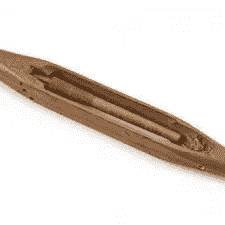
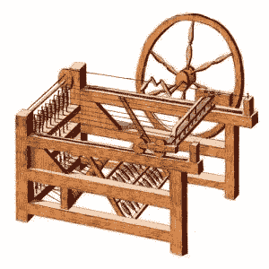
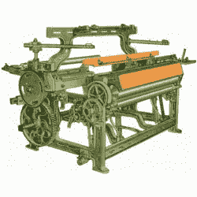
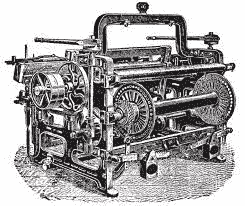

# 纺织机械工业的发明 1.0

> 原文：<https://medium.com/geekculture/the-invention-of-the-textile-machinery-industry-1-0-58175b67d431?source=collection_archive---------19----------------------->

# 介绍

工业革命的开始小心翼翼地与小范围的创新联系在一起，在 18 世纪的 2 . 5 年内开始。纺织机械是工业 1.0 的关键技术之一。机械化棉纺通过蒸汽或水的方式提供动力，通过大约 500 的方式扩大了一个雇员的产量。

能量织布机通过一个超过 40 的东西的方式扩大了一个员工的产量。轧棉机通过一种 50 年代的东西的方式扩大了从棉花上脱籽的生产力。此外，羊毛和亚麻的纺织也带来了巨大的生产利润，但是，现在已经不像棉花那样显著了。

# 描述

## 飞梭

它于 1733 年通过约翰·凯的方式获得了专利，随着接下来的一些升级以及 1747 年的一个关键升级，纺织厂的产量增加了一倍，加剧了纺纱和织布之间的不平衡。1760 年后，约翰的儿子罗伯特发明了便于转换线颜色的投件箱，这种方法在兰开夏郡被广泛使用。

## 锭翼和筒管机

刘易斯·保罗申请了卷发器纺纱体和锭翼及筒管机的专利，用于将羊毛拉至更均匀的厚度。在伯明翰的约翰·怀亚特的帮助下，[一代](https://www.technologiesinindustry4.com/?customize_changeset_uuid=b102b2a7-12ac-487a-a935-ccb96f512fd3)变得更加先进。保罗和怀亚特在伯明翰开了一家工厂，使用他们的新滚动装置，通过驴的方式提供动力。1743 年，一个制造单位在北安普顿开张，保罗和怀亚特的每 5 台机器上就有 50 个锭子。这一直持续到大约 1764 年。

一个类似的磨坊通过丹尼尔·伯恩在莱奥明斯特的方式建成，然而，它被烧毁了。刘易斯·保罗和丹尼尔·伯恩都在 1748 年获得了梳理机的专利。基于以非凡速度行进的辊子单元，它后来被用于第一家棉纺厂。路易斯的发明通过他的水中的理查德·阿克赖特和他的纺车中的萨缪尔[克兰普顿](https://www.technologiesinindustry4.com/?customize_changeset_uuid=b102b2a7-12ac-487a-a935-ccb96f512fd3)的方式变成了后来的进步。

## 珍妮纺线

1764 年，在兰开夏郡斯坦希尔村，詹姆斯·哈格里夫斯发明了珍妮纺纱机，并于 1770 年获得专利。它变成了带有几个纺锤的基本现实旋转体。珍妮以类似于纺车的方式劳动，首先通过[夹紧](https://www.technologiesinindustry4.com/?customize_changeset_uuid=b102b2a7-12ac-487a-a935-ccb96f512fd3)纤维，然后通过将它们拉出的方式，通过扭转的方式观察。在 1792 年，它变成了一个简单的木制框架装置，对于一个 40 锭的版本来说，其最简单的价值约为 6 英镑，并特别通过家用纺纱机的方式使用。珍妮生产了一种轻捻的纱线，最简单的适合作纬线，现在不再作经线。

[旋转的](https://www.technologiesinindustry4.com/?customize_changeset_uuid=b102b2a7-12ac-487a-a935-ccb96f512fd3)身体或水体通过理查德·阿克赖特的方式变得先进，他与同伴一起在 1769 年获得了专利。该布局部分主要完全基于钟表匠约翰·凯为托马斯·海建造的纺纱装置，钟表匠则受雇于阿克莱特。对于每个锭子，水体使用一系列 4 对辊，每对辊以连续更好的旋转速度运行，以吸引出纤维，纤维通过锭子的方式变成然后扭曲。卷发夹的间距变成了比纤维长度略长。

过近的间距会使纤维[中断](https://www.technologiesinindustry4.com/?customize_changeset_uuid=b102b2a7-12ac-487a-a935-ccb96f512fd3)，过远的间距会使丝线变得断续。品尼高的滚轮被皮革包裹，滚轮上的负载通过重物的方式实现。重物比滚轮更早地防止了扭曲。背面的滚轴是木制的和金属的，沿着长度方向有凹槽。水体变成能够生产一种硬的，中等记忆线适合经纱，最终允许 100%棉材料在英国制造。一匹马为主要制造单元提供动力以应用旋转体。1771 年，Arkwright 和他的同伴在德比郡 Cromford 的一个制造单位使用水电，这一发现因此得名。

## 走锭细纱机

萨缪尔·克朗普顿的纺车在 1779 年变成了加的斯。Mule 意味着混合，因为它变成了纺纱珍妮和水体的混合物，其中锭子被放置在托架上，托架经过一系列操作，在此过程中，辊停止，同时托架远离拉伸卷曲器移动，以完成拉伸纤维，因为锭子开始旋转。克伦普顿的骡子能够生产比手工纺纱更细的线，而且价格更低。走锭细纱机纺出的线转化成适当的能量用作经线，最终，让英国能够大量供应更具侵略性的纱线。

## 动力织布机

埃德蒙·卡特赖特意识到阿克赖特专利的到期可能会大幅增加棉纺产量，并导致纺织工短缺，于是他发明了一种立式电动织布机，并于 1785 年获得专利。1776 年，他申请了一台拉线式织布机的专利，这种织布机后来变成了更大的传统织布机。卡特赖特建造工厂；第一个被烧毁，第二个通过他的工人被破坏。卡特赖特的织布机设计有许多缺陷，最严重的是断线。塞缪尔·霍罗克斯在 1813 年获得了相当成功的织布机专利。1822 年，理查德·罗伯茨将霍罗克斯织机改造成步进式织机，并通过罗伯茨·希尔公司大量生产。

**轧花机**

对棉花的需求为美国南部的种植者提供了一种可能性，他们认为如果能找到一种更好的方法播种，陆地棉可能是一种有价值的作物。艾利·惠特尼通过发明更便宜的轧棉机来应对这一任务。一个使用轧棉机的伟人应该从尽可能多的陆地棉中提取种子，以前，一天一磅棉花的费用，需要一个女孩几个月来处理。

## 纺织厂

这些进步已经通过企业家的方式得到了利用，其中 nice 认可的是理查德·阿克赖特。他被归功于一系列的发明，然而，这些发明是通过像托马斯·海茨和约翰·凯这样的人的方式诚实地推进的；阿克莱特培养了发明家，为创意申请了专利，为创新提供了资金，并保护了机器。他创建了棉纺厂，在一个制造单元中集体交付制造策略，他推进了电力的使用——继水电之后的第一个马力——这使棉花制造成为一个机械化的行业。其他发明人改进了男子或女子纺纱步骤(梳理、加捻、纺纱和卷绕)的性能，以显著改善纱线的输送。之前漫长的蒸汽发电变成了实现对织物加压的机械。曼彻斯特在 19 世纪早期获得了棉花城邦的绰号，这归因于它无计划的纺织工厂。

尽管通过十九世纪中期的设备，机械化极大地降低了棉花材料的价值，但编织材料仍然无法与手工编织的印度材料相提并论，因为通过印度使用的那种棉花，线的细度变得可行，这允许过多的线数。然而，英国织物生产的过度生产力使得粗等级的英国材料在低工资的印度以低价出售手纺和机织材料，最终摧毁了这个行业。

更多详情请访问:[https://www . technologiesinindustry 4 . com/2022/09/the-invention-of-textile-machinery-industry-1-0/？customize _ changeset _ uuid = b 102 b2a 7-12ac-487 a-a935-CCB 96 f 512 FD 3](https://www.technologiesinindustry4.com/2022/09/the-invention-of-textile-machinery-industry-1-0/?customize_changeset_uuid=b102b2a7-12ac-487a-a935-ccb96f512fd3)

YouTube 频道:[https://www . YouTube . com/Channel/ucbhq 84 dcj _ mzg 6 w 4 l 1s 1 B2 g/featured](https://www.youtube.com/channel/UCbHQ84DcJ_mZG6W4L1S1b2g/featured)