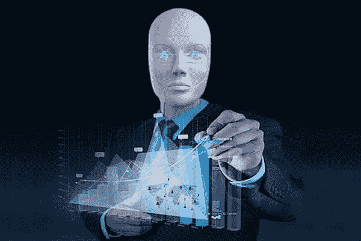

# 人工智能法律的法律景观

> 原文：<https://medium.com/geekculture/the-legal-landscape-of-artificial-intelligence-ai-law-b73731fef1db?source=collection_archive---------19----------------------->

Image credit: [Piqsels](https://www.piqsels.com/en/public-domain-photo-jqsrr)

虽然人工智能(AI)技术具有改变社会的潜力，但它引发的法律问题触及了不同的法律领域。这些领域包括隐私和数据安全、商业合同、知识产权、反垄断、员工福利和产品责任。

人工智能被广泛定义为可以模拟人类智能的计算机技术。通过算法，这个软件可以聚合数据，检测模式，优化行为，并做出未来的预测。人工智能应用的一些例子包括机器学习、自然语言处理、人工神经网络、机器感知和运动操纵。

公司和组织经常使用这些技术来更有效地执行功能。他们可以在内部开发人工智能能力，也可以从第三方获得人工智能技术的许可。

## **产品责任法**

人工智能已经成为许多产品和服务的常见功能。因此，产品责任索赔的可能性增加了。人工智能自主行动的能力提出了有关人身伤害和财产损失索赔的新的法律问题。

产品责任法在很大程度上依赖于各州的普通法和成文法原则。过失索赔、违反保证和严格责任构成了传统的产品责任理论。这些传统的责任理论也适用于人工智能环境。

过失索赔要求被告承担未能满足合理注意标准的责任。这可能源于产品设计疏忽或警告标签不充分。

违反保证索赔取决于原告和被告(产品卖方)之间的合同关系。原告可以声称违反了明示保证或默示保证。默示保证有两种形式:针对产品的适销性或针对产品特定用途的适用性。

最后，严格责任是一种标准，根据这种标准，产品制造商或销售商应对人身伤害或财产损失负责，而不管他们采取了何种程度的注意。

## 艾和一场公交车事故

这些产品责任原则在人工智能背景下的应用在最近的案例 [*Cruz 诉 Raymond Talmadge d/b/a Calvary 蔻驰*](https://casetext.com/case/cruz-v-talmadge) 中得到展示。这个案例展示了一种人工智能驱动的产品，它已经成为我们日常生活的一部分:GPS 设备。在这个案例中，当一辆公共汽车撞上一座立交桥时，原告受了伤。原告的诉讼基于对 GPS 设备制造商的疏忽、违反担保和严格责任的指控。具体来说，原告声称 GPS 设备的设计有缺陷，因为它指示司机沿着一条穿过立交桥的路线行驶。原告声称，GPS 设备应该能够发现天桥对于公交车来说太低了。双方最终达成和解。

## **人工智能和数据隐私**

人工智能技术围绕数据隐私和自动化决策产生了一系列问题。全球各地的数据保护法各不相同。在美国，管理在自动决策中使用个人数据的法律因州而异。在欧洲，欧盟[通用数据保护条例](https://carpenterwellington.com/post/artificial-intelligence-regulation-coming-european-union/)或 GDPR 提供了统一的标准。

Image credit: [Piqsels](https://www.piqsels.com/en/public-domain-photo-ifhpx)

尽管法律制度存在差异，但一些基本原则贯穿了对这些问题的总体思考。这些核心原则包括公平原则、目的规范原则和数据最小化原则。

公平原则要求组织以公平的方式处理个人信息。这意味着实施透明的措施，在个人的合理预期范围内使用个人信息，并降低歧视性申请的风险。

目的规范原则要求组织仅出于特定的明确目的收集个人信息。这在实践中可能很难实现，因为组织通常无法预测算法将学习什么，或者算法将与数据集建立什么样的关联。这可能导致算法以意想不到的方式使用数据。

数据最小化原则要求组织最大限度地减少存储数据的时间，并将数据使用限制在实现规定的处理目的上。这在实践中可能很难实现，因为人工智能技术往往在处理大型数据集时表现最佳。

## **人工智能技术和知识产权问题**

人工智能技术涉及专利法、版权法和商业秘密等问题。该技术可通过美国专利商标局的[专利分类系统中的 706 类(数据处理:人工智能)获得专利。人工智能系统的源代码和视觉元素受版权法保护。最后，商业秘密保护可以成为人工智能相关技术的一种有用的知识产权保护形式，可以应用于算法、源代码和人工智能训练数据集。](https://www.uspto.gov/)