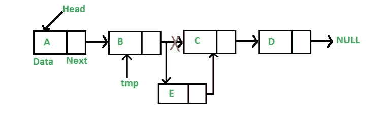

# 链表数据结构

> 原文：<https://medium.com/geekculture/the-linked-list-data-structure-c5a4b6ce7852?source=collection_archive---------52----------------------->

## 从 JavaScript 开发人员的角度来看

为了成为一名更好的开发人员，我相信偶尔走出你的语言范式去学习更多的概念是很重要的，否则这些概念可能不会在上下文中自然出现。对于 JavaScript，一个这样的概念是链表。这个简短的介绍旨在提供一个什么是链表的(非常)广泛的概述，以及它与它更广为人知的对应物数组相比的优缺点。

高级语言开发人员(包括我自己)倾向于认为理所当然的一个核心计算概念是，数据结构占用内存空间。我们生活在一个记忆空前繁荣的时代。在那里，你可以生成尽可能多的复杂数据结构，没人会在意。在像 c 这样的低级语言的*疯狂的麦克斯*时代，情况并非如此。在那个时代，内存是一种稀缺资源，你需要显式地分配，然后清理出来供程序的其他部分使用。由于内存不足，数组需要在创建时具有固定的长度。这意味着添加超出阵列初始定义容量的更多元素是一项执行成本很高的操作，因为这涉及到创建一个具有更大容量的新阵列，并将每个元素从旧阵列移动到新阵列，包括新插入的元素。此外，由于数组在内存中是连续的；这意味着它们会占用一个与数组长度相匹配的连续块，将元素添加到数组的开头或中间，不管它是否有容纳新元素的容量，都是非常昂贵的。这就是链表的用处。

从广义上来说，你可以把链表看作数组的替代物。不是使用索引，而是链表中的每个元素或**节点**本身就是一个数据结构，由一个**值**和一个指向链表中下一个节点的**引用点**组成。这些基本上是从上一个节点到内存中下一个节点的方向。列表中的最后一个节点指向空值。链表还有另外一种更复杂的实现，叫做**双向链表**，其中每个节点有两个引用点(一个指向前一个节点，一个指向下一个节点)。这允许在列表中双向上下移动。如果列表中的最后一个节点有一个指向列表中第一个节点的引用，那么它就是一个**循环链表**。

Caption: [https://www.faceprep.in/procoder/knowledgebase/linked-list-introduction/](https://www.faceprep.in/procoder/knowledgebase/linked-list-introduction/)

听起来很像数组，对吧？事实上，它们在概念上是密切相关的。然而，他们确实有某些不同的品质。链表不像数组那样存储在连续的内存位置，这意味着第一个节点可能离第二个节点很远，依此类推。这样做的实际好处是，链表在创建时不需要预先分配内存。这立即解决了昂贵的插入的问题，因为您不再需要移动元素来适应插入。让插入点之前的节点指向新节点，让插入的节点指向前一个节点指向的节点。很简单。

Caption: [https://media.geeksforgeeks.org/wp-content/cdn-uploads/gq/2013/03/Linkedlist_insert_middle.png](https://media.geeksforgeeks.org/wp-content/cdn-uploads/gq/2013/03/Linkedlist_insert_middle.png)

对于普通数组，当您想要在其中的某个位置插入一个元素时，您需要移动插入点之后的所有元素。这使得在数组开头插入的时间复杂度为 O(N ),或线性时间复杂度。对于一个链表来说，将一个元素添加到开头的时间复杂度是 O(1)，或者常数时间复杂度，因为你不需要移动任何元素。您所需要做的就是创建一个新的节点，该节点的引用指向现有链表中的第一个元素。不幸的是，链表插入和删除的速度并不能转化为索引的速度。因为链表中的每个节点只包含一个对链表中下一个节点的引用，它实际上并不携带任何对它所在位置的引用。另一方面，数组是索引的。如果您想查看第三个、第五个或第二十七个索引，您可以在常量时间内执行该查找，而不需要通过数组中的每个前面的元素进行 *rolodex* 。由于索引和插入在时间复杂度上的差异，链表在某些情况下比数组更有用。具体来说，链表可以作为堆栈和队列，其他专门的复杂数据结构的构建块。

数组和链表是一枚硬币的两面。每一种都有自己的实际好处。它们都是条目列表，但是虽然修改数组比修改链表困难，但是访问数组中的每个元素比访问链表容易。打个比方，你可以把一个数组想象成一列有编号车厢的火车，而一个链表就像一个没有链接的车队。

Caption: [https://www.pexels.com/photo/grayscale-photo-of-group-of-horse-with-carriage-running-on-body-of-water-802861/](https://www.pexels.com/photo/grayscale-photo-of-group-of-horse-with-carriage-running-on-body-of-water-802861/)

它们有相似的功能，都可以移动东西和人，但更容易从房车的前面、后面或中间添加或移除。移动列车车厢更加困难，因为增加一节车厢需要你每隔一节车厢向下移动，同时改变车厢编号(索引)。有了我们的大篷车，我们可以插入、删除、动态增加或减少大小，甚至可以将片段拆分到它们自己的大篷车中，没有问题，因为它们不是显式链接的。只是，没那么快。大篷车的灵活性使得在其中寻找一辆特别的车变得如此困难。有了我们的火车车厢系列，您可以准确地知道每节车厢相对于其他车厢的位置。你想坐头等舱吗？漫步走到 1 号车厢。有了链表大篷车，位置就更微妙了。第一个车队和第二个车队之间的距离可以变化，要找到卖水的人，你必须从头开始，从一辆车到下一辆车，直到你找到它。也就是说，链表的所有实时修改也需要查找。如果你想增加一个新的车队负责人，没问题。把他放在前面。然而，如果你想在中间的某个地方添加他，你需要沿着这条线走，直到你找到你想插入他的地方。

每种数据结构都有自己的优点和缺点。作为开发人员，您应该知道哪种方法最适合您所面临的特定问题。

参考

 [## 链表数据结构- GeeksforGeeks

### 链表是一种线性数据结构，其中的元素不是存储在连续的内存位置。的…

www.geeksforgeeks.org](https://www.geeksforgeeks.org/data-structures/linked-list/)  [## 链接列表-维基百科

### 在计算机科学中，链表是数据元素的线性集合，其顺序不是由它们的物理…

en.m.wikipedia.org](https://en.m.wikipedia.org/wiki/Linked_list)  [## 探索- LeetCode

### 引言在这张卡片中，我们将要介绍另一种数据结构——链表。与阵列类似,…

leetcode.com](https://leetcode.com/explore/learn/card/linked-list/)