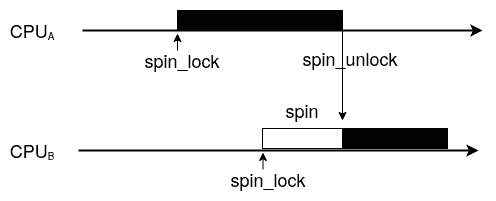

# Linux 内核锁定应用编程接口和共享对象

> 原文：<https://medium.com/geekculture/the-linux-kernel-locking-api-and-shared-objects-1169c2ae88ff?source=collection_archive---------2----------------------->


Linux 内核位于硬件和用户进程之间。内核核心实现了一组功能，帮助您避免重新发明轮子，并使开发设备驱动程序变得更容易。

在这本面向 Linux 系统工程师、系统程序员和 Linux 嵌入式开发发烧友的指南中，我们详细介绍了安全访问共享硬件资源的一个关键方面:*锁定*。使用内核锁定 API，您可以保护共享对象并避免竞争条件。

# **简介**

当一个资源可以被几个竞争者访问时，它被称为共享资源。当它们是独占的时，访问必须同步，以便只有允许的竞争者可以拥有资源。这些资源可能是内存位置或外围设备，而竞争者可能是处理器、进程或线程。操作系统通过原子地(也就是说，通过一个可以被中断的操作)修改保存资源当前状态的变量来执行互斥，使得所有可能同时访问该变量的竞争者都可以看到这个变量。这种原子性保证了修改要么成功，要么根本不成功。如今，现代操作系统依赖于用于实现同步的硬件(应该允许原子操作),尽管一个简单的系统可以通过禁用关键代码段周围的中断(并避免调度)来确保原子性。

在本指南中，我们将描述以下两种同步机制:

*   **锁**:用于互斥。当一个竞争者持有锁时，没有其他竞争者可以持有(其他竞争者被排除在外)。内核中最著名的锁定原语是自旋锁和互斥锁。
*   **条件变量**:多用于感知或等待状态变化。正如我们将在后面看到的，这些在内核中以不同的方式实现(主要在 Linux 内核的*等待、感知和阻塞*一节中)。

谈到锁定，硬件可以通过原子操作来允许这种同步。内核然后使用这些来实现锁定工具。同步原语是用于协调对共享资源的访问的数据结构。因为只有一个竞争者可以持有锁(从而访问共享资源)，所以它可能会对与锁相关联的资源执行任意操作，这对于其他人来说似乎是原子的。

除了处理给定共享资源的独占所有权，有些情况下最好等待资源的状态改变；例如，等待一个列表包含至少一个对象(其状态随后从空变为非空)或者等待一个任务完成(例如，一个 DMA 事务)。Linux 内核不实现条件变量。从我们的用户空间来看，我们可以考虑在这两种情况下使用一个条件变量，但是为了达到相同甚至更好的效果，内核提供了以下机制:

*   **等待队列**:主要用于等待状态变化。它被设计成和锁一起工作。
*   **完成队列**:用于等待给定的计算完成。

这两种机制都受到 Linux 内核的支持，并且由于 API 集的减少而向驱动程序公开(当开发人员使用时，这大大简化了它们的使用)。我们将在接下来的章节中讨论这些。

# 旋转锁

自旋锁是一种基于硬件的锁定原语。它依赖于现有硬件提供原子操作的能力(例如 test_and_set，在非原子实现中，它将导致读、修改和写操作)。自旋锁主要用在不允许睡眠或者根本不需要睡眠的原子上下文中(例如，在中断中，或者当您想要禁用抢占时)，但也用作 CPU 间锁定原语。它是最简单的锁原语，也是基本的锁原语。它的工作原理如下:



**Figure 1 — Spinlock contention flow**

让我们通过查看以下场景来研究该图表:

当运行任务 B 的 CPU(B)由于自旋锁的锁定功能想要获取自旋锁，并且这个自旋锁已经被另一个 CPU 持有时(假设 CPU(A)，运行任务 A，已经调用了这个自旋锁的锁定功能)，那么 CPU(B)将简单地围绕 while 循环旋转，从而阻塞任务 B，直到另一个 CPU 释放该锁(任务 A 调用自旋锁的释放功能)。这种旋转只会发生在多核机器上，这就是为什么前面描述的用例(由于它在单核机器上，所以涉及多个 CPU)不会发生的原因:任务要么持有一个旋转锁并继续执行，要么直到锁被释放才运行。我曾经说过，自旋锁是由 CPU 持有的锁，它与互斥锁相反(我们将在下一节讨论这一点)，互斥锁是由任务持有的锁。旋转锁通过禁用本地 CPU(即运行调用旋转锁的锁定 API 的任务的 CPU)上的调度程序来运行。这也意味着当前运行在该 CPU 上的任务不能被另一个任务抢占，除非 IRQ 没有被禁用(稍后将详细介绍)。换句话说，自旋锁保护一次只有一个 CPU 可以获取/访问的资源。这使得自旋锁适用于 SMP 安全和执行原子任务。

> **重要提示**
> 
> 自旋锁并不是利用硬件原子功能的唯一实现。例如，在 Linux 内核中，抢占状态取决于每个 CPU 的变量，如果该变量等于 0，则意味着抢占被启用。但是，如果它大于 0，这意味着抢占被禁用(schedule()不起作用)。因此，禁用抢占(preempt_disable())包括将当前每 CPU 变量(实际上是 preempt_count)加 1，而 preempt_enable()从变量中减去 1(一)，检查新值是否为 0，并调用 schedule()。这些加法/减法操作应该是原子的，因此依赖于 CPU 能够提供原子加法/减法功能。

创建和初始化自旋锁有两种方法:要么静态地使用 DEFINE_SPINLOCK 宏来声明和初始化自旋锁，要么动态地对未初始化的自旋锁调用 spin_lock_init()。

首先，我们将介绍如何使用 DEFINE_SPINLOCK 宏。为了理解这是如何工作的，我们必须看看这个宏在 include/linux/spinlock_types.h 中的定义，如下所示:

```
#define DEFINE_SPINLOCK(x) spinlock_t x = __SPIN_LOCK_ 
UNLOCKED(x)
```

这可以按如下方式使用:

```
static DEFINE_SPINLOCK(foo_lock)
```

在这之后，自旋锁可以通过它的名字 foo_lock 来访问。注意，它的地址应该是&foo_lock。但是，对于动态(运行时)分配，您需要将自旋锁嵌入到一个更大的结构中，为这个结构分配内存，然后在自旋锁元素上调用 spin_lock_init():

```
struct bigger_struct {
   spinlock_t lock;
   unsigned int foo;
   […]
};
static struct bigger_struct *fake_alloc_init_function()
{
   struct bigger_struct *bs;
   bs = kmalloc(sizeof(struct bigger_struct), GFP_KERNEL);
   if (!bs)
         return -ENOMEM;
   spin_lock_init(&bs->lock);
         return bs;
}
```

最好尽可能使用 DEFINE_SPINLOCK。它提供了编译时初始化，需要更少的代码行，没有真正的缺点。在这个阶段，我们可以使用 spin_lock()和 spin_unlock()内联函数锁定/解锁自旋锁，这两个函数都在 include/linux/spinlock.h:

```
void spin_unlock(spinlock_t *lock)
void spin_lock(spinlock_t *lock)
```

也就是说，以这种方式使用自旋锁有一些限制。虽然自旋锁阻止了本地 CPU 上的抢占，但它并不能阻止这个 CPU 被中断占用(因此，执行这个中断的处理程序)。想象一下这样一种情况，CPU 持有一个“自旋锁”以保护给定的资源，这时发生了一个中断。CPU 将停止它当前的任务并转移到这个中断处理程序。到目前为止，一切顺利。现在，假设这个 IRQ 处理程序需要获得这个自旋锁(您可能已经猜到这个资源是与中断处理程序共享的)。它将无限旋转，试图获取一个已经被它抢占的任务锁定的锁。这种情况称为死锁。

为了解决这个问题，Linux 内核为自旋锁提供了 _irq 变量函数，除了禁用/启用抢占之外，还禁用/启用本地 CPU 上的中断。这些函数是 spin_lock_irq()和 spin_unlock_irq()，定义如下:

```
void spin_unlock_irq(spinlock_t *lock);
void spin_lock_irq(spinlock_t *lock);
```

您可能认为这个解决方案已经足够了，但事实并非如此。_irq 变体部分解决了这个问题。假设在您的代码开始锁定之前，中断已经在处理器上被禁用了。因此，当您调用 spin_unlock_irq()时，您不仅会释放锁，还会启用中断。然而，这可能会以一种错误的方式发生，因为 spin_unlock_irq()没有办法知道哪些中断在锁定之前被启用，哪些没有被启用。

以下是一个简短的例子:

1.  假设中断 *x* 和 *y* 在获得自旋锁之前被禁用，而 *z* 没有被禁用。
2.  spin_lock_irq()将禁用中断( *x，y，*和 *z* 现在被禁用)并获取锁。
3.  spin_unlock_irq()将启用中断。 *x、y、*和 *z* 都将被使能，这在获取锁之前是不存在的。这就是问题产生的地方。

这使得 spin_lock_irq()在从上下文外的 irq 调用时变得不安全，因为它的对应函数 spin_unlock_irq()会天真地启用 irq，并冒着启用那些在 spin_lock_irq()被调用时未启用的 irq 的风险。只有当您知道中断已启用时，使用 spin_lock_irq()才有意义；也就是说，您确信没有其他东西会禁用本地 CPU 上的中断。

现在，想象一下，在获取锁并将它们恢复到释放时的状态之前，您将中断的状态保存在一个变量中。在这种情况下，不会有更多的问题。为了实现这一点，内核提供了 _irqsave 变量函数。这些函数的行为类似于 _irq 函数，同时还保存和恢复中断状态特性。这些函数是 spin_lock_irqsave()和 spin_lock_irqrestore()，它们的定义如下:

```
spin_lock_irqsave(spinlock_t *lock, unsigned long flags)
spin_unlock_irqrestore(spinlock_t *lock, unsigned long flags)
```

> **重要提示**
> 
> spin_lock()及其所有变体会自动调用 preempt_disable()，从而禁用本地 CPU 上的抢占。另一方面，spin_unlock()及其变体调用 preempt_enable()，后者尝试启用(是的，尝试！—这取决于其他自旋锁是否被锁定，这将影响抢占计数器的值)抢占，以及哪个内部调用 schedule()，如果启用的话(取决于计数器的当前值，该值应该是 0)。spin_unlock()是一个抢占点，可以重新启用抢占。

## 禁用中断与仅禁用抢占

虽然禁用中断可能会阻止内核抢占(调度程序的定时器中断将被禁用)，但没有什么能阻止受保护部分调用调度程序(schedule()函数)。许多内核函数间接调用调度程序，比如那些处理自旋锁的函数。因此，即使是一个简单的 printk()函数也可能调用调度程序，因为它处理保护内核消息缓冲区的自旋锁。内核通过增加或减少内核全局和每 CPU 变量(默认为 0，表示“已启用”)来禁用或启用调度程序(执行抢占)。当这个变量大于 0(由 schedule()函数检查)时，调度程序只返回，不做任何事情。每次调用与 spin_lock*相关的助手时，该变量都会增加 1。另一方面，释放自旋锁(任何 spin_unlock*族函数)会将其减少 1，并且每当它达到 0 时，调度程序就会被调用，这意味着您的关键部分不会非常原子化。

因此，如果您的代码本身没有触发抢占，那么它只能通过禁用中断来防止被抢占。也就是说，被自旋锁锁定的代码可能不会休眠，因为没有办法唤醒它(请记住，本地 CPU 上的定时器中断和调度器被禁用)。

现在我们已经熟悉了自旋锁及其微妙之处，让我们来看看互斥锁，这是我们的第二个锁定原语。

# 互斥体

我们将讨论的另一个锁定原语是互斥体。它的行为就像自旋锁一样，唯一的区别是您的代码可以休眠。如果您试图锁定一个已经被另一个任务持有的互斥体，您的任务会发现它被挂起，并且它只会在互斥体被释放时被唤醒。这次没有旋转，这意味着 CPU 可以在您的任务等待时处理其他事情。正如我之前提到的，自旋锁是由 CPU 持有的锁，而互斥锁是由任务持有的锁。

互斥体是一个简单的数据结构，它嵌入了一个等待队列(让竞争者进入休眠状态)，而自旋锁保护对这个等待队列的访问。以下是结构互斥体的样子:

```
struct mutex {
     atomic_long_t owner;
     spinlock_t wait_lock;
#ifdef CONFIG_MUTEX_SPIN_ON_OWNER
     struct optimistic_spin_queue osq; /* Spinner MCS lock */
#endif
     struct list_head wait_list;
[...]
};
```

在前面的代码中，为了可读性，只在调试模式中使用的元素被删除了。然而，正如您所看到的，互斥体是建立在自旋锁之上的。所有者表示实际拥有(持有)锁的进程。wait_list 是互斥体的竞争者进入休眠状态的列表。wait_lock 是保护 wait_list 的自旋锁，当竞争者被插入并进入休眠状态时。这有助于在 SMP 系统上保持等待列表的一致性。

互斥 API 可以在 include/linux/mutex.h 头文件中找到。在获取和释放互斥体之前，必须对其进行初始化。至于其他内核核心数据结构，可能有静态初始化，如下所示:

```
static DEFINE_MUTEX(my_mutex);
```

以下是 DEFINE_MUTEX()宏的定义:

```
#define DEFINE_MUTEX(mutexname) \
     struct mutex mutexname = __MUTEX_INITIALIZER(mutexname)
```

内核提供的第二种方法是动态初始化。这可以通过调用底层 __mutex_init()函数来实现，该函数实际上由一个更加用户友好的宏 mutex_init()封装:

```
struct fake_data {
     struct i2c_client *client;
     u16 reg_conf;
     struct mutex mutex;
};
static int fake_probe(struct i2c_client *client,
                      const struct i2c_device_id *id)
{
      [...]
      mutex_init(&data->mutex);
      [...]
}
```

获取(也称为锁定)互斥体就像调用以下三个函数之一一样简单:

```
void mutex_lock(struct mutex *lock);
int mutex_lock_interruptible(struct mutex *lock);
int mutex_lock_killable(struct mutex *lock);
```

如果互斥体是自由的(未锁定的)，你的任务将立即获得它，而不会进入睡眠状态。否则，您的任务将根据您使用的锁定功能休眠。使用 mutex_lock()，当您等待互斥体被释放时(万一它被另一个任务占用)，您的任务将被置于不可中断的睡眠状态(TASK_UNINTERRUPTIBLE)。mutex_lock_interruptible()将使您的任务进入可中断睡眠状态，在这种状态下，睡眠可以被任何信号中断。mutex_lock_killable()将允许你的任务的睡眠被中断，但是只能被真正杀死任务的信号中断。如果成功获得锁，这两个函数都返回零。此外，当锁定尝试被信号中断时，可中断变量返回-EINTR。

无论使用什么锁定函数，互斥体所有者(只有所有者)都应该使用 mutex_unlock()释放互斥体，其定义如下:

```
void mutex_unlock(struct mutex *lock);
```

如果希望检查互斥体的状态，可以使用 mutex_is_locked():

```
static bool mutex_is_locked(struct mutex *lock)
```

这个函数只是检查互斥体所有者是否为空，如果是，则返回 true，否则返回 false。

> **重要提示**
> 
> 只有在可以保证互斥体不会被长时间持有的情况下，才建议使用 mutex_lock()。通常，您应该使用可中断的变体。

使用互斥时有特定的规则。最重要的枚举在内核的互斥 API 头文件中，包括/linux/mutex.h。下面是它的摘录:

* —一次只能有一个任务持有互斥体

* —只有所有者可以解锁互斥体

* —不允许多次解锁

* —不允许递归锁定

* —互斥对象必须通过 API 初始化

* —互斥对象不能通过 memset 或初始化

复制

* —任务可能不会在持有互斥体的情况下退出

* —保留锁所在的内存区域不得被释放

* —不能重新初始化持有的互斥体

* —互斥体不能用于硬件或软件中断

*微线程和定时器等上下文

完整版本可以在同一文件中找到。

现在，让我们看一些例子，在这些例子中，我们可以避免互斥体在被持有时进入睡眠状态。这就是所谓的 try-lock 方法。

# try-lock 方法

在某些情况下，如果锁还没有被其他人持有，我们可能需要获取它。这种方法试图获取锁，并立即(如果使用自旋锁，则不旋转；如果使用互斥锁，则不休眠)返回一个状态值。这告诉我们锁是否被成功锁定。当其他线程持有锁时，如果我们不需要访问受锁保护的数据，就可以使用它们。

spinlock 和 mutex APIs 都提供了 try-lock 方法。它们分别被称为 spin_trylock()和 mutex_trylock()。两种方法都在失败时返回 0(锁已经被锁定)，或者在成功时返回 1(获得锁)。因此，将这些函数与语句一起使用是有意义的:

```
int mutex_trylock(struct mutex *lock)
```

spin_trylock()实际上以自旋锁为目标。如果 spinlock 没有像 spin_lock()方法那样被锁定，它将锁定 spin lock。但是，如果自旋锁已经锁定，它会立即返回 0 而不旋转:

```
static DEFINE_SPINLOCK(foo_lock);
[...]
static void foo(void)
{
[...]
     if (!spin_trylock(&foo_lock)) {
          /* Failure! the spinlock is already locked */
          [...]
          return;
     }
     /*
      * reaching this part of the code means
        that the
      * spinlock has been successfully locked
      */
[...]
      spin_unlock(&foo_lock);
[...]
}
```

另一方面，mutex_trylock()以互斥体为目标。如果互斥体没有像 mutex_lock()方法那样被锁定，它将锁定互斥体。但是，如果互斥体已经被锁定，它会立即返回 0 而不休眠。以下是这方面的一个例子:

```
static DEFINE_MUTEX(bar_mutex);
[...]
static void bar (void)
{
[...]
     if (!mutex_trylock(&bar_mutex))
           /* Failure! the mutex is already locked */
           [...]
           return;
     }
     /*
      * reaching this part of the code means that the mutex has
      * been successfully locked
      */
[...]
      mutex_unlock(&bar_mutex);
[...]
}
```

在前面的代码中，try-lock 与 if 语句一起使用，以便驱动程序可以调整其行为。

# Linux 内核中的等待、感知和阻塞

这一部分可以被命名为*内核睡眠机制*,因为我们将要处理的机制包括将相关进程置于睡眠状态。设备驱动程序在其生命周期中可以启动完全独立的任务，其中一些任务依赖于其他任务的完成。Linux 内核通过结构完成项解决了这种依赖性。另一方面，可能需要等待特定条件变为真或对象的状态发生变化。这一次，内核提供了工作队列来解决这种情况。

## 等待完成或状态改变

您可能不需要专门等待资源，而是等待给定对象的状态(共享或不共享)发生变化，或者等待任务完成。在 Linux 内核编程实践中，通常在当前线程之外启动一个活动，然后等待该活动完成。例如，当您等待使用缓冲区时，完成是 sleep()的一个很好的替代方法。它适合于检测数据，就像 DMA 传输一样。处理完井需要包括<linux>头。其结构如下所示:</linux>

```
struct completion {
     unsigned int done;
     wait_queue_head_t wait;
};
```

您可以使用静态 DECLARE_COMPLETION(my_comp)函数静态地创建结构完成结构的实例，也可以通过将完成结构封装到动态(在堆上分配，在函数/驱动程序的生存期内保持活动)数据结构中并调用 init _ COMPLETION(& dynamic _ object--> my _ comp)来动态地创建结构完成结构的实例。当设备驱动程序执行一些工作(例如，DMA 事务)并且其他工作(例如，线程)需要被通知它们的完成时，等待程序必须在先前初始化的结构完成对象上调用 wait_for_completion()以便被通知这一情况:

```
void wait_for_completion(struct completion *comp);
```

当代码的另一部分决定工作已经完成时(在 DMA 的情况下，事务已经完成)，它可以通过调用 complete()或 complete_all()来唤醒任何正在等待的人(需要访问 DMA 缓冲区的代码)，complete()将只唤醒一个等待进程，complete _ all()将唤醒所有等待进程完成的人:

```
void complete(struct completion *comp);
void complete_all(struct completion *comp);
```

一个典型的使用场景如下(这段摘录摘自内核文档):

```
CPU#1                                            CPU#2
struct completion setup_done;
init_completion(&setup_done);
initialize_work(...,&setup_done,...);
/* run non-dependent code */                /* do some setup */
[...]                                            [...]
wait_for_completion(&setup_done);          complete(setup_done);
```

wait_for_completion()和 complete()的调用顺序无关紧要。作为信号量，完成 API 被设计为即使在 wait_for_completion()之前调用 complete()，它们也能正常工作。在这种情况下，一旦满足了所有的依赖关系，服务员将简单地立即继续。

请注意，wait_for_completion()将调用 spin_lock_irq()和 spin_unlock_irq()，根据 *Spinlocks* 部分，不建议在中断处理程序内或禁用的 irq 中使用这两个函数。这是因为它会导致虚假中断被启用，这是很难检测到的。此外，默认情况下，wait_for_completion()将任务标记为不可中断的(TASK_UNINTERRUPTIBLE)，使其对任何外部信号(甚至 kill)都没有响应。这可能会阻塞很长时间，这取决于它所等待的活动的性质。

您可能需要*等待*不要在不可中断的状态下完成，或者至少您可能需要*等待*能够被任何信号中断或者只被杀死进程的信号中断。内核提供了以下 API:

*   wait _ for _ completion _ interruptible()
*   等待完成可中断超时()
*   wait_for_completion_killable()
*   wait _ for _ completion _ killable _ time out()

_killable 变体将任务标记为 TASK_KILLABLE，从而只让它响应实际杀死它的信号，而 _interruptible 变体将任务标记为 TASK_INTERRUPTIBLE，允许它被任何信号中断。_timeout 变量最多会等待指定的超时:

```
int wait_for_completion_interruptible(struct completion *done)
long wait_for_completion_interruptible_timeout(
           struct completion *done, unsigned long timeout)
long wait_for_completion_killable(struct completion *done)
long wait_for_completion_killable_timeout(
           struct completion *done, unsigned long timeout)
```

因为 wait_for_completion*()可能会休眠，所以它只能在这个进程上下文中使用。因为可中断、可终止或超时变量可能会在底层作业运行完成之前返回，所以应该仔细检查它们的返回值，以便采取正确的行为。killable 和 interruptible 变量如果被中断，则返回-ERESTARTSYS，如果已完成，则返回 0。另一方面，如果超时变量被中断，将返回-ERESTARTSYS，如果超时，将返回 0，如果在超时前完成，将返回超时前剩余的秒数(至少 1)。请参考内核源代码中的 kernel/sched/completion.c 了解更多相关信息。

另一方面，complete()和 complete_all()从不休眠，而是在内部调用 spin _ lock _ IRQ save()/spin _ unlock _ irqrestore()，使得来自 IRQ 上下文的完成信令完全安全。

## Linux 内核等待队列

等待队列是一种高级机制，用于处理块 I/O、等待特定条件为真、等待给定事件发生，或者检测数据或资源可用性。为了理解它们是如何工作的，让我们看看 include/linux/wait.h 中的结构:

```
struct wait_queue_head {
     spinlock_t lock;
     struct list_head head;
};
```

等待队列只不过是一个列表(在这个列表中，进程被置于睡眠状态，以便在满足某些条件时被唤醒)，其中有一个自旋锁来保护对这个列表的访问。当不止一个进程想要休眠，并且您正在等待一个或多个事件发生以便它可以被唤醒时，您可以使用等待队列。head 成员是等待事件的进程列表。每个在等待事件发生时想要休眠的进程在休眠前都会将自己放在这个列表中。当一个进程在列表中时，它被称为*等待队列条目*。当事件发生时，列表中的一个或多个进程被唤醒并从列表中移除。我们可以用两种方式声明和初始化一个*等待队列*。首先，我们可以使用 DECLARE_WAIT_QUEUE_HEAD 静态地声明和初始化它，如下所示:

```
DECLARE_WAIT_QUEUE_HEAD(my_event);
```

我们也可以使用 init_waitqueue_head()动态地完成这项工作:

```
wait_queue_head_t my_event;
init_waitqueue_head(&my_event);
```

任何希望在等待 my_event 发生时休眠的进程都可以调用 wait_event_interruptible()或 wait_event()。大多数情况下，事件只是资源变得可用的事实。因此，只有在检查了该资源的可用性之后，进程进入睡眠状态才有意义。为了方便起见，这两个函数都用一个表达式来代替第二个参数，这样只有当表达式的值为 false 时，进程才会进入休眠状态:

```
wait_event(&my_event, (event_occurred == 1) );
/* or */
wait_event_interruptible(&my_event, (event_occurred == 1) );
```

wait_event()和 wait_event_interruptible()只是在调用时评估条件。如果条件为假，流程将被置于 TASK_UNINTERRUPTIBLE 或 TASK_INTERRUPTIBLE(对于 _INTERRUPTIBLE 变量)状态，并从运行队列中删除。

有些情况下，你不仅需要条件为真，还需要在等待一定时间后超时。您可以使用 wait_event_timeout()来处理这种情况，其原型如下:

```
wait_event_timeout(wq_head, condition, timeout)
```

该函数有两种行为，具体取决于是否超时:

1.  超时已过:如果条件评估为假，函数返回 0；如果评估为真，函数返回 1。
2.  尚未超时:如果条件评估为真，函数返回剩余时间(单位为 jiffies —必须至少为 1)。

超时的时间单位是秒。为了使您不必为秒到 jiffies 的转换而烦恼，您应该使用 msecs_to_jiffies()和 usecs_to_jiffies()帮助器，它们分别将毫秒或微秒转换为 jiffies:

```
unsigned long msecs_to_jiffies(const unsigned int m)
unsigned long usecs_to_jiffies(const unsigned int u)
```

对任何可能破坏等待条件结果的变量进行更改后，必须调用适当的 wake_up*系列函数。也就是说，为了唤醒在等待队列中休眠的进程，您应该调用 wake_up()、wake_up_all()、wake_up_interruptible()或 wake_up_interruptible_all()。无论何时调用这些函数，条件都会被重新计算。如果此时条件为真，那么等待队列中的一个进程(或者 _all()变量的所有进程)将被唤醒，其(它们的)状态将被设置为 TASK _ RUNNING 否则(条件为假)，什么都不会发生:

```
/* wakes up only one process from the wait queue. */
wake_up(&my_event);
/* wakes up all the processes on the wait queue. */
wake_up_all(&my_event);:
/* wakes up only one process from the wait queue that is in
* interruptible sleep.
*/
wake_up_interruptible(&my_event)
/* wakes up all the processes from the wait queue that
* are in interruptible sleep.
*/
wake_up_interruptible_all(&my_event);
```

因为它们可以被信号中断，所以应该检查 _interruptible 变量的返回值。非零值意味着您的睡眠被某种信号中断，因此驱动程序应该返回 ERESTARTSYS:

```
#include <linux/module.h>
#include <linux/init.h>
#include <linux/sched.h>
#include <linux/time.h>
#include <linux/delay.h>
#include<linux/workqueue.h>static DECLARE_WAIT_QUEUE_HEAD(my_wq);
static int condition = 0;
/* declare a work queue*/
static struct work_struct wrk;static void work_handler(struct work_struct *work)
{
     pr_info(“Waitqueue module handler %s\n”, __FUNCTION__);
     msleep(5000);
     pr_info(“Wake up the sleeping module\n”);
     condition = 1;
     wake_up_interruptible(&my_wq);
}static int __init my_init(void)
{
     pr_info(“Wait queue example\n”);
     INIT_WORK(&wrk, work_handler);
     schedule_work(&wrk);
     pr_info(“Going to sleep %s\n”, __FUNCTION__);
     wait_event_interruptible(my_wq, condition != 0);
     pr_info(“woken up by the work job\n”);
     return 0;
}
void my_exit(void)
{
     pr_info(“waitqueue example cleanup\n”);
}
module_init(my_init);
module_exit(my_exit);
MODULE_AUTHOR(“John Madieu <john.madieu@labcsmart.com>”);
MODULE_LICENSE(“GPL”);
```

在前面的例子中，当前进程(实际上是 insmod)将在等待队列中休眠 5 秒钟，并被工作处理程序唤醒。dmesg 的输出如下:

```
**[342081.385491] Wait queue example
[342081.385505] Going to sleep my_init
[342081.385515] Waitqueue module handler work_handler
[342086.387017] Wake up the sleeping module
[342086.387096] woken up by the work job
[342092.912033] waitqueue example cleanup**
```

您可能已经注意到，我没有检查 wait_event_interruptible()的返回值。有时(如果不是大多数时候)，这可能会导致严重的问题。以下是一个真实的故事:我不得不干预一家公司，以修复一个错误，在这个错误中，杀死(或发送信号给)一个用户空间任务会使他们的内核模块崩溃(死机和重启——当然，系统被配置为在死机时重启)。发生这种情况的原因是，在这个用户进程中有一个线程在内核模块公开的 char 设备上执行 ioctl()。这导致在给定的标志上调用内核中的 wait_event_interruptible()，这意味着有一些数据需要在内核中处理(不能使用 select()系统调用)。

那么，他们犯了什么错误？发送到流程的信号是在没有设置标志的情况下使 wait_event_interruptible()返回(这意味着数据仍然不可用)，并且它的代码没有检查其返回值，也没有重新检查标志或对应该可用的数据执行健全性检查。数据被访问，就好像标志已经被设置，它实际上取消了对一个无效指针的引用。

解决方案可能很简单，只需使用以下代码:

```
if (wait_event_interruptible(...)){
     pr_info(“catching a signal supposed make us crashing\n”);
     /* handle this case and do not access data */
    […]
} else {
     /* accessing data and processing it */
    […]
}
```

然而，由于某种原因(他们设计的历史原因)，我们必须使它不可中断，这导致我们使用 wait_event()。但是，请注意，这个函数将进程置于独占等待状态(不可中断的睡眠)，这意味着它不能被信号中断。它应该只用于关键任务。在大多数情况下，建议使用可中断功能。

# 结论

您现在已经熟悉了 Linux 内核锁定 API，了解这些 API 对于开发稳定有效的 Linux 设备驱动程序非常重要。显而易见的下一步是学习工作延迟机制(软件中断、微线程和工作队列)和中断管理。遗憾的是，这里没有足够的空间来讨论这些主题，但是您现在所掌握的关于锁定的知识代表了一个很好的基础。

# 进一步阅读

有用的 Linux 内核 4.19 源代码可以在 https://github.com/torvalds/linux[获得](https://github.com/torvalds/linux)

这篇文章涵盖了 John Madieu 的书[中的内容，掌握 Linux 设备驱动程序开发](https://www.amazon.com/Mastering-Linux-Device-Driver-Development/dp/178934204X/ref=sr_1_1?dchild=1&keywords=Mastering+Linux+Device+Driver+Development.&qid=1615377668&sr=8-1)。这本书提供了复杂的 Linux 内核框架的最新报道，以帮助您简化战略技术决策并减少开发工作。

要解锁整本书并阅读更多 Linux 书籍，现在就开始订阅 Packt 吧！