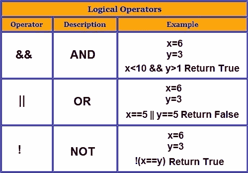

# 逻辑运算符中的逻辑

> 原文：<https://medium.com/geekculture/the-logic-in-logical-operators-1cb16f4f0af3?source=collection_archive---------14----------------------->



相关运算符用于评估或测试两个表达式之间的关系。有时我们需要连接两个或更多这样的评估或表达式，并提供一个复合输出，比如当我们需要检查一个变量是否包含一个介于 10 和 20 之间的数字时。逻辑运算符用于我们必须组合表达式求值的情况。

# &&

这就是所谓的“逻辑与”运算符。它用于检查运算符两边的条件是否为真。

```
int a, b;
bool condition1, condition2, result;a = 10;
b = 20;condition1 = a == 10;  //Contains true as a = 10
condition2 = b == 20;  //Contains true as b = 20result = condition1 && condition2;
```

这里变量 result 将包含 true，因为两个条件都为真。对于 AND 运算符，两边的条件都必须为真才能输出 true。如果其中任何一个为假，AND 运算符将输出假。例如，如果 a 的值为 12，条件 1 将为假。因此，AND 运算符的两边都不为真，因此它将输出 false。这里，条件 1 和条件 2 这两个条件组合在一起形成了一个新的条件。

# ||

这就是所谓的“逻辑或”运算符。它检查两边的条件是否都为真。

```
int a, b;
bool condition1, condition2, result;a = 10;
b = 20;condition1 = a == 10;  //Contains true as a = 10
condition2 = b == 20;  //Contains true as b = 20result = condition1 || condition2;
```

这里的结果将包含真，因为两个条件都为真。即使其中一个条件为假，结果仍然包含真。例如，即使 a 的值为 12，当 condition2 为 true 时，结果仍将包含 true。但是，如果两个条件都为假，则结果将包含假。

# !

这就是所谓的“逻辑非”运算符。它只是将当前的布尔值更改为相反的值。

```
int a, b;
bool condition1, condition2, result;a = 10;
b = 20;condition1 = a == 10;  //Contains true as a = 10
condition2 = b == 20;  //Contains true as b = 20result = !(condition1 && condition2);
```

在这里，result 将包含 false，因为它最初包含 true，但在应用 NOT 运算符后被更改为相反的布尔值 false。因此，基本上，如果 NOT 运算符应用于 false 条件，新值将变为 true，反之亦然。

# 检查该值是否在一个范围内

所以，为了更好的理解，让我们假设我们想要检查一个变量的值是否在 10 到 20 之间。所以，如果值是 2，不在 10 到 20 之间，那么 false 应该存储在一个变量中。如果值为 15，介于 10 和 20 之间，则应将 true 存储在变量中。我们可以为此编写一个程序。

[在写程序之前，想好实现目标所需的步骤，并把它写成一个算法。](https://medium.datadriveninvestor.com/code-factory-algorithm-16502f8709b6)

# 算法

1.  声明一个 integer，num 类型的变量来存储数字。
2.  声明两个布尔类型的变量 isNumGreaterThan10 和 isNumLessThan20 来存储条件。
3.  声明一个 boolean 类型的变量，isNumInRange 来存储结果。
4.  将值 12 赋给 num。
5.  将(num > 10)的值赋给 isNumGreaterThan10，将(num < 20)的值赋给 isNumberLessThan20。
6.  赋值(num > 10 & & num< 20) to isNumInRange.

# Program

```
#include <stdio.h>
#include<stdbool.h>int main()
{
   int num;
   bool isNumGreaterThan10, isNumLessThan20;
   bool isNumInRange;

   num = 12;
   isNumGreaterThan10 = num > 10;
   isNumLessThan20 = num < 20;

   isNumInRange = isNumGreaterThan10 && isNumLessThan20;

   /*
     The line of code below is used to display
     the output of boolean values
     as they don't have format specifiers.
     It will be explained in the next article.
     Right now no need to understand this line.
   */
   printf("%s", isNumInRange ? "true" : "false");
}
```

Output

```
true
```

Try assigning num the value of 22\. The program would output false as it is not in the range. Try with different values and ranges. Also, with all of the previous knowledge, try to do some new creative programs of your own.

[**Previous =>关系运算符**](/geekculture/code-factory-relational-operators-3a0f2f06e638)

[**Next = >编程中如何与用户互动？**](/geekculture/how-to-interact-with-users-in-programming-d9eaebb565c1)